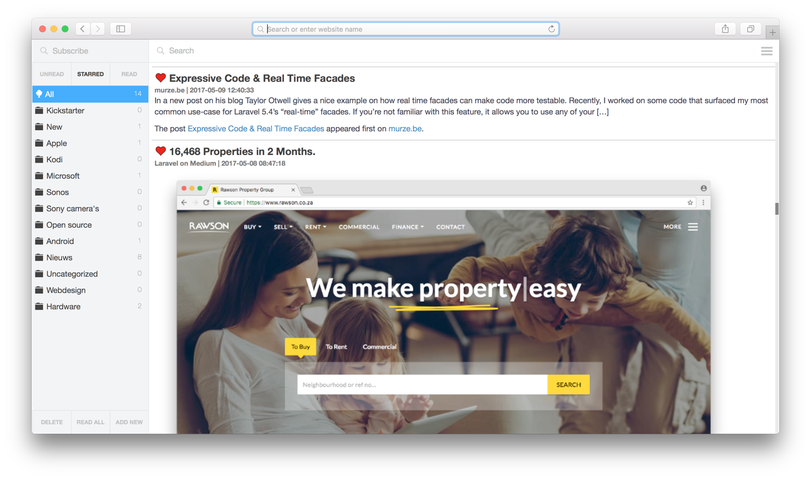

## RSS Monster

Copyright (c) 2017 Piethein Strengholt, piethein@strengholt-online.nl

RSSMonster is an easy to use web-based RSS aggregator and reader compatible with the Fever API, created as an alternative for Google Reader.
RSSMonster features a lightweight fluid responsive design. It is written in JavaScript (VueJS), PHP (Laravel Lumen) and uses the Twitter Boostrap framework. Several features are implemented such as marking as read when scrolling, drag and drop style manage feeds, json events, etc.
Feel free to add any contributions or new features.

#### Prerequisites
* PHP >= 7.0
* OpenSSL PHP Extension
* Mbstring PHP Extension
* Tokenizer PHP Extension
* Git
* A mysql installation (other databases will also work with a bit of configuration)
* [Composer](https://getcomposer.org/)

#### How to get everything running
* Clone this repository `git clone https://github.com/pietheinstrengholt/rssmonster.git .`
* Find the `.env.example` file in the root of the project, copy it and rename to `.env`
* Edit `.env` and enter your mysql server login data (at least fill DB_DATABASE, DB_USERNAME and DB_PASSWORD)
* Start a command prompt and browse to the folder to which you checked out
* Run `composer install` this will install all dependencies and might take a while
* Run `php artisan key:generate` this will generate your individual application key, so that passwords are safe
* Run `npm install` to install node dependencies, when using windows you might need to run `npm install --global --production windows-build-tools` first.
* Run `npm run production` to compile all JS files
* Run `php artisan migrate` this will add all needed database tables to your mysql database
* Run `chmod -R 777 storage/`
* Navigate to http://yourRSSMonsterurl/public/index.php and add feeds by using the top menu
* Add a cron job to pull articles: `curl -s http://yourRSSMonsterurl/public/index.php/api/feed/updateall`

If you would like to run RSSMonster in development mode I recommand to run `npm run watch`

#### Reeder (iOS) integration support (via Fever API)

Reeder (iOS) support have been added. To use the Reeder API (http://feedafever.com/api), point to the following url:

http://yourRSSMonsterurl/public/index.php/api/fever

Any username and password will work.
You might need to change the redirect in the `.htaccess` inside the public folder.
Change "/lumen/public/" to the location where RSSMonster has been deployed.

#### Credits

The following scripts and plug-ins are used within RSSMonster

* Laravel Lumen https://github.com/laravel/lumen
* Twitter bootstrap: https://twitter.github.io/bootstrap/
* SimplePie: http://simplepie.org/
* jQuery: http://jquery.com/
* jQuery Waypoint: https://github.com/imakewebthings/jquery-waypoints/
* Infinite scrolling: http://www.inserthtml.com/2013/01/scroll-pagination/
* Feedbin: https://github.com/feedbin
