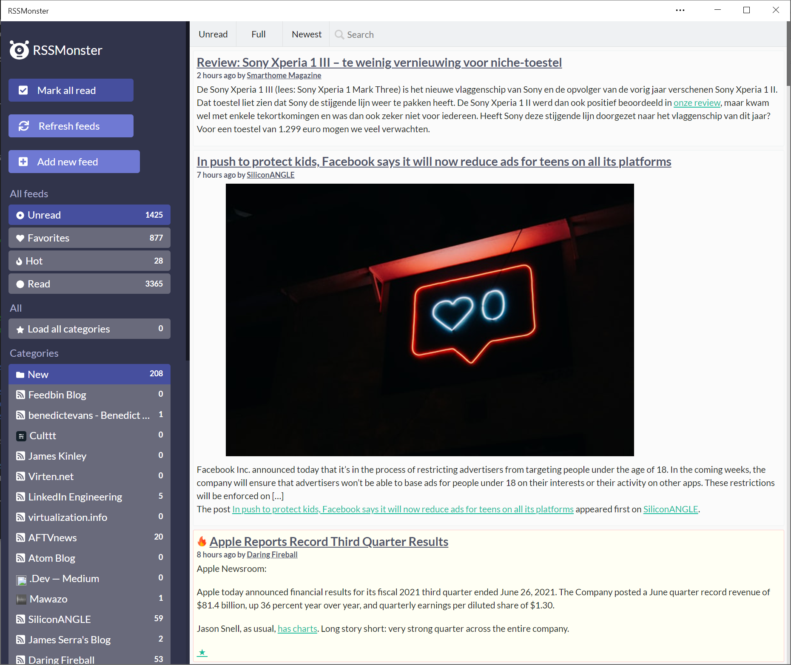
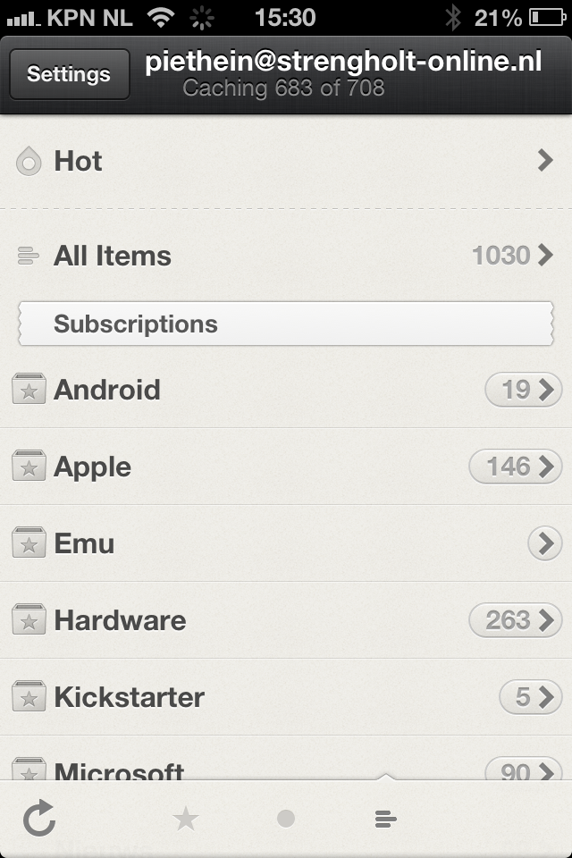

## RSSMonster
[](https://opensource.org/licenses/MIT)
[](https://hub.docker.com/r/pietheinstrengholt/rssmonster/builds)

Copyright (c) 2025 Piethein Strengholt, piethein@strengholt-online.nl

### Background
RSSMonster is a user-friendly, web-based RSS aggregator developed as an alternative to one of my favorite tools, Google Reader. Motivated by the need to replace Google Reader for tracking RSS feeds, RSSMonster aims to replicate its functionality while offering modern enhancements.



### Features
- Lightweight and Responsive Design: Built using Vue.js 3 for the frontend and Express for the backend, RSSMonster leverages Bootstrap to ensure a fluid and responsive user experience.
- Google Reader-like Behavior: Mimics the behavior of Google Reader, such as marking items as read when you start scrolling and identifying trending content.
- Progressive Web App Support: Install RSSMonster as a PWA for a seamless experience across devices.
- Drag and Drop: Easily manage your feeds with intuitive drag and drop functionality.
- Dark Mode: Switch to dark mode for a comfortable reading experience in low-light environments.
- Fever API Compatibility: Fully compatible with the Fever API, allowing for integration with other RSS tools.

### Prerequisites
* NPM and NodeJS 18.x or higher
* Git
* A Mysql installation (other databases will as well with some configuration)

### How to get everything installed
* Clone this repository `git clone https://github.com/pietheinstrengholt/rssmonster.git .`
* Run `npm install` in both the `client` and `server` folder
* Find the `.env.example` file in the root of both the `client` and `server` folder. Copy and rename the files to `.env`
* Edit `.env` inside the `server` folder and enter your Mysql or Database server login data (at least fill DB_DATABASE, DB_USERNAME and DB_PASSWORD).
* Edit `.env` inside the `client` folder. Change the VITE_APP_HOSTNAME, so it points to the back-end.
* Run `./node_modules/.bin/sequelize db:migrate && ./node_modules/.bin/sequelize db:seed:all` in side the `server` folder. this will add all needed database tables and content to your mysql database. Alternatively you can also uncomment the `//force:` true in the app.js inside the server folder to create the schema structure.
* Optional: Add a cronjob to crawl http://localhost/api/crawl every 5 minutes.

### Development
If you would like to run RSSMonster in development mode I recommend to run:
- Inside the client folder: `npm run dev`.
- Inside the server folder: `npm run debug`.

### Production
If you would like to run RSSMonster in production mode I recommend to run:
- Update the `VITE_APP_HOSTNAME` and `VITE_NODE_ENV` inside the file `client/.env`. Most likely you want to remove port 3000 and point to the url where the backend will be running. For production, make sure you set the `VITE_NODE_ENV` to `production`.
- Update the `NODE_ENV` inside the file `server/.env`. For production, make sure you set the `NODE_ENV` to `production`.
- Inside the client folder build all the static files with: `npm run build`.
- Move the `dist` output folder created inside the `client` folder to the `server` folder. The NodeJS server is also capable of serving out static content.
- Inside the server folder: `npm run start`.

### Docker for development
- Run the following command to build all the images: `docker-compose build`
- Run the following command to start the containers: `docker-compose up`
- The client will be running on port 8080 and communication with the backend takes place via 3000. Make sure these ports aren't being used. The mysql database is accessible via port 3306.

### Docker for production
The production version has the server and client combined into a single container. The VueJS is also compiled into an optimized version. To build this single image, run the following command: `docker build -t rssmonster .`
Lastly you need to run the docker container. You need to provide the correct environment variables for the database server to connect to. Here's is an example: `docker run -d -t -i -e NODE_ENV=production -e DB_HOSTNAME=localhost -e DB_DATABASE=rssmonster -e DB_USERNAME=rssmonser -e DB_PASSWORD=password -p 3000:3000 rssmonster`

### HTTPS Certificate
If you would like to host RSSMonster in a trusted environment using a certificate, I recommend installing Certbot, obtaining a certificate, and setting up automatic renewal, for example, by using a cron job. Below is the script that I have scheduled to run every week:

`certbot certonly --standalone -d yourdomain --agree-tos -q`
`cp /etc/letsencrypt/live/yourdomain/* /dir/to/rssmonster/cert/`

The code above copies the certificates to the cert folder in the RSSMonster directory. From there, you can include the certificates in your application using the following code in app.js:

```
const fs = require('fs');
const https = require('https');

const options = {
  cert: fs.readFileSync('cert/fullchain.pem'),
  key: fs.readFileSync('cert/privkey.pem')
};

https.createServer(options, app).listen(port, () => {
  console.log(`Server has started on port ${port}!`);
});
```

This configuration sets up an HTTPS server that utilizes the SSL/TLS certificates for secure communication. Ensure that the domain name and directory paths are correctly configured to your specific setup.

### AWS Beanstalk
- Setup your AWS Security credentials: https://docs.aws.amazon.com/general/latest/gr/aws-sec-cred-types.html
- Download and install the Beanstalk CLI: https://docs.aws.amazon.com/elasticbeanstalk/latest/dg/eb-cli3.html
- Run the following command: `eb init`
- Select your region and use the aws-access-id & aws-secret-key from step 1.
- Provision a new environment: `eb create rssmonster-app --envvars "NODE_ENV=production" --database --database.engine mysql --database.username rssmonster --database.password "fvX2Ht8jXxXEYlZ6"`
- SSH into the new environment: `eb ssh rssmonster-app`
- Migrate the database content: `/app/server/node_modules/.bin/sequelize db:migrate && /app/server/node_modules/.bin/sequelize db:seed:all`

### Reeder (iOS) integration support (via Fever API)
RSSMonster is compatible with the Fever API. Apps like Reeder (iOS) will support this. To use the Reeder API (http://feedafever.com/api), point to the following url:

http://yourRSSMonsterurl/api/fever

Any username and password will work.



### Contributions
I welcome contributions and new features from the community. Feel free to fork the repository and submit pull requests.

#### Credits
The following scripts and plug-ins are used within RSSMonster

* NodeJS https://nodejs.org/en/
* Twitter bootstrap: https://twitter.github.io/bootstrap/
* feed-parser: https://github.com/rowanmanning/feed-parser
* VueJS: https://vuejs.org/