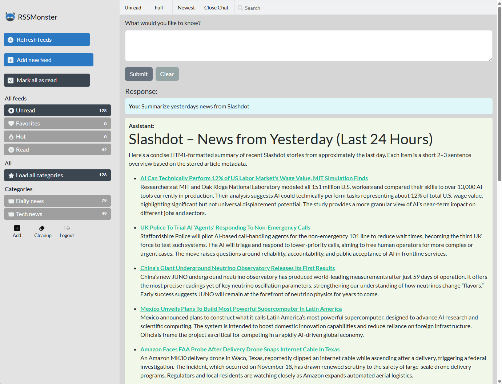

# RSSMonster

[](https://opensource.org/licenses/MIT)
[](https://hub.docker.com/r/pietheinstrengholt/rssmonster/builds)

Copyright (c) 2025 Piethein Strengholt, piethein@strengholt-online.nl

## Overview

RSSMonster is a modern, web-based RSS aggregator and reader inspired by Google Reader. It provides a lightweight, responsive interface for tracking and reading RSS feeds with built-in AI-powered search capabilities through the Model Context Protocol (MCP). Perfect for developers and power users who want full control over their RSS reading experience.


## Key Features

- **Lightweight & Responsive**: Built with Vue.js 3 and Express, styled with Bootstrap for a fluid experience across all devices
- **Google Reader-inspired UX**: Automatic mark-as-read on scroll, trending content identification, and familiar keyboard shortcuts
- **Advanced Search Expressions**: Powerful filtering with field operators (`star:true`, `unread:false`, `clicked:true`, `tag:tech`) and flexible date filters (`@2025-12-14`, `@today`, `@yesterday`, `@"3 days ago"`, `@"last Monday"`). Combine multiple filters like `javascript @today star:false sort:ASC` for precise content discovery
- **RSS Feed Generation**: Create custom RSS feeds from your stored articles with flexible filtering by user, feed, category, starred status, and read/unread state. Perfect for sharing curated content or syncing with other applications (accessible via `/rss` endpoint with query parameters)
- **Progressive Web App (PWA)**: Install on any device for native app-like experience with offline support
- **Drag & Drop Management**: Intuitive feed organization and categorization
- **Dark Mode**: Easy on the eyes with automatic or manual dark theme switching
- **OPML Support**: Import and export feeds in OPML format for seamless migration
- **Fever API Compatible**: Works with popular RSS clients like Reeder (iOS)
- **Automated Actions**: Define custom rules using regular expressions to automatically delete, star, mark as read, flag as advertisement, or mark articles as low quality
- **Multi-user Support**: Separate accounts with personalized feeds and preferences
- **AI-Powered Assistant**: Natural language search and feed management via Model Context Protocol (MCP)

## Prerequisites

- **Node.js**: Version 20.x or higher
- **npm**: Comes bundled with Node.js
- **Git**: For cloning the repository
- **MySQL**: Or any compatible database (with configuration adjustments)

## Installation

### 1. Clone the Repository

```bash
git clone https://github.com/pietheinstrengholt/rssmonster.git
cd rssmonster
```

### 2. Install Dependencies

```bash
# Install server dependencies
cd server
npm install

# Install client dependencies
cd ../client
npm install
cd ..
```

### 3. Configure Environment Variables

Copy the `.env.example` files to `.env` in both directories:

```bash
# Server configuration
cp server/.env.example server/.env

# Client configuration
cp client/.env.example client/.env
```

**Edit `server/.env`:**
```env
DB_DATABASE=your_database_name
DB_USERNAME=your_database_user
DB_PASSWORD=your_database_password
DB_HOSTNAME=localhost
NODE_ENV=development
```

**Edit `client/.env`:**
```env
VITE_APP_HOSTNAME=http://localhost:3000
VITE_NODE_ENV=development
VITE_ENABLE_AGENT=false  # Set to 'true' to enable AI assistant
```

### 4. Initialize Database

Run database migrations and seed initial data:

```bash
cd server
./node_modules/.bin/sequelize db:migrate
./node_modules/.bin/sequelize db:seed:all
```

### 5. Optional: Set Up Feed Crawler

Add a cron job to crawl feeds every 5 minutes:

```bash
*/5 * * * * curl http://localhost:3000/api/crawl
```

## AI Assistant (Model Context Protocol)

RSSMonster includes an AI-powered assistant that enables natural language interactions with your RSS feeds. Ask questions like:
- "Show me technology articles from the last week"
- "What are my favorite articles?"
- "Find unread posts about JavaScript"



### Configuration

To enable the AI assistant, configure the following environment variables:

**Server (`server/.env`):**
```env
OPENAI_API_KEY=your-openai-api-key-here
OPENAI_MODEL_AGENT=gpt-5.1
OPENAI_MODEL_CRAWL=gpt-4o-mini
```

**Client (`client/.env`):**
```env
VITE_ENABLE_AGENT=true
```

After configuration, restart both the client and server. The assistant provides:
- Natural language search across all articles
- Time-based filtering (e.g., "articles from last month")
- Article summarization, classification, and tagging
- Favorite and trending article discovery
- Smart recommendations based on reading habits

RSSMonster automatically tracks article clicks and uses AI to classify content with three quality metrics: **advertisementScore** (ad/promotional content detection), **sentimentScore** (emotional tone analysis), and **qualityScore** (content depth and accuracy assessment). These scores provide at-a-glance insights into article quality.

**Note:** All interactions are user-scoped, ensuring privacy and data isolation in multi-user environments.

**Note for Developers:** You can access the MCP server directly at `/mcp` for programmatic integration. Authentication requires a valid JWT token passed via the `Authorization: Bearer <token>` header. Obtain your token by authenticating through the `/api/auth/login` endpoint.

## Development

### Running in Development Mode

**Client (with hot reload):**
```bash
cd client
npm run dev
```

**Server (with debugging):**
```bash
cd server
npm run debug
```

The client will typically run on `http://localhost:5173` and the server on `http://localhost:3000`.

## Production Deployment

### Manual Deployment

1. **Update Environment Variables**

   **Client (`client/.env`):**
   ```env
   VITE_APP_HOSTNAME=https://your-production-domain.com
   VITE_NODE_ENV=production
   ```

   **Server (`server/.env`):**
   ```env
   NODE_ENV=production
   ```

2. **Build the Client**
   ```bash
   cd client
   npm run build
   ```

3. **Move Static Files**
   ```bash
   # Move the dist folder to the server directory
   mv client/dist server/
   ```

4. **Start the Server**
   ```bash
   cd server
   npm run start
   ```

### Docker Deployment

#### Development with Docker Compose

```bash
# Build all images
docker-compose build

# Start containers
docker-compose up
```

- Client: `http://localhost:8080`
- Server API: `http://localhost:3000`
- MySQL: `localhost:3306`

#### Production with Docker

Build the production image (combines server and optimized client):

```bash
docker build -t rssmonster .
```

Run the container with environment variables:

```bash
docker run -d \
  -e NODE_ENV=production \
  -e DB_HOSTNAME=your-db-host \
  -e DB_DATABASE=rssmonster \
  -e DB_USERNAME=rssmonster \
  -e DB_PASSWORD=your-secure-password \
  -p 3000:3000 \
  rssmonster
```

## HTTPS Configuration

For production environments, use Let's Encrypt with Certbot for SSL/TLS certificates:

### 1. Obtain Certificate

```bash
certbot certonly --standalone -d yourdomain.com --agree-tos -q
```

### 2. Copy Certificates (automated with cron)

Create a weekly cron job:

```bash
# Example cron entry (runs weekly)
0 0 * * 0 certbot renew --quiet && cp /etc/letsencrypt/live/yourdomain.com/* /path/to/rssmonster/cert/
```

### 3. Configure HTTPS in `server/app.js`

```javascript
import fs from 'fs';
import https from 'https';

const options = {
  cert: fs.readFileSync('cert/fullchain.pem'),
  key: fs.readFileSync('cert/privkey.pem')
};

https.createServer(options, app).listen(port, () => {
  console.log(`HTTPS server running on port ${port}`);
});
```

## AWS Elastic Beanstalk Deployment

### 1. Configure AWS Credentials

Set up your AWS credentials: https://docs.aws.amazon.com/general/latest/gr/aws-sec-cred-types.html

### 2. Install Elastic Beanstalk CLI

Download and install: https://docs.aws.amazon.com/elasticbeanstalk/latest/dg/eb-cli3.html

### 3. Initialize and Deploy

```bash
# Initialize EB application
eb init

# Create environment with MySQL database
eb create rssmonster-app \
  --envvars "NODE_ENV=production" \
  --database \
  --database.engine mysql \
  --database.username rssmonster \
  --database.password "your-secure-password"

# SSH into instance to run migrations
eb ssh rssmonster-app

# Run migrations inside the instance
/app/server/node_modules/.bin/sequelize db:migrate
/app/server/node_modules/.bin/sequelize db:seed:all
```

## Fever API Integration

RSSMonster is compatible with the Fever API, enabling integration with third-party RSS clients.

### Configuration

- **Fever API Endpoint:** `http://your-rssmonster-url/api/fever`
- **Authentication:** Any valid RSSMonster username and password

### Supported Clients

- **Reeder (iOS)**: Configure by adding a Fever account with the endpoint above


## Contributing

Contributions are welcome! To contribute:

1. Fork the repository
2. Create a feature branch (`git checkout -b feature/amazing-feature`)
3. Commit your changes (`git commit -m 'Add amazing feature'`)
4. Push to the branch (`git push origin feature/amazing-feature`)
5. Open a Pull Request

Please ensure your code follows the existing style and includes appropriate tests.

## Credits

RSSMonster is built with the following technologies:

- **[Node.js](https://nodejs.org/)** - JavaScript runtime
- **[Express](https://expressjs.com/)** - Web framework
- **[Vue.js 3](https://vuejs.org/)** - Frontend framework
- **[Bootstrap](https://getbootstrap.com/)** - UI framework
- **[Sequelize](https://sequelize.org/)** - ORM for database management
- **[feed-parser](https://github.com/rowanmanning/feed-parser)** - RSS/Atom feed parsing

## License

This project is licensed under the MIT License - see the [LICENSE.md](LICENSE.md) file for details.
