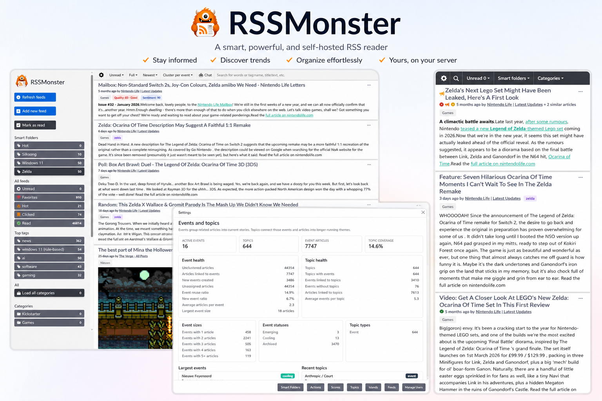
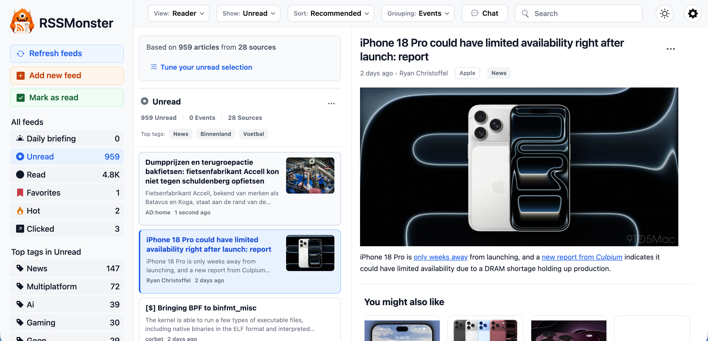
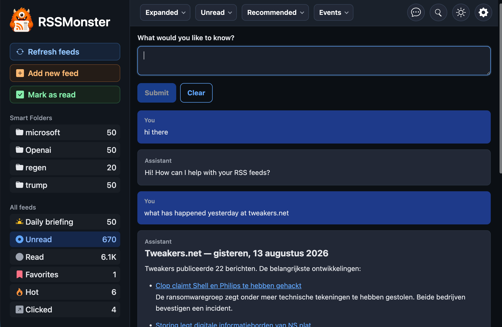
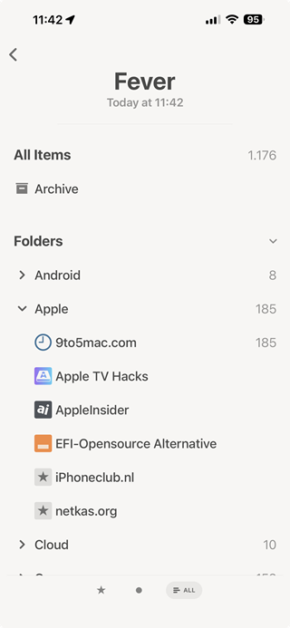

# RSSMonster

[](https://opensource.org/licenses/MIT)
[](https://codecov.io/github/pietheinstrengholt/rssmonster/tree/master/client)
[](https://codecov.io/github/pietheinstrengholt/rssmonster/tree/master/server)
[](https://hub.docker.com/r/rssmonster/rssmonster/builds)
[](
  https://github.com/pietheinstrengholt/rssmonster/actions/workflows/ci.yml
)

Copyright (c) 2026 Piethein Strengholt, piethein@strengholt-online.nl

## Overview

RSSMonster is a **self-hosted, intelligent RSS reader** designed to help you cut through information overload and focus on what actually matters.

Traditional RSS readers are primarily organized around feeds, folders, and chronological article streams. RSSMonster adds a semantic and ranking layer on top: it groups articles covering the same event, evaluates signals such as quality, freshness, originality, and source trust, explains why stories rank highly, and lets you create declarative **Smart Folders** for the views that matter to you.



At its core, RSSMonster treats your feeds as a stream of signals rather than a pile of unread items. New articles are enriched with quality, freshness, originality, trust, attention, and semantic relationship metadata. That extra context lets the application answer better questions: *is this worth reading now?*, *is this just syndicated copy?*, *which sources are covering the same event?*, and *which broader storyline does this belong to?*

A conventional reader effectively sees:

```
Article
Article
Article
Article
Article
Article
```

RSSMonster can increasingly interpret that as:

```
               Topic
                 │
          Nintendo / Zelda
                 │
        ┌────────┴─────────┐
        │                  │
      Event             Related
        │               content
    ┌───┼───┐
    A   B   C
        │
   duplicates
```



RSSMonster combines advanced search expressions, semantic clustering, quality analysis, and importance-based ranking into a system where **views are declarative, not hard-coded**. Instead of fixed tabs and opaque algorithms, you define *what matters* using composable queries that power dynamic **Smart Folders** such as:

- *Top Stories Today* — importance-ranked, deduplicated coverage  
- *Worth Your Time* — high-quality, original long-form content  
- *Quick Scan* — summary-first daily overview  
- *Low Noise Mode* — maximum signal, minimal volume  

Ranking decisions are explainable and views are customizable. The result is a reader that can behave like a quick daily briefing, a research inbox, a low-noise monitoring tool, or a classic feed reader depending on the view you choose.

## Why RSSMonster?

- **Semantic event discovery**: RSSMonster groups reporting about the same real-world story into one expandable event, so several headlines from different sources become one event with multiple articles.
- **Importance- and quality-aware ranking**: Freshness, personal interest, article quality, breadth of coverage, source diversity, corroboration, and source trust help surface worthwhile stories without hiding the underlying signals.
- **Declarative Smart Folders**: Composable search expressions turn your own definition of “important” into reusable, dynamic reading views.
- **Self-hosted and transparent**: Your feeds and reading data stay under your control, and ranking dimensions remain inspectable instead of disappearing inside an opaque recommendation system.

## Docker Quick Start

RSSMonster runs as a single application container and requires a MySQL database. If you already have MySQL available, this Linux/WSL example starts RSSMonster on port 3000:

```bash
docker run -d \
  -p 3000:3000 \
  --add-host=host.docker.internal:host-gateway \
  -e NODE_ENV=production \
  -e DB_HOSTNAME=host.docker.internal \
  -e DB_PORT=3306 \
  -e DB_DATABASE=rssmonster \
  -e DB_USERNAME=rssmonster \
  -e DB_PASSWORD=rssmonster \
  rssmonster/rssmonster
```

Open `http://localhost:3000`. For a source installation or production setup, continue with [Manual Installation](#manual-installation) and [Production Deployment](#production-deployment).

## Key Features

- **Flexible reading modes**: Use Reader Mode for summaries beside a details panel, List Mode for fast headline scanning, or Expanded Mode for distraction-free full articles. Keyboard shortcuts, drag-and-drop organization, dark mode, and mobile swipe gestures support efficient reading.
- **Semantic event discovery**: Group related reporting, compare sources, identify duplicate coverage, and connect events to broader topics and personal interest islands.
- **Smart Folders**: Build reusable views with queries such as `@today unread:true sort:recommended`, `unread:true quality:>0.7 sort:quality`, or `event:true island:true eventCount:>=3 sort:recommended`.
- **Advanced search**: Combine article state, dates, tags, text, semantic filters, score thresholds, and sorting. See the [search guide](docs/search.md) for the supported operators.
- **Transparent ranking signals**: Recommended ordering considers freshness, interest, quality, event coverage, publisher diversity, corroboration, rule tags, and optional feed-trust preference. Quality, uniqueness, attention, and feed trust remain visible signals with dedicated sorting or filtering where supported.
- **PWA and mobile support**: Install RSSMonster on supported devices for an app-like experience with offline support and responsive controls.
- **OPML and generated RSS**: Import or export subscriptions through OPML, and create filtered RSS feeds from stored articles through the `/rss` endpoint.
- **Third-party client compatibility**: Connect Fever clients such as Reeder or Google Reader clients including News+, FeedMe, Reeder, Vienna RSS, and ReadKit.
- **Automated actions**: Use regular-expression rules to delete, star, mark as read, flag as advertising, or mark matching articles as low quality.
- **Multi-user support**: Keep accounts, subscriptions, reading state, preferences, and assistant interactions user-scoped.
- **Optional AI assistant**: Enable natural-language search, summarization, classification, tagging, and feed interactions through the Model Context Protocol (MCP).

## Semantic Architecture

RSSMonster's newer architecture adds a semantic layer between feed crawling and the article list. Rather than storing articles as isolated feed entries, the system enriches them with vectors, scores, cluster membership, topic membership, and engagement signals. Those derived signals are then used by search expressions, Smart Folders, ranking, and the UI.

The semantic pipeline works in stages:

1. **Article enrichment**: crawled articles are normalized, summarized where applicable, scored for quality, and embedded into vectors that capture meaning beyond exact keyword overlap.
2. **Event clustering**: each article is compared with recent candidate events using semantic similarity, headline overlap, named-entity overlap, and time proximity. Strong matches update an existing event; otherwise RSSMonster can create a new event cluster.
3. **Topic grouping**: events are assigned to broader topics using ranked membership. An event can have a primary topic while still retaining secondary topic relationships, which keeps broad storylines stable without forcing every article into a single rigid category.
4. **Signal aggregation**: event size, source diversity, topic density, freshness, quality, uniqueness, trust, and engagement are aggregated into ranking signals. This allows larger corroborated stories to surface without letting repetitive coverage drown out more original work.
5. **Declarative retrieval**: Smart Folders and searches consume supported signals through visible query operators such as `quality:>0.7`, `freshness:>=0.5`, `event:true`, `island:true`, `hot:true`, `tag:security`, and `sort:recommended`.

This design keeps the intelligence of the reader inspectable. RSSMonster does not only decide what to show; it exposes the dimensions behind that decision so you can build views for different reading modes. A morning scan might prefer fresh event clusters with multiple sources, while deeper research might expand the full cluster, inspect related topic groups, and compare how different feeds covered the same story.

Historical semantic rebuilding is available through `npm run semantic:all`. It rebuilds event, topic, and interest-island assignments for existing articles and is intended for explicit repair or migration workflows after large imports, algorithm changes, or embedding updates.

## How Ranking Scores Work (End User)

- **Recommended / importance ranking**: Combines freshness, personal interest, article quality, event coverage, publisher diversity, and cross-source corroboration. Meaningful multi-article events and user-defined rule tags can add small boosts; prioritizing high-trust feeds is an explicit preference. The result favors timely, relevant, well-supported stories while keeping its inputs inspectable.
- **Attention**: Reflects how people interact with an article. A quick skim gives a small boost; reads, deep reads, and highly engaged sessions boost more. Re-opens and outbound clicks add a modest extra lift. No interaction means no attention boost.
- **Quality**: Evaluates tone, writing, and promotional content. Sentiment, writing quality, and advertisement detection combine into a single 0–1 score, which feed-quality evidence can gently adjust.
- **Uniqueness**: Describes how standalone an article is. Articles in larger event clusters receive a lower uniqueness signal, helping the interface identify redundant coverage without removing access to the underlying articles.

## Prerequisites

- **Node.js**: Version 22.x or higher
- **npm**: Comes bundled with Node.js
- **Git**: For cloning the repository
- **MySQL**: Or any compatible database (with configuration adjustments)

## Manual Installation

### 1. Clone the Repository

```bash
git clone https://github.com/pietheinstrengholt/rssmonster.git
cd rssmonster
```

### 2. Install Dependencies

```bash
# Install server dependencies
cd server
npm install

# Install client dependencies
cd ../client
npm install
cd ..
```

### 3. Configure Environment Variables

Copy the `.env.example` files to `.env` in both directories:

```bash
# Server configuration
cp server/.env.example server/.env

# Client configuration
cp client/.env.example client/.env
```

**Edit `server/.env`:**
```env
DB_DATABASE=your_database_name
DB_USERNAME=your_database_user
DB_PASSWORD=your_database_password
DB_HOSTNAME=localhost
NODE_ENV=development
```

**Edit `client/.env`:**
```env
VITE_APP_HOSTNAME=http://localhost:3000
VITE_NODE_ENV=development
VITE_ENABLE_AGENT=false  # Set to 'true' to enable AI assistant
```

### 4. Initialize Database

Run database migrations and seed initial data:

```bash
cd server
./node_modules/.bin/sequelize db:migrate
./node_modules/.bin/sequelize db:seed:all
```

### Recommended MySQL Configuration for Larger Article Volumes

When processing or querying large numbers of articles, it is recommended to tune MySQL sort memory to reduce sort-related bottlenecks.

Add the following to your MySQL configuration (for example in `my.cnf`):

```ini
[mysqld]
sort_buffer_size = 4M
```

### 5. Required: Build and Seed Island Taxonomy Vectors

After installation (and after each deployment to a new environment), generate taxonomy vectors and seed them into the database:

```bash
cd server
npm run taxonomy:vectors
npm run seed:island-taxonomy
```

**Important:** `npm run taxonomy:vectors` requires a valid OpenAI API key in `server/.env`:

```env
OPENAI_API_KEY=your-openai-api-key-here
```

### 6. Set Up Feed Crawler

You can crawl feeds in two ways:

**Option A: Manual crawl from command line**

```bash
cd server
DISABLE_LISTENER=true npm run crawl
```

This runs a synchronous crawl of all active feeds and provides a summary upon completion.

**Option B: Automated crawl with the dedicated worker**

The production PM2 ecosystem runs `rssmonster-web` and exactly one
`rssmonster-worker`. The worker runs once immediately, then polls at the interval
configured in `server/.env`:

```env
CRAWL_WORKER_INTERVAL_MS=60000
```

Start or reload both production processes from the repository root:

```bash
pm2 startOrReload ecosystem.config.cjs --env production --update-env
pm2 save
```

Disable the former OS cron entry after deploying the worker, or scheduled crawls
will be triggered twice. Older installations commonly contain this entry (with
the locally configured port, such as `3000`):

```cron
*/5 * * * * curl http://localhost:3000/api/crawl
```

For an existing deployment, remove the obsolete PM2 process once with
`pm2 delete rssmonster-dev && pm2 save`. Enable restoration after reboot with
`pm2 startup`, run the command PM2 prints, then run `pm2 save` again.

## Optional / Recommended Post-Installation Tasks

### Rebuild Historical Semantic Data

If you have semantic search enabled and need to rebuild article clusters from scratch:

```bash
cd server
npm run semantic:all
```

This command rebuilds historical event assignments, topics, interest islands, and interest scores for every user. Use `npm run semantic:all -- --userId=3` to limit the rebuild to one user.

**When to use this:**
- After bulk importing articles
- When cluster quality degrades over time
- After changing clustering algorithms or parameters
- To fix cluster assignment inconsistencies

**Note:** This is an explicit historical rebuild workflow. Normal post-crawl semantic processing only considers newly created, unfiltered articles.

### Calculate Feed Trust Scores

Feed trust scores help identify high-quality sources based on originality, article quality, and user engagement:

```bash
cd server
npm run feedtrust
```

This command calculates trust scores (0.0 to 1.0) for all active feeds using:
- **Originality (35%)**: How often the feed publishes original content vs syndicated articles
- **Quality (25%)**: Average quality score of articles from this feed
- **Engagement (20%)**: User interaction (stars, clicks) with feed content
- **Consistency (20%)**: Placeholder for future enhancements

**When to use this:**
- Periodically (e.g., weekly) to update feed rankings
- After significant changes in reading patterns
- To identify low-quality or spam feeds

The trust score uses exponential moving average (EMA) to smoothly adapt over time while being resistant to short-term fluctuations.

## Optional AI Assistant (Model Context Protocol)

RSSMonster can expose an AI-powered assistant for natural-language interactions with your RSS feeds. It is optional and complements the core semantic pipeline rather than replacing event discovery, ranking, topics, or Smart Folders. Ask questions like:
- "Show me technology articles from the last week"
- "What are my favorite articles?"
- "Find unread posts about JavaScript"



### Configuration

To enable the AI assistant and other agentic features, configure the following environment variables:

**Server (`server/.env`):**
```env
OPENAI_API_KEY=your-openai-api-key-here
OPENAI_MODEL_AGENT=gpt-5.1
OPENAI_MODEL_CRAWL=gpt-4o-mini
```

After configuration, restart both the client and server. The assistant provides:
- Natural language search across all articles
- Time-based filtering (e.g., "articles from last month")
- Article summarization, classification, and tagging
- Favorite and trending article discovery
- Smart recommendations based on reading habits

RSSMonster automatically tracks article clicks and uses AI to classify content with three quality metrics: **advertisementScore** (ad/promotional content detection), **sentimentScore** (emotional tone analysis), and **qualityScore** (content depth and accuracy assessment). These scores provide at-a-glance insights into article quality.

**Note:** All interactions are user-scoped, ensuring privacy and data isolation in multi-user environments.

**Note for Developers:** You can access the MCP server directly at `/mcp` for programmatic integration. Authentication requires a valid JWT token passed via the `Authorization: Bearer <token>` header. Obtain your token by authenticating through the `/api/auth/login` endpoint.

## Development

### Running in Development Mode

**Client (with hot reload):**
```bash
cd client
npm run dev
```

**Server (with hot reload):**
```bash
cd server
npm run dev
```

To attach a debugger, start the server with `npm run debug`; Node exposes its inspector on port 9229.

The client will typically run on `http://localhost:8080` and the server on `http://localhost:3000`.

## Production Deployment

### Manual Deployment

1. **Update Environment Variables**

   **Client (`client/.env`):**
   ```env
   VITE_APP_HOSTNAME=https://your-production-domain.com
   VITE_NODE_ENV=production
   ```

   **Server (`server/.env`):**
   ```env
   NODE_ENV=production
   ```

2. **Build the Client**
   ```bash
   cd client
   npm run build
   ```

3. **Move Static Files**
   ```bash
   # Move the dist folder to the server directory
   mv client/dist server/
   ```

4. **Generate and Seed Taxonomy Vectors (Required in New Environments)**

  ```bash
  cd server
  npm run taxonomy:vectors
  npm run seed:island-taxonomy
  ```

  Make sure `OPENAI_API_KEY` is set in `server/.env` before running `npm run taxonomy:vectors`.

5. **Start the Server**
   ```bash
   cd server
   npm run start
   ```

## HTTPS Configuration

For production environments, use Let's Encrypt with Certbot for SSL/TLS certificates:

### 1. Obtain Certificate

```bash
certbot certonly --standalone -d yourdomain.com --agree-tos -q
```

### 2. Copy Certificates (automated with cron)

Create a weekly cron job:

```bash
# Example cron entry (runs weekly)
0 0 * * 0 certbot renew --quiet && cp /etc/letsencrypt/live/yourdomain.com/* /path/to/rssmonster/cert/
```

### 3. Enable HTTPS

Add the following to your `server/.env` file:

```env
ENABLE_HTTPS=true
```

The server will automatically use HTTPS with certificates from the `cert/` directory. Ensure your SSL certificates are properly placed:
- `cert/fullchain.pem`
- `cert/privkey.pem`

Restart the server to apply the changes:

```bash
cd server
npm run start
```

## Fever API Integration

RSSMonster is compatible with the Fever API, enabling integration with third-party RSS clients.

### Configuration

- **Fever API Endpoint:** `http://your-rssmonster-url/api/fever`
- **Authentication:** Any valid RSSMonster username and password

### Supported Clients

- **Reeder (iOS)**: Configure by adding a Fever account with the endpoint above



## Google Reader API Integration

RSSMonster supports the Google Reader API, providing compatibility with a wide range of RSS clients.

See the [Google Reader API compatibility matrix](docs/google-reader-api.md) for the exact endpoint contract, authentication examples, client checklist, identifier formats, and unsupported behavior.

### Configuration

- **API Endpoint:** `http://your-rssmonster-url/api/greader`
- **Authentication:** Use your RSSMonster username and password

### Supported Clients

| App | Platform | Notes |
|-----|----------|-------|
| [News+](https://github.com/noinnion/newsplus) | Android | With Google Reader extension |
| [FeedMe](https://play.google.com/store/apps/details?id=com.seazon.feedme) | Android | Full sync support |
| [Reeder](https://www.reederapp.com/) | iOS/macOS | Classic version |
| [Vienna RSS](http://www.vienna-rss.com/) | macOS | Open source |
| [ReadKit](https://readkit.app/) | macOS | Multi-service reader |

### Supported Operations

- **Authentication:** ClientLogin with username/password
- **Subscriptions:** List, add, edit, remove feeds
- **Tags/Categories:** List, rename, delete categories
- **Articles:** Fetch by stream, feed, or category with pagination
- **Mark as read/unread:** Individual articles or mark all as read
- **Star/unstar:** Favorite articles
- **Unread counts:** Per feed, category, and total

## Contributing

Contributions are welcome! To contribute:

1. Fork the repository
2. Create a feature branch (`git checkout -b feature/amazing-feature`)
3. Commit your changes (`git commit -m 'Add amazing feature'`)
4. Push to the branch (`git push origin feature/amazing-feature`)
5. Open a Pull Request

Please ensure your code follows the existing style and includes appropriate tests.

## Credits

RSSMonster is built with the following frameworks and libraries:

- **[Node.js](https://nodejs.org/)** - JavaScript runtime
- **[Express](https://expressjs.com/)** - Web framework
- **[Vue.js 3](https://vuejs.org/)** - Frontend framework
- **[Bootstrap Icons](https://icons.getbootstrap.com/)** - Icon library
- **[Sequelize](https://sequelize.org/)** - ORM for database management
- **[feedsmith](https://github.com/macieklamberski/feedsmith)** - RSS/Atom feed parsing

## License

This project is licensed under the MIT License - see the [LICENSE.md](LICENSE.md) file for details.
