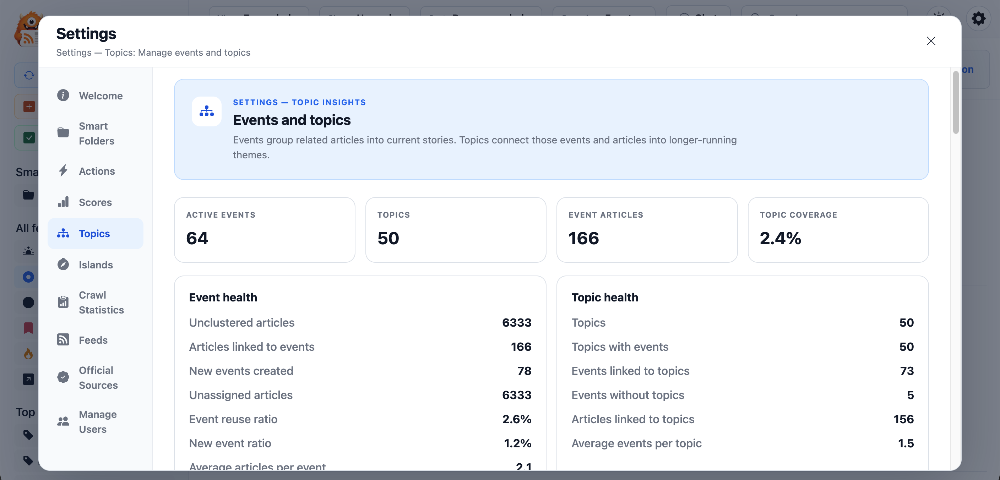
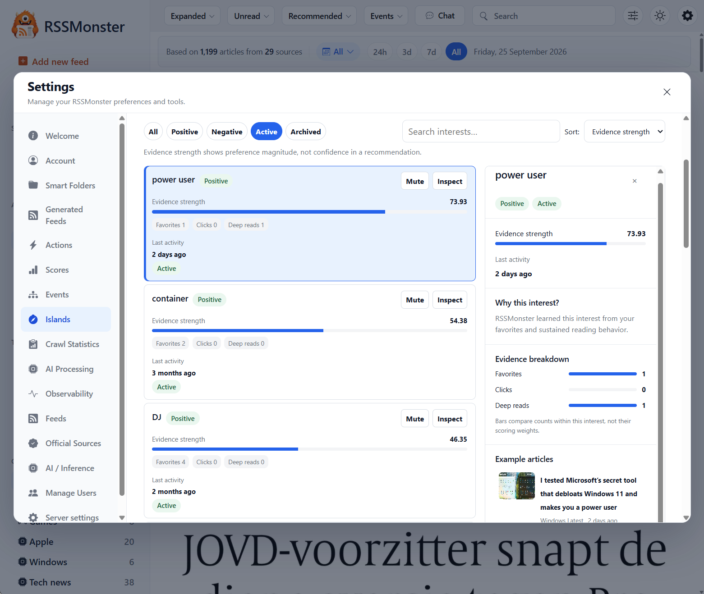

# RSSMonster

[](https://github.com/pietheinstrengholt/rssmonster/releases)
[](https://github.com/pietheinstrengholt/rssmonster/actions/workflows/ci.yml)
[](https://codecov.io/github/pietheinstrengholt/rssmonster/tree/master/client)
[](https://codecov.io/github/pietheinstrengholt/rssmonster/tree/master/server)
[](https://hub.docker.com/r/rssmonster/rssmonster)
[](https://github.com/pietheinstrengholt/rssmonster/stargazers)
[](https://opensource.org/licenses/MIT)

Copyright (c) 2026 Piethein Strengholt, [piethein@strengholt-online.nl](mailto:piethein@strengholt-online.nl)

## Overview

RSSMonster is a **self-hosted, intelligent RSS reader** designed to help you cut through information overload and focus on what actually matters.

[Learn more about RSSMonster in the complete documentation.](https://pietheinstrengholt.github.io/rssmonster/)

Traditional RSS readers are primarily organized around feeds, folders, and chronological article streams. RSSMonster adds an intelligent semantic and ranking layer on top: it groups articles covering the same event and your personal interests, evaluates signals such as quality, freshness, originality, and source trust, explains why stories rank highly, and lets you create declarative **Smart Folders** for the views that matter to you.


At its core, RSSMonster treats your feeds as a stream of signals rather than a pile of unread items. New articles are enriched with quality, freshness, originality, trust, attention, and semantic relationship metadata. That extra context lets the application answer better questions: *is this worth reading now?*, *is this just syndicated copy?*, *which sources are covering the same event?*, and *which broader storyline does this belong to?*

A conventional reader effectively sees:

```text
Article
Article
Article
Article
Article
Article
```

RSSMonster can increasingly interpret that as:

```text
               Topic
                 │
          Nintendo / Zelda
                 │
        ┌────────┴─────────┐
        │                  │
      Event             Related
        │               content
    ┌───┼───┐
    A   B   C
        │
   duplicates
```


RSSMonster combines advanced search expressions, semantic clustering, quality analysis, and personal-interest-based rankings into a system where **views are declarative, not hard-coded**. Instead of fixed tabs and opaque algorithms, you define *what matters* using composable queries that power dynamic **Smart Folders** such as:

* *Top Stories Today* — importance-ranked, deduplicated coverage
* *Worth Your Time* — high-quality, original long-form content
* *Quick Scan* — summary-first daily overview
* *Low Noise Mode* — maximum signal, minimal volume

Ranking decisions are explainable and views are customizable. The result is a reader that can behave like a quick daily briefing, a research inbox, a low-noise monitoring tool, or a classic feed reader depending on the view you choose.

## Why RSSMonster?

* **Semantic event discovery**: RSSMonster groups reporting about the same real-world story into one expandable event, so several headlines from different sources become one event with multiple articles.
* **Importance- and quality-aware ranking**: Freshness, personal interest, article quality, breadth of coverage, source diversity, corroboration, and source trust help surface worthwhile stories without hiding the underlying signals.
* **Declarative Smart Folders**: Composable search expressions turn your own definition of “important” into reusable, dynamic reading views.
* **Simple self-hosting**: Run RSSMonster with SQLite and no separate database service, or use MySQL for larger and higher-concurrency deployments.
* **Self-hosted, local, and transparent**: Your feeds and reading data stay under your control, ranking dimensions remain inspectable instead of disappearing inside an opaque recommendation system, and pluggable small language models let the feed-processing pipeline run locally.

## See RSSMonster in Action

Choose the reading experience that fits the moment, follow stories instead of duplicate headlines, and keep the same focused workflow across devices. Click any screenshot to view it at full resolution.

### Read Your Way

<table>
  <tr>
    <td width="33%"><strong>Reader Mode</strong><br><sub>Scan headlines while keeping the full article in view.</sub></td>
    <td width="33%"><strong>Expanded Mode</strong><br><sub>Read complete articles in a spacious, distraction-free stream.</sub></td>
    <td width="33%"><strong>Summarized Mode</strong><br><sub>Move quickly through compact, summary-first coverage.</sub></td>
  </tr>
  <tr>
    <td><a href="docs/assets/mode-reader.png"></a></td>
    <td><a href="docs/assets/mode-expanded.png"></a></td>
    <td><a href="docs/assets/mode-summarized.png"></a></td>
  </tr>
</table>

### Discover the Stories Behind the Headlines

<table>
  <tr>
    <td width="50%"><strong>Events and Topics</strong><br><sub>Group related reporting into current stories and connect them to longer-running themes.</sub></td>
    <td width="50%"><strong>Interest Islands</strong><br><sub>See the subjects your reading, favorites, and clicks keep reinforcing.</sub></td>
  </tr>
  <tr>
    <td><a href="docs/assets/events.png"></a></td>
    <td><a href="docs/assets/interestislands.png"></a></td>
  </tr>
</table>

### At Home on Every Screen

<table>
  <tr>
    <td width="67%"><strong>Landscape</strong><br><sub>A full dark-mode reading workspace on wider mobile and tablet screens.</sub></td>
    <td width="33%"><strong>Portrait</strong><br><sub>A focused, touch-friendly article stream that travels with you.</sub></td>
  </tr>
  <tr>
    <td><a href="docs/assets/mode-mobile-landscape.png"></a></td>
    <td><a href="docs/assets/mode-mobile-portrait.png"></a></td>
  </tr>
</table>

## Docker Quick Start

The default Docker Compose deployment is designed for quickly seeing RSSMonster in live action. It uses SQLite, requires no separate database or model service, and starts the web application plus its dedicated crawl worker.

For the comprehensive deployment—with MySQL and local inference using Qwen and ModernBERT—use [MySQL Deployment](#mysql-deployment).

### 1. Clone RSSMonster

```bash
git clone https://github.com/pietheinstrengholt/rssmonster.git
cd rssmonster
```

### 2. Configure Application Secrets

Create a `.env` file in the repository root:

```env
JWT_SECRET=replace-with-a-long-random-secret
FEVER_CREDENTIAL_SECRET=replace-with-a-long-random-secret
```

Generate secure values with:

```bash
openssl rand -hex 32
```

Run the command twice and use a different value for each secret.

### 3. Start RSSMonster

```bash
docker compose up -d
```

The default `docker-compose.yml` is the quick live-action profile. It uses SQLite and stores the database in a persistent Docker volume. It disables inference-backed classifications, embeddings, the assistant, AI feed repair, and Smart Folder recommendations so it can start without downloading or running local models.

On first startup RSSMonster automatically:

* creates the SQLite database file;
* initializes the database schema;
* starts the application; and
* starts a dedicated crawl worker that keeps due feeds updated.

Open:

```text
http://localhost:3000
```

and create your first account.

Check the deployment:

```bash
docker compose ps
```

The application validates database readiness, while the dedicated worker has
its own crawl-health check. By default, three consecutive crawl failures or 15
minutes without a worker-state update mark the worker unhealthy.

Follow the application and crawl-worker logs:

```bash
docker compose logs -f rssmonster rssmonster-worker
```

### Data Persistence

SQLite data is stored in the persistent Docker volume mounted inside the container at:

```text
/app/data
```

The SQLite files can include:

```text
rssmonster.sqlite
rssmonster.sqlite-wal
rssmonster.sqlite-shm
```

Do not remove the Docker volume unless you intentionally want to delete your RSSMonster database.

To stop RSSMonster without deleting its data:

```bash
docker compose down
```

Avoid:

```bash
docker compose down -v
```

unless you deliberately want to remove the persistent database volume.

### MySQL Deployment

The MySQL Compose deployment is the comprehensive RSSMonster profile. It is intended for installations that want higher write concurrency, multiple active users, and the local intelligent-content pipeline.

It starts:

* the RSSMonster web application, dedicated crawl worker, and
  `rssmonster-ai-worker` background-enrichment worker;
* MySQL 8.4;
* Qwen3 Embedding for 1024-dimensional semantic vectors;
* Qwen3.5 for local classification text generation, Smart Folder recommendations, and feed rediscovery; and
* ModernBERT for local article scoring.

The comprehensive profile enables RSSMonster's AI-backed interface and processing features. No OpenAI API key is required for classification, embeddings, scoring, Smart Folder recommendations, or feed rediscovery. The optional natural-language assistant remains hidden unless `INFERENCE_ASSISTANT_ENABLED=true` is set after configuring `ASSISTANT_PROVIDER=openai` and `OPENAI_API_KEY`, because its current inference adapter is OpenAI-only.

Add the comprehensive deployment secrets and database passwords to the repository-root `.env`:

```env
JWT_SECRET=replace-with-a-long-random-secret
FEVER_CREDENTIAL_SECRET=replace-with-a-long-random-secret
DB_PASSWORD=replace-with-a-strong-database-password
MYSQL_ROOT_PASSWORD=replace-with-a-different-strong-database-password
```

Use the separate MySQL Compose configuration:

```bash
docker compose -f docker-compose.mysql.yml up -d --build
```

On the first startup, the inference container downloads Qwen and ModernBERT into the persistent `inference-model-cache` volume. This can take several minutes depending on the host and network connection. RSSMonster, its crawl worker, and its AI worker wait until MySQL is healthy and the inference models are loaded. Each worker reports its own health. Later starts reuse the downloaded models.

Follow the complete deployment while it starts:

```bash
docker compose -f docker-compose.mysql.yml logs -f inference rssmonster rssmonster-worker rssmonster-ai-worker
```

## Key Features

* **Flexible reading modes**: Use Reader Mode for summaries beside a details panel, List Mode for fast headline scanning, or Expanded Mode for distraction-free full articles. Keyboard shortcuts, drag-and-drop organization, dark mode, and mobile swipe gestures support efficient reading.
* **Semantic event discovery**: Group related reporting, compare sources, identify duplicate coverage, and connect events to broader topics and personal interest islands.
* **Smart Folders**: Build reusable views with queries such as `@today unread:true sort:recommended`, `unread:true quality:>0.7 sort:quality`, or `event:true island:true eventCount:>=3 sort:recommended`.
* **Advanced search**: Combine article state, dates, tags, text, semantic filters, score thresholds, and sorting. See the [search guide](docs/search.md) for the supported operators.
* **Transparent ranking signals**: Recommended ordering emphasizes personal interest, with freshness, Quality, corroboration, and rule tags as supporting signals. Top Stories separately ranks current multi-source event importance without personalization. Quality, uniqueness, attention, and feed trust remain inspectable signals where supported; attention sorting is retained only for legacy search expressions.
* **PWA and mobile support**: Install RSSMonster on supported devices for an app-like experience with offline support and responsive controls.
* **OPML and generated RSS**: Import or export subscriptions through OPML, and create filtered RSS feeds from stored articles through the `/rss` endpoint.
* **Third-party client compatibility**: Connect Fever clients such as Reeder or Google Reader clients including News+, FeedMe, Reeder, Vienna RSS, and ReadKit.
* **Automated actions**: Use regular-expression rules to delete, star, mark as read, flag as advertising, or mark matching articles as low quality.
* **Multi-user support**: Keep accounts, subscriptions, reading state, preferences, and assistant interactions user-scoped.
* **Optional AI assistant**: Enable natural-language search, summarization, classification, tagging, and feed interactions through the Model Context Protocol (MCP).

## Web Push Notifications (Optional)

RSSMonster can notify a user when a completed crawl has persisted new articles, even when the installed web app is closed. Web Push is optional: RSSMonster continues to work normally when the VAPID variables are unset.

### How VAPID works

VAPID identifies your RSSMonster server to browser push services. It uses one public/private key pair for the whole RSSMonster installation:

* `VAPID_PUBLIC_KEY` is sent to browsers when they create a push subscription. It is not secret.
* `VAPID_PRIVATE_KEY` signs outgoing push requests. Keep it secret and only provide it to the RSSMonster server.
* `VAPID_SUBJECT` supplies operator contact information. Use a `mailto:` address or an HTTPS URL that belongs to the server operator.

Each browser creates its own endpoint and encryption keys after the user selects **Enable notifications**. RSSMonster stores that subscription against the authenticated user. After a crawl, the server signs and encrypts a notification for each of that user's active browser subscriptions. The browser push service can route the encrypted message but does not receive the RSSMonster login token or VAPID private key.

Keep the same VAPID key pair for the lifetime of an installation. Replacing it can invalidate existing browser subscriptions and require users to enable notifications again. Never commit the private key or paste it into client-side configuration.

### Generate a VAPID key pair

Install the server dependencies, then use the bundled `web-push` command:

```bash
cd server
npm install
npx web-push generate-vapid-keys
```

The command prints a public and private key. Copy them without adding quotes or whitespace.

For a source installation, add them to `server/.env`:

```env
# Optional Web Push notification configuration (VAPID).
VAPID_PUBLIC_KEY=replace-with-the-generated-public-key
VAPID_PRIVATE_KEY=replace-with-the-generated-private-key
VAPID_SUBJECT=mailto:admin@example.com
```

For Docker Compose, add the same values to the repository-root `.env` used by Compose:

```env
VAPID_PUBLIC_KEY=replace-with-the-generated-public-key
VAPID_PRIVATE_KEY=replace-with-the-generated-private-key
VAPID_SUBJECT=https://rss.example.com
```

Both included Compose configurations pass these optional values into the application container. Restart RSSMonster after changing them:

```bash
docker compose up -d
```

Restart a source installation after changing these values:

```bash
cd server
npm start
```

### Browser setup and requirements

1. Serve RSSMonster through HTTPS in production. Browser service workers and Push subscriptions require a secure context; localhost is the development exception.
2. Install or open RSSMonster in a supported browser. On iOS and iPadOS, add RSSMonster to the Home Screen and launch that installed web app before enabling notifications.
3. Sign in, open the mobile Options sheet, and select **Enable notifications**.
4. Allow notifications in the browser or operating-system prompt.

The control changes to **Disable notifications** after a subscription is active. It can also restore a missing subscription, remove the current browser subscription, explain unsupported or unconfigured states, and remove endpoints that a push service reports as expired.

If RSSMonster says that Web Push is not configured, confirm that all three VAPID variables are present in the server process and restart it. If permission was denied, re-enable notifications through the browser or operating-system settings; a web application cannot reverse a denial itself.

## Semantic Architecture

RSSMonster's newer architecture adds a semantic layer between feed crawling and the article list. Rather than storing articles as isolated feed entries, the system enriches them with vectors, scores, cluster membership, topic membership, and engagement signals. Those derived signals are then used by search expressions, Smart Folders, ranking, and the UI.

The semantic pipeline works in stages:

1. **Article enrichment**: crawled articles are normalized, summarized where applicable, scored for quality, and embedded into vectors that capture meaning beyond exact keyword overlap.
2. **Event clustering**: each article is compared with recent candidate events using semantic similarity, headline overlap, named-entity overlap, and time proximity. Strong matches update an existing event; otherwise RSSMonster can create a new event cluster.
3. **Topic grouping**: events are assigned to broader topics using ranked membership. An event can have a primary topic while still retaining secondary topic relationships, which keeps broad storylines stable without forcing every article into a single rigid category.
4. **Signal aggregation**: event size, source diversity, topic density, freshness, quality, uniqueness, trust, and engagement are aggregated into ranking signals. This allows larger corroborated stories to surface without letting repetitive coverage drown out more original work.
5. **Declarative retrieval**: Smart Folders and searches consume supported signals through visible query operators such as `quality:>0.7`, `freshness:>=0.5`, `event:true`, `island:true`, `hot:true`, `tag:security`, and `sort:recommended`.

This design keeps the intelligence of the reader inspectable. RSSMonster does not only decide what to show; it exposes the dimensions behind that decision so you can build views for different reading modes. A morning scan might prefer fresh event clusters with multiple sources, while deeper research might expand the full cluster, inspect related topic groups, and compare how different feeds covered the same story.

Historical semantic rebuilding is available through `npm run semantic:all`. It rebuilds event, topic, and interest-island assignments for existing articles and is intended for explicit repair after large imports or algorithm changes.

## How Ranking Scores Work (End User)

The visible sort order is **Newest, Oldest, Top Stories, Recommended, Quality**.

* **Recommended**: Emphasizes signed personal interest, then freshness and Quality, with small corroboration and rule-match contributions. It does not add a separate raw feed-trust preference boost.
* **Top Stories**: Ignores personalization and combines event coverage, cross-source diversity, corroboration, freshness, and Quality to surface broadly supported current stories.
* **Article quality**: Evaluates one article's writing, tone, and promotional content as an independent `0–1` signal.
* **Quality ranking**: Combines `70%` article quality with `30%` FeedTrust while keeping both concepts separate.
* **Uniqueness**: Describes how standalone an article is. Articles in larger event clusters receive a lower uniqueness signal, helping the interface identify redundant coverage without removing access to the underlying articles.

Legacy `sort:attention` queries remain accepted for compatibility, but Most
Engaged is no longer a visible sort option. Legacy `sort:trust` queries resolve
to Quality.

## Prerequisites

### Docker Installation

For the recommended Docker deployment:

* Docker Engine or Docker Desktop
* Docker Compose

No separate MySQL installation is required when using the default SQLite deployment.

### Manual / Source Installation

For running RSSMonster directly from source:

* **Node.js**: Version 22.x or higher
* **npm**: Comes bundled with Node.js
* **Git**: For cloning the repository
* **SQLite**: Recommended for simple local and personal installations
* **MySQL**: Optional; recommended for higher-concurrency installations

## Manual Installation

### 1. Clone the Repository

```bash
git clone https://github.com/pietheinstrengholt/rssmonster.git
cd rssmonster
```

### 2. Install Dependencies

```bash
# Install server dependencies
cd server
npm install

# Install client dependencies
cd ../client
npm install

# Install inference dependencies
cd ../inference
npm install
cd ..
```

### 3. Configure Environment Variables

Copy the `.env.example` files to `.env`:

```bash
cp server/.env.example server/.env
cp client/.env.example client/.env
cp inference/.env.example inference/.env
```

### Inference Models

RSSMonster sends all model requests to the standalone inference service.
Configure the server connection in `server/.env`:

```env
INFERENCE_URL=http://127.0.0.1:3001
INFERENCE_TIMEOUT_MS=30000
INFERENCE_AI_ENABLED=true
INFERENCE_ASSISTANT_ENABLED=false
SKIP_ARTICLE_CLASSIFICATION_ANALYSIS=false
SKIP_ARTICLE_EMBEDDINGS=false
SKIP_SEMANTIC_LABELING=false
```

Set `INFERENCE_AI_ENABLED=false` to prevent every server and worker inference
request. This master switch overrides the feature-specific skip settings.
Leave `INFERENCE_ASSISTANT_ENABLED=false` to hide chat while keeping the other
intelligent features enabled. Set it to `true` on the server only after the
assistant provider and credentials are configured in inference.

Use a longer timeout such as `600000` when running Qwen on low-power hardware.

The inference service selects providers independently for semantic embeddings,
text generation, article scoring, and assistant responses. A complete OpenAI
configuration in `inference/.env` is:

```env
# OpenAI
EMBEDDING_PROVIDER=openai
GENERATION_PROVIDER=openai
ARTICLE_SCORING_PROVIDER=openai
ASSISTANT_PROVIDER=openai
ASSISTANT_MODEL=gpt-4o-mini
OPENAI_API_KEY=your-openai-api-key
OPENAI_EMBEDDING_MODEL=text-embedding-3-small
OPENAI_EMBEDDING_DIMENSIONS=1536
```

Alternatively, embeddings, article generation, and scoring can run locally
while the assistant remains on OpenAI:

```env
# Qwen and ModernBERT
EMBEDDING_PROVIDER=qwen
GENERATION_PROVIDER=qwen
ARTICLE_SCORING_PROVIDER=modernbert
EMBEDDING_MODEL=onnx-community/Qwen3-Embedding-0.6B-ONNX
EMBEDDING_DIMENSIONS=1024
GENERATION_MODEL=onnx-community/Qwen3.5-0.8B-ONNX
GENERATION_DTYPE=q4
ASSISTANT_PROVIDER=openai
ASSISTANT_MODEL=gpt-4o-mini
OPENAI_API_KEY=your-openai-api-key
INFERENCE_MODEL_CACHE_DIR=.cache/models
```

Run inference with `cd inference && npm run dev` during development. Selected
Qwen3 Embedding, Qwen3.5 generation, and ModernBERT models are downloaded and
loaded during service startup, then reused from the model cache. The service
logs when all configured models are ready and crawling can start. Development
mode also logs content-safe activity for embeddings, summaries, tags, article
scoring, assistant calls, Smart Folder recommendations, and feed rediscovery.
Assistant responses currently continue to use OpenAI.
See [Model Usage](docs/model-usage.md) and
[Inference administration](docs/inference.md) for production setup and
model-specific guidance.

### SQLite Configuration

For a simple local installation, configure `server/.env` with:

```env
NODE_ENV=development

DB_DIALECT=sqlite
DB_STORAGE=./data/rssmonster.sqlite
```

RSSMonster creates the SQLite parent data directory when required.

SQLite installations use conservative crawl concurrency settings automatically to reduce write contention.

### MySQL Configuration

To use MySQL instead, configure:

```env
NODE_ENV=development

DB_DIALECT=mysql
DB_DATABASE=rssmonster
DB_USERNAME=rssmonster
DB_PASSWORD=your_database_password
DB_HOSTNAME=localhost
DB_PORT=3306
```

### Client Configuration

Configure `client/.env`:

```env
VITE_APP_HOSTNAME=http://localhost:3000
```

### 4. Initialize the Database

Create the database schema:

```bash
cd server
npm run db
```

If you explicitly need the project seeders:

```bash
./node_modules/.bin/sequelize db:seed:all
```

### Recommended MySQL Configuration for Larger Article Volumes

This section applies only to MySQL installations.

When processing or querying large numbers of articles, increasing MySQL sort memory can reduce sort-related bottlenecks.

Add the following to your MySQL configuration, for example in `my.cnf`:

```ini
[mysqld]
sort_buffer_size = 4M
```

### 5. Set Up Feed Crawling

Run a crawl manually with:

```bash
cd server
DISABLE_LISTENER=true npm run crawl
```

This runs a crawl of active feeds and prints the crawl and semantic-processing results to the console.

Production installations can run the dedicated crawl worker using the process-management approach appropriate to the deployment environment.

## Optional / Recommended Post-Installation Tasks

### Rebuild Historical Semantic Data

If you need to rebuild article clusters from scratch:

```bash
cd server
npm run semantic:all
```

This command rebuilds historical event assignments, topics, interest islands, and interest scores for every user.

Use:

```bash
npm run semantic:all -- --userId=3
```

to limit the rebuild to one user.

**When to use this:**

* after bulk importing articles;
* when cluster quality degrades over time;
* after changing clustering algorithms or parameters;
* to repair cluster assignment inconsistencies.

This is an explicit historical rebuild workflow. Normal post-crawl semantic processing only considers newly created, unfiltered articles.

### Generate Island Taxonomy Vectors

Taxonomy-vector generation is **not required for a normal SQLite installation or Docker Quick Start**.

If you explicitly need to generate or regenerate taxonomy vectors:

```bash
cd server
npm run taxonomy:vectors
npm run seed:island-taxonomy
```

`npm run taxonomy:vectors` uses the embedding model selected by the running
inference service, so it works with either OpenAI or Qwen.

### Calculate Feed Trust Scores

Feed trust estimates how consistently valuable a subscribed source has been as a source of articles:

```bash
cd server
npm run feedtrust
```

This command calculates trust scores from `0.0` to `1.0` for active feeds using:

* **Article quality (50%)**: Average existing normalized article quality
* **Engagement (20%)**: Usefulness observed through reads, favorites, and clicks
* **Originality (15%)**: Canonical articles versus deterministically linked duplicates
* **Negative-feedback quality (15%)**: Explicit negative feedback among exposed articles

**When to use this:**

* periodically to update feed rankings;
* after significant changes in reading patterns;
* to identify low-quality or noisy feeds.

Each signal has its own evidence confidence and shrinks toward the neutral score of `0.75` when evidence is sparse. Recalculating unchanged data produces the same result.

[Read the conceptual FeedTrust model](docs/feedtrust.md).

## Optional AI Assistant (Model Context Protocol)

RSSMonster can expose an AI-powered assistant for natural-language interactions with your RSS feeds. It is optional and complements the core semantic pipeline rather than replacing event discovery, ranking, topics, or Smart Folders.

Example requests include:

* "Show me technology articles from the last week"
* "What are my favorite articles?"
* "Find unread posts about JavaScript"


### Configuration

To enable the AI assistant and other OpenAI-backed capabilities, configure:

**Server (`server/.env`):**

```env
INFERENCE_AI_ENABLED=true
INFERENCE_ASSISTANT_ENABLED=true
INFERENCE_AGENT_TIMEOUT_MS=300000
```

**Inference (`inference/.env`):**

```env
OPENAI_API_KEY=your-openai-api-key-here
ASSISTANT_PROVIDER=openai
ASSISTANT_MODEL=gpt-4o-mini
```

The server keeps no OpenAI credential; all provider calls go through inference.
After configuration, restart the client, server, and inference processes.

The assistant provides:

* natural-language search across articles;
* time-based filtering;
* article summarization;
* classification and tagging;
* favorite and trending article discovery;
* Smart recommendations based on reading interests.

RSSMonster automatically tracks article interactions and can use AI to classify content with three quality metrics:

* **advertisementScore** — promotional or advertising-content detection;
* **sentimentScore** — emotional-tone analysis;
* **qualityScore** — content depth and writing-quality analysis.

These scores provide additional inspectable signals for filtering and ranking.

**Note:** All interactions are user-scoped, ensuring privacy and data isolation in multi-user environments.

**Note for Developers:** The MCP server is available at `/mcp` for programmatic integration. Authentication requires a valid JWT token passed through the `Authorization: Bearer <token>` header. Obtain a token by authenticating through `/api/auth/login`.

## Development

### Continuous Integration

The GitHub Actions workflow runs independent jobs for the server on MySQL, the
server on SQLite, inference, and the client. The inference job also validates
both Compose configurations and builds the inference Docker image.

### Running in Development Mode

**Client with hot reload:**

```bash
cd client
npm run dev
```

**Server with hot reload:**

```bash
cd server
npm run dev
```

To attach a debugger:

```bash
npm run debug
```

Node exposes its inspector on port `9229`.

The client will typically run on:

```text
http://localhost:8080
```

and the server on:

```text
http://localhost:3000
```

## Production Deployment

### Docker Deployment

To quickly see RSSMonster in live action, use the SQLite deployment described in [Docker Quick Start](#docker-quick-start):

```bash
docker compose up -d
```

This quick profile requires no separate database server or inference models and keeps persistent application data in a Docker volume.

For the comprehensive MySQL and local-inference deployment:

```bash
docker compose -f docker-compose.mysql.yml up -d --build
```

### Manual Deployment

For environments where RSSMonster runs directly on the host rather than through Docker:

#### 1. Configure the database

SQLite:

```env
NODE_ENV=production
DB_DIALECT=sqlite
DB_STORAGE=/path/to/persistent/rssmonster.sqlite
```

Or MySQL:

```env
NODE_ENV=production
DB_DIALECT=mysql
DB_HOSTNAME=localhost
DB_PORT=3306
DB_DATABASE=rssmonster
DB_USERNAME=rssmonster
DB_PASSWORD=your_database_password
```

#### 2. Install server dependencies and initialize the database

```bash
cd server
npm ci
npm run db
```

#### 3. Build the client

```bash
cd ../client
npm ci
npm run build
```

#### 4. Copy the client build

```bash
rm -rf ../server/dist
cp -R dist ../server/dist
```

#### 5. Start RSSMonster

```bash
cd ../server
npm run start
```

Use a suitable process manager or service manager for long-running production installations.

## HTTPS Configuration

For production environments, use Let's Encrypt with Certbot for SSL/TLS certificates.

### 1. Obtain Certificate

```bash
certbot certonly --standalone -d yourdomain.com --agree-tos -q
```

### 2. Copy Certificates

For example, create a weekly cron job:

```cron
0 0 * * 0 certbot renew --quiet && cp /etc/letsencrypt/live/yourdomain.com/* /path/to/rssmonster/cert/
```

### 3. Enable HTTPS

Add the following to `server/.env`:

```env
ENABLE_HTTPS=true
```

RSSMonster will use certificates from:

```text
cert/fullchain.pem
cert/privkey.pem
```

Restart the server after updating the configuration.

## Fever API Integration

RSSMonster is compatible with the Fever API, enabling integration with third-party RSS clients.

### Configuration

* **Fever API Endpoint:** `http://your-rssmonster-url/api/fever`
* **Authentication:** Any valid RSSMonster username and password

### Supported Clients

* **Reeder (iOS)**: Configure by adding a Fever account with the endpoint above


## Google Reader API Integration

RSSMonster supports the Google Reader API, providing compatibility with a wide range of RSS clients.

See the [Google Reader API compatibility matrix](docs/google-reader-api.md) for the exact endpoint contract, authentication examples, client checklist, identifier formats, and unsupported behavior.

### Configuration

* **API Endpoint:** `http://your-rssmonster-url/api/greader`
* **Authentication:** Use your RSSMonster username and password

### Supported Clients

| App                                                                       | Platform  | Notes                        |
| ------------------------------------------------------------------------- | --------- | ---------------------------- |
| [News+](https://github.com/noinnion/newsplus)                             | Android   | With Google Reader extension |
| [FeedMe](https://play.google.com/store/apps/details?id=com.seazon.feedme) | Android   | Full sync support            |
| [Reeder](https://www.reederapp.com/)                                      | iOS/macOS | Classic version              |
| [Vienna RSS](http://www.vienna-rss.com/)                                  | macOS     | Open source                  |
| [ReadKit](https://readkit.app/)                                           | macOS     | Multi-service reader         |

### Supported Operations

* **Authentication:** ClientLogin with username/password
* **Subscriptions:** List, add, edit, remove feeds
* **Tags/Categories:** List, rename, delete categories
* **Articles:** Fetch by stream, feed, or category with pagination
* **Mark as read/unread:** Individual articles or mark all as read
* **Star/unstar:** Favorite articles
* **Unread counts:** Per feed, category, and total

## Contributing

Contributions are welcome.

To contribute:

1. Fork the repository.

2. Create a feature branch:

   ```bash
   git switch -c feature/amazing-feature
   ```

3. Commit your changes:

   ```bash
   git commit -m "Add amazing feature"
   ```

4. Push the branch:

   ```bash
   git push origin feature/amazing-feature
   ```

5. Open a Pull Request.

Please ensure your code follows the existing style and includes appropriate tests.

## Credits

RSSMonster is built with the following frameworks and libraries:

* **[Node.js](https://nodejs.org/)** — JavaScript runtime
* **[Express](https://expressjs.com/)** — Web framework
* **[Vue.js 3](https://vuejs.org/)** — Frontend framework
* **[Bootstrap Icons](https://icons.getbootstrap.com/)** — Icon library
* **[Sequelize](https://sequelize.org/)** — ORM and database abstraction
* **SQLite** — Default database for simple self-hosted installations
* **MySQL** — Supported database for higher-concurrency installations
* **[feedsmith](https://github.com/macieklamberski/feedsmith)** — RSS/Atom feed parsing

## License

This project is licensed under the MIT License. See [LICENSE.md](LICENSE.md) for details.
