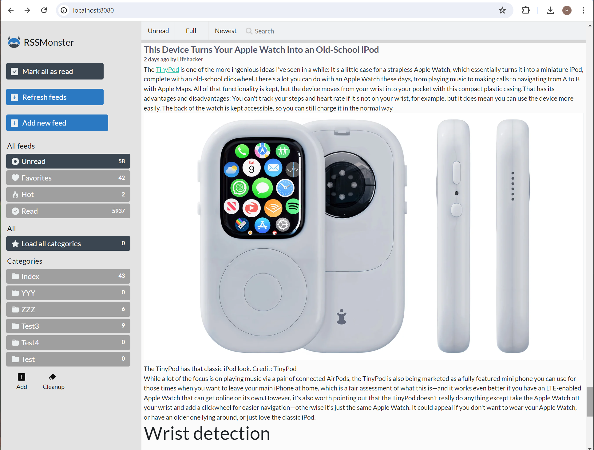

## RSSMonster

Copyright (c) 2021 Piethein Strengholt, piethein@strengholt-online.nl

RSSMonster is an easy to use web-based RSS aggregator, created as an alternative for Google Reader.
RSSMonster features a lightweight fluid responsive design. The font-end has been written in JavaScript (VueJS) and the back-end in Express (NodeJS). It also uses the Twitter Boostrap framework. Several features are implemented such as marking as read when scrolling, drag and drop style manage feeds, json events, etc. RSSMonster is compatible with the Fever API. Feel free to add any contributions or new features.

### Prerequisites
* NodeJS 10.x or higher
* Git
* A Mysql installation (other databases will also work with a bit of configuration)

### How to get everything installed
* Clone this repository `git clone https://github.com/pietheinstrengholt/rssmonster.git .`
* Run `npm install` in both the `client` and `server` folder
* Find the `.env.example` file in the root of both the `client` and `server` folder. Copy and rename the files to `.env`
* Edit `.env` inside the `server` folder and enter your Mysql or Database server login data (at least fill DB_DATABASE, DB_USERNAME and DB_PASSWORD).
* Edit `.env` inside the `client` folder. Change the VUE_APP_HOSTNAME so it points to the back-end.
* Run `./node_modules/.bin/sequelize db:migrate && ./node_modules/.bin/sequelize db:seed:all` in side the `server` folder. this will add all needed database tables and content to your mysql database. Alternatively you can also uncomment the `//force:` true in the app.js inside the server folder to create the schema structure.

### Development
If you would like to run RSSMonster in development mode I recommend to run:
- Inside the client folder: `npm run serve`.
- Inside the server folder: `npm run start`.

### Production
If you would like to run RSSMonster in production mode I recommend to run:
- Update the `VUE_APP_HOSTNAME` inside the file `client/.env`. Most likely you want to remove port 3000 and point to the url where the backend will be running.
- Inside the client folder build all the static files with: `npm run build`.
- Move the `dist` output folder created inside the `client` folder to the `server` folder. The NodeJS server is also capable of serving out static content.
- Inside the server folder: `npm run start`.

### Docker for development
- Run the following command to build all the images: `docker-compose build`
- Run the following command to start the containers: `docker-compose up`
- The client will be running on port 8080 and communication with the backend takes place via 3000. Make sure these ports aren't being used. The mysql database is accessible via port 3307.

### Docker for production
The production version has the server and client combined into a single container. The VueJS is also compiled into an optimized version. To build this single image, run the following command: `docker build .`
Lastly you need to run the docker container. You need to provide the correct environment variables for the database server to connect to. Here's is an example: `docker run -d -t -i -e NODE_ENV=production -e DB_HOSTNAME=localhost -e DB_DATABASE=rssmonster -e DB_USERNAME=rssmonser -e DB_PASSWORD=password -p 3000:3000`

### AWS Beanstalk
- Setup your AWS Security credentials: https://docs.aws.amazon.com/general/latest/gr/aws-sec-cred-types.html
- Download and install the Beanstalk CLI: https://docs.aws.amazon.com/elasticbeanstalk/latest/dg/eb-cli3.html
- Run the following command: `eb init`
- Select your region and use the aws-access-id & aws-secret-key from step 1.
- Provision a new environment: `eb create rssmonster-app --envvars "NODE_ENV=production" --database --database.engine mysql --database.username rssmonster --database.password "fvX2Ht8jXxXEYlZ6"`
- SSH into the new environment: `eb ssh rssmonster-app`
- Migrate the database content: `/app/server/node_modules/.bin/sequelize db:migrate && /app/server/node_modules/.bin/sequelize db:seed:all`

### Reeder (iOS) integration support (via Fever API)
RSSMonster is compatible with the Fever API. Apps like Reeder (iOS) will support this. To use the Reeder API (http://feedafever.com/api), point to the following url:

http://yourRSSMonsterurl/api/fever

Any username and password will work.

#### Credits
The following scripts and plug-ins are used within RSSMonster

* NodeJS https://nodejs.org/en/
* Twitter bootstrap: https://twitter.github.io/bootstrap/
* Feedparser: https://github.com/danmactough/node-feedparser/
* VueJS: https://vuejs.org/
* Vue infinite scrolling: https://github.com/PeachScript/vue-infinite-loading
* Waypoints: https://github.com/imakewebthings/waypoints