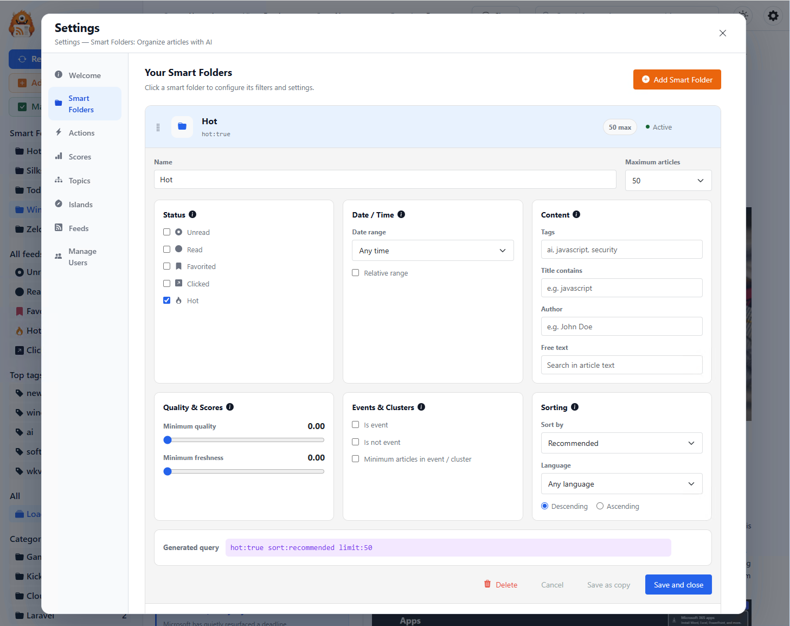

# How RSSMonster is designed

This guide is derived from the current RSSMonster client source. The repository screenshots below provide visual context; the implemented tokens and component styles are authoritative where a screenshot differs from the current interface.

Last updated: 2026-08-08

## Captured pages

[Composite view of the RSSMonster desktop reader, mobile reader, dark theme, and settings](../../../../docs/assets/screenshot04.png)

[RSSMonster desktop shell with the assistant response beside the navigation sidebar](../../../../docs/assets/screenshot02.png)

[RSSMonster settings dialog showing the Smart Folder editor](../../../../docs/assets/screenshot03.png)

## Overview

RSSMonster is designed as a calm, information-dense reading workspace. The interface gives most of the screen to feeds and article content, then uses a fixed navigation sidebar, a compact toolbar, and quiet metadata to keep a large library manageable. Its closest visual relatives are focused productivity tools and desktop mail or feed readers rather than a consumer news homepage.

The system is built from pale neutral surfaces, thin borders, native system typography, and one primary blue selection language. Orange identifies the RSSMonster brand and feed creation, green confirms successful or completed actions, and red or pink marks favorites, errors, warnings, and destructive actions. Supporting badge colors appear only when they communicate article signals such as similarity, duplication, quality, sentiment, or rule-generated tags.

The experience has three related modes. The standard stream presents complete or minimal article rows in one reading pane. Reader mode adds a compact article list beside a dedicated article pane. Mobile mode replaces the persistent desktop chrome with a sticky toolbar and an overlay menu while keeping the same selections, article states, and semantic colors.

## Colors

The light theme uses cool whites and grays instead of decorative color blocks. `#F8FAFC` is the page field, `#FFFFFF` is the card and control surface, and `#111827` is the main ink. Structural borders stay between `#E8EBF0` and `#C5CEDA`, making separation visible without turning every region into a card.

Blue is the main interaction color. `#2563EB` identifies primary actions, links, focus, navigation, and selected states; `#E8F2FE` provides its quiet selected surface. The brand orange, `#EA650D`, is reserved for RSS and feed-related identity or creation. Success uses `#166534`, and destructive actions use `#B91C1C`.

The dark theme is deliberately authored rather than inverted. Its page starts at `#0B0F14`, cards use `#1A202C`, secondary surfaces use `#11161D` or `#222836`, and primary text becomes `#E5E7EB`. Links brighten to `#60A5FA`, borders move into the blue-gray range, and selected reader rows use a deep navy surface with a clear blue accent edge.

| role | light | dark | use |
|---|---|---|---|
| brand | `#EA650D` | `#2563EB` in the current theme token | RSSMonster identity and feed-related emphasis |
| primary | `#2563EB` | `#2563EB` | Main actions, links, navigation, focus, and selection |
| primary hover | `#1D4ED8` | `#1D4ED8` | Hovered primary actions and links |
| success | `#166534` | `#4ADE80` | Completed, confirmed, and mark-as-read states |
| danger | `#B91C1C` | `#AC5561` | Errors, destructive actions, and warnings |
| page | `#F8FAFC` | `#0B0F14` | Application field and scroll bounce surface |
| card | `#FFFFFF` | `#1A202C` | Articles, dialogs, inputs, and raised content surfaces |
| muted surface | `#F3F4F6` | `#222836` | Secondary controls, badges, and hover regions |
| secondary surface | `#F3F4F6` | `#11161D` | Sidebar rows and supporting chrome |
| selected surface | `#E8F2FE` | `#1E3A8A` | Active navigation and selected controls |
| primary ink | `#111827` | `#E5E7EB` | Titles, article text, labels, and icons |
| secondary ink | `#6B7280` | `#9CA3AF` | Metadata, helper text, and quiet controls |
| subtle border | `#E8EBF0` | `#232B38` | Pane separation and low-priority rules |
| control border | `#D7DDE5` | `#344054` | Inputs, buttons, and selectable controls |
| focus border | `#2563EB` | `#60A5FA` | Keyboard focus treatment |
| similar badge | `#E8F2FE` / `#1D4ED8` | `#1E3A5F` / `#93C5FD` | Related-event article counts |
| duplicate badge | `#FDF2F8` / `#BE185D` | `#4A1433` / `#F9A8D4` | Duplicate article counts |
| quality badge | `#EAF7EF` / `#1F5E3A` | `#173D2A` / `#86EFAC` | Positive quality and favorite signals |
| feed badge | `#FFEDD5` / `#EA650D` | `#5C2A14` / `#FDBA74` | Feed, advertisement, and hot-item signals |

## Typography

RSSMonster uses one native system sans-serif family throughout application-owned UI: `-apple-system`, `BlinkMacSystemFont`, `Segoe UI`, `Roboto`, `Helvetica`, `Arial`, and `sans-serif`. This makes the product feel at home on the operating system, keeps rendering fast, and prevents typography from competing with publisher content.

Hierarchy comes from compact changes in size, weight, line height, and color. The application does not use a display face. Monospace is reserved for generated queries, identifiers, and other technical values. Article HTML may retain compatible publisher formatting inside the sanitized content boundary, but surrounding reader chrome returns to the system family.

| token | family | size | weight | leading | tracking | use |
|---|---|---:|---:|---:|---:|---|
| `brand-title` | system sans | 26px | 600 | normal | default | RSSMonster label in the desktop sidebar |
| `page-title` | system sans | 26–28px | 700 | about 1.15 | tight/default | Authentication and exceptional top-level headings |
| `section-title` | system sans | 21–24px | 700 | about 1.2 | default | Settings pages and major content headings |
| `article-title` | system sans | 22px | 600 | 1.25 | `-0.01em` | Expanded article headline |
| `article-title-mobile` | system sans | 18px | 600 | 1.25 | `-0.01em` | Article headline on narrow portrait screens |
| `reader-list-title` | system sans | 14px | 700 | 1.35 | default | Article title in Reader mode’s list pane |
| `briefing-title` | system sans | 17px | 700 | 1.25 | default | “The stories shaping your morning” heading |
| `body` | system sans | 14px | 400 | 1.5 | default | Ordinary interface copy and compact prose |
| `article-body` | system sans | 14px | 400 | 1.65 | default | Long-form reading content |
| `ui` | system sans | 14px | 400–500 | about 1.4 | default | Navigation, inputs, menus, and ordinary controls |
| `ui-strong` | system sans | 14px | 600–700 | about 1.4 | Buttons, selected labels, and compact headings |
| `meta` | system sans | 13px | 400–600 | 1.3–1.4 | Article provenance, help text, and descriptions |
| `dense-meta` | system sans | 12px | 400–700 | 1.3–1.45 | Reader previews, counts, and table detail |
| `micro` | system sans | 11px | 600 | 1.3–1.4 | Badges, eyebrows, top tags, and tertiary signals |
| `technical` | monospace | context-dependent | 400–600 | context-dependent | Queries and technical values only |

The scale stays intentionally small. Routine headings should not exceed 28px, and larger sizes belong to functional icons or exceptional focal states rather than marketing-style hero copy. Titles use stronger weight and tighter leading; reading text uses regular weight and a relaxed `1.5` to `1.65` line height.

## Layout

The desktop shell begins with a fixed `266px` sidebar. The main surface fills the remaining width and owns its own scroll behavior. A `58px` toolbar is fixed or offset above the article area, keeping filtering, grouping, search, theme, chat, and settings controls within reach without taking over the screen.

In standard view, articles form a continuous vertical stream. Article cards are visually flat: white or dark page surfaces, a thin divider, compact inner padding, and no routine elevation. Expanded titles, provenance, tags, score indicators, sanitized publisher content, and media all belong to the same reading flow. Media is constrained to a comfortable maximum width and uses modest 8–10px rounding.

Reader mode activates at desktop reading widths of `1024px` and above. Inside the main area it creates two columns: a list pane sized `minmax(340px, 38%)` and a flexible article pane. Together with the global sidebar, this becomes the product’s characteristic three-pane layout. The list and article panes scroll independently; their slim scrollbars remain transparent until active.

The Reader list uses compact bordered rows with 8px radii and 8px vertical separation. A selected row changes to the blue selected surface, strengthens its border, and adds a `3px` blue leading edge. Optional thumbnails are `96 × 72px`, while title, two-line preview, source, relative date, and badges remain in a dense text column.

Settings is a focused overlay rather than a separate dashboard. Its desktop dialog uses a two-column grid with a `160px` navigation rail and flexible content area, generous 24–30px content padding, a 16px outer radius, and shadow only to establish modal depth. Information panels and editors may use 12–14px radii, but the screen avoids wrapping every setting in an ornamental card.

Shared structural tokens keep controls consistent: compact controls are `32px`, default controls are `40px`, touch controls are `44px`, control radii are `8px`, compact radii are `6px`, panel radii are `14px`, and pills use a fully rounded radius only for true badge or segmented-control shapes.

## Visual language

RSSMonster’s visual language is quiet, practical, and content-first. Typography and spacing establish hierarchy; borders and subtle surface changes establish structure. Blue selection is the most persistent visual signal. Orange, green, and red appear when their meaning is specific enough to justify attention.

The monster mark supplies the product’s only expressive brand illustration. It appears beside the RSSMonster wordmark in the sidebar and authentication surface. Elsewhere the application relies on Bootstrap Icons at compact sizes. Icons clarify feed types, article state, actions, sources, semantic events, and settings sections, but labels remain visible for actions that would be ambiguous as icon-only controls.

Most application rectangles are flat. Sidebar items and Reader list rows use 6–8px radii, dialogs and larger panels use 14–16px, and shadows are limited to menus, dialogs, and overlays that genuinely sit above another layer. Motion is short and functional—generally `150–200ms`—for hover colors, menus, scroll indicators, and control state changes.

Article imagery is publisher-owned rather than decorative application chrome. Images and video are allowed to carry visual weight inside the article, while the surrounding interface remains neutral. In dark mode, shell imagery is slightly reduced in brightness and increased in contrast to sit comfortably against the darker reading field.

## Components

### Sidebar and collection navigation

The desktop sidebar is the main library map. A 60px monster mark and 26px RSSMonster label create a compact brand header. Below it, the primary actions—Refresh feeds, Add new feed, and Mark as read—use blue, orange, and green semantics respectively.

Smart Folders, status filters, tags, all categories, categories, and nested feeds use dense rows with counts aligned to the trailing edge. Selected rows use a soft blue surface and blue text; hover uses a neutral gray. Category rows expand in place so the subscription hierarchy remains understandable without a second navigation screen. Management actions and the version link sit quietly at the bottom.

### Desktop and mobile toolbars

The desktop toolbar is a 58px utility strip above the content. It combines status, view, sort, grouping, chat, search, theme, and settings controls. Inputs and buttons are compact, neutral, and lightly bordered. Dropdowns use small elevated menus only while open.

Below 880px, a sticky mobile toolbar takes over. It preserves the same core filters and search while compressing secondary actions into smaller controls and an overlay menu. Rounded icon buttons are appropriate here because space is constrained and each icon has an accessible label.

### Article stream

The article stream is the default reading surface. Each article begins with a strong linked headline and may include source-platform icons, developing-story signals, clicked, favorite, hot, or recommendation indicators. Provenance follows in 13px muted text, then similarity, duplication, source-diversity, score, and tag badges wrap as needed.

Expanded content uses 14px text at `1.65` line height. Cards are separated by thin rules, not large gaps or shadows. Event-related articles receive a very pale blue surface. Hot articles may strengthen an orange border, but the design avoids recoloring the whole story.

### Reader layout and article list

Reader mode is optimized for rapid triage and sustained reading. Its list header summarizes the active collection with unread, event, and source counts plus up to four top tags. The list rows show a 14px bold headline, a two-line 12px preview, 11px source/date metadata, optional status badges, and an optional thumbnail.

The selected article opens in the adjacent reader pane without replacing the list. Keyboard interactions support moving through articles, opening the original, toggling read status, and toggling favorites. Selection and keyboard focus remain separate: the selected row has its blue surface and edge, while `:focus-visible` adds a distinct outline.

### Article metadata, badges, and signals

Metadata is deliberately quieter than the headline and content. Publication time and source are gray, while compact badges make machine-assisted signals scan-friendly. Similar articles are blue, duplicates pink, ordinary tags gray, quality green, advertisements and hot items orange, sentiment indigo, and rule tags purple.

These secondary accent families are domain signals, not general navigation colors. They should remain inside their established meanings and should not spread to generic buttons, headings, or decorative panels.

### Daily Briefing

Daily Briefing remains part of the article collection rather than becoming a separate destination. A neutral context strip reports eligible article and source totals and offers a tuning action. The morning summary adds the warmest application-owned surface: a pale orange gradient, orange border, large orange icon, and the heading “The stories shaping your morning.”

The treatment is an intentional interruption before the article list, not a reusable marketing card. In Reader mode it stays compact. On narrow portrait screens its layout tightens and supporting excerpts can disappear while story headlines remain available.

### Settings and editors

Settings uses a modal shell with stable left navigation and a scrollable content pane. Welcome, Smart Folders, Actions, Scores, Topics, Islands, Feeds, Official Sources, Crawl Statistics, and Manage Users share a consistent heading, description, loading, empty, error, and save-state language.

Blue indicates active settings navigation and primary saves. Informational panels use pale blue, successful metrics use green, feed-related operations use orange, and destructive actions use red. Editable grids and tables are reserved for data that benefits from comparison; explanatory copy and metrics should stay in normal flow.

### Dialogs, dropdowns, and forms

Dialogs and dropdowns use semantic HTML, clear headings, subtle borders, and restrained elevation. Default buttons and fields are at least 40px high, with 8px radii and 14px text. Primary buttons are solid blue, secondary buttons use the control surface and border, and destructive buttons are solid red.

Inputs inherit the system font and use the shared control border. Hover strengthens the border; focus changes it to blue and adds a visible ring. Disabled controls retain readable text, use a muted surface, and show an unavailable cursor rather than relying on low opacity alone.

### Authentication and onboarding

The signed-out experience centers one restrained authentication panel on the pale page field. The monster mark, a 28px RSSMonster heading, and “Your intelligent RSS reader” establish identity before the form. The panel has a 16px radius, a very soft shadow, and a maximum width of 680px; it becomes more compact below 600px.

### Assistant and system feedback

The assistant uses the same application shell rather than adopting a separate chat-product identity. User messages use the selected blue surface, assistant messages use the muted neutral surface, and loading remains subdued. Connectivity notices, action errors, loading states, empty states, and retry controls are designed to preserve the current content whenever possible instead of replacing the whole page with a blank state.

## Responsive behavior

At `880px` and above, RSSMonster uses the desktop toolbar and persistent sidebar. The standard article stream receives the toolbar’s 58px offset. Reader mode is available at `1024px` and above, where the main area can support both its 340px-minimum list pane and the article pane.

Between `768px` and `879px`, the sidebar remains persistent while the mobile toolbar replaces the desktop toolbar. The main surface uses document scrolling to avoid nested overflow traps. This hybrid state is important: it is not simply a scaled desktop view or a widened phone view.

Below `768px`, the sidebar disappears and navigation moves into the mobile overlay. In portrait layouts below `880px`, article padding tightens, headlines reduce to 18px, metadata gaps shrink, and the toolbar overlays the top of the content. Minimal article rows support horizontal swipe actions while vertical scrolling remains native.

At roughly `640px`, article media and floated content adapt to the available width. Daily Briefing and preference layouts collapse further below `576px`, and authentication padding tightens below `600px`. The goal is to preserve article order, readable measure, complete controls, and clear state—not to preserve desktop column geometry.

## Practical implementation guidance

### Preserve

- Keep the native system sans-serif stack for application-owned UI.
- Keep the 266px desktop sidebar, 58px toolbar rhythm, and three-pane Reader relationship.
- Keep blue for navigation, selection, links, primary actions, and focus.
- Keep orange for RSSMonster/feed meaning, green for success, and red or pink for favorites, warnings, errors, and destructive actions.
- Keep article surfaces flat and reading-focused, with thin rules instead of routine elevation.
- Keep metadata compact and quieter than headlines and article content.
- Keep light and dark themes driven by the resolved `data-theme` tokens.
- Keep keyboard focus visually distinct from selected state.

### Avoid

- Avoid large hero headers, marketing layouts, bright dashboard palettes, gradients outside established special-purpose surfaces, and decorative illustration beyond the brand mark.
- Avoid turning every article, setting, or navigation group into a floating card.
- Avoid spreading domain badge colors into general-purpose navigation or actions.
- Avoid display fonts, decorative monospace, oversized routine headings, and centered reading text.
- Avoid glossy fills, glass effects, excessive shadows, arbitrary z-index values, and slow or ornamental animation.
- Avoid icon-only actions when the meaning is not immediately clear or an accessible label is missing.
- Avoid hard-coded component colors when a semantic token already owns the meaning.

### Recommended build order

1. Establish the light and dark semantic tokens, native typography, control heights, radii, focus ring, and layer scale.
2. Build the responsive shell with the 266px sidebar, desktop toolbar, mobile toolbar, and scroll ownership.
3. Build sidebar navigation, status filters, categories, feed rows, counts, and primary actions.
4. Build the standard article stream with headline, provenance, content, media, actions, tags, and semantic badges.
5. Add Reader mode with its collection summary, selectable list, independent scrolling, and article pane.
6. Add Daily Briefing, empty/loading/error states, and system feedback.
7. Add Settings, dialogs, dropdowns, forms, authentication, and the assistant using the shared primitives.
8. Validate desktop, hybrid tablet, narrow portrait, light theme, dark theme, keyboard use, and reduced motion.

### Accessibility

- Use semantic buttons, links, form controls, headings, landmarks, dialogs, and lists; do not make generic elements the only interaction surface.
- Give every icon-only control an accessible name and keep visible labels for ambiguous actions.
- Preserve visible `:focus-visible` outlines with the 2px semantic focus ring or the established 3px inset list-row outline.
- Keep touch-priority controls at least 44px high and ordinary controls at least 40px high.
- Maintain WCAG AA contrast for normal text in both authored themes.
- Do not use color alone to communicate read, selected, favorite, hot, error, or processing state; pair it with text, an icon, shape, or position.
- Keep modal keyboard behavior, Escape handling, focus trapping, and focus restoration intact.
- Respect `prefers-reduced-motion` for loading and transitional effects.
- Preserve readable publisher content, meaningful image alternatives, safe external-link behavior, and logical heading order.

## Scope note

This guide covers the current client-wide design language and the main implemented surfaces: authentication, responsive shell, sidebar navigation, desktop and mobile toolbars, standard and Reader article layouts, article metadata and media, Daily Briefing, assistant feedback, dialogs, forms, and Settings. It is based on `client/src` source and repository reference screenshots as of 2026-08-08. It does not define publisher-provided article styling, server-rendered content, exact data values, or a replacement for the semantic tokens in `assets/styles/theme.css` and component-owned CSS.
