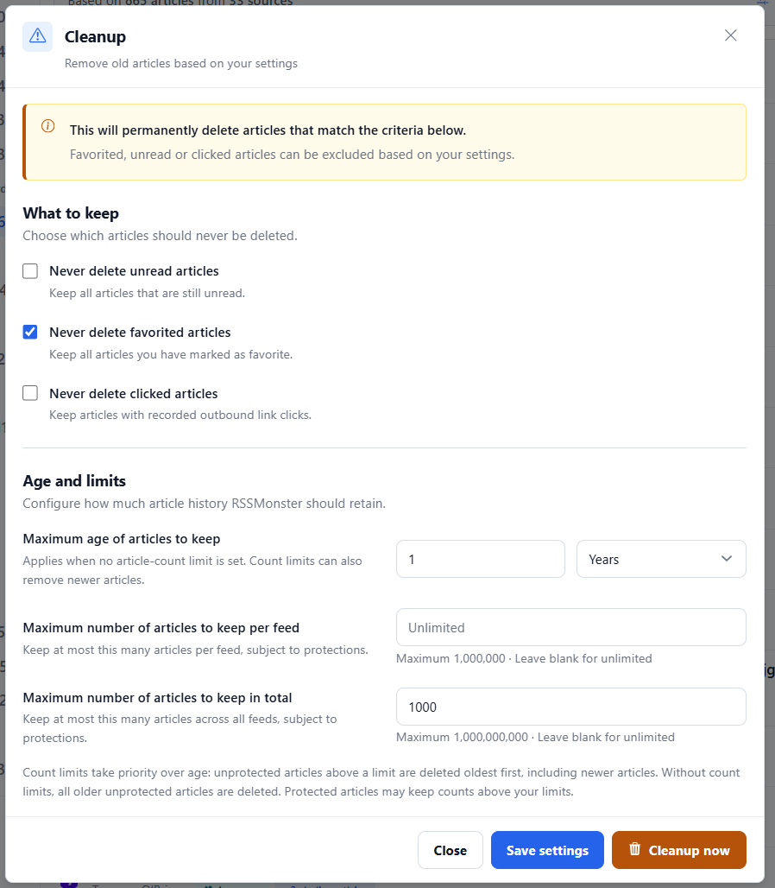

# Article Archiving

Use **Cleanup articles** in the sidebar to configure how much article history
RSSMonster retains. Settings belong to your account and apply both to manual
cleanup and the server's nightly archiving run.

Archiving permanently deletes eligible articles; it does not move them into a
separate archive. Your feed subscriptions remain. Use a
[database backup]() if you need to recover deleted
articles later. An [OPML export]() saves subscriptions, not
article content or reading state.



## Choose what to keep

These protections take priority over every retention limit:

| Setting | What it protects | Default |
| --- | --- | --- |
| Never delete unread articles | Articles still marked unread. | Checked |
| Never delete favorited articles | Articles saved as favorites or [bookmarks](). | Checked |
| Never delete clicked articles | Articles with recorded outbound link clicks. Opening an article inside the reader is not an outbound click. | Unchecked |

Protected articles count toward the limits but cannot be deleted by cleanup.
If protected articles alone exceed a limit, the retained count stays above it.

## Set age and count limits

| Setting | Accepted values | Default |
| --- | --- | --- |
| Maximum age of articles to keep | A positive whole number and Days, Weeks, Months, or Years. | 7 days |
| Maximum number of articles to keep per feed | 1–1,000,000; leave blank for unlimited. | Unlimited |
| Maximum number of articles to keep in total | 1–1,000,000,000; leave blank for unlimited. | Unlimited |

**Count limits take priority over age.** When either count limit is set, cleanup
removes unprotected articles oldest first to satisfy the configured count limits,
even if those articles are newer than the age setting. When both count limits
are blank, cleanup deletes unprotected articles older than the configured age.

Age and oldest-first ordering use the time an article was stored in RSSMonster,
not its publisher's publication date. Months and years use calendar arithmetic
in UTC, clamping to the last valid day of the target month.

For example, with **Never delete favorited articles** checked, an age of **1 year**,
a total limit of **1,000**, and no per-feed limit, cleanup keeps favorites and
removes the oldest eligible articles until at most 1,000 stored articles remain.
The one-year setting does not protect newer articles in this configuration.
Other checked protections still apply, and protected articles may prevent the
total from reaching 1,000.

## Save or clean up now

- **Close** dismisses the dialog without saving edits or running cleanup.
- **Save settings** saves your preferences without deleting articles immediately.
  The nightly worker uses these saved settings.
- **Cleanup now** first saves the displayed settings, then runs cleanup. You do
  not need to press Save settings first. When cleanup completes, the application
  refreshes and reloads the sidebar counts.

Controls are disabled while saving or cleaning up to prevent duplicate requests.
If saving fails, cleanup does not start. A cleanup failure is reported without
refreshing the page.

## Why the sidebar can show fewer articles

Retention limits count **stored article records**, while the sidebar counts the
articles visible in each view. Duplicate suppression, filtering, score thresholds,
read/unread state, and [Event grouping]() affect the displayed
counts.

For example, 1,000 stored records might contain 898 unread articles, 100 read
articles, and two duplicates. With Event grouping enabled, those articles could
appear as 865 unread entries and 85 read entries. Seeing **865 unread** does not
mean only 865 article records remain.

## Nightly cleanup at 03:00

The [crawl worker](#running-the-workers) starts archiving
every night at **03:00 in the worker's local timezone** (`TZ`; typically UTC in
Docker). It processes users sequentially, applying each user's saved settings.
Accounts without a settings record use the defaults above.

Every completed user cleanup writes a console log, including runs that remove
zero articles:

```text
[Archiving] Completed user=42: removed 503 articles.
```

A failure for one user is logged and does not stop cleanup for the remaining
users. Keep the crawl worker running for nightly cleanup; restarting it schedules
the next 03:00 rather than replaying missed nights. The standalone desktop app
does not run this worker, so use Cleanup now there.
