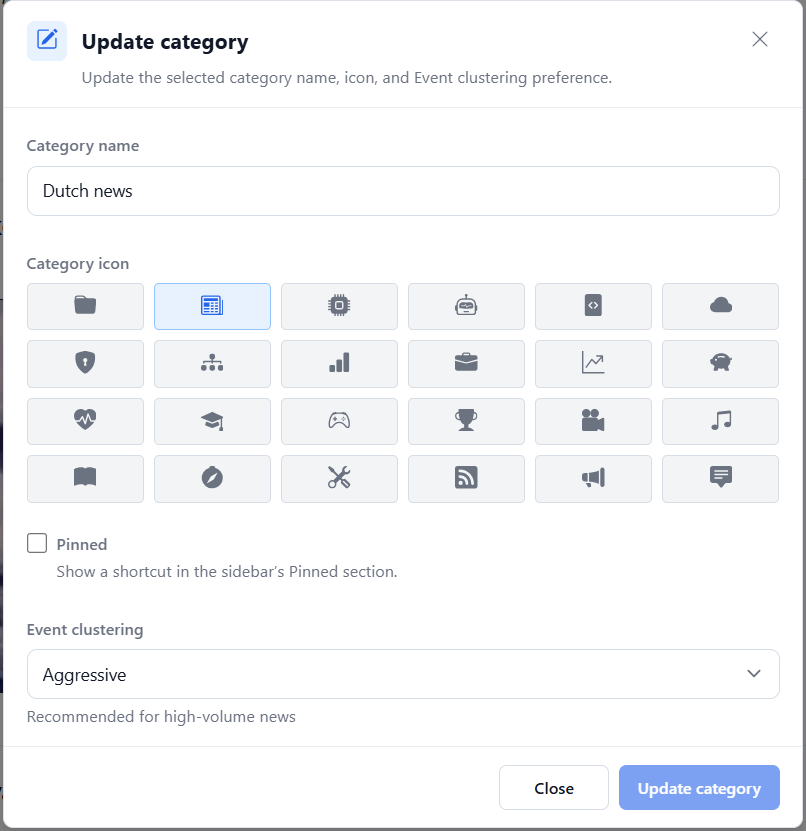

# Categories

Categories organize your feed subscriptions. You can give each category a name
and icon, pin it for quick access, and choose how readily its articles join
existing [Events]().

## Edit a category

Select a category in the sidebar and choose **Edit category**. In the
**Update category** dialog, change the settings you need, then select
**Update category** to save. **Close** discards unsaved edits.

*The Event clustering control appears when AI features are enabled.*

## Change the name or icon

Edit **Category name** to rename the category. Under **Category icon**, select
an icon from the picker to make the category easier to recognize in navigation.
The selected icon is highlighted. Names and icons can also be chosen when
creating a category.

Changing a name or icon preserves the category's feeds and articles.

## Pin a category

Enable **Pinned** and save to add a shortcut to the sidebar's **Pinned** section.
The shortcut opens the same category and shares its selection state and counts.
The category remains in its usual location; pinning does not move or duplicate
its subscriptions.

Pinned shortcuts remain available even when normal sidebar filters hide an item.
Disable **Pinned** and save to remove the shortcut. If no categories or feeds are
pinned, the Pinned section is hidden. You can change the section's position in
Sidebar configuration.

## Choose Event clustering

An Event groups coverage of one occurrence, such as several reports about the
same announcement. **Event clustering** controls how permissive the normal
semantic match is when an article from this category is considered for an
existing Event.

| Option | Recommended use | Effect |
| --- | --- | --- |
| **Server default** | Follow the administrator's configuration. | Uses the server's existing matching threshold. This is the default for new and existing categories without an explicit preference. |
| **Aggressive** | High-volume news. | More permissive matching; articles are more likely to join existing Events. |
| **Moderate** | Sports, gaming, and technology. | Uses a fixed middle setting. |
| **Conservative** | Blogs and niche feeds. | Stricter matching; articles are less likely to join existing Events. |

Lower thresholds allow more articles to join existing Events and tend to reduce
fragmentation. Higher thresholds require closer similarity and can leave more
articles standalone or spread coverage across more Events. Similarity is still
only part of the decision: existing time, occurrence-identity, supporting-evidence,
and ambiguity rules remain in force, including the near-identical-headline
exception. Aggressive does not force every article into an Event.

The preference comes from the **incoming article's feed category**, not from the
categories of articles already in the Event. Categories are not boundaries that
prevent coverage from different categories from sharing an Event.

The setting applies during subsequent Event attachment decisions, including the
final membership check. Saving a new preference does not automatically regroup
previously assigned articles. It does not change candidate retrieval, new-Event
creation rules, embedding generation, similarity calculations, or Event lifecycle.
It also does not change Interest Island, personal-interest, or Recommended scoring
formulas.

### When AI is disabled

The Event clustering control is hidden in both the create and update dialogs
when AI features are disabled or not yet enabled. Category names, icons, and
pinning remain available. Editing a category while the control is hidden preserves
its saved clustering preference. New categories use Server default.

### Stored values and server default

The category API stores this preference as `clusteringBehavior`:

| UI option | Stored value | Normal matching threshold |
| --- | --- | ---: |
| Server default | `null` | Configured `EVENT_SIM_THRESHOLD`, or `0.84` when unset |
| Aggressive | `aggressive` | `0.78` |
| Moderate | `moderate` | `0.84` |
| Conservative | `conservative` | `0.89` |

A missing value also uses the server default. **Moderate** is fixed at `0.84`,
whereas **Server default** follows the administrator's configuration. Existing
categories are not automatically assigned Moderate. These numeric thresholds
are not exposed in the category dialog.

For Event grouping, supporting evidence, and administrator settings, see the
[Events guide](). For feed organization and sidebar options,
see [Feeds and Categories]().
