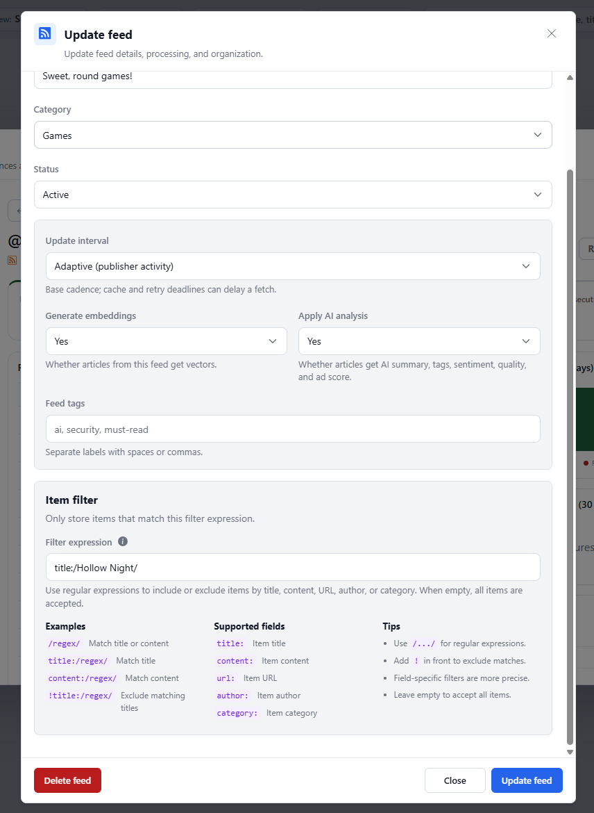

# Filtering Feed Items

An item filter limits which entries from a particular feed enter RSSMonster.
Use one when a publisher combines several subjects in the same feed and you
only want to retain a subset, or when recurring unwanted items can be
identified reliably from their metadata.

Open **Settings → Feeds**, select the feed, and enter an expression in the
**Item filter** section of the **Update feed** dialog. Leave the field empty to
accept every item.



An item filter affects future crawl processing for that feed. It is not a
search expression and does not change articles already stored in RSSMonster.

## Expression Syntax

RSSMonster supports one slash-delimited JavaScript regular expression,
optionally scoped to a field or negated. Matching is case-sensitive unless the
expression uses the `i` flag.

### Match Title or Content

An expression without a field name accepts an item when either its title or
its content matches:

```text
/Hollow Knight|Silksong/i
```

Title and content are tested independently. They are not joined into one
string. This means an anchored expression such as `/^Release/` can match the
start of either field.

### Match One Field

Prefix the expression with a supported field and a colon to inspect only that
field:

| Expression | Value inspected |
| --- | --- |
| `title:/release/i` | Item title |
| `content:/security update/i` | Normalized text content |
| `url:/\/games\//` | Item URL supplied by the feed |
| `author:/Jane Doe/i` | Item author |
| `category:/technology/i` | Each category supplied for the item |

For content matching, RSSMonster uses the normalized article body and falls
back to the item description when the body has no text. A category filter
accepts the item when any one of its categories matches.

Forward slashes inside the pattern must be escaped. For example, this filter
accepts HTTPS URLs under an `/articles/` path:

```text
url:/^https:\/\/example\.com\/articles\//
```

Standard JavaScript regular-expression flags can follow the closing slash.
The `i` flag for case-insensitive matching is the most commonly useful:

```text
author:/rssmonster reporter/i
```

See the [MDN regular-expression guide](https://developer.mozilla.org/en-US/docs/Web/JavaScript/Guide/Regular_expressions)
for JavaScript pattern syntax.

### Exclude Matches

Add `!` before an atomic or field-specific filter to reject matching items and
keep everything else:

```text
!title:/sponsored|advertisement/i
```

```text
!category:/podcast/i
```

For a negated field filter, an item without that field is accepted because
there is no matching value to exclude. A negated atomic filter rejects an item
when its title or content matches.

## More Examples

| Goal | Filter expression |
| --- | --- |
| Keep articles mentioning Linux in the title or body | `/linux/i` |
| Keep titles beginning with “Release” | `title:/^Release/` |
| Keep items in either of two categories | `category:/^(technology|science)$/i` |
| Keep articles from a particular author | `author:/^Jane Doe$/i` |
| Exclude promotional titles | `!title:/sale|deal|sponsored/i` |
| Exclude a URL section | `!url:/\/opinion\//` |

Only one filter expression can be configured per feed. Use regular-expression
alternation, such as `/linux|bsd/i`, when several values should match.

## Validation and Crawl Behavior

The Update feed dialog validates the expression before enabling the update.
The server validates it again before saving. During every crawl, RSSMonster
compiles the stored expression once for that feed before processing its
entries.

If a stored expression is invalid—for example, because it was written by an
older client or edited directly in the database—the feed fails with an
observable `FEED_ITEM_FILTER_INVALID` validation error. RSSMonster does not
silently accept all items, and the failure does not crash the crawl worker.

The feed still has to be fetched and parsed so RSSMonster can inspect each
entry. It also normalizes the entry's body before content matching. A rejected
entry then stops before article identity lookup, image detection, automation,
AI analysis, semantic enrichment, or article persistence. This avoids spending
classification and embedding resources on content that will not be retained.

Crawl progress and results include a filtered-item count, and structured crawl
logs include a `filtered=<count>` field. The count also includes items discarded
by existing ingestion automation rules.

## Non-Retroactive Filtering

Item filters apply only as entries are encountered in later crawls:

- Saving or changing a filter does not scan, hide, or delete existing articles.
- A rejected item does not leave an article identity row in the database. If
  the publisher still includes it after the filter changes, RSSMonster evaluates
  it again.
- If an article was previously accepted but a later publisher revision no
  longer matches, RSSMonster keeps the last accepted version. The rejected
  revision does not update, hide, or delete it.

Use [Search](search.md) or a [Smart Folder](smart-folders.md) when you want a
dynamic view over articles that are already stored. Use an item filter only
when the unwanted entries should not enter the article library at all.
