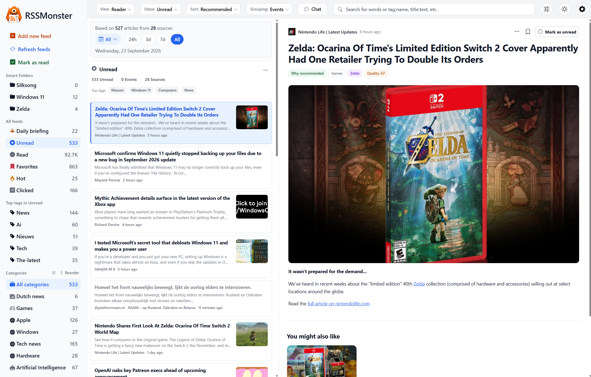

# RSSMonster

RSSMonster is a self-hosted RSS reader for people who enjoy following their own
sources. Read chronologically, organize subscriptions, and save useful articles.
With optional AI processing, you can also explore related coverage, follow
ongoing stories, and rank articles by quality or personal interest.

## Start reading

- [Get Started →]() — Installation and first steps.
- [Run the Desktop App →]() — Read locally with Electron and SQLite.
- [See It In Action →]() — Reading modes and mobile layouts.
- [Deep Dive →]() — How it all works.

[Install RSSMonster](), [create your account](),
and [add feeds]() or [import an OPML file]().
The default SQLite Docker deployment provides a lightweight reader. Use the
MySQL deployment with inference and its AI worker for background analysis and
semantic features; these are not enabled by default in the SQLite quick start.

Choose [Expanded, Reader, Summarized, Summary Bullets, or Headlines]()
to suit your reading session and screen. [Bookmarks](),
[keyboard shortcuts](), and configurable
[read behavior]() help you work through your subscriptions.

## Find and organize

- **[Search]():** combine words with filters such as
  `title:javascript @today quality:>0.7`.
- **[Smart Folders]():** save a search as a reusable view.
- **[Tags]():** organize articles using publisher, feed, generated, or rule-based labels.
- **[Actions]():** automatically bookmark, mark read, tag, score, or hide incoming articles.
- **[Official Feeds]():** recognize articles from organization domains you configure.
- **[Feed item filters]():** decide which future entries a subscription accepts.
- **[HTML + XPath feeds]():** follow sites without a usable syndication feed.
- **[Generated feeds]():** publish a saved selection at a revocable, token-protected RSS URL.

## Explore optional intelligent features

[Quality, Recommended, and Top Stories]() provide different ways to
order your reading. [FeedTrust]() explains how source
history contributes to those rankings. [Events]() collect coverage of a particular story;
[Topics]() connect related themes; [Interest Islands]()
use reading feedback to model recurring interests. Similar coverage is not
necessarily duplicate content, and a ranking score is not a fact check.

[Daily Briefing]() offers a tunable recent collection and a
source-based story overview. The [assistant]() lets you ask questions
about stored articles in natural language. Ordinary search uses the documented
expression syntax; conversational requests belong in the assistant.

## Use RSSMonster beyond the browser tab

[Run RSSMonster as a desktop app]() with its own local SQLite
database and manual feed refresh, without Docker or a separate server.

[Install the web app and enable notifications](),
configure [account recovery and briefing emails](), or connect a
[Fever or Google Reader client](). Developers can use the
[native API](), authenticated RSS output, or MCP tools.

Self-hosting gives you control over storage and deployment. Optional external
inference providers receive the content needed for enabled model requests;
SMTP and browser Push delivery also use configured external services. Choose
[models and providers]() to match your deployment preferences.

## Operate and understand your server

Start with [Configuration]() and [Administration]()
for crawling, processing jobs, email, maintenance, and backups. Read
[How RSSMonster Works]() for the processing architecture,
or [Concepts]() for the distinctions behind the interface.
The [FAQ]() answers common questions about filtering and ranking.

For development setup, validation, and pull requests, read
[Contributing]().

RSSMonster is open source under the MIT license.
