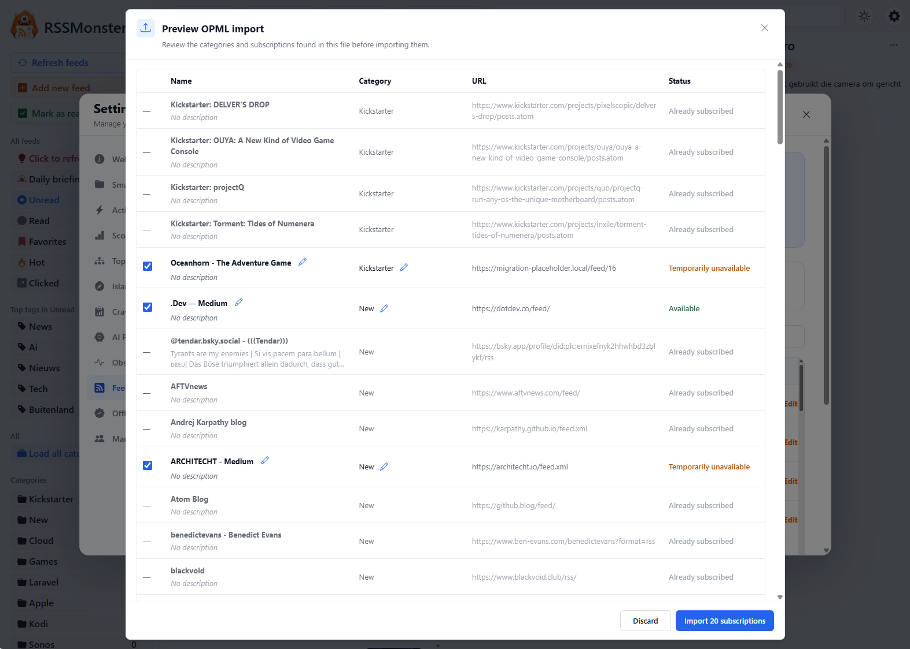

# OPML Import and Export

OPML is a common exchange format for moving feed subscriptions between RSS
readers. RSSMonster can import an OPML file through a review step and export
your current subscriptions as a new OPML file.

Both actions are available from **Settings → Feeds**.

## Import Subscriptions

Choose **Import OPML**, then select an `.opml` or `.xml` file exported by your
previous RSS reader. The file may be up to 1 MiB.

RSSMonster opens the preview dialog immediately. It parses the file, finds its
categories and subscriptions, compares the feed URLs with your existing
subscriptions, and checks whether new feeds can be reached. The progress text
shows how many eligible feeds have been checked while this work runs.



Uploading the file does not create categories or subscriptions. Changes are
only saved after you approve the completed preview.

### Understand the Preview

The preview displays the name, category, feed URL, and status of every
subscription found in the file. Importable subscriptions are selected by
default. Clear a subscription's checkbox to exclude it; the number on the
**Import subscriptions** button updates to match your selection.

RSSMonster can show the following statuses:

| Status | Meaning |
| --- | --- |
| **Available** | The server reached an HTTP response from the feed URL. |
| **Temporarily unavailable** | The connection timed out or failed, including DNS and network failures. |
| **Access denied** | The feed returned HTTP 401 or 403. |
| **Rate limited** | The feed returned HTTP 429. |
| **Not checked** | The connection check did not run before the preview deadline. |
| **Already subscribed** | Your account already has this exact or canonical feed URL. |
| **Duplicate in file** | The same normalized feed URL appeared earlier in the uploaded file. |

The connection check is deliberately lightweight. It has a five-second limit
per feed and only verifies that a response can be reached; it does not download
or process the feed content. Already subscribed feeds and duplicates within the
file are not checked.

Connection statuses are advisory. A new feed remains selectable when it is
temporarily unavailable, access denied, rate limited, or not checked. The
approved OPML metadata is stored without downloading or parsing the feed first,
so these connection statuses do not prevent its creation. Normal crawling will
try the imported URL afterward and update its health and feed metadata over
time. Until an imported feed has articles, crawl history, or errors, the Feeds
overview shows its health as **New**. Feeds marked **Already subscribed** or
**Duplicate in file** cannot be selected or imported.

For large files, preview validation runs in the background and can take up to
about five minutes. If the backend preview deadline is reached first, any
remaining candidates appear as **Not checked** so that you can still review the
result. If the preview itself fails, close the dialog and try the upload again.

### Adjust Descriptions and Categories

Use the pencil beside an importable feed's name to change its description. The
feed name itself comes from the OPML file and is shown as the row heading.

Use the pencil beside a category to assign the subscription to:

- an existing RSSMonster category;
- a category found in the OPML file;
- **Uncategorized**; or
- a new category name.

The category menu identifies choices that already exist in RSSMonster, came
from the OPML file, or are present in both. Choose an existing category to reuse
it instead of creating a second one. A new category entered in the preview is
also available for other subscriptions in the same preview.

The complete preview is sent back with each subscription's selection state,
and the backend processes only those explicitly selected for import. Choose
**Import subscriptions** to create them, or **Discard** to close the preview
without changing your account. After a successful import,
RSSMonster reports how many categories and feeds were added and refreshes the
Feeds overview.

## Export Subscriptions

Choose **Export OPML** from **Settings → Feeds**. Your browser downloads a file
named similar to:

```text
rssmonster-export-<timestamp>.opml
```

The export contains:

- your categories, in their configured order;
- feed names and URLs within each category; and
- feed descriptions when available.

The file uses OPML 2.0 XML and escapes characters that have a special meaning
in XML. Empty categories are retained in the outline. Articles, read and
favorite state, tags, scores, and application settings are not part of the
export.

You can keep the downloaded file as a subscription backup or import it into
another RSS reader that supports OPML.
