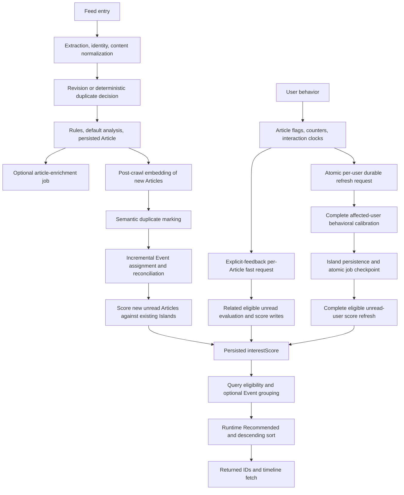

# RSSMonster Personalization Architecture Validation

## 1. Executive Summary

**Review target:** `topic-removal`, commit `6178eae9`, 2026-09-14. This review examines the current implementation, not the earlier Topic architecture. No production code, configuration, fixtures, thresholds, weights, or existing tests were changed. Only this report and ignored diagnostic artifacts were created.

**FACT** denotes repository behavior or measured output; **INTERPRETATION** denotes engineering/product judgment; **HYPOTHESIS** denotes a proposed benefit requiring evaluation. Scores below are review judgments, not calibrated benchmarks or comparisons measured against TikTok.

| Dimension | Score /10 | Basis |
| --- | ---: | --- |
| Overall personalization maturity | 5 | Working individualized scoring and durable jobs; important memory/capture gaps and little ranked-feed validation |
| Adaptation speed | 6 | Explicit feedback can change scores after one fast job; no measured end-to-end latency or completion-driven timeline refresh |
| Interest-model quality | 5 | Signed vector communities with confidence; very slow positive decay, permanent negative formation evidence, capacity pressure and lingering Islands |
| Behavioral-signal quality | 5 | Explicit clocks and atomic job requests; deep-read state mismatch, Event sibling propagation, automated rule evidence, and publication-window feed trust |
| Ranking quality | 4 | Deterministic bounded mathematics and partial held-out labels; no production relevance, satisfaction, or online ranking benchmark |

**INTERPRETATION:** Recommended is a credible heuristic personalized ranking system, not yet an evaluated continuously learning timeline. It learns semantic affinity from current Article state; it does not learn a user's utility function, calibrate engagement likelihood, correct for exposure, or optimize a ranked list. A passing finite-score simulation does not establish that each additional interaction improves the next timeline.

Five strengths:

1. Article-to-Island personalization works without Topics, and unmatched eligible articles retain finite scores.
2. Explicit positive and negative feedback have separate clocks and an independently runnable fast scoring path.
3. Behavior and refresh requests commit together; coalescing and request-scoped checkpoints reduce lost work and duplicate calibration.
4. Confidence discounts singleton/weak support; strongest positive and negative paths avoid unbounded correlated score addition.
5. Canonical ownership constraints, persisted-score write suppression, and production-service regression tests protect important operational contracts.

The ten main weaknesses are detailed in §26: weak forgetting; deep-read capture mismatch; synthetic Event sibling evidence; loss of intent specificity on the durable path; capacity/lifecycle mismatch; worker and timeline-refresh dependency; incomplete concurrency serialization; no list-level diversity; no exposure-aware exploration; and insufficient ranked/adaptation evaluation with known fixture-integrity failure.

**Recommended next decision:** validate and correct evidence/capture semantics first, then measure adaptation and ranked relevance. Do not add a replacement for Topics. Improvements below are proposals only.

## 2. Current Architecture

**FACT — active flow:**



The Article is persisted **before** post-crawl embedding/Event work. Events and Islands are not successive ownership layers: Events identify occurrences; Islands are formed directly from behavioral Articles. An Event is not required to create an Island or score a candidate.

Entry points: [`processArticle`](../server/services/crawl/orchestration/processArticle.js), `buildArticleCandidate`, `processNewArticle`, `processArticleRevision`, and [`runPostCrawlSemanticPipeline`](../server/services/crawl/orchestration/postCrawlSemanticPipeline.js). The latter executes `embedArticles → markDuplicateArticlesForUser → runIncrementalEventsForUser → scoreArticlesFromIslandsForUser`, scoped to crawl-touched users and new creation times. It **does not** recalibrate Islands. Desktop mode skips this post-crawl semantic pipeline. Optional article classification and display-label generation use separate jobs.

## 3. Semantic Data Model

**FACT:** [`models/index.js`](../server/models/index.js) initializes Article, Event, Island, IslandTaxonomy, ProcessingJob, Feed and the supporting models. Article stores `articleVector`, `embedding_model`, nullable `eventId`, `interestScore`, duplicate identity, filtering, behavioral flags/counters, and five nullable interaction timestamps. Event ownership/membership is `Article.eventId`; its vector, representative/developing pointers and aggregate counts are derived occurrence state. Island stores vector, signed weight, signal snapshot, labels, archival state and bounded population audit. There is no persisted Article↔Island membership table; scoring and support membership are derived.

An active-source search across models, services, controllers, routes and client found no `Topic`, `ArticleTopic`, `EventTopic`, `IslandTopic`, `topicId` or `topicVector` dependency. The remaining literal `Topic:` in [`taxonomyEmbeddingText.js`](../server/services/islands/taxonomyEmbeddingText.js) labels taxonomy embedding text; it is not a Topic model or a personalization join. Taxonomy supplies display names. Historical migrations/reports are not active semantic dependencies. **Topic removal is complete for the inspected recommendation path.**

## 4. Embedding Pipeline

**FACT:** `buildArticleCandidate` extracts publisher fields, normalizes URLs/identity, sanitizes presentation HTML, builds normalized visible text/description and distinct source/content representations. Publisher identity is resolved before semantic duplicate suppression; unchanged revisions stop, changed revisions preserve user state through their separate persistence path. Filter/discard decisions prevent inappropriate enrichment and visibility.

[`buildArticleEventEmbeddingText`](../server/services/articles/embedArticle.js) constructs `Title`, unique summary sentences and up to two meaningful early body paragraphs, deduplicates overlapping content, removes URLs/boilerplate and caps input at 512 estimated tokens. Title normalization removes common news prefixes and source-like suffixes; short inputs below 60 characters are normally skipped. `contentOriginal`, `contentHtml`, `contentText` and `description` are distinct contracts, not interchangeable text fields.

`embedArticle` reuses an existing vector before requesting inference. `embeddingService` delegates to [`capabilities/embedding.js`](../server/services/ai/capabilities/embedding.js), which validates model metadata, requested count, positive dimensions, equal vector length and finite elements. Feed `generateEmbeddings`, intelligent-feature switches and inference availability govern missing-vector generation. This audit did not invoke inference.

[`inference/src/config/config.js`](../inference/src/config/config.js) supports local and OpenAI-compatible embedding configurations. Local defaults are Qwen3 Embedding 0.6B ONNX with 1,024 dimensions. The local provider uses CPU fp32, last-token pooling and `normalize: true`; remote model/dimensions are configurable. The server stores the model returned by inference. Legacy metadata is a fallback for old vectors, not a forced current model.

[`vectors/similarity.js`](../server/services/vectors/similarity.js) computes cosine using norms; mismatched dimensions, missing vectors and zero norms yield zero. Formation and persistence normalize/average vectors. Equal dimensionality does **not** prove the same embedding coordinate system: scoring compares vectors without checking `embedding_model`. **INTERPRETATION:** model migration must remain coordinated; mixing equal-dimensional models could silently produce meaningless affinity. The existing rebuild tooling is relevant, but was not run.

## 5. Events

**FACT:** Deterministic identity duplicates are checked before new persistence; [`markDuplicateArticlesForUser`](../server/services/duplicates/articleDuplicates.js) is a later vector duplicate pass (default cosine .99, bounded publication window). Duplicate pointers/filtering exclude Articles from personalization. Event identity is a different question from duplicate identity.

[`assignArticleToEvent`](../server/services/events/assignArticleToEvent.js) uses recent Event and Article caches, centroid/member discovery, [`evaluateArticleAgainstEvent`](../server/services/events/eventOccurrencePolicy.js), a clear-winner decision and locked membership revalidation. Defaults include Event similarity .84, at least two articles/two sources, a strict whole-Event span below 24 hours, and winner margin .03. Semantic/headline/temporal ranking weights are .75/.15/.10 plus the existing .03 entity bonus; near-identical headline and strong semantic support rules remain. Deterministic product/version/location/action hints can reject conflicting occurrences; missing hints remain neutral. Member evidence and leave-one-out seed validation prevent self-corroboration. Candidate comparison is bounded, not a global all-pairs scan.

[`reconcileTouchedEvents`](../server/services/events/eventReconciliation.js) recomputes membership-derived counts, source diversity, windows, strength, status and developing pointers. A valid representative remains stable; the developing pointer tracks the current unread coverage wave. Status derives from support and age; it is not itself a personal preference signal. Repair/backfill entry points exist but were not run.

Events influence Recommended through corroboration and optional candidate grouping. They do not provide behavioral normalization: five independently stored canonical members can contribute five Article samples. Event source diversity is **not** interest diversity. Grouping suppresses repeated cards when enabled; it does not undo behavioral overcounting or cap feed/Island concentration.

## 6. Interest Islands

**FACT:** [`buildInterestIslandProfilesForUser`](../server/services/islands/islandArticleProfiles.js) loads the affected user's complete canonical, unfiltered vectorized behavior state, including read Articles. There is no publication-history cutoff or SQL evidence LIMIT for formation. Profiles below absolute score .05 are excluded. It sorts by absolute signed score, then Article ID; greedily adds each profile to its most similar current centroid at cosine ≥.64 or creates a new community while capacity remains. No below-threshold join is forced.

Centroids average vectors using absolute profile magnitude, then normalize. Positive and negative Articles can occupy the same community: signs affect weight, not geometric direction. Community preference is:

```text
W = round4(clamp[-1,1](mean(profile score)/7
    + sign(mean(profile score)) × min(.2, .03 × member count)))
```

The denominator is `star + deepRead + click = 4 + 1 + 2`, not the maximum possible combined evidence. Explicit feedback or combined engagement can saturate W.

The default **new-profile** cap is 20 (also the measured first-pass count). Runtime deployment environment overrides were not inspected; this report does not infer a production setting from defaults. The configuration parser uses `parseInt(MAX_INTEREST_ISLANDS, 20)`, so an environment value such as `20` means 40 in radix 20. This is a concrete configuration defect, distinct from active-count overflow. No setting was changed.

[`persistInterestIslandProfiles`](../server/services/islands/islandPersistence.js) matches each new profile to an unused existing Island (including archived rows) at cosine ≥.78. It replaces weight/counter snapshots, blends the vector as normalized `.65 × old + .35 × incoming`, appends bounded audit data and reactivates matches. Unmatched profiles create Islands. Unmatched existing rows retain their prior weight/vector and archive only when confidence <.12 and `updatedAt` is stale for 45 days. This is not a hard cap on active stored Islands. A matched profile refreshes `updatedAt` even when its underlying interactions are old. General repeated calibration can move a blended vector toward the same profile again; complete signal snapshots prevent counter inflation but do not make every new calibration geometrically idempotent.

Confidence is separate from preference and relationship strength; see §13. Labels/taxonomy do not enter the candidate cosine equation. A separate duplicate-name pass can archive a weaker same-name Island at cosine ≥.92; other name collisions are renamed. Thus naming-related maintenance can affect which Islands remain active, even though labels are not independent relevance evidence. Ten unrelated interests can coexist if their vectors form distinct above-signal-threshold profiles and win capacity, but no current test guarantees the specific ten-interest portfolio in the request. Broad themes can absorb adjacent interests; greedy order and centroid drift can fragment another theme. These are structural possibilities, not evidence that every label corresponds to a coherent human interest.

## 7. Behavioral Signals

The authoritative write orchestrator is [`updateArticleBehavior`](../server/services/articles/updateArticleBehavior.js). Its trigger is the presence of an interaction timestamp field in the update, not semantic comparison of old/new state. Repeated explicit submissions can request work even if the flag remains set.

| Action | Kind/sign | Persisted state and clock | Formation weight/accumulation | Refresh and ranking effect |
| --- | --- | --- | --- | --- |
| Click/open | Implicit positive | `clickedAmount`, `lastClickedAt` | 2 per click, capped at 3 for evidence; stored counter can exceed 3; newest clock ages the entire capped count | Durable; supports Island confidence; no independent click fallback |
| Click clear | Explicit state reset | counter reset, clock cleared | Removes capped click evidence | Durable |
| Favorite | Explicit positive | `favoriteInd=1`, `favoritedAt` | 4, state not additive per repeated favorite | Durable; also eligible for .25 explicit fallback, but no fast job |
| Unfavorite | Explicit removal, not dislike | flag 0, clock null | Removes favorite contribution | Durable; existing Island can retain residual memory |
| More-like-this | Explicit positive | positive 1, negative 0; positive clock now, negative clock null | 8 | Fast and durable; positive fallback if not represented by same-sign Island |
| Not-interested | Explicit negative | negative 1, positive 0; negative clock now, positive clock null | −8, **no formation decay** | Fast and durable; signed fallback and possibly negative Island |
| Deep/high engagement | Implicit positive | `attentionBucket≥3`, `lastMeaningfulReadAt` | 1; bucket 4 gives no extra Island weight over 3 | Durable only when observed deep-read timestamp is written |
| Short attention/buckets 0–2 | Implicit exposure | `attentionBucket`, first-seen state | No direct Island weight | No durable refresh unless another behavioral field changes; affects optional feed-trust recalculation |
| Read / mark unread | Navigation/state | `status`, `readAt` where supported | No direct preference weight | Changes unread candidate eligibility; no refresh by itself |
| First seen | Exposure/UI | `firstSeen` | No direct Island weight | Search/exposure metadata; first-write gate affects attention capture |
| Feed mute | Explicit source availability | `Feed.mutedUntil` | No Island negative | Defers crawling; existing Articles remain queryable; no preference refresh |
| Rule favorite/click | Automated positive state | Same flags and timestamps | Same weights as human state | Ingestion/revision code writes state directly; not an interactive refresh trigger |
| Rule tag | Explicit configured rule | Tag `tagType=rule` | No Island effect unless another action writes behavior | Adds one .08 Recommended boost; multiple rule tags do not stack |
| Other tags/search/smart folders | Selection/metadata | Existing tags/saved expressions | No direct preference weight | Restrict pool; ordinary AI/manual tags do not get the rule boost |

Normal HTTP paths include `articleClicked`, click toggle, more-like-this, not-interested, `articleMarkAsSeen` and favorite handling in [`controllers/article.js`](../server/controllers/article.js). Fever saved/unsaved and GReader starred edits route through the same behavior helper, including bulk owned updates. The MCP controller exposes favorite/click search metadata; it is not an additional direct behavior mutation path in the inspected code. Rule-derived timestamps are set in `applyActions` and preserved through persistence/reconciliation; they are not proof a person interacted.

Feed trust is an **indirect** behavioral path: [`calculateFeedTrustForFeed`](../server/scripts/calculateFeedTrust.js) mixes confidence-adjusted quality (.50), engagement (.20), originality (.15) and negative-feedback quality (.15). Its neutral component prior is .75. Engagement caps favorite + click-presence + attention at 2.5; read/attention/explicit state determines meaningful exposure. It selects **publication within 30 days**, not interaction within 30 days. A favorite today on a 2022 Article is excluded here. Recalculation is a separate command/API, not part of behavior refresh; maximum final Recommended leverage of feed trust is .20×.30=.06.

## 8. Interaction-Time Semantics

**FACT:** [`signalTimestamp`](../server/services/articles/articleBehaviorTime.js) uses `article[field] ?? publishedAt`. Known clocks win; null clocks fall back to publication as legacy evidence. The schema does not distinguish genuinely legacy null from newly manufactured untimestamped state.

| Signal | Clock | Decay / window | Caveat |
| --- | --- | --- | --- |
| Click, favorite, positive feedback, deep read in formation | Their own field | `max(.2, exp(-max(0, ageDays)/1460))` | The variable says half-life, but 1460 is an exponential time constant; actual half-life ≈1012 days |
| Negative in formation | **Not consulted** | Constant 8 | Old dislikes remain strong indefinitely while flag/vector persist |
| Explicit positive/favorite fallback | Each own clock | Within 0–90 days; `2^(-ageDays/30)` | Each path decays separately; strongest positive survives aggregation |
| Explicit negative fallback | `negativeFeedbackAt` | Same 90-day window and 30-day half-life | Unlike negative Island formation, it does age out |
| Confidence day breadth | Latest active signal clock per Article | Count distinct UTC dates; no additional age weighting | Multiple historical days on one Article are not retained |
| Feed-trust engagement sample | Publication date | 30-day inclusion cutoff | Remaining behavioral-age proxy outside Island learning |

Old publication/new favorite: fresh formation weight 4 and fresh fallback. New publication/old favorite: old clock decays formation and may exclude fallback. Repeated click: the latest clock refreshes all up-to-three click units, not a history of separately dated clicks. Reversal clears the opposite explicit flag/clock; negative wins contradictory legacy explicit flags, but favorites/clicks/deep reads remain independent positive inputs.

After 90 days, positive formation retains ~94.0%; after one year ~77.9%; after 1460 days ~36.8%; it eventually floors at 20%. Even one ancient deep-read sample remains .2, above .05 formation eligibility. **INTERPRETATION:** current memory forgets very little. Negative formation does not forget at all. There is no periodic per-candidate read-time refresh of persisted interest; merely waiting does not rescore existing unread Articles.

Two capture defects deserve explicit attention:

* `articleMarkAsSeen` assigns `attentionBucket` only when `firstSeen` is absent. A skim first and deep read later writes a fresh `lastMeaningfulReadAt` but leaves the bucket below 3. Both formation and active-clock selection ignore it. The existing repeated-deep-read test starts with bucket 3 and misses this transition.
* First-time grouped seen handling copies the payload, including `attentionBucket` and `firstSeen`, to Event siblings but deletes only `lastMeaningfulReadAt`. Siblings can therefore acquire deep-read flags without observed reading and be counted using publication fallback. The existing sibling test checks only the timestamp and starts with an already-seen representative, so no bucket is propagated in that test.

These findings follow directly from `controllers/article.js` around `articleMarkAsSeen`; they were not corrected in this diagnostic task.

## 9. Personalization Refresh Architecture

**FACT:** `updateArticleBehavior` obtains the owned User lock before Article/job writes and commits behavior plus request in one transaction. SQLite uses an immediate transaction; bulk no-match updates do not enqueue. The unique ProcessingJob key is `(userId,type,dedupeKey)`.

[`requestRefresh`](../server/services/jobs/personalizationRefresh.js) reuses `personalization_refresh/current` for each user. The first pending request sets `availableAt=now+2000ms`; later requests keep that deadline and replace `payload.requestId`, merging reason labels. Continuous action cannot keep pushing that particular deadline forward. Completion checks the claimed request against the current payload under a job lock. A newer request leaves one pending follow-up; otherwise it succeeds. Terminal jobs reactivate on new action.

[`aiWorker`](../server/src/workers/aiWorker.js) defaults to a 1,000ms polling interval and concurrency 1; SQLite effective concurrency is 1. Claims prefer priority descending, then newest job creation/ID. The crawl-priority lease pauses new claims across job types. Long running work is not preempted by fast feedback. Across users, newer/higher-priority work can postpone an old reusable job; anchored debounce alone does not prove queue fairness.

The handler logs trigger reasons, user/job/type, calibration duration, Islands changed, candidates rescored, changed interest scores and checkpoint reuse. Worker lifecycle logs also include execution latency. These are server-work metrics, not action-to-render latency. Trigger reasons accumulate in the reusable payload rather than describing a single isolated click. No deployment worker uptime/queue-age measurement was made. Configured delays are **not measured action-to-screen latency**. Expected sequence is producer commit → worker availability/eligibility → handler time → persisted score → subsequent query → client refresh. The next query before the worker completes can still return the previous score/order.

## 10. Fast Explicit Feedback

**FACT:** `explicit_feedback_refresh/article:<id>` is immediately eligible at priority 20; durable work is priority 10. It is per source Article, not one fast job per user. Favorites do not enqueue it.

`handleExplicitFeedbackRefresh` reloads an owned canonical unfiltered source vector, then calls the existing scoring service. Current flags/timestamps come from `loadIslandEvidence`, not a sign embedded in the queued payload. A reversal before evidence loading uses the new state; the request-version guard preserves another run when a reversal arrives while claimed.

Candidate scope is the union of the source vector neighborhood and neighborhoods of active Islands matching that source at ≥.64. Candidates must pass the existing score relationship threshold (default >.62). However, candidate **discovery still scans every eligible unread vector in 200-row batches**; targeting reduces evaluation/writes, not database retrieval to a vector index.

The evaluator can persist positive/negative scores before any Island rebuild. The HTTP-to-worker regression in [`explicitFeedbackRefresh.test.js`](../server/tests/services/explicitFeedbackRefresh.test.js) verifies neutral → positive → negative, still zero Islands, and unchanged unrelated/read/filtered/duplicate/other-user rows. It asserts signs and Recommended changes, not exact wall time or top-K movement. Positive/negative response magnitude depends on existing Island support and opposing evidence; not-interested is not a universal hard exclusion.

## 11. Durable Calibration

**FACT:** The handler reloads the current job checkpoint and runs [`runIslandCalibrationForUser`](../server/services/islands/runIslandCalibration.js) for only its user. No Event rebuilding or inference is involved; behavioral refresh disables label generation. Complete formation is necessary to preserve greedy ordering, centroid updates, capacity competition, matching and lifecycle semantics. The current optimization does not prune old formation evidence.

Island persistence and `payload.calibration={requestId,...summary}` commit in one transaction after checking job status, owner and lease. Scoring then traverses every canonical unfiltered unread candidate in batches of 200. Missing vectors/relationships become neutral rather than retaining an old unrelated score. Read Articles are not rescored, though they remain behavioral evidence; a later mark-unread does not itself request recomputation.

Unchanged scores skip writes. MySQL comparisons use `Math.fround` to account for actual FLOAT storage precision; SQLite uses exact numeric equality. Write predicates recheck ownership/unread/canonical/filter eligibility. This is not a behavior-version guard on the candidate score itself.

Work is approximately O(B×K×D) for formation plus sorting, O(500×K×D) support assignment, and O(U×(K+E)×D) scoring, where B is complete behavioral history, K active Islands, U eligible unread candidates, E up to 200 explicit sources, and D vector dimensions. Persistence also performs per-profile audit/name work. B and U are not globally capped. Batch size bounds each read, not total work.

## 12. Concurrency and Replay

| Scenario | Current behavior | Coverage / qualification |
| --- | --- | --- |
| Burst completed before claim | One durable job/run for final state; explicit actions may also create fast jobs | GOOD: concurrent click increments, same deadline, one job |
| Action while calibration runs | Request changes; completion leaves one reusable follow-up | GOOD for request retention; not exactly one total future run if more activity continues |
| Scoring fails after calibration | Retry with same request reuses committed checkpoint and resumes whole unread scoring | GOOD: no profile rebuild, unchanged blended vector, reference-result equality |
| Checkpoint commit fails | Island transaction rolls back | GOOD: injected checkpoint failure |
| New behavior after checkpoint | Old checkpoint request differs from newest request, so subsequent claim recalibrates | Code guard present; combined interleaving not exhaustively tested |
| Positive→negative before fast execution | Reloaded current evidence is negative; pending follow-up preserved | GOOD controlled regression |
| Reversal after evidence snapshot | In-flight score may temporarily reflect old snapshot; newer source request runs again | PARTIAL: tests reverse before handler, not every batch interleaving |
| Expired lease/crash | Recover/reclaim, increment attempts; lease-guarded checkpoint/completion | General queue tests; no production crash latency measurement |
| Two workers claim same live job | Row lock/claim state prevents duplicate live ownership | General queue coverage |
| Fast and durable jobs for same user | Separate jobs can run concurrently if deployment concurrency/workers allow | No shared per-user consumer mutex or score generation fencing |
| Manual calibration versus worker | Manual entry point does not share refresh request/checkpoint protocol | No proven global serialization |

Queue defaults: two-minute lease, renewal approximately lease/3, five attempts, exponential retry delay starting at five seconds plus jitter, bounded at fifteen minutes. Dead jobs need a new behavior request or operator retry. User locks serialize **producers**, not every calibration/scoring consumer. Lease checks occur before scoring batches, not atomically with each score write.

**INTERPRETATION:** replay safety is request-scoped and substantially better than blind retries; it is not a proof of global idempotence or serializable recommendation state. An identical *new* request may reblend a centroid. A stale scoring context from a different concurrently running job can overwrite newer values without checking an evidence generation. Default one-worker concurrency reduces this risk, but the configurable/multi-process architecture does not eliminate it. No exhaustive race test was added, per task constraints.

## 13. Interest Matching

**FACT:** [`prepareIslandEvidence` / `evaluateArticleInterest`](../server/services/islands/islandInterestConfidence.js) are the shared confidence-aware evaluator. Support reads the latest 500 eligible behavioral Articles by active interaction time. Each goes to its single best Island at cosine ≥.64. Separate bounded pools contain up to 100 recent explicit negatives and 100 recent positives/favorites within 90 days. Sources represented by a same-sign matching Island are removed from explicit fallback.

For support diagnostics let n be distinct Article IDs, f distinct feeds, d distinct latest-interaction UTC dates, m median cosine and q minimum cosine. Then:

```text
support = .35 + .35·clamp01((n−1)/4)
              + .15·clamp01((f−1)/2)
              + .15·clamp01((d−1)/3)
cohesion = (clamp01(m) + clamp01(q))/2
consistency = .5 + .5·max(positiveCount,negativeCount)/(positiveCount+negativeCount)
confidence = clamp01(support·cohesion·consistency)
```

No current support produces confidence .1. One exact, consistently signed source yields .35. Sources can count in both positive and negative diagnostics when a dislike coexists with favorite/click/deep-read evidence. Distinct feeds/days improve confidence but are not strict independent-evidence requirements.

```text
relationship(s) = clamp01((s−t)/(1−t)), if s>t; else 0; default t=.62
Island path = persisted signed W × confidence × relationship
Explicit path = sign × .25 × 2^(−ageDays/30) × relationship × intentCompatibility
interestScore = round4(clamp[-1,1](strongest positive path + strongest negative path))
```

Direct Island contributions are not intent-gated or individually interaction-decayed at evaluation time. Their weight was derived at calibration time. Explicit paths use intent compatibility: same known intent 1; unknown .5; promotion versus another known intent .05; other differing known intents .75. The heuristic is bounded English title/description matching plus advertisement-score metadata, not general multilingual intent understanding.

Two positive clocks on one source are evaluated separately, but strongest-path selection means they do not stack into two fallback votes. Sign reversal of the source does not necessarily reverse a candidate when another strong positive Island still wins enough magnitude.

## 14. Candidate Selection

**FACT:** The main path is [`searchArticles`](../server/services/articleSearch/articleSearch.service.js) → `buildArticleSearchQuery` → SQL fetch → [`sortArticles`](../server/services/articleSearch/articleSort.service.js) → returned IDs/result limits → article fetch/render. Ownership, selected feeds/categories, canonical duplicate pointer, filtering, configured score eligibility, tags, dates and search expressions determine the pool. No embedding or Island match is required for ordinary Recommended ordering.

The ordinary view defaults to unread; explicit read/unread filters and saved searches can override that. Generic searches can search across states. Favorites/hot/clicked views have their own predicates. Smart folders use saved expressions, score filters and limits. Briefing can explicitly require positive interest or developing Event state, so personalization can affect **retrieval there**. Ordinary Recommended primarily changes **ordering**, not semantic retrieval.

Event grouping adds a SQL representative/developing-pointer predicate. It does not independently choose the highest-interest member of each Event. A specific Event query/grouping option changes this behavior. Feed mute affects future crawl claims, not `fetchFeedIds` exclusion of existing muted-feed Articles.

Computed ranking generally loads the qualifying collection then sorts in memory. Trusted internal `executionBounds` can bound candidates to the newest subset; generic search-expression results default to a 500-ID output limit after ranking, not necessarily a 500-row database scan. Limits and saved-view settings vary by caller. Cursor pagination is rejected for unsupported computed orderings; the client maintains ID collections and paginates fetched Articles. This is not an ANN candidate-retrieval system.

The separate [`articleRecommendations`](../server/services/recommendations/articleRecommendations.js) related-article surface uses its own bounded recent candidate pool (up to 600, returning up to four). It is not the Recommended timeline ranker and should not be mistaken for its retrieval stage.

## 15. Recommendation Mathematics

**FACT:** [`computeRecommendedBreakdown`](../server/services/recommendations/recommendedScore.js) calculates:

```text
I = finite clamp[-1,1](stored interestScore); absent/invalid → 0
F = clamp01(freshness)
A = clamp[0,100](.50·qualityScore + .25·sentimentScore + .25·advertisementScore)/100
Q = .70·A + .30·clamp01(feedTrust)
coverage = clamp01(log2(max(Event.articleCount,1))/log2(64))
spread = clamp01(log2(max(Event.sourceCount,1))/log2(8))
sourceDiversity = clamp01(ln(Event.sourceCount+1)/2.56)
crossSource = max(spread, sourceDiversity)
C = coverage × crossSource; missing Event → 0
B = .08 if any matched rule tag, otherwise 0
Recommended = clamp01(.45·max(I,0) − .30·max(−I,0) + .25·F + .20·Q + .10·C + B)
```

Article model freshness is `exp(-publicationAgeHours/48)`, clamped by the ranker; future dates cannot contribute above .25. Absent publication on a model yields zero. A plain object without `freshness` uses .5. Null/unavailable article score components fall back to 70 in the calculator, whereas model defaults are quality 50, sentiment 50, advertisement 0. Missing feed association uses .5 trust; explicit null trust numerically coerces to zero. These distinctions matter for fixture/plain-object versus production-model comparisons.

There is no separate direct Event strength, hotness, predicted-affinity or click term in Recommended. Feed trust contributes through Q; rule boost is bounded/nonstacking. Event coverage influences corroboration, not negative feedback. Display explanations include positive interest, source diversity, rules, freshness and quality; the presentation does not list a symmetric negative-interest reason.

**INTERPRETATION:** nominal .45 interest weight does not prove interest dominates actual ranking. The retained two-batch trace has mostly neutral Articles (§20), which necessarily rank on the other components. The fresh read-only diagnostic used the 1,886 actually unread canonical unfiltered Articles among the 2,000 stored trace rows. All recomputed scores matched the saved snapshot (tolerance 1e−8). The trace's 100% coverage denominator includes all stored rows; it is not the unread pool size.

| Contribution | Mean | Median | 90th percentile | Maximum |
| --- | ---: | ---: | ---: | ---: |
| Positive interest | .01037 | 0 | 0 | .34610 |
| Negative-interest penalty | −.00203 | 0 | 0 | 0 (most negative −.16035) |
| Freshness | .14094 | .17677 | .23380 | .24991 |
| Quality including feed trust | .10325 | .09750 | .13600 | .16050 |
| Corroboration | .01110 | .00715 | .02872 | .04771 |
| Rule boost | 0 | 0 | 0 | 0 |
| Final Recommended | .26363 | .27824 | .35531 | .67722 |

**INTERPRETATION:** freshness and quality dominate typical candidates in this corpus, while a minority of strongly matched candidates receive substantial interest benefit. Zero rule contribution reflects this fixture, not a disabled production boost. These are fixture observations, not deployed-user measurements.

## 16. Ranking Quality

**FACT:** Current recommendation tests verify equation components, finite defaults, signed penalties, deterministic ordering and joins. They do not establish production Precision@K, click utility, satisfaction, diversity or Recommended superiority over Newest. The main two-batch test asserts finite coverage, positive/neutral presence, signed score effects and some structural continuity, not ranked relevance thresholds.

A restricted offline comparison is possible using existing held-out labels. There are 160 designated pre-feedback probes: 60 `positive`, 23 `negative`, 24 `neutral`, 25 `attenuated`, 12 `emerging`, and 16 without an explicit expected label in the retained report. For a binary relevance diagnostic, use exactly the same 104 eligible unread positive/negative/neutral Articles for Recommended and Newest; positive=1, negative/neutral=0. Exclude attenuated/emerging/unlabelled rather than inventing relevance grades. The original labelled subset contains 107 Articles; three read-state Articles are excluded from both orders.

Precision@10/20, Recall@20 and nDCG@20 are calculable for that **restricted diagnostic pool**. A single-pool reciprocal rank is calculable, but is not a multi-user/query MRR estimate. Pre-feedback `heldOut.recommended` was calculated on Articles without the Event/Feed associations loaded in the final snapshot; this is another reason not to call that comparison production timeline quality. It must not be merged with final post-feedback scores.

For the complete 2,000-Article snapshot, Event/feed concentration and matched Island counts can be calculated without relevance labels. Precision/recall/nDCG for the entire library cannot be validly inferred by treating unlabelled backgrounds as irrelevant. Fresh restricted-pool results:

| Metric | Recommended | Newest |
| --- | ---: | ---: |
| Pool / positive labels | 104 / 57 | 104 / 57 |
| Precision@10 | 1.000 | 0.000 |
| Precision@20 | 1.000 | 0.000 |
| Recall@20 | .3509 | 0.000 |
| nDCG@20 (binary) | 1.000 | 0.000 |
| Single-pool reciprocal rank | 1.000 | .04762 |

**INTERPRETATION:** this limited labelled fixture favors Recommended, but its synthetic chronology places neutral/negative probes later than many positives, making the chronological baseline especially weak. It cannot support a claim of 100% precision on a real feed. Global-library P@K and multi-user MRR remain unavailable. Fresh sign checks give 60/60 expected positives positive, 23/23 expected negatives negative, 24/24 expected neutrals zero, and 12/12 emerging probes zero. These are diagnostic observations, not newly added test assertions.

## 17. Adaptation Latency

**Definition:** number of interactions and/or completed refresh cycles before relevant held-out content materially improves in ranking. Neither elapsed handler runtime nor changing one score alone is that metric.

**FACT, controlled-vector tests:** one more-like-this action → one fast job can produce positive interest before any Island exists. One negative action similarly produces negative interest in the empty-memory controlled case. One favorite → one durable job creates/updates memory and increases related score. Burst actions coalesce. Tests do not measure HTTP-to-worker poll delay, top-10/top-20 movement, or client reordering latency.

Analytical exact-vector singleton examples (fresh isolated source, consistent known intent, no competing paths; these are calculations, not new tests):

| Evidence | Profile score | W | Direct candidate I after durable refresh | Positive Recommended increment |
| --- | ---: | ---: | ---: | ---: |
| One click | 2 | .3157 | .1105 | .049725 |
| Deep read only | 1 | .1729 | .0605 | .027225 |
| One favorite | 4 | .6014 | .2105 | .094725 |
| More-like-this | 8 | 1 | .3500 | .1575 |
| Three capped clicks | 6 | .8871 | .3105 | .139725 |

At cosine .95 the relationship is .868421; confidence and preference then multiply it. Fresh unrepresented explicit feedback at cosine 1 and matching known intent yields ±.25 before calibration (positive rank increment .1125 or negative penalty .075 before final clamping). Two or three **independent Articles** can improve source/day confidence, but exact output depends on cohesion, signed mixture and capacity; it is not a fixed interaction-count threshold.

Existing emerging-interest fixture probes cover gardening, audio and photography, not a staged self-hosting/F1→home-automation product experiment. The retained report has all 12 emerging probes neutral before feedback. The runner batches all held-out probes before its second calibration; legacy wave metadata does not create actual successive refresh cycles. No claim of measured emerging-interest adaptation across those waves is justified. Required missing evaluation: fixed eligible pool and labels, exact action sequence, before/after ranks and top-K membership, independent source count, worker completion, and elapsed action-to-next-render latency. No missing tests were implemented.

## 18. Persistent / Emerging / Abandoned Interests

**FACT:** There is one durable signed Island representation plus a bounded explicit fallback with a different time scale; there is no dedicated short-term/long-term user-model pair.

* Persistent PostgreSQL: retained Article states repeatedly contribute; many independent Articles improve confidence. Same-Article repeat clicks are capped, but new clock refreshes the entire count.
* Short-lived breaking story: several canonical Articles can create a high-support profile even if they represent one occurrence. No Event-normalized weight makes it transient.
* Kubernetes abandoned for three months: positive formation retains roughly .94 recency, while explicit fallback ages out at 90 days. Matched old profiles prevent ordinary stale archival; existing scores can remain unchanged without a refresh.
* Reactivated interest: a new positive interaction is fresh, can use explicit fallback, match/revive an archived Island at .78, or form a new profile. Capacity and matching determine identity continuity; no hard promise of recovering a specific old Island ID exists.

**INTERPRETATION:** the model favors persistence over forgetting, with a sharp difference between direct explicit response and durable memory. It can retain meaningful long-term preferences, but it also retains accidental/transient ones. Calling the default four-year time constant a half-life understates persistence semantics and makes tuning harder to reason about.

## 19. Event Saturation

Five reads among ten publications are not collapsed to one Event-level behavioral sample. Normal read state alone is neutral; five deep reads/clicks/favorites on five canonical Articles become five samples. Distinct feed count can increase confidence precisely because several outlets cover the same story. Duplicate pointers remove copies already identified as duplicates, but canonical corroborating reports still count independently.

The first-time grouped-seen bucket-copy issue (§8) can amplify this beyond the truly observed samples. Repeated clicks on one Article are capped; this does not cap multiple Articles in one Event. Corroboration can independently raise each Event member's Recommended score. With grouping off, several members can dominate the list; with grouping on, one representative/developing card mitigates presentation repetition but not learned memory distortion.

**INTERPRETATION:** arithmetic bounds prevent extreme numerical accumulation, not Event-level exposure bias. Measure unique Events among behavioral support, same-Event share of strongest profiles, and held-out rank changes after one event burst before choosing a normalization design.

## 20. Island Capacity and Cohesion

**FACT, fresh two-batch trace, identical to the retained comparison report:**

| Metric | Batch001 | Batch002 cumulative |
| --- | ---: | ---: |
| Articles | 1,000 | 2,000 |
| Active Islands | 20 | 25 |
| Singleton Islands | 8 (40%) | 10 (40%) |
| Unassigned eligible behavioral profiles | 74 | 114 |
| Positive interest Articles | 43 | 167 |
| Negative interest Articles | 6 | 44 |
| Neutral interest Articles | 951 | 1,789 |
| Events | 128 | 315 |
| Eventless Articles | 520 | 864 |
| Finite Recommended coverage | 100% | 100% |

The second pass matched 15 profiles, created five Islands and archived none. Its persistence summary reports 20 active **returned profiles**, while the database snapshot reports 25 active stored Islands. These are different counts, not conflicting measurements. Formation capacity demonstrably leaves evidence unassigned, but raising capacity is not proven to improve relevance; not all profiles necessarily represent distinct desired interests.

The current report supplies per-Island member counts, distinct feeds/days, median/minimum cosine, positive/negative counts, singleton/cohesion classifications and confidence. Average similarity and pairwise Island overlap require read-only vector diagnostics; labels alone are not valid measurements. The Formula 1 Island has 13 support Articles across ten feeds/two latest-interaction days, median .91085, minimum .77226 and confidence .75740 in the fresh final snapshot. Photography has confidence .84659. Mixed-sign support is explicitly recorded in several negative Islands (e.g. Gaming Laptops). These samples show measurable geometry, not semantic-label ground truth.

There is no current staged test of 10, 15 and 20+ independently labelled interests with recall/false-positive evaluation. Controlled low-capacity tests protect refusal to force joins; the frozen corpus demonstrates cap pressure. Per-Island drift over time is not preserved as vectors in the batch report, so it cannot be reconstructed numerically from those reports alone. Fresh final-state overlap is measurable, but is not centroid drift. All 300 active-Island pairs were inspected: maximum cosine .65899 (Gaming News ↔ Infrastructure as Code), next .61710 (Bitcoin ↔ Nintendo Switch); only one pair meets .64. Those display labels are taxonomy assignments, not proof these pairs semantically represent those exact human categories. No near-.78 pair was found. F1 average member cosine is .87665; all per-Island values are in the appendix. High singleton similarity (~1) is self-geometry, not evidence of generalization.

Potential broad absorption follows incremental centroid recomputation; fragmentation follows the .64 formation versus .78 persistence boundary and signed-strength ordering. Opposing evidence can cancel in a community's mean weight while still steering its centroid through absolute magnitudes. Support assignment is recomputed against persisted/blended vectors and can differ from original formation membership.

## 21. Diversity and Exploration

**FACT:** Main Recommended is independent Article scoring followed by descending sort, with publication timestamp and ID tie-breaks. There is no list-level reranker, feed quota, Island quota, semantic-neighborhood saturation term, randomized exploration bucket or uncertainty-driven exploration policy in this path.

Fresh ungrouped unread-pool diversity diagnostic (same 1,886 candidates for both orders):

| Order / K | Unique Events | Unique feeds | Matched Islands | Largest Event share | Largest feed share |
| --- | ---: | ---: | ---: | ---: | ---: |
| Recommended / 10 | 4 | 4 | 4 | 40% | 30% |
| Recommended / 20 | 7 | 4 | 7 | 20% | 35% |
| Newest / 10 | 10 | 5 | 0 | 10% | 30% |
| Newest / 20 | 20 | 5 | 0 | 5% | 30% |

There were no Eventless cards in these top-K sets. “Matched Islands” counts evaluator path IDs, not independently labelled human interests; zero for Newest does not mean its stories all concern one subject. This diagnostic does not apply the optional grouped-view predicate.

Event grouping is useful but only addresses Event repetition. Feed trust can favor already-successful sources. A feed or one semantic neighborhood can dominate top-N even when every local score is correct. An 8/6/4/2 interest mix is neither good nor bad without user intent and satisfaction data; there is no code ensuring an appropriate mix.

Fresh/high-quality neutral content can surface and lead to a new interest. That is **neutral discovery**, not deliberate exploration. Existing subscriptions/crawled feeds bound available novelty; no global content inventory is searched for interests the user has not yet shown.

## 22. Feedback-Loop Analysis

**FACT:** Clicks affect Islands, which affect exposure, which creates further click opportunities. Protections include three-click evidence cap per Article, singleton attenuation, canonical duplicate exclusion, decay, strongest-path selection, signed clamping and optional Event grouping.

These controls bound arithmetic. They do not measure exposure propensity, correct position bias, distinguish a curious/accidental click from satisfaction, or balance underexposed sources. `firstSeen` and visibility duration exist, but do not implement counterfactual learning. Separate Articles from one popular Event can still broaden confidence. Automated rules that star/click Articles contribute indistinguishable positive state, risking a rule→preference→exposure loop.

**HYPOTHESIS:** better observed-satisfaction capture and an evaluation of exposure-normalized evidence could improve relevance. There is no basis here to assert a particular replacement click weight is optimal; weights were not tuned.

## 23. Negative Personalization

**FACT:** Not-interested is semantic Article evidence, with intent scoping only on explicit fallback. It does not set a global feed mute, guarantee candidate exclusion, or mean only “hide this exact Article.” Source UI emits a local not-interested event; persistence records opposing flags/clocks. Feed-trust recalculation separately uses explicit rejection as source-quality evidence.

For a fresh gaming-laptop promotion dislike with no representing negative Island and cosine .95:

* another known promotion: about −.2171 fallback interest;
* known technical review at the same cosine: about −.0109 due to .05 compatibility;
* unrelated vector below .62: zero contribution;
* unknown intent: intermediate .5 multiplier.

Once a same-sign Island represents that dislike, fallback is suppressed. Direct Island scoring has **no intent multiplier**. A geometrically matching review can therefore receive materially stronger negative interest after durable calibration than during fast feedback. For an exact-vector negative singleton, confidence .35, W=−1, and cosine .95, direct interest is about −.3039 regardless of promotion/review label. These are direct calculations of the current evaluator, not frozen-model guarantees that a given review has that cosine.

**INTERPRETATION:** reliable sign persistence exists, but the semantic scope of rejection changes between fast and durable paths. This deserves focused before/after evaluation and a product decision about whether dislikes target content intent, semantic neighborhood, or both. Existing positive favorites/clicks may offset negative formation; an explicit dislike need not dominate all independent positive evidence.

## 24. Test-Suite Assessment

| Category | Assessment | Evidence and limits |
| --- | --- | --- |
| Embedding | GOOD contract coverage, PARTIAL semantic quality | `embeddings/embeddingService`, vector utilities, `articles/embedArticle`, inference provider tests; frozen vectors are not user relevance labels |
| Event | GOOD focused invariants, PARTIAL occurrence quality | occurrence policy/features/assignment, caches, creation, reconciliation, developing pointers; removed gold assertions no longer run |
| Islands | PARTIAL | profile thresholds/caps, persistence, vector blending, confidence/scoring, audits; no labelled many-interest quality benchmark |
| Behavior | PARTIAL | normal HTTP/Fever/GReader timestamp tests and migration tests; later low→deep transition and first-time sibling flag propagation not covered |
| Refresh | GOOD happy path/replay, PARTIAL concurrency/latency | `personalizationRefresh`, `explicitFeedbackRefresh`, `refreshScoping`, generic queue/worker tests; no full concurrent fast/durable version-fencing test or real latency benchmark |
| Recommendation mathematics | GOOD | equation/default/sign/order tests; correctness is not ranked quality |
| Ranked-feed relevance | MISSING product benchmark; PARTIAL diagnostic labels | no enforced P@K/nDCG/Recommended-vs-Newest quality target; restricted offline comparison is possible |
| Longitudinal adaptation | PARTIAL | one two-batch integration test with 160 pre-feedback probes; no actual month-scale action/refresh trajectory |

The seven semanticGold files and their commands are absent by explicit prior request. They are not reported as failing current tests, and removed Topic tests are not counted as missing coverage. Historical semantic failures are evidence about those historical runs only. Surviving fixture-cache integrity failure remains material even if the two-batch runner can read the cached vectors.

## 25. Representative Execution Traces

1. **Established positive:** multiple coherent independent Articles → decayed profile average/breadth → matched Island weight/confidence → candidate cosine >.62 → strongest positive contribution → `.45×I` ranking benefit. Retained F1 support/confidence is quantified in §20; an unrelated candidate remains neutral.
2. **More-like-this:** controller sets positive/clock and clears negative → atomic fast+durable requests → one fast cycle evaluates current explicit evidence → controlled related candidate changes from zero to positive while Island count stays zero → durable subsequently forms/matches memory.
3. **Not-interested:** negative/clock replaces explicit positive → current-sign fallback can lower related candidate below zero → durable may form a negative Island; a strong competing positive path can attenuate the net penalty.
4. **Old Article favorite:** 2022 publication + favorite now → clock now, formation +4 → durable request → fresh evidence; a new unread candidate's own publication still determines its freshness. The source's old publication does not make the user preference old.
5. **Repeated clicks:** persisted count increments; first three affect magnitude → every click refreshes `lastClickedAt` and requests durable work → a burst can become one calibration; repeated identical state does not add independent confidence samples.
6. **Deep read:** visible duration/content-length ratio ≥.75 → computed bucket≥3 and timestamp → durable request. If already seen at a lower bucket, the clock updates but formation remains ineligible for deep-read weight (§8).
7. **Emerging interest:** new explicit source can respond after one fast cycle without an Island; implicit click/deep read needs durable formation and capacity. The 12 retained emerging probes were neutral; their legacy wave numbers do not prove a failed sequence of new refresh jobs.
8. **Abandoned interest:** no new timestamps → extremely slow positive decay at future calibration, no negative decay; existing persisted candidate scores stay stale absent scoring work. Archival checks are conditional, not automatic inactivity deletion.
9. **Multiple interests:** complete user evidence → strongest-first communities up to profile cap → leftover explicit evidence may use fallback, but leftover click-only evidence has no explicit fallback. Observed 114 unassigned profiles demonstrate breadth pressure without proving 114 distinct interests.
10. **Several Articles in one Event:** canonical member actions → separate Article profiles/source counts → potentially more confidence, not one Event-normalized vote; grouped cards only limit presentation repetition.
11. **Fast refresh:** source-vector/related-Island union → scan unread batches → evaluate related candidates with current support/fallback → only changed eligible scores written. Unrelated stored scores stay unchanged in the controlled test.
12. **Durable after fast:** full profile rebuild/match/blend → checkpoint → full eligible-unread scoring. The same evaluator is used, but new Island representation can change confidence and remove fallback intent attenuation; outputs need not remain equal to the fast stage.
13. **Retry after scoring failure:** Islands+request checkpoint commit → score handler throws → existing retry lifecycle requeues → same request reuses checkpoint → no second centroid blend → complete unread scoring matches a single reference calibration in the controlled regression.

None of these code traces establishes a measured top-10/top-20 improvement without a labelled candidate set and an executed ranking comparison. Exact-vector analytical magnitudes are in §17; frozen-model outcomes remain separately identified.

## 26. Architectural Risks

No CRITICAL security/data-loss finding was established in this diagnostic. Severity below is personalization/operational impact, not a claim every user experiences each risk.

| Severity | Finding, trigger and impact | Concrete evidence |
| --- | --- | --- |
| HIGH | **Weak forgetting and inconsistent negative clocks.** Persistent flags survive years; negative formation ignores its timestamp; stale candidates do not decay on read | `islandArticleProfiles.computeArticleSignals`, `islandVectorUtils.behaviorRecencyWeight`, persisted `interestScore` |
| HIGH | **Later meaningful reading can be ignored.** First skim fixes a low bucket, later deep timestamp remains inactive | `controllers/article.articleMarkAsSeen`, firstSeen gate; `activeSignal` |
| HIGH | **Grouped seen can invent sibling deep-read state.** First-time representative payload copies bucket while deleting sibling clock; legacy fallback accepts it | `articleMarkAsSeen` eventPayload/update; formation queries |
| HIGH | **Negative intent scope changes after calibration.** Same-sign Island suppresses fallback; direct path lacks intent compatibility | `prepareIslandEvidence`, `evaluateArticleInterest`, `behavioralIntentCompatibility` |
| HIGH | **Freshness of displayed personalization depends on worker and later fetch.** Crawl priority pauses claims; no completion-driven reorder; no measured SLA | `aiWorker.runLoop`, `articleActions.moreLikeThis`, `pagination.refreshArticleIds` |
| HIGH | **Ranked quality is unproven.** Coverage and score-sign assertions do not establish personal utility; emerging trajectories not simulated | current batch test and refresh tests |
| MEDIUM | **Capacity is not a hard active cap; env parser is radix 20.** Old unmatched Islands linger; explicit numeric configuration can be misinterpreted | `islandVectorUtils` line 9; `islandPersistence`; retained 20→25 active |
| MEDIUM | **Cross-job stale writes are not version-fenced.** Concurrent fast/durable/manual consumers use different evidence snapshots | per-job claim key; scorer `Article.update` guard lacks generation |
| MEDIUM | **Event/source exposure loops remain.** Multiple canonical reports increase support; automated star/click rules look like behavior | confidence Article/feed counts; grouped seen; `applyActions` |
| MEDIUM | **No list-level diversity or deliberate exploration.** One feed/interest can dominate; new-interest discovery is incidental | `articleSort.sortByScore`, candidate pool |
| MEDIUM | **Full-history and full-unread scans scale with library size.** Fast targeting scans all unread vectors; no ANN index | profile `findAll`, 200-row scoring loop |
| MEDIUM | **Embedding compatibility is positional, not model-validated.** Same-dimensional mixed model vectors can be compared | embedding metadata storage versus cosine callers |
| MEDIUM | **Rule state and feed trust do not follow interactive refresh semantics.** Automated favorite/click state bypasses helper; feed trust uses publication window | rule persistence and `calculateFeedTrustForFeed` |
| MEDIUM | **Read→unread can expose an old interestScore.** Read Articles are skipped in durable scoring; mark-unread alone does not enqueue | scoring `status:'unread'`; helper timestamp trigger |
| LOW | **Diagnostics can mislead.** Persistence “active” count is returned profiles; historical support-basis wording says publication proxy; model/fixture quality defaults differ | `islandPersistence.summary`, diagnostics, Article defaults |

## 27. Evaluation Gaps

Do not fill these gaps by changing fixture expectations until the product contract is decided:

* Action→job→score→fetch→render latency with p50/p95, queue age, crawl overlap, multiple users and burst load.
* Skim→deep progression and first grouped deep read, asserting **effective evidence**, not timestamps alone.
* Fast and durable negative-feedback scope on promotion/review/technical cross-intent pairs with fixed vectors and real texts.
* Reversal during scoring, new behavior after checkpoint, expired lease during a batch, concurrent fast/durable/manual runs.
* Months of persistence, abandonment and reactivation with actual clock progression and completed refresh cycles.
* 10/15/20+ distinct labelled interests, neutral probes, capacity sweeps for diagnosis only, fragmentation and overlap measurements. No capacity changes were made here.
* Same-Event versus independent-Event evidence at identical interaction counts.
* Fixed-pool Recommended/Newest P@10/20, Recall@20, nDCG@20, per-user/query MRR and relevance confidence intervals.
* Event/feed/interest/neighborhood concentration, novelty and satisfaction beyond correctness of individual scores.
* Large B/U performance with service/query counts, memory and write counts; a 2,000-Article simulation is not a scaling proof.
* Cache/source integrity reconciliation without silently rewriting provenance hashes; the retained failing integrity test must remain visible.

## 28. Prioritized Improvement Opportunities

These are **HYPOTHESES / proposals**, not implemented changes.

| Value | Opportunity | Evidence / expected impact | Complexity | Measurement before adoption |
| --- | --- | --- | --- | --- |
| VERY HIGH | Correct effective behavior capture and clock consistency | Low→deep and sibling flags can misrepresent what the user did; establishes trustworthy learning inputs | Small–medium | State-transition/effective-weight tests; observed-read validation |
| VERY HIGH | Establish ranked adaptation benchmark and latency telemetry | Current tests prove score changes but not improved next timelines | Medium | Fixed eligible pools, action steps, top-K/rank deltas, p50/p95 action-to-render |
| VERY HIGH | Make explicit negative scope coherent across fast/durable paths | Intent-aware fallback can become broad negative Island influence | Medium | Same texts/vectors before/after calibration; relevant review retention and unwanted promotion suppression |
| HIGH | Define forgetting and Island lifecycle semantics | Four-year time constant/floor and constant negatives overretain evidence | Medium | Month-scale abandonment/reactivation, retention versus stale-interest false positives |
| HIGH | Evaluate list-level diversity/saturation after relevance is measurable | Independent sorting lacks Event/feed/interest balancing | Medium–high | Satisfaction and nDCG trade-offs, unique Events/feeds/interests@K, repeated-neighborhood share |
| HIGH | Harden refresh scheduling and cross-job ordering | Queue/worker dependency and unfenced score snapshots | Medium | Overlap/crash tests, starvation distributions, evidence-generation checks |
| HIGH | Evaluate Event-normalized support and rule/human distinction | Breaking-story/rule evidence can overstate personal interest | Medium | Same-Event controlled comparisons and independent-event generalization |
| MEDIUM | Clarify active capacity and correct configuration parsing | 20-profile cap can coexist with 25 active Islands; radix bug | Small for parsing; medium for lifecycle | Capacity/recall/cohesion outcomes and accurate active metrics |
| MEDIUM | Add scalable vector candidate discovery where equivalence is demonstrable | Fast jobs still scan U vectors | High | Recall against full exact scan, rank equivalence and runtime/memory curves |
| MEDIUM | Evaluate explicit exploration and exposure-bias correction | Neutral fresh content is not deliberate exploration | High | Novel-interest discovery and satisfaction versus irrelevant exposure |

The five highest-value immediate workstreams are the first five rows. Do not add another durable-subject layer. A new short/long-term model, reranker or exploration mechanism would require a separately reviewed design; none is part of this report.

## 29. Questions / Decisions for Follow-up

1. Should not-interested target a semantic neighborhood regardless of intent, or preserve the source's promotion/review distinction after calibration?
2. What inactivity period should materially weaken implicit clicks versus explicit favorites and dislikes? Should a dislike ever expire automatically?
3. Should meaningful attention reflect the strongest/later observed read, and should grouped sibling state remain purely navigational?
4. Is the capacity goal a maximum number of new profiles, active persisted Islands, or measurable coverage of distinct preferences?
5. What counts as “immediate”: next manual fetch after completion, automatically reordered current feed, or a measured latency budget?
6. Which labelled user tasks and satisfaction criteria should decide whether Recommended beats Newest? What diversity trade-off is acceptable?
7. Should automated rule favorites/clicks be treated as human preference evidence or only configured selection state?

These are follow-up product decisions, not requests to pause this diagnostic or approvals for implementation.

## 30. Appendix

### Evidence provenance and validation

The fresh audit uses branch `topic-removal`, commit `6178eae9`. Generated evidence lives under `server/tests/.semantic-regression/comparisons/personalization-audit/` (ignored). The prior retained successful run under `comparisons/suite-rerun/` is explicitly historical; its 20→25 Islands and 160 held-out observations are not substituted for a failed fresh run.

Fresh MySQL full-suite and initial trace attempts failed during global test-database setup with foreign-key constraints (`categories` / `feed_url_aliases` referring to `users`). No tests executed in those attempts despite Vitest's misleading “No test files found” message; test files are present. Logs retain the setup failure and shutdown timeout. The sequential trace retry passed: 1/1 test, 127.00 seconds Vitest wall time and 107.46 seconds reported processing time. Fixture digest, both phase metrics/rows/Events/Islands, and all 160 held-out records exactly equal the preceding retained trace (113.05 seconds processing). Runtime variation is not attributed to a code optimization in this read-only audit.

Fresh client run: 1,462 tests passed, 136 files, 32.50 seconds. Fresh SQLite refresh run: 14 passed, one expected skipped MySQL-specific race, three files, 23.37 seconds. Fresh MySQL focused rerun: **477 passed across 48 files**, 56.98 seconds, covering Events, Islands, recommendation mathematics, embedding contracts, Article search, interaction timestamps/migration, refresh orchestration, queue and worker tests. The initial full-suite attempt did not execute tests, so the earlier 3,220 passed/one fixture-hash failure/two todo result remains historical, not a fresh full-suite result.

Read-only `diagnose.mjs` connected only to `rssmonstertest` after the successful trace, froze calculation time to final publication plus one minute, loaded existing Article/Event/Feed vectors, and performed no database writes. It wrote `diagnostics.json`; score equality against the saved snapshot is true for every eligible unread row. Its P@K diagnostic uses the same 104 eligible labelled candidates for both rankings; no fixture label or vector was altered.

The report is based on code inspection plus explicitly identified controlled/frozen fixtures. No deployed-worker uptime, production latency, production user relevance or comparison to another recommendation product was measured. Historical metrics use the frozen Qwen 1,024-dimensional corpus; controlled refresh tests use small synthetic vectors. The main batch loader omits the new interaction clocks and sets firstSeen from fixture publication, so its behavioral recency exercises legacy fallback rather than realistic new timestamp capture. Its held-out feedback writes bypass the HTTP/job path; it tests calibration integration, not end-to-end refresh scheduling.

Principal evidence: `server/services/crawl/orchestration/*`, `articles/embedArticle.js`, `events/*`, `islands/{islandArticleProfiles,islandVectorUtils,islandPersistence,islandInterestConfidence}.js`, `articles/{articleBehaviorTime,updateArticleBehavior}.js`, `jobs/{personalizationRefresh,processingJobQueue,processingJobHandlers}.js`, `src/workers/aiWorker.js`, `score/scoreArticlesFromIslands.js`, `recommendations/{recommendedScore,eventRankingMetrics}.js`, `articleSearch/*`, normal/Fever/GReader controllers, client feed visibility/read/action/pagination helpers, and the tests linked in the corresponding sections.

### Per-Island current support geometry

Counts use the existing bounded 500-Article support estimator, not a new durable membership table. All listed rows are active. Sign mix is positive/negative Article counts, which can overlap for independent flags. UTC days use latest active interaction with legacy fallback.

| ID / display label | Members | Feeds | Days | Positive / negative | Min cosine | Median | Mean |
| --- | ---: | ---: | ---: | --- | ---: | ---: | ---: |
| 1 / Formula 1 | 13 | 10 | 2 | 13 / 0 | 0.7723 | 0.9109 | 0.8766 |
| 2 / Astronomy | 6 | 6 | 1 | 6 / 6 | 0.8766 | 0.9402 | 0.9318 |
| 3 / Gaming Laptops | 7 | 7 | 3 | 6 / 7 | 0.7683 | 0.9371 | 0.9019 |
| 4 / Achievements | 6 | 6 | 2 | 6 / 6 | 0.8975 | 0.9514 | 0.9438 |
| 5 / Game Reviews | 6 | 6 | 2 | 6 / 0 | 0.8724 | 0.9315 | 0.9267 |
| 6 / Containers | 6 | 6 | 2 | 6 / 0 | 0.8905 | 0.9654 | 0.9564 |
| 7 / Photography | 6 | 6 | 2 | 6 / 0 | 0.9238 | 0.9575 | 0.9556 |
| 8 / Personal Organization | 6 | 6 | 2 | 6 / 0 | 0.9146 | 0.9431 | 0.9405 |
| 9 / Mods | 3 | 2 | 1 | 3 / 0 | 0.9140 | 0.9576 | 0.9484 |
| 10 / Gaming News | 1 | 1 | 1 | 1 / 0 | 0.9966 | 0.9966 | 0.9966 |
| 11 / Inference | 1 | 1 | 1 | 1 / 0 | 1.0000 | 1.0000 | 1.0000 |
| 12 / Gaming News: Sure GTA Trailer Would | 1 | 1 | 1 | 1 / 0 | 1.0000 | 1.0000 | 1.0000 |
| 13 / Bitcoin | 1 | 1 | 1 | 0 / 1 | 1.0000 | 1.0000 | 1.0000 |
| 14 / Gaming Laptops: Save 400 Off Alienware | 1 | 1 | 1 | 0 / 1 | 1.0000 | 1.0000 | 1.0000 |
| 15 / Ethereum | 1 | 1 | 1 | 1 / 0 | 1.0000 | 1.0000 | 1.0000 |
| 16 / Game AI | 1 | 1 | 1 | 1 / 0 | 1.0000 | 1.0000 | 1.0000 |
| 17 / Productivity | 1 | 1 | 1 | 1 / 0 | 1.0000 | 1.0000 | 1.0000 |
| 18 / Incident Response | 6 | 6 | 2 | 6 / 6 | 0.8605 | 0.9553 | 0.9392 |
| 19 / Infrastructure as Code | 10 | 10 | 2 | 10 / 0 | 0.8197 | 0.9080 | 0.8929 |
| 20 / Nintendo Switch | 2 | 2 | 1 | 1 / 1 | 0.8788 | 0.9065 | 0.9065 |
| 21 / Endpoint Security | 2 | 2 | 1 | 0 / 2 | 0.9359 | 0.9359 | 0.9359 |
| 22 / Cardiology | 1 | 1 | 1 | 1 / 0 | 1.0000 | 1.0000 | 1.0000 |
| 23 / AI Safety | 1 | 1 | 1 | 1 / 0 | 1.0000 | 1.0000 | 1.0000 |
| 24 / Photography (2) | 3 | 3 | 1 | 3 / 0 | 0.9887 | 0.9902 | 0.9909 |
| 25 / Gaming Keyboards | 7 | 6 | 2 | 6 / 1 | 0.8567 | 0.9378 | 0.9323 |

Generated artifacts: [trace log](../server/tests/.semantic-regression/comparisons/personalization-audit/trace.log), [batch report](../server/tests/.semantic-regression/comparisons/personalization-audit/batch-report.md), [numeric diagnostics](../server/tests/.semantic-regression/comparisons/personalization-audit/diagnostics.json), [comparison](../server/tests/.semantic-regression/comparisons/personalization-audit/comparison.json), and [diagnostic script](../server/tests/.semantic-regression/comparisons/personalization-audit/diagnose.mjs). These ignored artifacts are local and are not automatically included if this report is committed.

### Final validation ledger

| Fresh command / check | Result |
| --- | --- |
| Full server suite, first attempt | Blocked in MySQL setup; no executed test result |
| Semantic trace, first attempt | Blocked in MySQL setup |
| Semantic trace, sequential retry | 1 passed; exit 0; same fixture/results as retained baseline |
| Focused semantic/behavior/refresh/search/worker/migration tests | 477 passed in 48 files; exit 0 |
| SQLite refresh tests | 14 passed, one expected database-specific skip; exit 0 |
| Client suite | 1,462 passed in 136 files; exit 0 |
| Fresh fixture-integrity test | Three passed, one failed (cached contentSourceHash mismatch); exit 1 |
| Report structure / local links / diff check | 30 required sections; local links resolve; whitespace check passed |

The failed fixture-integrity test is not skipped, weakened or repaired. Its exact log is [fixture-integrity.log](../server/tests/.semantic-regression/comparisons/personalization-audit/fixture-integrity.log). Full-suite setup failures are not classified as product regression assertions, and their cause was not established. The successful isolated retry does not retroactively make the failed full-suite attempt pass.

Only `docs/personalization-architecture-validation.md` is a new non-ignored workspace file. Generated scripts/logs/reports/fingerprints are ignored diagnostics; production code and all existing tracked files are unchanged. No commit or push was performed for this diagnostic task.
