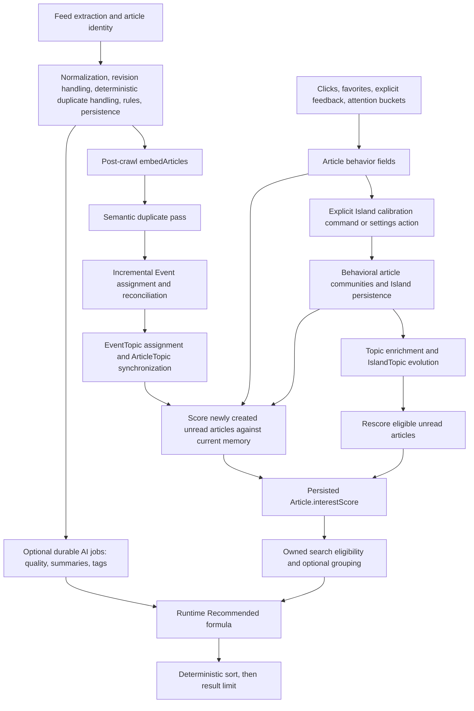

# RSSMonster Semantic Architecture Validation

Baseline date: 2026-09-13. Review target: the **current working tree**, based on commit `2749e86caca34bc01516b410a8dc5f0247af1225`, including the pre-existing, uncommitted two-batch test reorganization. This is not a review of HEAD alone. No implementation, threshold, fixture, dependency, or algorithm was changed for this review. Existing tests were run sequentially against their isolated MySQL test database. Generated diagnostics are local artifacts, not production measurements.

**Evidence notation:** **FACT** means directly observed source behavior or current test output. **INTERPRETATION** means a consequence inferred from that evidence. **HYPOTHESIS** means a product outcome requiring measurement. Unless stated otherwise, constants below are source defaults, not claims about a deployed installation. Repository-relative links identify source files; function names identify the exact implementation within them. Section 18 preserves execution details, scenario inventories, and measured outcomes.

## 1. Executive Summary

RSSMonster has a substantial, explainable semantic system: article vectors, occurrence-aware Events, durable-subject Topics, multiple signed behavioral Island centroids, confidence-aware interest propagation, and a bounded final Recommended equation. It is already a personalized ranker, but it is **not yet validated as a continuously adapting personalized timeline**.

Its strongest property is separation of concerns: Event membership is not equivalent to interest; weak semantic relationships are attenuated; explicit dislikes remain signed; duplicate relationships and ownership constrain processing; unmatched articles still receive finite Recommended scores. Its largest product gaps concern the quality and timing of behavioral evidence, refresh scheduling, retention/forgetting, and list-level objectives.

The normal crawl scores newly created unread articles against existing memory. It does not recalibrate Islands, and feedback controllers do not trigger rescoring. Island recalibration exists as a settings operation and administrative command; no automatic recurring calibration caller was found in the repository. Therefore the simulation's explicit calibration after each batch is a stronger learning schedule than the normal crawl itself provides.

The current two-batch trace passed: **2,000/2,000 finite Recommended scores**, but **227/2,000 nonzero interest scores** (180 positive, 47 negative). That is 100% score coverage and 11.35% personalization coverage in this corpus, not 100% recommendation relevance. The 160 pre-feedback probes include 60/60 labeled positives with positive interest, 23/23 labeled negatives with negative interest, 24/24 neutrals at zero, and 12/12 emerging-interest probes at zero. These are sign checks, not Precision@K, Recall@K, or a comparison with Newest. The isolated semantic gold command passed 75/84 tests (9 failed); the shared-corpus longitudinal gold review passed 35/139 (104 failed). These are materially different outcomes from the passing coverage trace; details and scenario traces are recorded below.

**Assessment:** a useful semantic and scoring foundation with meaningful correctness tests; insufficient evidence yet for excellent adaptation, exploration, diversity, or superior personalized ordering over time. No CRITICAL security/data-loss defect was established by this review. HIGH product risks are documented in section 14 without implementing remedies.

## 2. Architecture Overview

### Active paths



Sources: [`processArticle`](../server/services/crawl/orchestration/processArticle.js), [`processArticleRevision`](../server/services/crawl/orchestration/processArticleRevision.js), [`runPostCrawlSemanticPipeline`](../server/services/crawl/orchestration/postCrawlSemanticPipeline.js), [`runIncrementalEventsForUser`](../server/services/reconcile/semanticPipelineScopes.js), [`runIslandCalibrationForUser`](../server/services/islands/runIslandCalibration.js), [`scoreArticlesFromIslandsForUser`](../server/services/score/scoreArticlesFromIslands.js), [`searchArticles`](../server/services/articleSearch/articleSearch.service.js), [`sortArticles`](../server/services/articleSearch/articleSort.service.js).

The post-crawl order is embedding → semantic duplicates → Event assignment (including Topic work) → interest scoring → optional semantic-label reconciliation. A separate deterministic identity/duplicate path precedes this during ingestion. Semantic duplicates are therefore a distinct, later operation, not proof of publisher identity. Optional AI processing jobs operate separately from this critical path. Generated Event/Topic/Island labels are presentation metadata, not evidence for matching or ranking.

Normal post-crawl scoring passes `createdAtFrom: crawlStartedAt`; full calibration calls the scorer without that bound. The scorer processes **unread** canonical, unfiltered articles in ID batches of 200, persists changed `interestScore`, and does not persist Recommended. Search uses stored interest, current freshness, current joined feed/event metadata, and rule tags. Explanation code can recompute current paths without refreshing the persisted score used for ranking. `recommendationAttribution.loadInterestIslandAttributions` suppresses an Island attribution if recomputed and stored scores differ by more than .00015, preventing a misleading Island explanation; it does not repair the stale score.

### Other paths that must not be conflated

- [`getArticleRecommendations`](../server/services/recommendations/articleRecommendations.js) is the related-articles endpoint: source-to-article cosine, up to 600 newest candidates, minimum similarity 0.64, four results, one per Event, excluding the source Event. It is not the personalized Recommended timeline. It can include read articles.
- [`resolvePredictedAffinity`](../server/services/recommendations/predictedAffinityResolver.js) predicts reading presentation (`cold`, `skim`, `medium`, `deep`, `ignore`) from feed aggregates. It does not enter `computeRecommended` directly.
- [`calibrateBehavioralTopicsForUser`](../server/services/topics/behavioral/calibrateBehavioralTopics.js) is a separate behavioral-Topic service. Normal crawl and Island calibration do not call it. The model-rebuild script does.
- Historical rebuild/repair scopes can detach/reconstruct relationships and reprocess historical content. They were inspected, not executed. They are not normal online learning.

## 3. Semantic Data Model

All models use factories initialized through [`models/index.js`](../server/models/index.js). Semantic ownership is principally the stored `userId`; relationship queries additionally join back to owned records where appropriate. There is no shared collaborative user embedding or global user-to-user recommender in the inspected path.

| Model/table | Relevant state | Relationship and semantic role |
| --- | --- | --- |
| [Article / articles](../server/models/article.js) | `articleVector`, `embedding_model`, `interestScore`, `eventId`, `topicId`, `positiveInd`, `negativeInd`, `favoriteInd`, `clickedAmount`, `attentionBucket`, `firstSeen`, `readAt`, `status`, `filteredInd`, `duplicateOfArticleId`, `duplicateCount`, publication/revision fields, quality component scores | One article vector; signed derived interest. Vector/model stored per article. Read/click/feedback values are mutable snapshots, not a timestamped interaction log. |
| [Event / events](../server/models/event.js) | `eventVector`, window start/end, representative/developing article IDs, counts, `sourceDiversityScore`, `eventStrength`, lifecycle `status`, `topicId` | A user-owned occurrence with many articles; raw source count counts distinct feed IDs. |
| [Topic / topics](../server/models/topic.js) | `topicVector`, `topicKey`, `topicType` event/behavioral/hybrid, affinity/evidence/count fields, `lastActivityAt`, `lastBehaviorAt` | Persistent subject identity. Key is not sufficient authority for reuse. No per-Topic embedding-model field. |
| [ArticleTopic / article_topics](../server/models/articleTopic.js) | article/topic IDs, confidence, rank, primary flag | Authoritative many-to-many assignment; unique article/topic pair. `Article.topicId` is a convenience primary pointer. |
| [EventTopic / event_topics](../server/models/eventTopic.js) | event/topic IDs, confidence, rank, primary flag | Authoritative Event/Topic relationship; confidence propagated to articles by synchronization. |
| [Island / islands](../server/models/island.js) | vector, signed weight, signal JSON, archive fields, compact population audit | Multiple persistent user-interest centroids. No durable ArticleIsland join table; current support is reconstructed. No per-Island embedding-model field. |
| [IslandTopic / island_topics](../server/models/islandTopic.js) | island/topic IDs, similarity, confidence | Composite primary key; topic-mediated personalization path. |
| [IslandTaxonomy](../server/models/islandTaxonomy.js) | taxonomy vector, display name, model metadata, status | Nearest-vector display label, not user preference or semantic identity evidence. |
| [Feed](../server/models/feed.js) | `feedTrust`, attention/click aggregates, `mutedUntil`, embedding flag | Source-level behavioral/quality summary, ingestion controls. |
| [Tag](../server/models/tag.js), [Action](../server/models/action.js) | tag provenance/type; regex/action configuration | A `rule` tag enables one fixed ranking boost. `Action` is an automation rule, not a behavioral event log. |
| [ProcessingJob](../server/models/processingJob.js), [ProcessingFailure](../server/models/processingFailure.js) | durable jobs, guards, status, failure context | Optional enrichment and operational observability, not preference samples. |

`contentOriginal` preserves publisher HTML; `contentHtml` is rendered/processed HTML; `contentText` is the text-search/embedding input contract; `description` is separately handled summary material. Embedding code does not treat all of these as interchangeable, although fixture adapters sometimes supply original content as text.

## 4. Embedding Pipeline

[`embedArticles`](../server/services/articles/embedArticles.js) selects eligible unembedded articles and respects feed embedding configuration. [`embedArticle`](../server/services/articles/embedArticle.js) checks intelligent-feature configuration and inference configuration, and returns early for existing nonempty vectors. It does **not** validate an existing vector against the currently selected model before reuse.

### Input construction

`buildArticleEventEmbeddingText` calls `extractEventText`:

1. Title removes initial `breaking/update/live/exclusive`, trailing ` | ...`, and trailing ` - ...`.
2. Emit `Title: ...`.
3. For description not recognized as HTML, remove URLs, common subscription/read-more phrases, normalize whitespace, split sentences, and emit unique `Summary: ...` sentences.
4. For usable `contentText`, take at most two paragraphs of at least 40 characters, remove duplicate sentences, emit `Body: ...`.
5. Sentence duplicate detection uses exact normalized text or token Jaccard ≥0.9.
6. Clip to **512 whitespace-separated tokens**, not the model tokenizer's tokens. Event text normally needs 60 characters (`allowShortEventText` overrides this).

An optional second embedding uses body content (fallback description), up to 2,200 characters, at least 120 characters, and at most 512 estimated tokens. `embedArticle` returns this `topicVector`, but persists only the event-oriented embedding as `Article.articleVector`. Active Event/Topic/Island processing consumes that persisted vector and aggregates it; it does not persist/use a separate article subject vector. This second output is not the Topic pipeline's durable source of truth.

### Transport, providers, dimensions

`services/embeddings/embeddingService.js` is a compatibility re-export of [`ai/capabilities/embedding.js`](../server/services/ai/capabilities/embedding.js). `createEmbeddingCapability` validates nonempty text, count, model string, positive dimensions, exact vector length, and finite elements. [`ai/providers/inference.js`](../server/services/ai/providers/inference.js) calls `/api/embeddings`; the inference process owns provider selection.

[`inference/src/config/config.js`](../inference/src/config/config.js) defaults to the OpenAI-compatible path through legacy provider `openai`: `text-embedding-3-small`, 1,536 dimensions. `EMBEDDING_PROVIDER=local` (or `qwen`) uses `onnx-community/Qwen3-Embedding-0.6B-ONNX`, fixed 1,024 dimensions; local dimension reduction is rejected. Compatible provider/model/dimension configuration and legacy `OPENAI_EMBEDDING_*` aliases are supported. Metadata is declared by configuration; response vectors are subsequently validated by the server capability. The compatible provider request sends only `model` and `input`, not a `dimensions` argument. Configuring a reduced dimension does not request that reduction and will fail server validation if the provider returns its usual longer vectors. Batch default is 8; local queue concurrency is one, pending default 4.

[`qwenEmbeddingProvider`](../inference/src/embeddings/providers/qwenEmbeddingProvider.js) uses feature extraction with last-token pooling and `normalize: true`. [`openaiEmbeddingProvider`](../inference/src/embeddings/providers/openaiEmbeddingProvider.js) requests embeddings from the compatible endpoint. Provider/model output is not recomputed by the semantic test suite; its local caches are frozen Qwen vectors.

### Vector assumptions

Shared [`cosineSimilarity`](../server/services/vectors/similarity.js) computes dot product divided by both norms; empty, zero, or dimension-mismatched inputs return zero. String parsing and numeric coercion are caller options. [`weightedAverageVector`](../server/services/vectors/average.js) normalizes the aggregate, but does not normalize each sample before summing. Ordinary `averageVector` returns an arithmetic mean without unit normalization. This is safe for subsequent cosine, but raw sample magnitude affects a centroid. Event policy/cache also have local normalization/cosine implementations and use dot products only with normalized vectors.

**FACT:** article-related recommendations filter by source `embedding_model`; Event matching, Island formation, and Island interest matching generally depend on dimensional compatibility without equivalent model-ID partitioning. Aggregates do not carry model metadata. Same-size incompatible model spaces can therefore be compared; different-size spaces silently fail to match or are excluded by averages. The model-rebuild administrative path exists, but is not automatically invoked by `embedArticle` reuse.

**INTERPRETATION:** input truncation, headline suffix removal, English-oriented heuristics, sample norm differences, and fixed thresholds can materially change semantic recall. Current caches assess one model/input recipe, not provider interchangeability or multilingual embedding quality in general.

## 5. Events and Topics

### Event retrieval, decision, and persistence

[`assignArticleToEvent`](../server/services/events/assignArticleToEvent.js) combines bounded article witnesses and Event candidates, applies [`eventOccurrencePolicy`](../server/services/events/eventOccurrencePolicy.js), then commits through [`createAndAssignEvent`](../server/services/events/createEvents.js) or [`assignArticleToExistingEvent`](../server/services/events/updateEvents.js). Creation/update reload and lock owned canonical records, recompute membership evidence, and update projections. Article-pair discovery does not itself authorize an Event join.

[`ArticleEventCandidateCache`](../server/services/events/ArticleEventCandidateCache.js) indexes publication-time buckets and precomputed vectors/tokens/entities. Default gap 24h plus 2h cache buffer; initial load up to `MAX_CANDIDATES*4` (1,200), returned article candidates at most 300. Other Event/Topic candidate queries cap at 300. The semantic processing recency default is seven days. These bounds can exclude otherwise relevant witnesses under heavy traffic.

`evaluateArticleAgainstEvent` requires ownership, canonical/unfiltered status, positive temporal score, semantic/auxiliary support, and no hard occurrence contradiction:

- semantic cosine ≥0.84 and (headline Jaccard ≥0.22, or ≥1 shared heuristic entity, or cosine ≥0.92);
- alternatively headline similarity ≥0.92 plus semantic ≥0.75;
- complete proposed Event span must be **strictly below 24 hours** (exactly 24 yields temporal score zero);
- version/location contradictions and strong action/object-state contradictions reject; softer action/object differences subtract 0.02 each from evidence;
- missing extracted features are neutral, not invented contradictions.

`extractOccurrenceFeatures` / `compareOccurrenceFeatures` in [`occurrenceFeatures.js`](../server/services/events/occurrenceFeatures.js) use deterministic title/description patterns for scoped versions, locations, actions, and objects. Only up to 16 stable member feature sets enter occurrence aggregation. Entity/title heuristics are not general multilingual named-entity recognition.

For a witness, `T=1-spanHours/24`, `R=2^(-max(0, EventAgeHours)/18)`:

```text
base = .75*cosine + .15*headlineJaccard + .10*T
entityBonus = sharedEntities >= 1 ? .03 : 0
evidenceScore = base + entityBonus - softConflictPenalty
candidateScore = (base - softConflictPenalty)*R + entityBonus
```

The strongest supported centroid/member witness supplies evidence. Member counts cannot stack witness scores. `selectEventDecision` sorts eligible candidates by candidateScore then ID, but requires the winning **undecayed** evidence advantage over alternatives to be positive and at least 0.03. Ambiguity yields no forced join.

Creation needs ≥2 articles and shared leave-one-out support (`evaluateEventCreation`). `REQUIRE_MULTI_SOURCE_FOR_EVENT` defaults false; if enabled, source count must reach `MIN_EVENT_SOURCES` (2). Same-feed canonical reports can therefore form an Event by default. Semantic duplicates are normally removed earlier.

[`buildCanonicalEventProjection`](../server/services/events/eventProjection.js) recomputes mean member vector, member count, distinct feed count, `log(sourceCount+1)`, and min/max publication window. Representative identity is preserved by reconciliation; developing-story pointer can select an unread continuation. [`reconcileTouchedEvents`](../server/services/events/eventReconciliation.js) dissolves insufficiently supported Events and updates counts/lifecycle. Lifecycle defaults: ≤2 articles emerging while fresh; larger fresh Events active; age >24h cooling; age ≥96h archived. Lifecycle is recomputed when services touch/reconcile Events, not a continuously changing database virtual field.

No normal centroid-only bulk Event merge operation was found. Incremental assignment reuses or creates Events, creation excludes already assigned records, and repair/rebuild scopes detach/reconstruct state. This differs from claiming that all duplicate Events will eventually merge automatically.

`eventStrength` reconciliation is `.45*min(articleCount/3,1) + .35*.85 + .20*min(log2(topicEventCount+1)/3,1)`, rounded to three decimals. The .85 cohesion is a **constant**, not measured member cohesion. This strength influences other grouping/presentation logic; it is not a direct Recommended component.

### Topics

[`assignTopicsForEvents`](../server/services/topics/event/eventTopicAssignment.js) feeds Event vectors into [`assignSemanticUnitToTopic`](../server/services/topics/event/assignEventToTopic.js). Candidate types are event/hybrid, not pure behavioral; default maximum 300. Source Event subject evidence is loaded by [`loadTopicSubjectEvidence`](../server/services/topics/shared/topicSubjectEvidence.js); generated labels do not supply identity.

`evaluateTopicCandidates` requires durable-subject match, not just cosine. Incremental primary threshold .76, secondary .62; non-incremental adds .01/.02 respectively. Identity fallback at ≥.50 is allowed only with durable subject evidence and has confidence `0.5*cosine`. Near-tied candidates within .04 can be ambiguous. At most five assignments survive; primary must satisfy primary confidence. Weak fallback remains secondary. No Topic is a valid result.

`createTopic` filters seed Events by subject compatibility before averaging. `evaluateTopicCreationGate` permits a current Event of ≥2 articles with ≥2 seed Events **or** ≥3 seed articles; alternatively a strong Event (≥2 articles, ≥2 sources, strength ≥.35, meaningful name, not archived); alternatively a two-article repeated-entity case with seed cosine ≥.50. **A Topic does not require multiple occurrences:** a single strongly corroborated Event can create one.

`topicKey` hashes the first 32 vector dimensions rounded to 1e-6, but active identity decisions check subject evidence rather than blindly trusting this hash. EventTopic/ArticleTopic joins are authoritative; primary pointers may be null while secondary relationships exist. `syncEventTopicsToArticles` preserves relationship confidence and behavioral relationships.

Topic drift is off by default (`TOPIC_VECTOR_DRIFT_ENABLED=false`). When enabled, context/similarity gates apply; ordinary matched-primary update blends at .08 then blends that result at .03, equivalent to .0024 incoming weight; the identity-update utility can use .03 directly, but the active weak-fallback caller passes `identity-fallback`, which disables drift (only incremental context may drift). `updateTopicByKey` remains exported but is not the active subject-policy bypass. Topics have persistent activity/count fields, no general wall-clock expiration job in this path. Candidate bounds still limit old Topic reuse.

Separate behavioral Topics require ≥3 engaged articles, total score ≥8, and at least two feeds or publication days; community cosine .64, persistent match .78, vector blend .35. Signals are star=4, click=2 (cap 3), deep read=1. This service does not share the complete signed Island signal contract: positiveInd and negative feedback are not equivalent inputs, and it has no equivalent behavioral-age decay. Do not describe it as a stage run by every crawl.

## 6. Interest Islands and User Representation

The user is represented by **multiple persistent signed centroids**, current behavioral article evidence, IslandTopic relationships, and bounded recent explicit article vectors. There is no single global averaged user vector.

`buildInterestIslandProfilesForUser` in [`islandArticleProfiles.js`](../server/services/islands/islandArticleProfiles.js) loads all owned canonical vectorized articles with positive/favorite/click/deep-read/negative evidence. No historical time or row bound is applied to this formation query. It computes signed article scores, discards absolute score <.05, sorts by absolute score then ID, and greedily joins the most similar community at cosine ≥.64. A nonmatching profile creates a new community until the default **10 candidate communities** are occupied; afterward it stays unassigned. Capacity cannot force a bad semantic join.

Community vectors are normalized weighted averages with sample weight `max(.0001, abs(articleScore))`. Both positive and negative evidence can occupy the same community; sign does not partition the geometry. Community weight is:

```text
w = round4(clamp(mean(articleScore)/7
                + sign(mean(articleScore))*min(.20, .03*memberCount), -1, 1))
```

Three unrelated areas such as databases, Formula 1, and home automation can remain separate if cosine boundaries and available capacity permit. Within a community, averaging can blur subinterests; mixed-sign related articles can cancel. An initial supported member can admit later bridging members against the evolving centroid; there is no complete-link pairwise-cohesion creation guarantee.

[`persistInterestIslandProfiles`](../server/services/islands/islandPersistence.js) matches existing vectors at ≥.78, updates matched weight from the fresh profile, blends vector at .35, and **replaces** signal snapshots rather than incrementing them on replay. Audits retain at most 30 runs and bounded IDs (default 300). Existing unmatched Islands can remain active; thus 10 is not a strict cap on all persisted active Islands. This run ended with 12 active Islands. Duplicate-label handling can rename distinct interests or archive semantic duplicates; nearest taxonomy label has no minimum similarity, so labels can overstate certainty without changing ranking.

Unmatched Islands archive only when stale (`updatedAt` ≥45 days) **and** average IslandTopic confidence <.12. An old behavioral article can continue qualifying and refresh its Island on every calibration. Updates are not proof of new behavior.

Topic enrichment computes semantic similarity to existing Islands (≥.62), topic evidence `clamp(abs(strength)+.04*min(evidenceCount,5), .25,1)`, and confidence `similarity*evidence` (minimum .10). `islandTopicProfiles` derives topic strength from signed article evidence plus `2*clamp(topic.affinityScore)` and `.25*min(eventCount,12)`, divided by `6*(articleCount || evidenceCount || 1)`. Its topic communities use weighted Jaccard of shared positive article evidence and **publication** 12-hour buckets: .35 article overlap + .65 temporal pattern, threshold .12, up to two communities/topic. This enriches existing Islands; it does not independently create the user's Island memory.

[`evolveIslandTopicMemberships`](../server/services/islands/islandMemberships.js) blends old/new similarity and confidence (.35 old + .65 new); missing memberships decay by .82 per invocation and disappear below .05. This is run-count decay, not elapsed-time decay. Some orchestration paths skip enrichment evolution if no topic candidates exist, so absence of new matching Topics does not guarantee ongoing decay.

Read-time confidence is reconstructed from at most 500 newest behavioral canonical articles. Each article supports its nearest Island at ≥.64; it is not assigned to every matching Island. Distinct articles, feeds, publication days, minimum/median member similarity, and sign consistency affect confidence. An old Island may remain persisted yet lose confidence when its support leaves that 500-article evidence set.

## 7. Behavioral Signals

### Complete active signal inventory

Weights below distinguish direct semantic learning from indirect feed trust. `P(age)=max(.2,exp(-publicationAgeDays/1460))`. Feedback is binary; there is no numeric rating scale in this path.

| Signal/event | Recording path and storage | Explicit/implicit; sign | Magnitude and repetitions | Decay | Semantic/ranking effect | Interpretation of evidence strength |
| --- | --- | --- | --- | --- | --- | --- |
| Outbound article click | `article.markClicked`, client `articleActions.articleClicked`, Reader outbound handling; `Article.clickedAmount` | Implicit positive | Increment each call; Island weight `2*min(clicks,3)`; manual mark ensures ≥1; unmark sets 0 | Positive score ×P; feed statistics last 30 publication days | Island formation/support; no passive-click explicit fallback; indirect feed trust | Moderate: can mean navigation, curiosity, or repeated accidental action, not satisfaction |
| Manual mark/unmark clicked | Same endpoint, `update=mark/unmark` | Explicit state manipulation | Snapshot, not repeated increments in mark mode | Same as click | Same semantic representation as actual click; unmark removes positive evidence, not negative evidence | Different intent is collapsed into click state |
| Favorite/star, unfavorite | `article.markFavorite`; Fever/GReader favorite mutations; `Article.favoriteInd` | Explicit positive/bookmark; removal neutral | Binary, +4; can coexist with click/deep read/positiveInd | ×P; recent favorite can use 90-day explicit fallback | Islands, explicit fallback, feed trust (+1 engagement before normalization) | Stronger than click, but saving is not proof of reading |
| More like this | `article.markMoreLikeThis`; `Article.positiveInd=1`, `negativeInd=0` | Explicit positive | Binary +4; repeated requests do not stack; combines with favorite | ×P; fallback half-life 30 days, publication window 90 days | Islands and explicit fallback; not an immediate score refresh | Strong stated recommendation preference, but nominally equal to favorite and two clicks |
| Not interested / less like this | `article.markNotInterested`; `Article.negativeInd=1` | Explicit negative | Binary -4; does not clear positiveInd/favorite/click; not additive per repetition | **No age multiplier in Island negative score**; explicit fallback decays separately | Negative Island preference or bounded fallback; indirect feed trust penalty | Strong but potentially contradicted by retained positive state |
| Visible reading duration | `feed/visibilityTracking.js` → `articleMarkAsSeen(visibleSeconds)`; duration itself not stored | Implicit attention | Accumulated client milliseconds, rounded seconds; first server seen bucket wins | Bucket contribution ×P if ≥3 | Becomes attentionBucket; no continuous-duration semantic weight | Weak-to-moderate proxy: visibility is not attention |
| Attention bucket / deep read | `article.attentionBucketFromSeconds`; `Article.attentionBucket` 0–4 | Implicit; only ≥3 positive in Islands | ≥3 gives +1, 3 and 4 identical for Islands; firstSeen guards later improvement | ×P; feed aggregates 30-day window | Island support, feed trust, predicted presentation | Deep reading gets less direct weight than one click |
| Seen/impression proxy | `articleMarkAsSeen`; `Article.firstSeen` | Neutral exposure state | First persistence only, not a repeated impression history; grouped updates propagate payload | No dedicated decay | Gates attention updates; optional search filter; no Island weight | Does not record rank, dwell series, or recommendation propensity |
| Read / mark all read | article read/status endpoints, Fever/GReader; `status`, `readAt` | Explicit state or scroll-driven implicit state | Binary/latest timestamp; batch/group actions possible | No direct semantic decay because no direct Island score | Eligibility (unread view), feed meaningful-exposure denominator; **read alone = 0 Island signal** | Read state may be housekeeping rather than interest |
| Mark unread | Status APIs; status unread, readAt null | Neutral | Does not erase clicks/favorites/attention | Existing evidence unchanged | Returns article to eligible unread pool; no dislike | Not evidence of abandonment |
| Mute feed seven days | client `muteFeedSevenDays`, `feed.muteFeed`; `Feed.mutedUntil` | Explicit source-level avoidance | Timestamp overwrite | Expires by timestamp | `feedClaims` excludes muted feeds from crawling; not semantic dislike and not a general filter for already stored search rows | Strong operational preference, not learned subject aversion |
| Rule/tag match | Rule processing, `Tag.tagType=rule` | Explicit configured preference, not an interaction | Any rule tag: +.08 Recommended; multiple tags do not stack | No time decay except article freshness | Direct runtime boost, no embedding change | Strong if rule is intentionally relevant; independent of learned confidence |

Sources: [`controllers/article.js`](../server/controllers/article.js), [`greader.js`](../server/controllers/greader.js), [`fever.js`](../server/controllers/fever.js), [`articleActions.js`](../client/src/components/articles/helpers/articleActions.js), [`visibilityTracking.js`](../client/src/components/articles/feed/visibilityTracking.js), [`readState.js`](../client/src/components/articles/feed/readState.js), [`feedClaims.js`](../server/services/feeds/feedClaims.js).

No separate persisted share, scroll-depth percentage, session satisfaction, explicit dismiss history, or skipped-recommendation event was found. “Ignore” exists as a **derived feed metric/prediction**, not an explicit per-subject dislike. `hotInd`, duplicate counts, and event coverage are content-derived metadata, not user votes. User-authored tags have no direct boost unless their provenance is `rule`.

### Attention fidelity

`expectedSeconds=clamp(wordCount(contentHtml)/200*60,15,300)`; bucket cutoffs are duration/expectedSeconds <.05 →0, <.25 →1, <.75 →2, <1.25 →3, else 4. Despite its comment, the function splits the supplied HTML string on whitespace; it does not strip markup there. Visibility tracking uses IntersectionObserver threshold 0 and elapsed `performance.now()`, not an actual comprehension/scroll-depth measure. Minimal view skips seen persistence in this helper; disabling mark-as-read-on-scroll suppresses the automatic unread transition path. There is no document-visibility pause in this helper.

The first seen request stores the bucket and prevents later deeper sessions from improving it. Grouped Event/Topic seen handling copies the payload, including attentionBucket when present, to other canonical members. **INTERPRETATION:** one deeply viewed representative can become multiple behavioral support articles across feeds, inflating confidence without independent interactions. The test suite's direct seeded behavior does not reproduce that measurement path.

### Feed behavior layer

[`calculateFeedTrustForFeed`](../server/scripts/calculateFeedTrust.js) uses articles published in the last 30 days. Meaningful exposure includes read state, nonzero attention/click, favorite, or negative feedback. Per exposed article engagement is `min(favorite + .5*clickedBoolean + bucketWeight,2.5)/2.5`, with bucket weights 0/.25/.75/1.25/1.75. Feed trust blends quality .50, engagement .20, originality .15, and absence of negative feedback .15. Each component is shrunk toward .75 using `min(samples/target,1)` (quality target4, others8). This calculation's .75 neutral differs from the ranking helper's missing-feed .5.

It also persists bucket averages/ratios and raw click averages/ratios. `feedIgnoreRatio` counts bucket-zero articles, including articles with no recorded attention; this is not proof of observed rejection. `resolvePredictedAffinity` uses attention .5, deep ratio .2, click signal .2, skim .1, ignore penalty .25; its cold default requires sample size <8 and clickSignal <.08. These predictions do not directly change Recommended. Feed trust does, through a maximum .06 final-score contribution. This is per-feed behavior, not global popularity.

## 8. Recommendation Candidate Selection

[`searchArticles`](../server/services/articleSearch/articleSearch.service.js) resolves owned feeds/category/tag/text/date filters, combines `canonicalArticleWhere()` (`duplicateOfArticleId IS NULL`, `filteredInd=false`) with configured score eligibility, and delegates status/grouping predicates to `buildArticleSearchQuery`. Explicit ownership remains in the Article predicate even when a specific feed ID is supplied.

Recommended is a **sort mode**, not an unconditional unread/last-seven-days filter. An unread view selects unread; search expressions and explicit status filters can select read/all/favorite/clicked content. No default freshness cutoff, negative-interest exclusion, or low-interest threshold is inherent in `sortRecommended`. Missing vectors/Islands/Topics do not disqualify candidates. Unresolved AI analysis (pending/processing/failed) can bypass inference-owned score thresholds, while action-owned overrides retain authority.

Optional Event grouping filters candidates to representative/developing pointers. Topic grouping selects a strongest Event representative per primary Topic and can omit eventless/topicless material. Those SQL choices happen before ranking; they are not a diversity reranker selecting the best personalized member of each group.

Runtime Recommended ordering generally loads all eligible candidates, sorts them, then applies user/result limits. Internal execution bounds are supported for bounded callers; they are not a universal timeline candidate budget. Non-smart-folder search expressions without an explicit limit have a 500-result post-sort cap. Pagination/result limits are not evidence that vector formation or runtime candidate retrieval is globally bounded.

No MMR, per-feed quota, per-interest quota, exploration slot, viewed-Event suppression budget, or novelty term occurs in `sortArticles`. Ungrouped articles from one Event can all receive similar interest and corroboration and crowd out others. Optional grouping reduces duplication but changes the result contract and does not ensure topic/source balance.

The related-articles endpoint has its own four-result Event diversification and same-model filter; those safeguards must not be attributed to the timeline.

## 9. Recommendation Scoring

### Behavioral score and decay

From `computeArticleSignals`:

```text
P(a) = clamp(max(.2, exp(-max(0, publicationAgeDays)/1460)),0,1)
positive = (4*positiveInd + 4*favoriteInd + 2*min(clickedAmount,3)
            + 1*(attentionBucket>=3))*P(a)
negative = 4*negativeInd
articleScore = positive - negative
```

The option named `ISLAND_RECENCY_HALF_LIFE_DAYS` is actually an exponential **time constant**: its true half-life is `1460*ln(2)≈1012 days`. At 90 days, P≈.9402. The floor means positive evidence never decays below 20% while its article remains available. Negative Island evidence does not decay. A just-favorited three-year-old article gets publication-age attenuation immediately; recent interaction time is unavailable.

### Confidence-aware interest

For reconstructed Island support (`deriveIslandConfidence`):

```text
support = .35 + .35*clamp((n-1)/4) + .15*clamp((sources-1)/2)
               + .15*clamp((publicationDays-1)/3)
cohesion = (clamp(medianCosine)+clamp(minimumCosine))/2
consistency = .5 + .5*max(positiveCount,negativeCount)/(positiveCount+negativeCount)
confidence = clamp(support*cohesion*consistency)
```

No current support yields .1 confidence. A perfect singleton has .35. Mixed-sign counts reduce consistency, but do not separate the centroid.

`evaluateArticleInterest` considers:

1. **Direct Island:** `relationship=max(0,(cosine-.62)/(1-.62))`, bounded to 1; exact threshold gives zero. Contribution = signed Island weight × Island confidence × relationship.
2. **Topic path:** `relationship=clamp(ArticleTopic.confidence)*clamp(IslandTopic.confidence)*clamp(IslandTopic.similarity)`. Same signed weight/confidence multiplication. The candidate need not independently match the Island vector if this relationship is trusted.
3. **Explicit fallback:** up to 100 negative and 100 positive/favorite articles published in the preceding 90 days, with no same-sign Island match at ≥.64. Contribution = `sign*.25*2^(-ageDays/30)*normalizedRelationship*intentCompatibility`. Click-only/deep-only evidence has no such fallback.

Intent compatibility: same known intent1; missing .5; promotion/editorial mismatch .05; other known mismatch .75. Title rules recognize promotions, reviews, technical coverage, then completed/overridden advertisement scores and product hints. These rules apply to explicit fallback, **not every direct Island match**.

For each Island keep only its strongest absolute direct/Topic path. Across all Island and explicit paths keep only the strongest positive and strongest negative; add, clamp [-1,1], round4. This prevents correlated sum inflation, but repeated independent same-sign fallback samples do not add authority beyond the strongest path. No path means zero.

### Final equation

[`computeRecommendedBreakdown`](../server/services/recommendations/recommendedScore.js):

```text
I = clamp(finite(Article.interestScore), -1,1)
F = clamp(exp(-publicationAgeHours/48),0,1)        # model freshness; plain-input fallback .5
A = clamp(.50*qualityScore + .25*sentimentScore + .25*advertisementScore,0,100)/100
Q = .70*A + .30*clamp(feedTrust,0,1)             # missing article components 70; missing trust .5
coverage = clamp(log2(max(eventArticleCount,1))/6,0,1)
spread = clamp(log2(max(sourceCount,1))/3,0,1)
diversity = clamp(ln(sourceCount+1)/2.56,0,1)
corroboration = coverage*max(spread,diversity)    # no Event => 0
rule = any rule-provenance tag ? .08 : 0
Recommended = clamp(.45*max(I,0) + .25*F + .20*Q
                    + .10*corroboration - .30*max(-I,0) + rule,0,1)
```

Article quality and source trust are not additional independent terms beyond Q. Missing-value helper defaults are not database defaults: Article model defaults are quality50, sentiment50, advertisement0 (A=.375); Feed defaults trust.75, giving Q=.4875. Normal crawl enrichment initializes70/70/70 (`crawl/enrichment/articleAnalysis.js`), but directly inserted fixture rows can retain model defaults. The helper preserves real zero values rather than replacing them with70. `eventStrength`, `uniqueness`, `hotInd`, raw click count, attentionScore, and predictedAffinity are not direct final terms. No cross-user engagement/popularity term was found. Source diversity counts **feed IDs**, not independent publishers/ownership groups. Descending score ties use publication date descending, then article ID descending. Optional high-trust prioritization does not add raw trust to Recommended.

### Worked comparisons

Illustrative equal-quality candidates: article quality .8, trust .75, Q=.785. Four-article, three-feed Event: coverage=1/3, crossSource≈.5415, corroboration≈.1805.

| Candidate | I | Age | Freshness | Interest term | Freshness term | Quality term | Corroboration term | Final |
| --- | ---: | ---: | ---: | ---: | ---: | ---: | ---: | ---: |
| Strong relevant, two days old | .60 | 48h | .3679 | .2700 | .0920 | .1570 | .0181 | .5370 |
| Mild relevant, very fresh | .15 | 2h | .9592 | .0675 | .2398 | .1570 | .0181 | .4824 |
| Attenuated relevant, two days old | .30 | 48h | .3679 | .1350 | .0920 | .1570 | .0181 | .4020 |

With everything else equal, overcoming this 46-hour age disadvantage requires a positive-interest advantage >`.25*(.9592-.3679)/.45≈.3285`. Thus a large nominal .45 interest weight does not ensure semantic relevance wins: confidence attenuation may leave I near zero.

A singleton favorite with fresh article score4 has Island weight≈.6014, confidence .35. At candidate cosine .8, direct relationship .4737, I≈.0997 and the final interest contribution only .0449. One rule tag adds .08, larger than that singleton contribution. At cosine .95 with supplied weight .8, a singleton gives I=.2432 while five coherent, independent-source/day supports give I=.6947.

Measured final corpus quantiles (min / median / p90 / p95 / p99 / max): interest `-.2468 / 0 / 0 / .1522 / .4284 / .7035`; Recommended `.0550 / .2769 / .3549 / .3713 / .4893 / .6484`; corroboration `0 / .0715 / .2995 / .3712 / .4308 / .4771`. Its largest corroboration contribution is .0477, not the nominal .10 maximum. Most articles receive no personal-interest contribution. These are fixture distributions, not deployed-user distributions; quality/freshness decompositions and comparisons appear in the appendix.

## 10. Semantic Test Suite

The working tree's [`tests/semantic/README.md`](../server/tests/semantic/README.md) describes the current split:

- `npm run test:semantic-trace`: one test in `semanticRegression.batches.test.js`; 1,000 + 1,000 articles, one user, one compressed publication week, two calibrations.
- `npm run test:semantic-gold`: independent tests in `tests/semanticGold`, excluding longitudinal report review; includes occurrence, Topic, Island quality, confidence, intent, expansion, and AD duplicate tests.
- `semanticRegression.longitudinal.test.js`: separately evaluates the saved batch report against 138 named relationships plus a cross-subject check. It adds no articles, but Vitest global setup still resets the dedicated test database. It is not included in the trace or default gold command.
- Additional production-helper/controller tests live under events, topics, islands, recommendations, articleSearch, embeddings, articles, duplicates, scripts, and client tests. Their existence is not equivalent to running them; executed subsets are listed in section 18.

### End-to-end trace harness

`vitest.config.js` disables file parallelism. `tests/setup/database.js` sets NODE_ENV=test and database name `rssmonstertest`; global setup calls `resetDatabase`, which refuses a different MySQL database name, drops test tables, and syncs models. Tests do not call inference for frozen vectors. No migration, production rebuild, fixture generator, or provider request was run.

`loadSemanticBatch` reads canonical batch JSON. `insertMissingFixtureArticles` creates owned feeds/articles, inserts frozen vectors keyed primarily by fixture source ID (content-hash compatibility remains), and supplies behavioral snapshots. `semanticBatchEmbeddingText` deliberately preserves historical input recipes; controlled cases may map contentOriginal into contentText while real rows use their actual text fields. The batch test validates model agreement with taxonomy, lengths, finiteness, counts, chronology, and uniqueness. It does not itself regenerate embeddings; occurrence gold additionally checks embedding-input hashes.

For each batch the harness fakes Date only, advances after the final publication, inserts rows, calls production `runIncrementalEventsForUser` including Topics, and calls full `runIslandCalibrationForUser`. Before the second calibration it scores 160 untouched incoming probes against first-batch memory, then applies optional feedback to two F1 probes. `longitudinalSnapshot` calls real scoring/explanation helpers and collects Event/Topic/Island state and per-article Recommended.

Assertions cover exact article count, finite scores for all, some positive and neutral scores, signed-score monotonicity against neutral baselines, no corroboration for eventless articles, path coverage, stable prior Event membership, Event/Topic reuse, and expanded existing Island support. **They do not assert all expected held-out signs or gold identities.** Snapshot metrics labeled “held-out” also include general non-behavioral rows; distinguish them from the explicit 160-probe list.

Not exercised by the batch simulation: real feed fetching/extraction, complete normalization/revision path, semantic duplicate pass, embedding provider/tokenizer, browser tracking, feedback HTTP requests, automatic calibration scheduling, actual search candidate filtering/grouping/pagination, or ranked-list relevance. The snapshot calls `computeRecommended` on articles rather than asserting search ordering.

### Gold categories and production boundary

| Test file/category | Inputs, thresholds and intermediate decision | Expected contract | Production exercised / bypassed |
| --- | --- | --- | --- |
| `incremental.occurrences` | 69 frozen-vector occurrence articles, original publication waves; .84 semantic, 24h whole span, .03 ambiguity margin, version/location/action features | Same occurrence joins stable Event; distinct occurrence separates; vague stays unassigned; cross-language continuity | Actual incremental Event retrieval/commit/projection; skips Topic assignment, Islands, provider, ingestion |
| `topicGold` | Eight named fixture scenarios with 3D controlled vectors plus four policy edge cases; pre-created Events | Durable subject reuse even across versions/time; different incidents/generic language separate; fallback .55→.275; ambiguity | Actual Topic decision and persistence/sync; bypasses Event formation and provider |
| `islandQuality` | Five geometric article vectors, clicks/favorites/dislike; capacity1 then3; .64/.78 | No forced joins, replay-safe counters, signed scores, neutral unrelated article | Actual Article profiles, Island persistence, scoring; no Event/Topic/provider/browser |
| `interestConfidence` | Axes and near-axis held-out vectors; independent sources/days; capacity pressure; 90-day fallback bound | Singleton attenuated; coherent support stronger; relationship confidences multiply; signs survive; no double-counting | Pure evaluator plus DB formation/persistence/scoring cases; no model embedding quality or actual ranking retrieval |
| `behavioralIntent` | Same .95 geometry for promotion/review/technical titles | Correct sign transfer and .05 commercial mismatch attenuation; missing intent .5 | Production intent/evaluator; no DB learning or provider |
| `expansion` | 226 articles across 43 scenarios; frozen Qwen plus **separate controlled** 14D behavioral geometry | Event/Topic gold, natural held-out transfer, duplicates, capacity, replay; 40 controlled outcomes and 21 required natural transfers | Production pipeline on isolated users; diagnostic assertions plus some mocked Article reads to isolate capacity; no browser or full ranked timeline |
| `incremental.adEvent` | Three same-feed heatwave variants; frozen vectors; test threshold **.985**, default production .99 | Two duplicates, one canonical article, no one-article Event | Semantic duplicate pass and incremental Events; threshold differs explicitly; no Topics/Islands |
| `longitudinal` | Saved two-batch report, fixture digest, 138 declared scenarios | Continuity/separation/subject persistence/held-out sign contracts in shared competition | **No fresh semantic computation**; examines prior real-path output; compressed timeline and one feedback step limit interpretation |

All scenario identifiers, input keys, expected relationships, and actual outcomes are enumerated in section 18. A passed controlled-vector test validates geometry/policy, not that real text maps to that geometry. A failed model-backed gold case can reflect embedding/input/policy/corpus mismatch; diagnostic labels are the test author's classification, not automatically a proven root cause.

## 11. Test Execution Trace

### Controlled confidence trace

`semanticRegression.interestConfidence: gives coherent independent support more authority than a singleton or noisy evidence`:

```text
Training vector [1,0,0], favorite; supplied Island weight .8
Held-out [ .95, sqrt(1-.95²), 0 ], no behavior
→ cosine .95; direct threshold .62
→ normalized relationship (.95-.62)/.38 = .868421
→ singleton confidence .35
→ I = round4(.8*.35*.868421) = .2432
→ five coherent sources/days: confidence 1
→ I = round4(.8*1*.868421) = .6947
```

No normalized text/provider embedding occurs in this test. These are intentionally manufactured vectors. A separate persisted singleton-growth test adds independent training articles, recalibrates, and verifies a held-out article's score increases without admitting it as training evidence.

### Controlled explicit-negative trace

`semanticRegression.behavioralIntent: transfers promotional dislikes to promotions and attenuates reviews, even for the same product`:

```text
Negative source: “Save $2,400 on an Alienware gaming laptop deal”, [1,0,0]
→ no Island; source age0; candidate cosine .95
→ relationship .868421; sign -1; fallback cap .25
→ promotion candidate intent1: I=-.2171
→ review candidate intent .05: I=-.0109
→ orthogonal technical review cosine0: I=0
→ duplicate request/evidence does not stack penalties
```

The final scoring penalty for I=-.2171 is .06513 before clamping. This verifies intent-specific **fallback**, not intent-specific negative Island formation.

### Controlled Topic trace

`topicGold: product version continuity` seeds separate three-article Events for Orion OS4.2 and4.3. Vectors `[1,0,0]` and `[.55,.8351646544,0]` give cosine≈.55. Event creation is bypassed. Durable Orion subject matches; .55 fails .62 secondary and .76 primary but passes .50 identity. The Topic is reused with confidence .275, secondary only; three ArticleTopic links inherit .275. If IslandTopic confidence/similarity are both .8, Topic relationship transmission is only `.275*.8*.8=.176`, before multiplying Island preference/confidence. Version conflict rules are intentionally different between Event and Topic identity.

### Current natural held-out trace

The batch's `local-inference-8`, “Local inference technical guide to offline deployment,” arrives without behavior. Stored frozen-vector comparison against explicit source Article945 has cosine .9565069. It uses **behavioral-fallback**, not a direct Island path:

```text
frozen semantic text/vector → cosine .9565069 > .62
→ normalized relationship .8855445
→ publication-age fallback factor .9193278
→ technical→technical compatibility1
→ .25*.8855445*.9193278 = .2035264
→ persisted I=.2035; pre-feedback Recommended=.3650956
```

This is actual report data. The probe's `seedSelf=false`. The probe calculation omits joined Event/Feed associations in that specific held-out query; final snapshot scoring loads those associations. Do not equate the probe's Recommended value with a fully joined timeline score.

### Current Event trace

Batch Article1570, “Linux container security: what a second expert found,” compared with Event195 “Linux container security”:

```text
frozen vector → semantic .9867473; headline Jaccard .4285714; shared entities1
→ complete span .7316667h; T=.9695139
→ semantic/auxiliary/time pass; no occurrence conflicts
→ evidenceScore=.9312975; recency-adjusted score=.6928231
→ candidate winner join; commit_check repeats acceptance
→ assignment reused Event195
```

The same candidate list rejects “Wireguard home networking” at cosine .3882279 (insufficient semantic/support), despite compatible time. Raw diagnostic IDs are observations, not hardcoded expectations. Natural rejected/ambiguous gold traces and all per-scenario outcomes appear in the execution appendix.

## 12. Coverage Assessment

“GOOD” means meaningful current contract coverage, not perfect product quality. This matrix assesses the inspected suite family, not only the one trace test. Execution failures still matter even where coverage is GOOD.

| Category | Coverage | Why |
| --- | --- | --- |
| Embedding quality | PARTIAL | Frozen natural corpora and multilingual failures expose some behavior; controlled geometry/provider mocks and no retrieval-quality benchmark do not measure general model quality. |
| Article similarity | GOOD | Shared math, thresholds, article recommendations, Event witnesses, input/vector checks. Model calibration remains partial. |
| Duplicate / near duplicate | PARTIAL | Focused duplicate and syndication gold; batch omits duplicate pass, AD threshold differs, semantic-only suppression remains a risk. |
| Event detection | GOOD | Natural and controlled occurrence scenarios, ambiguity, hard conflicts, whole-span and incremental paths. |
| Event membership | GOOD | Commit/reconciliation/projection and stable-membership assertions; order independence not universally established. |
| Topic formation | GOOD | Subject gold, weak fallback, ambiguous matches, unrelated seed exclusion, source-label independence. |
| Interest-Island formation | GOOD | Real DB creation/persistence/replay, capacity, singleton/cohesion and natural held-out cases. |
| Behavioral learning | PARTIAL | Seeded field snapshots and one feedback evolution step; browser quality and production schedule omitted. |
| User-interest matching | GOOD | Shared evaluator, confidence products, signs, direct/Topic/fallback, held-out natural cases; broader relevance calibration unmeasured. |
| Recommendation candidate generation | PARTIAL | Separate search ownership/eligibility/grouping tests; semantic batch bypasses actual search. |
| Recommendation scoring | GOOD | Exact weights, defaults, clamp, negative asymmetry, rule nonstacking, quality/corroboration cases. |
| Recommendation ordering | PARTIAL | Formula comparisons and deterministic sort ties; no labeled realistic top-K timeline benchmark. |
| Recommendation diversity | PARTIAL | Related endpoint one-per-Event and explicit grouping tests; no timeline source/interest balance objective. |
| Freshness | PARTIAL | Formula/equal-content comparisons and publication windows; no systematic relevance-versus-age evaluation. |
| Negative feedback | PARTIAL | Strong signed/fallback intent tests; contradictory flags, negative Islands, ignoring, and repeated behavior measured less completely. |
| Interest decay | PARTIAL | Scalar recency/fallback cutoff/membership tests; no end-to-end months-long abandonment ranking trajectory. |
| Adaptation to changing interests | PARTIAL | One feedback expansion and emerging probes; no latency or multi-session adaptation curve. |
| Cold start | PARTIAL | Neutral finite score and feed cold prediction; no measured new-user relevance/exploration. |
| Long-term interests | PARTIAL | Durable Topic identity and synthetic support; Topic persistence is not proof of long-term personalized retention. |
| Short-lived interests | MISSING | No demonstrated test that a breaking-event interest is learned then appropriately forgotten. |
| Repeated-event saturation | PARTIAL | Canonical exclusion/grouping/related endpoint; no exposure-based saturation curve in the timeline. |
| Recommended versus Newest | MISSING | No held-out relevance/utility comparison under identical eligibility. |
| Exposure feedback loops | MISSING | No sequential recommendation→exposure→behavior simulation with propensity/control cohorts. |

The suite is no longer “only clustering”: confidence, explicit intent, held-out propagation and final scoring tests are meaningful personalization contracts. Nevertheless, its broadest simulation primarily validates semantic state, coverage, and signs; it does not establish personalized ranked-list utility.

## 13. Personalization Scenario Analysis

These are **INTERPRETATIONS** of current code, not claims of measured production outcomes.

| Scenario | Likely current behavior and limiting condition |
| --- | --- |
| Repeated PostgreSQL reads/favorites over weeks | Favorites/clicks/deep buckets can form coherent Islands after calibration; distinct source/day support raises confidence. Read status alone does not. A global user vector is not required. Database terminology generalization depends on the model and .64/.62 boundaries. |
| Emerging home automation | A qualifying click can seed a community at the next calibration; one favorite/positive can transfer via explicit fallback when scoring runs even without a same-sign Island. No automatic calibration/feedback rescore caller was found; older unread candidates can retain old scores. Capacity can leave the new area unassigned. All 12 emerging probes in the single-step batch report were zero before feedback. |
| More like this | +4, equal to favorite and two capped click increments, versus +1 deep-read signal. It clears negativeInd, unlike dislike clearing positives. Repeated requests do not accumulate. Influence is confidence/semantic/age gated and is not an immediate guaranteed timeline change. |
| Abandoned Kubernetes after three months | Positive article evidence retains ~94% weight; floor .2 and all-history formation preserve it. Recalibration may repeatedly refresh the Island from old articles, preventing stale archival. It can lose read-time confidence after >500 more recent behavioral articles. No reliable three-month forgetting guarantee. |
| Breaking-news event | Several canonical reports can create strong coherent behavioral support; different feeds/days raise confidence even if one underlying event motivates them. Grouped attention can amplify this. There is no separate short-term versus enduring preference memory or per-event evidence cap. Topics need not span multiple occurrences. |
| PostgreSQL/query optimization/indexes/internals | Direct vector matching can generalize without shared words. Multiple communities can preserve subinterests if dissimilar. Durable Topic matching also requires lexical subject evidence and may block broad abstraction that direct vectors could support. Whether the model forms coherent database islands needs a dedicated corpus. |
| Exploration outside current interests | Neutral candidates remain eligible and can rank through freshness/quality/corroboration. This allows incidental discovery, but there is no allocated exploration budget, uncertainty bonus, or controlled adjacent-interest sampling. |
| AI recommendation feedback loop | Clicks become positive support after calibration; no exposure correction separates recommendation-induced behavior from independent preference. Strongest-path aggregation, click cap, confidence attenuation and bounded weights limit arithmetic amplification, not selection bias. |
| Five sources covering one event | Ungrouped copies get similar semantic/corroboration scores, with no per-event negative novelty term. Event grouping collapses to a representative; Topic grouping is stricter. Related-article diversification does not automatically apply to the timeline. |
| Repeated ignoring/negative feedback | Missing click/read is not a semantic dislike. Seen/attention can indirectly affect feed trust/prediction. Explicit negative yields -4, but retained clicks/favorites/positiveInd can outweigh it in Island formation. Fallback gives negative precedence if both flags exist. |
| Strong relevant two-day-old versus mild fresh | Depends on actual I after attenuation; equal-other-components requires >.3285 interest advantage to beat a 2h versus48h age difference. Worked examples show either ordering is possible. |

## 14. Architectural Risks

No CRITICAL finding is asserted. Priorities are relative to the requested personalized-feed product goal; they are not a recommendation to implement all changes immediately.

| Priority | Severity | Observed risk, trigger and consequence | Concrete evidence |
| ---: | --- | --- | --- |
| 1 | HIGH | **Learning/score refresh is not behavior-driven.** Feedback mutates fields; normal crawl scores only new unread rows and does not calibrate. New interests and changes to existing unread ranks can lag indefinitely without explicit calibration/other orchestration. | `controllers/article.js: markClicked/markMoreLikeThis/markNotInterested`; `postCrawlSemanticPipeline: createdAtFrom`; `runIslandCalibrationForUser`; settings/command callers |
| 2 | HIGH | **Attention is frozen and can be multiplied by grouping.** First seen blocks later deeper attention; Event/Topic payload copies a representative bucket into unobserved related rows. Those rows can count as independent Island support. | `articleMarkAsSeen`, `attentionBucketFromSeconds`; `prepareIslandEvidence/islandCohesion`; visibility helper |
| 3 | HIGH | **Abandonment is weakly represented.** 1460-day exponential constant, .2 floor, publication-time clock and no negative decay; old evidence can refresh persistent Islands. Three-month inactivity is not meaningful forgetting. | `topicRecencyWeight`, `computeArticleSignals`, `persistInterestIslandProfiles`, `isStaleIsland` |
| 4 | HIGH | **Passing trace does not prove relevance or adaptation.** 88.65% final rows neutral; emerging probes all zero; trace asserts coverage/reuse, not all gold outcomes or ordered relevance. Explicit calibration schedule is injected. | `semanticRegression.batches.test.js`; current `batch-results.json`; separate longitudinal gold |
| 5 | HIGH | **No timeline saturation/diversity/exploration objective.** Same Event/source/interest can occupy many ranks; corroboration rewards coverage. Optional grouping is not an adaptive list policy. | `sortArticles`, `computeRecommended`, `buildArticleSearchQuery`; contrasting `diversifyByEvent` in related endpoint |
| 6 | HIGH | **Model-space coupling is not enforced across aggregate memory.** Existing vectors reused without current-model check; same dimension does not mean same semantic space; different dimensions silently fail matching/averaging. | `embedArticle` reuse; vector helpers; Event/Topic/Island models and matchers; related endpoint's explicit model filter highlights difference |
| 7 | HIGH | **Dislike can be outweighed by its own retained positives.** Dislike only sets negativeInd; e.g. favorite+three clicks gives positive10 versus negative4 at age0. Island scoring can become positive, while explicit fallback prioritizes negative. Intent attenuation applies only to fallback. | `markNotInterested`, `computeArticleSignals`, `prepareIslandEvidence`, `evaluateArticleInterest` |
| 8 | HIGH | **Current natural gold proves unsupported occurrence distinctions.** Firmware/model/object/region variants merged despite expected separation; unrelated wildfire subjects reused a Topic. Missing regex features and shared generic/entity evidence explain specific failures. These are observed cases, not merely speculative threshold concerns. | `occurrenceFeatures: versionsIn/locationsIn/objectTerms`; `compareTopicSubjects`; nine expansion failures and appendixH traces |
| 9 | MEDIUM | **Capacity and support windows do not align.** Ten candidate communities, persistent active Islands can exceed ten, all-history formation versus500 recent support articles,100-per-sign fallback. Smaller interests can remain unassigned or lose authority depending on traffic, not just preference. | `buildBehavioralArticleCommunities`, `persistInterestIslandProfiles`, `loadIslandEvidence`; observed12 active/155 unassigned |
| 10 | MEDIUM | **Expensive recomputation scales with history and eligible pool.** Formation loads all engaged vectors; enrichment loads Topics and joined articles; runtime Recommended often materializes eligible rows; scorer writes changed articles individually in200-row pages. Bounded event retrieval does not bound these costs. | `islandArticleProfiles`, `islandTopicProfiles`, `articleSearch.service`, `scoreArticlesFromIslands` |
| 11 | MEDIUM | **Semantic duplicate suppression uses similarity alone in its later pass.** At cosine≥.99 within bounded temporal candidates, an older article can suppress distinct but extremely similar content; no occurrence/version/body identity corroboration in that function. | `findCanonicalDuplicateForArticle`, active post-crawl duplicate call; AD gold uses .985 |
| 12 | MEDIUM | **Fixed lexical heuristics/thresholds limit model and language generalization.** English/ASCII title tokens, regex entities/intents, .84/.64/.62 fixed gates; candidate truncation changes recall. | `eventOccurrencePolicy`, `occurrenceFeatures`, `topicSubjectEvidence`, `behavioralIntent`, semantic configuration |
| 13 | MEDIUM | **Inconsistent time semantics.** Article positive decay uses exp with “half-life” name; explicit fallback uses true30-day half-life; memberships decay per run; Topic temporal affinity uses publication buckets; high confidence can delay archive indefinitely. | Island vector/profile/membership/confidence services |
| 14 | MEDIUM | **Source independence is approximated by feed IDs and article counts.** Multiple feeds from one publisher count separately; several reports of one incident can boost corroboration and confidence. | `buildCanonicalEventProjection`, `islandCohesion`, `computeEventRankingMetrics` |
| 15 | MEDIUM | **Support strength differs from satisfaction.** A click has twice deep-read weight; two clicks equal explicit preference; read status is mostly eligibility; attention bucket1/2 has no Island weight. Behavior pipelines differ in positive/negative handling. | Island signal weights; separate behavioral Topic service; feed-trust script |
| 16 | MEDIUM | **Configured compatible embedding dimensions are metadata, not a reduction request.** A non-default reduced size can disagree with provider output and cause vector validation failures, leaving new content unembedded. | `inference/src/embeddings/providers/openaiEmbeddingProvider.js: embed`; `ai/capabilities/embedding.js: validateResponse` |
| 17 | LOW | **Duplicated vector/lifecycle logic and compatibility exports obscure the active path.** Several local normalization/cosine/lifecycle implementations, unused identity helpers and optional returned topic vector can mislead maintenance. | Event cache/policy/create/update/reconcile; `vectors/*`; `updateTopicByKey`; `embedArticle` |
| 18 | LOW | **Labels can imply more certainty than evidence.** Taxonomy nearest label has no minimum match; generated labels are correctly excluded from ranking, but readers can overinterpret a broad name for a singleton. | `resolveTaxonomyDisplayName`, label jobs, confidence diagnostics |

The record-level canonical filter used by Island formation includes `filteredInd=false`; the concern is not that ordinary formation admits filtered articles. Topic enrichment's joined Article query is only user-scoped, so relationship cleanup remains important if linked articles later become ineligible. This is a narrower stale-relationship concern, not evidence of cross-user leakage.

## 15. Evaluation Gaps

Current evidence cannot objectively answer whether Recommended beats Newest, whether a user is satisfied, how long adaptation takes under the actual scheduler, or whether recommended exposure causes an interest to crowd out others. It does not estimate precision/recall at a selected K, calibrated interest probabilities, rank-position bias, publisher-independent diversity, semantic novelty, or useful exploration.

The current fixture insertion helper does not persist an input attentionBucket field; its behavioral learning evidence is consequently dominated by favorites/clicks/explicit flags. Model-backed snapshots show semantic propagation for frozen content; they do not measure production behavior fidelity. Pure-vector tests isolate mathematical contracts; they do not establish real-language neighborhoods. Long-running Topic reuse is not persistent-interest retention. Article self-similarity is not held-out generalization. Finite score coverage is not relevance coverage. A week compressed from longer histories cannot establish real months-long memory behavior.

Missing telemetry in the current model includes timestamped click/favorite/feedback changes, repeated recommendation impressions with rank/context, verified active reading duration across sessions, and independently labeled candidate relevance. Existing publication/read/firstSeen/updatedAt fields cannot reconstruct those facts reliably.

## 16. Proposed Future Recommendation Evaluation Matrix

This is evaluation design only. No tests or algorithms were added.

Use immutable article pools with independent subject, Event, publisher, language, quality and relevance labels; freeze real model vectors separately from controlled geometry tests. Supply several users with distinct preference histories. At each simulated time, expose only available content, run the **actual** learning/scoring schedule, rank the same eligible candidate pool under Recommended and Newest, then record the specified feedback without leaking future behavior into training. Run a separate “calibrate every wave” experiment to isolate scheduling from algorithm quality.

| Synthetic scenario | Required data | Metrics and comparison |
| --- | --- | --- |
| Persistent PostgreSQL interest | 6–12 weeks, multiple sources/subtopics, favorites/clicks/deep reads, unseen future database articles and distractors | Precision@10/20, Recall@20, nDCG@20, MRR; Island purity/cohesion; held-out cosine/interest; retention after quiet periods |
| Emerging home automation | Established unrelated interests, then1/2/5/10 new interactions with known timestamps | Interactions/time to target Recall@K; top-K subject share curve; score change after first explicit feedback; production versus forced-calibration schedule |
| Interest abandonment | Strong old Kubernetes interest, 30/90/180/365 quiet days with new-topic activity | Old-interest share/utility decay, false persistence rate, forgetting half-time, old versus new rank inversions |
| Short-lived breaking event | Many reports of one event followed by unrelated events of same subject | Event saturation, later subject generalization, temporary-event retention error, duplication-adjusted precision |
| Multi-interest separation | Databases, F1, home automation with labeled bridge articles | Cluster purity/NMI or pairwise precision/recall; within-Island minimum/median cosine; inter-Island cosine; per-interest Recall@K |
| Explicit feedback response | Same geometry/age under click, deep read, favorite, more-like, dislike and contradictory state | Pairwise rank delta, top-K displacement, correct sign transfer, magnitude and latency, intent-specific negative false positives |
| Accidental click robustness | Single accidental click versus coherent multi-session support | Unwanted top-K share, recovery time, influence of repeated same-article versus independent article actions |
| Source/event saturation | 1/5/20 syndicated and independent reports; multiple feeds per publisher | Unique publishers/Events@K, maximum Event/source share, entropy, relevance-weighted intra-list diversity |
| Exploration | Known interests plus adjacent valuable and unrelated candidates, labels hidden from learner | Discovery recall, new-interest conversion, coverage outside established Islands at fixed precision/utility loss |
| Feedback-loop resistance | Multi-step exposure-driven simulator with known latent preferences; random/control exposure cohorts | Concentration growth, preference-estimation error, off-interest regret, correction after explicit feedback |
| Cold start | Zero history, then one strong feedback; varied feeds and missing vectors | First-session nDCG/coverage, neutral fallback behavior, adaptation latency, comparison with Newest/quality-only |
| Freshness competition | Relevance grades crossed with2h/24h/48h/7d and quality/source strata | Pairwise ordering matrix, age-stratified nDCG, stale-relevant recall, freshness utility tradeoff |
| Capacity/support overflow | More than10 interests and more than500 behavioral articles | Per-interest retention, unassigned fraction, confidence discontinuities, active-count trajectory |
| Multilingual/provider compatibility | Parallel nonidentical articles, fresh caches per provider, explicit model metadata | Retrieval precision/recall, threshold ROC/PR curves, cross-language consistency, model-mismatch rejection |
| Browser-to-ranking measurement | Same intended read under Expanded/Reader/minimal, grouped/ungrouped, revisit/background tab | Recorded versus intended attention, independent-support overcount, final ranking differences for equivalent behavior |

Precision@K = relevant selected/K; Recall@K = relevant selected/all eligible relevant; nDCG uses graded relevance and ideal ranking **within the same eligible pool**. Report empty-relevance cases separately. Use paired per-user/time comparisons and confidence intervals over users/scenarios, not over correlated copies of the same event. Separate Event-level and Article-level relevance so five copies cannot manufacture precision. Compare Newest using identical read/duplicate/quality/grouping constraints. Report both score coverage and personalization coverage, with seed and held-out subsets explicitly separated.

## 17. Questions / Decisions for Follow-up

1. What should constitute a real read, and should manual/automatic mark-read differ from measured attention?
2. What update latency is intended after clicks, favorites, more-like, and dislike? Where should the production calibration schedule be owned?
3. Should dislike override retained positive state, and should dislike of a promotion transfer to a subject Island?
4. Is durable memory intended to forget over months, years, or only explicit reversal? Should interaction time replace publication time as evidence age?
5. Are temporary Event interests and enduring subject interests distinct product concepts?
6. Is ten a creation budget, an active-memory limit, or merely a default? How should minority interests fare after 500 interactions?
7. What is the desired default grouping and publisher/Event saturation policy for Recommended?
8. How much fresh adjacent-interest exploration is useful, and how should its utility be evaluated?
9. What operational guarantee prevents mixed embedding spaces after a model change?
10. Which gold failures are corpus/chronology expectation mismatches versus unwanted production semantics? Preserve failures while discussing that distinction.
11. What labeled evaluation set and minimum improvement over Newest would justify implementation changes?

## 18. Appendix

### A. Reproducibility and commands

The first launch failed before tests because npm was absent from the shell PATH. An already installed runtime was then used: `/home/piethein/.nvm/versions/node/v22.23.2/bin` (no installation). Commands use the repository's npm scripts/Vitest. The trace ran successfully in170.25s overall; measured batch processing was58.47s +86.51s. Fake Date means Island service logs can show0.0s; use `performance.now()` harness timings rather than those logs for this simulation.

```bash
cd server
PATH=/home/piethein/.nvm/versions/node/v22.23.2/bin:$PATH npm run test:semantic-trace
PATH=/home/piethein/.nvm/versions/node/v22.23.2/bin:$PATH npm run test:semantic-gold -- --reporter=json --outputFile=/tmp/rssmonster-semantic-gold.json
```

Raw trace log: `/tmp/rssmonster-semantic-trace.log`. Generated batch artifacts: [`batch-report.md`](../server/tests/.semantic-regression/batch-report.md), [`batch-results.json`](../server/tests/.semantic-regression/batch-results.json), [`batches-decisions.md`](../server/tests/.semantic-regression/batches-decisions.md). These ignored files are useful locally; this report embeds the important results so sharing it does not depend on ignored artifacts. Later test commands reset the isolated DB; the batch report, not the final database contents, preserves its2,000-row outcome.

### B. Current execution outcomes

| Command/suite | Passed | Failed | Skipped | Interpretation |
| --- | ---: | ---: | ---: | --- |
| semantic-trace | 1 | 0 | 0 | Two-batch coverage/state assertions pass |
| semantic-gold | 75 | 9 | 0 | Nine expansion scenarios fail; do not call the semantic suite green |
| longitudinal report review | 35 | 104 | 0 | Strict shared-corpus gold differs substantially from coverage assertions |
| server lint | — | 0 | — | npm run lint exited0; no source changes made |

Longitudinal review records 677 checks, 190 failed: 106 Event identity, 77 Topic identity, 6 interest propagation, 1 duplicate handling. These classifications are emitted by the tests; compressed chronology and the intentionally omitted duplicate pass make some expectations mismatched to the main simulation. They must be reviewed before interpreting every failed check as a distinct production bug. No assertions were weakened. The 6 interest-propagation failed checks concern emerging-interest expectations; the batch contains only one pre-feedback probe step, not multiple chronological feedback waves.

Independent gold totals by file:

| File under tests/semanticGold | Passed / total | Failed |
| --- | ---: | ---: |
| semanticRegression.behavioralIntent.test.js | 3 / 3 | 0 |
| semanticRegression.expansion.test.js | 35 / 44 | 9 |
| semanticRegression.incremental.adEvent.test.js | 1 / 1 | 0 |
| semanticRegression.incremental.occurrences.test.js | 18 / 18 | 0 |
| semanticRegression.interestConfidence.test.js | 5 / 5 | 0 |
| semanticRegression.islandQuality.test.js | 1 / 1 | 0 |
| semanticRegression.topicGold.test.js | 12 / 12 | 0 |

### C. Batch state and distributions

| Metric | Batch001 | Final Batch002 |
| --- | ---: | ---: |
| articles | 1000 | 2000 |
| Events | 128 | 315 |
| Events without primary Topic | 35 | 78 |
| Eventless | 520 | 864 |
| duplicates | 0 | 0 |
| Topics | 58 | 146 |
| Events linked to Topics | 124 | 296 |
| Single-Event Topics | 35 | 99 |
| Unassigned Event→Topic cases | 4 | 19 |
| Topic decisions: strong-reuse | 35 | 93 |
| Topic decisions: secondary-reuse | 7 | 24 |
| Topic decisions: weak-fallback-reuse | 24 | 35 |
| Topic decisions: new-topic | 58 | 144 |
| Topic decisions: ambiguous | 4 | 17 |
| Topic decisions: unassigned | 0 | 2 |
| Islands | 10 | 12 |
| Singleton Islands | 6 | 8 |
| Unassigned behavioral profiles | 117 | 155 |
| Articles eligible for Recommended | 1000 | 2000 |
| Articles with Recommended score | 1000 | 2000 |
| Recommended coverage (%) | 100 | 100 |
| Articles with non-zero interest | 55 | 227 |
| Articles with neutral interest | 945 | 1773 |
| Articles with negative interest | 6 | 47 |
| Positive-interest articles | 49 | 180 |
| Topic-based matches | 16 | 33 |
| Direct Island matches | 17 | 46 |
| Behavioral fallback matches | 22 | 148 |
| Singleton-derived matches | 9 | 13 |
| Seed/self matches | 29 | 42 |
| Held-out positive matches | 24 | 145 |
| Held-out negative matches | 2 | 40 |
| Neutral held-out articles | 821 | 1635 |
| Same-intent fallback paths | 34 | 87 |
| Cross-intent attenuated paths | 1 | 14 |
| Missing-intent fallback paths | 65 | 159 |
| Maximum path contribution | 0.8030242893317936 | 0.716355353943972 |
| Minimum path contribution | -0.2377086964325456 | -0.24676113874293487 |
| Maximum interest | 0.5377 | 0.7035 |
| Minimum interest | -0.2296 | -0.2468 |

Batch002:187 new Events,27 distinct prior Events reused by67 arrivals;88 net new Topics,35 prior Topics reused. Island persistence created2 and updated8, archived0;12 active in storage versus10 returned profiles. The returned persistence `activeIslandCount=10` counts returned profiles, not all active stored Islands.

| Explicit probe expected label | Count | Positive | Zero | Negative |
| --- | ---: | ---: | ---: | ---: |
| attenuated | 25 | 15 | 5 | 5 |
| emerging | 12 | 0 | 12 | 0 |
| negative | 23 | 0 | 0 | 23 |
| neutral | 24 | 0 | 24 | 0 |
| positive | 60 | 60 | 0 | 0 |
| unspecified | 16 | 16 | 0 | 0 |

Attenuated expectations concern relative magnitude/intent, not a universal sign; unspecified probes are not retrospectively relabeled positives.

### D. Every isolated gold test name and actual status

Dynamic expansion scenario names are detailed in E; this table also records every occurrence, confidence, Topic, intent and replay test. Intent/data/path boundaries are specified by category in section10.

| File | Test name | Actual |
| --- | --- | --- |
| semanticRegression.behavioralIntent.test.js | transfers promotional dislikes to promotions and attenuates reviews, even for the same product | PASSED |
| semanticRegression.behavioralIntent.test.js | applies equivalent intent specificity to explicit positive evidence | PASSED |
| semanticRegression.behavioralIntent.test.js | keeps missing intent conservative and respects the existing advertisement-score direction | PASSED |
| semanticRegression.expansion.test.js | app-versions: Two corroborated Events; the occurrence… | PASSED |
| semanticRegression.expansion.test.js | ubuntu-versions: Two corroborated Events; the occurrence… | PASSED |
| semanticRegression.expansion.test.js | firmware-versions: Two corroborated Events; the occurrence… | FAILED |
| semanticRegression.expansion.test.js | model-identity: Two corroborated Events; the occurrence… | FAILED |
| semanticRegression.expansion.test.js | cve-identity: Two corroborated Events; the occurrence… | PASSED |
| semanticRegression.expansion.test.js | city-fires: Two corroborated Events; the occurrence… | PASSED |
| semanticRegression.expansion.test.js | rail-locations: Two corroborated Events; the occurrence… | PASSED |
| semanticRegression.expansion.test.js | quake-regions: Two corroborated Events; the occurrence… | FAILED |
| semanticRegression.expansion.test.js | product-action: Two corroborated Events; the occurrence… | FAILED |
| semanticRegression.expansion.test.js | product-object: Two corroborated Events; the occurrence… | FAILED |
| semanticRegression.expansion.test.js | injury-update: All updates join one Event; ordinary nu… | PASSED |
| semanticRegression.expansion.test.js | revenue-revision: All updates join one Event; ordinary nu… | PASSED |
| semanticRegression.expansion.test.js | vote-tally: All updates join one Event; ordinary nu… | PASSED |
| semanticRegression.expansion.test.js | launch-followup: One causal occurrence across announceme… | PASSED |
| semanticRegression.expansion.test.js | accident-followup: One causal occurrence across announceme… | PASSED |
| semanticRegression.expansion.test.js | acquisition-followup: One causal occurrence across announceme… | PASSED |
| semanticRegression.expansion.test.js | vulnerability-followup: One causal occurrence across announceme… | PASSED |
| semanticRegression.expansion.test.js | window-inside: Same occurrence within the complete 24-… | PASSED |
| semanticRegression.expansion.test.js | window-outside: Late follow-up stays Eventless outside … | PASSED |
| semanticRegression.expansion.test.js | window-chain: A-B and B-C proximity cannot chain beyo… | PASSED |
| semanticRegression.expansion.test.js | monthly-security: Distinct Events reuse one durable subje… | PASSED |
| semanticRegression.expansion.test.js | product-lifecycle: Distinct Events reuse one durable subje… | PASSED |
| semanticRegression.expansion.test.js | project-lifecycle: Distinct Events reuse one durable subje… | PASSED |
| semanticRegression.expansion.test.js | championship-season: Distinct Events reuse one durable subje… | PASSED |
| semanticRegression.expansion.test.js | unrelated-collisions: Different Events and Topics despite sim… | PASSED |
| semanticRegression.expansion.test.js | unrelated-layoffs: Different Events and Topics despite sim… | PASSED |
| semanticRegression.expansion.test.js | unrelated-ransomware: Different Events and Topics despite sim… | PASSED |
| semanticRegression.expansion.test.js | unrelated-recalls: Different Events and Topics despite sim… | PASSED |
| semanticRegression.expansion.test.js | unrelated-elections: Different Events and Topics despite sim… | PASSED |
| semanticRegression.expansion.test.js | unrelated-wildfires: Different Events and Topics despite sim… | FAILED |
| semanticRegression.expansion.test.js | windows-edge: Near-tied durable subjects do not force… | FAILED |
| semanticRegression.expansion.test.js | chip-ecosystems: Near-tied durable subjects do not force… | PASSED |
| semanticRegression.expansion.test.js | home-ecosystems: Near-tied durable subjects do not force… | PASSED |
| semanticRegression.expansion.test.js | english-dutch: Cross-language reports share each occur… | PASSED |
| semanticRegression.expansion.test.js | english-german: Cross-language reports share each occur… | PASSED |
| semanticRegression.expansion.test.js | english-french-incidents: Cross-language reports share each occur… | FAILED |
| semanticRegression.expansion.test.js | syndicated-release: Exact copies collapse as duplicates; in… | PASSED |
| semanticRegression.expansion.test.js | press-release-rewrite: Exact copies collapse as duplicates; in… | FAILED |
| semanticRegression.expansion.test.js | local-inference: Coherent multi-day support yields posit… | PASSED |
| semanticRegression.expansion.test.js | self-hosting: Coherent multi-day support yields posit… | PASSED |
| semanticRegression.expansion.test.js | formula-one: Coherent multi-day support yields posit… | PASSED |
| semanticRegression.expansion.test.js | singleton-inference: Useful nonzero held-out interest with l… | PASSED |
| semanticRegression.expansion.test.js | capacity-and-intent: Capacity never contaminates Islands; ex… | PASSED |
| semanticRegression.expansion.test.js | accounts for all added articles and keeps opposing paths bounded without double counting | PASSED |
| semanticRegression.incremental.adEvent.test.js | marks two AD heatwave article variants as duplicates of one canonical article | PASSED |
| semanticRegression.incremental.occurrences.test.js | joins varied launch reporting and later follow-ups to the captured baseline Event | PASSED |
| semanticRegression.incremental.occurrences.test.js | versions: separates corroborated occurrences | PASSED |
| semanticRegression.incremental.occurrences.test.js | monthly: separates corroborated occurrences | PASSED |
| semanticRegression.incremental.occurrences.test.js | actions: separates corroborated occurrences | PASSED |
| semanticRegression.incremental.occurrences.test.js | locations: separates corroborated occurrences | PASSED |
| semanticRegression.incremental.occurrences.test.js | overlap: separates corroborated occurrences | PASSED |
| semanticRegression.incremental.occurrences.test.js | minimal-version: separates minimal pairs specifically on occurrence evidence | PASSED |
| semanticRegression.incremental.occurrences.test.js | minimal-location: separates minimal pairs specifically on occurrence evidence | PASSED |
| semanticRegression.incremental.occurrences.test.js | minimal-state: separates minimal pairs specifically on occurrence evidence | PASSED |
| semanticRegression.incremental.occurrences.test.js | evolution-injuries: preserves the existing Event through legitimate follow-ups | PASSED |
| semanticRegression.incremental.occurrences.test.js | evolution-pricing: preserves the existing Event through legitimate follow-ups | PASSED |
| semanticRegression.incremental.occurrences.test.js | evolution-launch: preserves the existing Event through legitimate follow-ups | PASSED |
| semanticRegression.incremental.occurrences.test.js | evolution-correction: preserves the existing Event through legitimate follow-ups | PASSED |
| semanticRegression.incremental.occurrences.test.js | evolution-missing-location: preserves the existing Event through legitimate follow-ups | PASSED |
| semanticRegression.incremental.occurrences.test.js | evolution-missing-version: preserves the existing Event through legitimate follow-ups | PASSED |
| semanticRegression.incremental.occurrences.test.js | prevents a 28-hour Event from forming through two 14-hour links | PASSED |
| semanticRegression.incremental.occurrences.test.js | leaves vague Nova coverage Eventless with two pre-existing product Events | PASSED |
| semanticRegression.incremental.occurrences.test.js | joins English and Dutch coverage of the same research-center opening | PASSED |
| semanticRegression.interestConfidence.test.js | gives coherent independent support more authority than a singleton or noisy evidence | PASSED |
| semanticRegression.interestConfidence.test.js | uses both Topic confidences and similarity; weak links cannot transmit full strength | PASSED |
| semanticRegression.interestConfidence.test.js | normalizes the trusted direct range and does not double-count paths or repeated evidence | PASSED |
| semanticRegression.interestConfidence.test.js | retains capped explicit preferences for held-out articles without contaminating Islands, including replay | PASSED |
| semanticRegression.interestConfidence.test.js | grows a real singleton from independent training evidence while keeping its recommendation held out | PASSED |
| semanticRegression.islandQuality.test.js | preserves coherent evidence, leaves capped profiles out, and replays counters safely | PASSED |
| semanticRegression.topicGold.test.js | product version continuity | PASSED |
| semanticRegression.topicGold.test.js | project lifecycle continuity | PASSED |
| semanticRegression.topicGold.test.js | product evolution | PASSED |
| semanticRegression.topicGold.test.js | recurring security series | PASSED |
| semanticRegression.topicGold.test.js | unrelated similar incidents | PASSED |
| semanticRegression.topicGold.test.js | weak generic vocabulary | PASSED |
| semanticRegression.topicGold.test.js | long-running durable subject | PASSED |
| semanticRegression.topicGold.test.js | mixed-case provider continuity | PASSED |
| semanticRegression.topicGold.test.js | does not force a primary between equally plausible Topics without durable subject evidence | PASSED |
| semanticRegression.topicGold.test.js | does not average unrelated unassigned Events into a new Topic seed | PASSED |
| semanticRegression.topicGold.test.js | does not treat identical generic wording or vector hashes as durable identity | PASSED |
| semanticRegression.topicGold.test.js | uses source Event evidence even when Topic display labels are misleading | PASSED |

### E. Expansion: all 43 scenario inputs, decisions and results

All input rows below come from the expansion subset reconstructed by `semanticBatchFixtures.loadSemanticFixtureSubset`, using original chronology. Frozen Qwen vectors are1024D; they are not generated during this run. Event cases exercise .84 semantic/.92 headline rescue/.75 rescue-semantic,24h span, occurrence features and .03 ambiguity. Topic cases seed separate Events and exercise .76/.62/.50 identity and .04 ambiguity. Behavior cases use .64 community/.78 persistence/.62 score plus confidence and intent. Controlled behavioral geometry is separately reported, not substituted for natural model results.

#### app-versions — PASS

**Intent/expected:** Two corroborated Events; the occurrence-defining feature differs. Category `event`. Checks: 11/11 pass.

| Input key and title | Role / behavior snapshot | Original publication | Actual Event / primary Topic | I / Recommended |
| --- | --- | --- | --- | --- |
| `app-versions-1`: Atlas App 5.1 released | incoming; none | 2026-09-13T12:00:00Z | 1 / None | 0 / 0.3934 |
| `app-versions-2`: Atlas App 5.1 released — what the official bulletin confirms | incoming; none | 2026-09-13T12:04:48Z | 1 / None | 0 / 0.3938 |
| `app-versions-3`: Atlas App 5.2 released | incoming; none | 2026-09-13T12:00:00Z | 2 / None | 0 / 0.3934 |
| `app-versions-4`: Atlas App 5.2 released — what the official bulletin confirms | incoming; none | 2026-09-13T12:04:48Z | 2 / None | 0 / 0.3938 |

**Read-only frozen pair cosine checks:** a: app-versions-1↔app-versions-2 = 0.949167; b: app-versions-3↔app-versions-4 = 0.922617. These are pair measurements, not a replacement for Event centroid/member witness decisions.

**Decision evidence:**
- PASS same occurrence a shares an Event: [{"source":"app-versions-1","event":1,"topic":null},{"source":"app-versions-2","event":1,"topic":null},{"source":"app-versions-3","event":2,"topic":null},{"source":"app-versions-4","event":2,"topic":null}]; pairSimilarity=0.9491672588794944
- PASS same occurrence b shares an Event: [{"source":"app-versions-1","event":1,"topic":null},{"source":"app-versions-2","event":1,"topic":null},{"source":"app-versions-3","event":2,"topic":null},{"source":"app-versions-4","event":2,"topic":null}]; pairSimilarity=0.9226166677367925

#### ubuntu-versions — PASS

**Intent/expected:** Two corroborated Events; the occurrence-defining feature differs. Category `event`. Checks: 11/11 pass.

| Input key and title | Role / behavior snapshot | Original publication | Actual Event / primary Topic | I / Recommended |
| --- | --- | --- | --- | --- |
| `ubuntu-versions-1`: Ubuntu 26.04 released | incoming; none | 2026-09-13T12:00:00Z | 3 / None | 0 / 0.3934 |
| `ubuntu-versions-2`: Ubuntu 26.04 released — what the official bulletin confirms | incoming; none | 2026-09-13T12:04:48Z | 3 / None | 0 / 0.3938 |
| `ubuntu-versions-3`: Ubuntu 26.10 released | incoming; none | 2026-09-13T12:00:00Z | 4 / None | 0 / 0.3934 |
| `ubuntu-versions-4`: Ubuntu 26.10 released — what the official bulletin confirms | incoming; none | 2026-09-13T12:04:48Z | 4 / None | 0 / 0.3938 |

**Read-only frozen pair cosine checks:** a: ubuntu-versions-1↔ubuntu-versions-2 = 0.941846; b: ubuntu-versions-3↔ubuntu-versions-4 = 0.924468. These are pair measurements, not a replacement for Event centroid/member witness decisions.

**Decision evidence:**
- PASS same occurrence a shares an Event: [{"source":"ubuntu-versions-1","event":3,"topic":null},{"source":"ubuntu-versions-2","event":3,"topic":null},{"source":"ubuntu-versions-3","event":4,"topic":null},{"source":"ubuntu-versions-4","event":4,"topic":null}]; pairSimilarity=0.9418455876257981
- PASS same occurrence b shares an Event: [{"source":"ubuntu-versions-1","event":3,"topic":null},{"source":"ubuntu-versions-2","event":3,"topic":null},{"source":"ubuntu-versions-3","event":4,"topic":null},{"source":"ubuntu-versions-4","event":4,"topic":null}]; pairSimilarity=0.9244677681769446

#### firmware-versions — FAIL

**Intent/expected:** Two corroborated Events; the occurrence-defining feature differs. Category `event`. Checks: 7/9 pass.

| Input key and title | Role / behavior snapshot | Original publication | Actual Event / primary Topic | I / Recommended |
| --- | --- | --- | --- | --- |
| `firmware-versions-1`: Aster firmware 3.4.1 released | incoming; none | 2026-09-13T12:00:00Z | 5 / None | 0 / 0.4085 |
| `firmware-versions-2`: Aster firmware 3.4.1 released — what the official bulletin confirms | incoming; none | 2026-09-13T12:04:48Z | 5 / None | 0 / 0.4089 |
| `firmware-versions-3`: Aster firmware 3.4.2 released | incoming; none | 2026-09-13T12:00:00Z | 5 / None | 0 / 0.4085 |
| `firmware-versions-4`: Aster firmware 3.4.2 released — what the official bulletin confirms | incoming; none | 2026-09-13T12:04:48Z | 5 / None | 0 / 0.4089 |

**Read-only frozen pair cosine checks:** a: firmware-versions-1↔firmware-versions-2 = 0.962328; b: firmware-versions-3↔firmware-versions-4 = 0.939594. These are pair measurements, not a replacement for Event centroid/member witness decisions.

**Decision evidence:**
- PASS same occurrence a shares an Event: [{"source":"firmware-versions-1","event":5,"topic":null},{"source":"firmware-versions-2","event":5,"topic":null},{"source":"firmware-versions-3","event":5,"topic":null},{"source":"firmware-versions-4","event":5,"topic":null}]; pairSimilarity=0.9623280837977586
- PASS same occurrence b shares an Event: [{"source":"firmware-versions-1","event":5,"topic":null},{"source":"firmware-versions-2","event":5,"topic":null},{"source":"firmware-versions-3","event":5,"topic":null},{"source":"firmware-versions-4","event":5,"topic":null}]; pairSimilarity=0.9395941253430674
- FAIL different occurrence groups have distinct Events: [{"source":"firmware-versions-1","event":5,"topic":null},{"source":"firmware-versions-2","event":5,"topic":null},{"source":"firmware-versions-3","event":5,"topic":null},{"source":"firmware-versions-4","event":5,"topic":null}]
- FAIL diagnostic version_conflict: semantic_match, headline_overlap, shared_entities, near_identical_headline, strong_semantic_support, temporal_match, action_match, semantic_match, headline_overlap, shared_entities, strong_semantic_support, temporal_match, action_match, semantic_match, headline_overlap, shared_entities, strong_semantic_support, temporal_match, action_match, semantic_match, headline_overlap, shared_entities, near_identical_headline, strong_semantic_support, temporal_match, action_match, semantic_match, headline_overlap, shared_entities, near_identical_headline, strong_semantic_support, temporal_match, action_match

#### model-identity — FAIL

**Intent/expected:** Two corroborated Events; the occurrence-defining feature differs. Category `event`. Checks: 7/8 pass.

| Input key and title | Role / behavior snapshot | Original publication | Actual Event / primary Topic | I / Recommended |
| --- | --- | --- | --- | --- |
| `model-identity-1`: Acme launches Orion X200 camera | incoming; none | 2026-09-13T12:00:00Z | 6 / None | 0 / 0.4085 |
| `model-identity-2`: Acme launches Orion X200 camera — what the official bulletin confirms | incoming; none | 2026-09-13T12:04:48Z | 6 / None | 0 / 0.4089 |
| `model-identity-3`: Acme launches Orion X300 camera | incoming; none | 2026-09-13T12:00:00Z | 6 / None | 0 / 0.4085 |
| `model-identity-4`: Acme launches Orion X300 camera — what the official bulletin confirms | incoming; none | 2026-09-13T12:04:48Z | 6 / None | 0 / 0.4089 |

**Read-only frozen pair cosine checks:** a: model-identity-1↔model-identity-2 = 0.940027; b: model-identity-3↔model-identity-4 = 0.935902. These are pair measurements, not a replacement for Event centroid/member witness decisions.

**Decision evidence:**
- PASS same occurrence a shares an Event: [{"source":"model-identity-1","event":6,"topic":null},{"source":"model-identity-2","event":6,"topic":null},{"source":"model-identity-3","event":6,"topic":null},{"source":"model-identity-4","event":6,"topic":null}]; pairSimilarity=0.9400272369797723
- PASS same occurrence b shares an Event: [{"source":"model-identity-1","event":6,"topic":null},{"source":"model-identity-2","event":6,"topic":null},{"source":"model-identity-3","event":6,"topic":null},{"source":"model-identity-4","event":6,"topic":null}]; pairSimilarity=0.9359016567816703
- FAIL different occurrence groups have distinct Events: [{"source":"model-identity-1","event":6,"topic":null},{"source":"model-identity-2","event":6,"topic":null},{"source":"model-identity-3","event":6,"topic":null},{"source":"model-identity-4","event":6,"topic":null}]

#### cve-identity — PASS

**Intent/expected:** Two corroborated Events; the occurrence-defining feature differs. Category `event`. Checks: 11/11 pass.

| Input key and title | Role / behavior snapshot | Original publication | Actual Event / primary Topic | I / Recommended |
| --- | --- | --- | --- | --- |
| `cve-identity-1`: Security advisory for CVE-2026-1234 | incoming; none | 2026-09-13T12:00:00Z | 7 / None | 0 / 0.3934 |
| `cve-identity-2`: Security advisory for CVE-2026-1234 — what the official bulletin confirms | incoming; none | 2026-09-13T12:04:48Z | 7 / None | 0 / 0.3938 |
| `cve-identity-3`: Security advisory for CVE-2026-1235 | incoming; none | 2026-09-13T12:00:00Z | 8 / None | 0 / 0.3934 |
| `cve-identity-4`: Security advisory for CVE-2026-1235 — what the official bulletin confirms | incoming; none | 2026-09-13T12:04:48Z | 8 / None | 0 / 0.3938 |

**Read-only frozen pair cosine checks:** a: cve-identity-1↔cve-identity-2 = 0.931053; b: cve-identity-3↔cve-identity-4 = 0.917088. These are pair measurements, not a replacement for Event centroid/member witness decisions.

**Decision evidence:**
- PASS same occurrence a shares an Event: [{"source":"cve-identity-1","event":7,"topic":null},{"source":"cve-identity-2","event":7,"topic":null},{"source":"cve-identity-3","event":8,"topic":null},{"source":"cve-identity-4","event":8,"topic":null}]; pairSimilarity=0.9310526637532845
- PASS same occurrence b shares an Event: [{"source":"cve-identity-1","event":7,"topic":null},{"source":"cve-identity-2","event":7,"topic":null},{"source":"cve-identity-3","event":8,"topic":null},{"source":"cve-identity-4","event":8,"topic":null}]; pairSimilarity=0.9170877610209244

#### city-fires — PASS

**Intent/expected:** Two corroborated Events; the occurrence-defining feature differs. Category `event`. Checks: 11/11 pass.

| Input key and title | Role / behavior snapshot | Original publication | Actual Event / primary Topic | I / Recommended |
| --- | --- | --- | --- | --- |
| `city-fires-1`: Warehouse fire in Amsterdam forces evacuation | incoming; none | 2026-09-13T12:00:00Z | 9 / None | 0 / 0.3934 |
| `city-fires-2`: Warehouse fire in Amsterdam forces evacuation — what the official bulletin confirms | incoming; none | 2026-09-13T12:04:48Z | 9 / None | 0 / 0.3938 |
| `city-fires-3`: Warehouse fire in Rotterdam forces evacuation | incoming; none | 2026-09-13T12:00:00Z | 10 / None | 0 / 0.3934 |
| `city-fires-4`: Warehouse fire in Rotterdam forces evacuation — what the official bulletin confirms | incoming; none | 2026-09-13T12:04:48Z | 10 / None | 0 / 0.3938 |

**Read-only frozen pair cosine checks:** a: city-fires-1↔city-fires-2 = 0.957670; b: city-fires-3↔city-fires-4 = 0.948978. These are pair measurements, not a replacement for Event centroid/member witness decisions.

**Decision evidence:**
- PASS same occurrence a shares an Event: [{"source":"city-fires-1","event":9,"topic":null},{"source":"city-fires-2","event":9,"topic":null},{"source":"city-fires-3","event":10,"topic":null},{"source":"city-fires-4","event":10,"topic":null}]; pairSimilarity=0.957669878170608
- PASS same occurrence b shares an Event: [{"source":"city-fires-1","event":9,"topic":null},{"source":"city-fires-2","event":9,"topic":null},{"source":"city-fires-3","event":10,"topic":null},{"source":"city-fires-4","event":10,"topic":null}]; pairSimilarity=0.9489775362760648

#### rail-locations — PASS

**Intent/expected:** Two corroborated Events; the occurrence-defining feature differs. Category `event`. Checks: 11/11 pass.

| Input key and title | Role / behavior snapshot | Original publication | Actual Event / primary Topic | I / Recommended |
| --- | --- | --- | --- | --- |
| `rail-locations-1`: Train collision in Brussels injures 12 | incoming; none | 2026-09-13T12:00:00Z | 11 / None | 0 / 0.3934 |
| `rail-locations-2`: Train collision in Brussels injures 12 — what the official bulletin confirms | incoming; none | 2026-09-13T12:04:48Z | 11 / None | 0 / 0.3938 |
| `rail-locations-3`: Train collision in Antwerp injures 12 | incoming; none | 2026-09-13T12:00:00Z | 12 / None | 0 / 0.3934 |
| `rail-locations-4`: Train collision in Antwerp injures 12 — what the official bulletin confirms | incoming; none | 2026-09-13T12:04:48Z | 12 / None | 0 / 0.3938 |

**Read-only frozen pair cosine checks:** a: rail-locations-1↔rail-locations-2 = 0.950592; b: rail-locations-3↔rail-locations-4 = 0.934519. These are pair measurements, not a replacement for Event centroid/member witness decisions.

**Decision evidence:**
- PASS same occurrence a shares an Event: [{"source":"rail-locations-1","event":11,"topic":null},{"source":"rail-locations-2","event":11,"topic":null},{"source":"rail-locations-3","event":12,"topic":null},{"source":"rail-locations-4","event":12,"topic":null}]; pairSimilarity=0.9505922391640866
- PASS same occurrence b shares an Event: [{"source":"rail-locations-1","event":11,"topic":null},{"source":"rail-locations-2","event":11,"topic":null},{"source":"rail-locations-3","event":12,"topic":null},{"source":"rail-locations-4","event":12,"topic":null}]; pairSimilarity=0.9345194145302225

#### quake-regions — FAIL

**Intent/expected:** Two corroborated Events; the occurrence-defining feature differs. Category `event`. Checks: 7/9 pass.

| Input key and title | Role / behavior snapshot | Original publication | Actual Event / primary Topic | I / Recommended |
| --- | --- | --- | --- | --- |
| `quake-regions-1`: Earthquake in Tuscany damages homes | incoming; none | 2026-09-13T12:00:00Z | 13 / None | 0 / 0.4085 |
| `quake-regions-2`: Earthquake in Tuscany damages homes — what the official bulletin confirms | incoming; none | 2026-09-13T12:04:48Z | 13 / None | 0 / 0.4089 |
| `quake-regions-3`: Earthquake in Calabria damages homes | incoming; none | 2026-09-13T12:00:00Z | 13 / None | 0 / 0.4085 |
| `quake-regions-4`: Earthquake in Calabria damages homes — what the official bulletin confirms | incoming; none | 2026-09-13T12:04:48Z | 13 / None | 0 / 0.4089 |

**Read-only frozen pair cosine checks:** a: quake-regions-1↔quake-regions-2 = 0.937142; b: quake-regions-3↔quake-regions-4 = 0.916053. These are pair measurements, not a replacement for Event centroid/member witness decisions.

**Decision evidence:**
- PASS same occurrence a shares an Event: [{"source":"quake-regions-1","event":13,"topic":null},{"source":"quake-regions-2","event":13,"topic":null},{"source":"quake-regions-3","event":13,"topic":null},{"source":"quake-regions-4","event":13,"topic":null}]; pairSimilarity=0.9371417454516408
- PASS same occurrence b shares an Event: [{"source":"quake-regions-1","event":13,"topic":null},{"source":"quake-regions-2","event":13,"topic":null},{"source":"quake-regions-3","event":13,"topic":null},{"source":"quake-regions-4","event":13,"topic":null}]; pairSimilarity=0.9160529941960659
- FAIL different occurrence groups have distinct Events: [{"source":"quake-regions-1","event":13,"topic":null},{"source":"quake-regions-2","event":13,"topic":null},{"source":"quake-regions-3","event":13,"topic":null},{"source":"quake-regions-4","event":13,"topic":null}]
- FAIL diagnostic location_conflict: semantic_match, headline_overlap, shared_entities, temporal_match, semantic_match, headline_overlap, shared_entities, strong_semantic_support, temporal_match, semantic_match, headline_overlap, shared_entities, strong_semantic_support, temporal_match, semantic_match, headline_overlap, shared_entities, temporal_match, semantic_match, headline_overlap, shared_entities, temporal_match

#### product-action — FAIL

**Intent/expected:** Two corroborated Events; the occurrence-defining feature differs. Category `event`. Checks: 7/8 pass.

| Input key and title | Role / behavior snapshot | Original publication | Actual Event / primary Topic | I / Recommended |
| --- | --- | --- | --- | --- |
| `product-action-1`: Acme launches Orion battery pack | incoming; none | 2026-09-13T12:00:00Z | 14 / None | 0 / 0.4085 |
| `product-action-2`: Acme launches Orion battery pack — what the official bulletin confirms | incoming; none | 2026-09-13T12:04:48Z | 14 / None | 0 / 0.4089 |
| `product-action-3`: Acme recalls Orion battery pack | incoming; none | 2026-09-13T12:00:00Z | 14 / None | 0 / 0.4085 |
| `product-action-4`: Acme recalls Orion battery pack — what the official bulletin confirms | incoming; none | 2026-09-13T12:04:48Z | 14 / None | 0 / 0.4089 |

**Read-only frozen pair cosine checks:** a: product-action-1↔product-action-2 = 0.955427; b: product-action-3↔product-action-4 = 0.945460. These are pair measurements, not a replacement for Event centroid/member witness decisions.

**Decision evidence:**
- PASS same occurrence a shares an Event: [{"source":"product-action-1","event":14,"topic":null},{"source":"product-action-2","event":14,"topic":null},{"source":"product-action-3","event":14,"topic":null},{"source":"product-action-4","event":14,"topic":null}]; pairSimilarity=0.9554273205156357
- PASS same occurrence b shares an Event: [{"source":"product-action-1","event":14,"topic":null},{"source":"product-action-2","event":14,"topic":null},{"source":"product-action-3","event":14,"topic":null},{"source":"product-action-4","event":14,"topic":null}]; pairSimilarity=0.945460021787412
- FAIL different occurrence groups have distinct Events: [{"source":"product-action-1","event":14,"topic":null},{"source":"product-action-2","event":14,"topic":null},{"source":"product-action-3","event":14,"topic":null},{"source":"product-action-4","event":14,"topic":null}]

#### product-object — FAIL

**Intent/expected:** Two corroborated Events; the occurrence-defining feature differs. Category `event`. Checks: 7/8 pass.

| Input key and title | Role / behavior snapshot | Original publication | Actual Event / primary Topic | I / Recommended |
| --- | --- | --- | --- | --- |
| `product-object-1`: Acme launches Orion Phone | incoming; none | 2026-09-13T12:00:00Z | 15 / None | 0 / 0.4085 |
| `product-object-2`: Acme launches Orion Phone — what the official bulletin confirms | incoming; none | 2026-09-13T12:04:48Z | 15 / None | 0 / 0.4089 |
| `product-object-3`: Acme launches Orion Tablet | incoming; none | 2026-09-13T12:00:00Z | 15 / None | 0 / 0.4085 |
| `product-object-4`: Acme launches Orion Tablet — what the official bulletin confirms | incoming; none | 2026-09-13T12:04:48Z | 15 / None | 0 / 0.4089 |

**Read-only frozen pair cosine checks:** a: product-object-1↔product-object-2 = 0.957739; b: product-object-3↔product-object-4 = 0.948915. These are pair measurements, not a replacement for Event centroid/member witness decisions.

**Decision evidence:**
- PASS same occurrence a shares an Event: [{"source":"product-object-1","event":15,"topic":null},{"source":"product-object-2","event":15,"topic":null},{"source":"product-object-3","event":15,"topic":null},{"source":"product-object-4","event":15,"topic":null}]; pairSimilarity=0.9577389505167994
- PASS same occurrence b shares an Event: [{"source":"product-object-1","event":15,"topic":null},{"source":"product-object-2","event":15,"topic":null},{"source":"product-object-3","event":15,"topic":null},{"source":"product-object-4","event":15,"topic":null}]; pairSimilarity=0.9489149828336391
- FAIL different occurrence groups have distinct Events: [{"source":"product-object-1","event":15,"topic":null},{"source":"product-object-2","event":15,"topic":null},{"source":"product-object-3","event":15,"topic":null},{"source":"product-object-4","event":15,"topic":null}]

#### injury-update — PASS

**Intent/expected:** All updates join one Event; ordinary numbers are not product versions. Category `event`. Checks: 7/7 pass.

| Input key and title | Role / behavior snapshot | Original publication | Actual Event / primary Topic | I / Recommended |
| --- | --- | --- | --- | --- |
| `injury-update-1`: Rotterdam train collision injures 12 | incoming; none | 2026-09-13T12:00:00Z | 16 / None | 0 / 0.3968 |
| `injury-update-2`: Rotterdam train collision: hospital confirms 14 injured | incoming; none | 2026-09-13T12:24:00Z | 16 / None | 0 / 0.3989 |
| `injury-update-3`: Rotterdam rail collision injury count revised to 14 | incoming; none | 2026-09-13T12:48:00Z | 16 / None | 0 / 0.4010 |

**Read-only frozen pair cosine checks:** a: injury-update-1↔injury-update-2 = 0.937059. These are pair measurements, not a replacement for Event centroid/member witness decisions.

**Decision evidence:**
- PASS same occurrence a shares an Event: [{"source":"injury-update-1","event":16,"topic":null},{"source":"injury-update-2","event":16,"topic":null},{"source":"injury-update-3","event":16,"topic":null}]; pairSimilarity=null

#### revenue-revision — PASS

**Intent/expected:** All updates join one Event; ordinary numbers are not product versions. Category `event`. Checks: 7/7 pass.

| Input key and title | Role / behavior snapshot | Original publication | Actual Event / primary Topic | I / Recommended |
| --- | --- | --- | --- | --- |
| `revenue-revision-1`: Meridian forecasts revenue of 3.2 billion euros | incoming; none | 2026-09-13T12:00:00Z | 17 / None | 0 / 0.3968 |
| `revenue-revision-2`: Meridian revises revenue estimate to 3.4 billion euros | incoming; none | 2026-09-13T12:24:00Z | 17 / None | 0 / 0.3989 |
| `revenue-revision-3`: Meridian corrects annual revenue forecast to 3.4 billion euros | incoming; none | 2026-09-13T12:48:00Z | 17 / None | 0 / 0.4010 |

**Read-only frozen pair cosine checks:** a: revenue-revision-1↔revenue-revision-2 = 0.951185. These are pair measurements, not a replacement for Event centroid/member witness decisions.

**Decision evidence:**
- PASS same occurrence a shares an Event: [{"source":"revenue-revision-1","event":17,"topic":null},{"source":"revenue-revision-2","event":17,"topic":null},{"source":"revenue-revision-3","event":17,"topic":null}]; pairSimilarity=null

#### vote-tally — PASS

**Intent/expected:** All updates join one Event; ordinary numbers are not product versions. Category `event`. Checks: 7/7 pass.

| Input key and title | Role / behavior snapshot | Original publication | Actual Event / primary Topic | I / Recommended |
| --- | --- | --- | --- | --- |
| `vote-tally-1`: Linden election result gives mayor 12,400 votes | incoming; none | 2026-09-13T12:00:00Z | 18 / None | 0 / 0.3968 |
| `vote-tally-2`: Linden election count updated to 12,460 votes after review | incoming; none | 2026-09-13T12:24:00Z | 18 / None | 0 / 0.3989 |
| `vote-tally-3`: Linden election result certified after concession | incoming; none | 2026-09-13T12:48:00Z | 18 / None | 0 / 0.4010 |

**Read-only frozen pair cosine checks:** a: vote-tally-1↔vote-tally-2 = 0.926799. These are pair measurements, not a replacement for Event centroid/member witness decisions.

**Decision evidence:**
- PASS same occurrence a shares an Event: [{"source":"vote-tally-1","event":18,"topic":null},{"source":"vote-tally-2","event":18,"topic":null},{"source":"vote-tally-3","event":18,"topic":null}]; pairSimilarity=null

#### launch-followup — PASS

**Intent/expected:** One causal occurrence across announcement and subsequent coverage. Category `event`. Checks: 6/6 pass.

| Input key and title | Role / behavior snapshot | Original publication | Actual Event / primary Topic | I / Recommended |
| --- | --- | --- | --- | --- |
| `launch-followup-1`: Acme announces Orion X1 in Berlin | incoming; none | 2026-09-13T12:00:00Z | 19 / None | 0 / 0.4012 |
| `launch-followup-2`: Acme publishes Orion X1 pricing after Berlin announcement | incoming; none | 2026-09-13T12:30:00Z | 19 / None | 0 / 0.4037 |
| `launch-followup-3`: Orion X1 preorders open following Acme announcement | incoming; none | 2026-09-13T13:00:00Z | 19 / None | 0 / 0.4063 |
| `launch-followup-4`: Orion X1 available in Berlin after Acme announcement | incoming; none | 2026-09-13T13:30:00Z | 19 / None | 0 / 0.4089 |

**Read-only frozen pair cosine checks:** a: launch-followup-1↔launch-followup-2 = 0.974720. These are pair measurements, not a replacement for Event centroid/member witness decisions.

**Decision evidence:**
- PASS same occurrence a shares an Event: [{"source":"launch-followup-1","event":19,"topic":null},{"source":"launch-followup-2","event":19,"topic":null},{"source":"launch-followup-3","event":19,"topic":null},{"source":"launch-followup-4","event":19,"topic":null}]; pairSimilarity=null

#### accident-followup — PASS

**Intent/expected:** One causal occurrence across announcement and subsequent coverage. Category `event`. Checks: 6/6 pass.

| Input key and title | Role / behavior snapshot | Original publication | Actual Event / primary Topic | I / Recommended |
| --- | --- | --- | --- | --- |
| `accident-followup-1`: Antwerp bridge collision closes crossing | incoming; none | 2026-09-13T12:00:00Z | 20 / None | 0 / 0.4012 |
| `accident-followup-2`: Antwerp bridge collision: crews confirm revised casualty total | incoming; none | 2026-09-13T12:30:00Z | 20 / None | 0 / 0.4037 |
| `accident-followup-3`: Investigation begins into Antwerp bridge collision | incoming; none | 2026-09-13T13:00:00Z | 20 / None | 0 / 0.4063 |
| `accident-followup-4`: Antwerp crossing reopens after bridge collision | incoming; none | 2026-09-13T13:30:00Z | 20 / None | 0 / 0.4089 |

**Read-only frozen pair cosine checks:** a: accident-followup-1↔accident-followup-2 = 0.945705. These are pair measurements, not a replacement for Event centroid/member witness decisions.

**Decision evidence:**
- PASS same occurrence a shares an Event: [{"source":"accident-followup-1","event":20,"topic":null},{"source":"accident-followup-2","event":20,"topic":null},{"source":"accident-followup-3","event":20,"topic":null},{"source":"accident-followup-4","event":20,"topic":null}]; pairSimilarity=null

#### acquisition-followup — PASS

**Intent/expected:** One causal occurrence across announcement and subsequent coverage. Category `event`. Checks: 6/6 pass.

| Input key and title | Role / behavior snapshot | Original publication | Actual Event / primary Topic | I / Recommended |
| --- | --- | --- | --- | --- |
| `acquisition-followup-1`: Meridian announces acquisition of Solstice Labs | incoming; none | 2026-09-13T12:00:00Z | 21 / None | 0 / 0.4012 |
| `acquisition-followup-2`: Regulator approves Meridian acquisition of Solstice Labs | incoming; none | 2026-09-13T12:30:00Z | 21 / None | 0 / 0.4037 |
| `acquisition-followup-3`: Meridian confirms Solstice Labs acquisition closing | incoming; none | 2026-09-13T13:00:00Z | 21 / None | 0 / 0.4063 |
| `acquisition-followup-4`: Solstice Labs joins Meridian as acquisition closes | incoming; none | 2026-09-13T13:30:00Z | 21 / None | 0 / 0.4089 |

**Read-only frozen pair cosine checks:** a: acquisition-followup-1↔acquisition-followup-2 = 0.963245. These are pair measurements, not a replacement for Event centroid/member witness decisions.

**Decision evidence:**
- PASS same occurrence a shares an Event: [{"source":"acquisition-followup-1","event":21,"topic":null},{"source":"acquisition-followup-2","event":21,"topic":null},{"source":"acquisition-followup-3","event":21,"topic":null},{"source":"acquisition-followup-4","event":21,"topic":null}]; pairSimilarity=null

#### vulnerability-followup — PASS

**Intent/expected:** One causal occurrence across announcement and subsequent coverage. Category `event`. Checks: 6/6 pass.

| Input key and title | Role / behavior snapshot | Original publication | Actual Event / primary Topic | I / Recommended |
| --- | --- | --- | --- | --- |
| `vulnerability-followup-1`: Aster discloses CVE-2026-7341 in remote service | incoming; none | 2026-09-13T12:00:00Z | 22 / None | 0 / 0.4012 |
| `vulnerability-followup-2`: Aster issues patch for CVE-2026-7341 | incoming; none | 2026-09-13T12:30:00Z | 22 / None | 0 / 0.4037 |
| `vulnerability-followup-3`: Mitigation guidance published for Aster CVE-2026-7341 | incoming; none | 2026-09-13T13:00:00Z | 22 / None | 0 / 0.4063 |
| `vulnerability-followup-4`: Administrators deploy Aster CVE-2026-7341 fix | incoming; none | 2026-09-13T13:30:00Z | 22 / None | 0 / 0.4089 |

**Read-only frozen pair cosine checks:** a: vulnerability-followup-1↔vulnerability-followup-2 = 0.942430. These are pair measurements, not a replacement for Event centroid/member witness decisions.

**Decision evidence:**
- PASS same occurrence a shares an Event: [{"source":"vulnerability-followup-1","event":22,"topic":null},{"source":"vulnerability-followup-2","event":22,"topic":null},{"source":"vulnerability-followup-3","event":22,"topic":null},{"source":"vulnerability-followup-4","event":22,"topic":null}]; pairSimilarity=null

#### window-inside — PASS

**Intent/expected:** Same occurrence within the complete 24-hour span. Category `event`. Checks: 6/6 pass.

| Input key and title | Role / behavior snapshot | Original publication | Actual Event / primary Topic | I / Recommended |
| --- | --- | --- | --- | --- |
| `window-inside-1`: Meridian datacenter outage disrupts regional services | incoming; none | 2026-09-13T12:00:00Z | 23 / None | 0 / 0.3028 |
| `window-inside-2`: Meridian datacenter outage disrupts regional services | incoming; none | 2026-09-13T12:03:00Z | 23 / None | 0 / 0.3030 |
| `window-inside-3`: Meridian datacenter outage disrupts regional services | incoming; none | 2026-09-14T11:57:00Z | 23 / None | 0 / 0.4010 |

**Read-only frozen pair cosine checks:** a: window-inside-1↔window-inside-2 = 1.000000. These are pair measurements, not a replacement for Event centroid/member witness decisions.

**Decision evidence:**
- PASS same occurrence a shares an Event: [{"source":"window-inside-1","event":23,"topic":null},{"source":"window-inside-2","event":23,"topic":null},{"source":"window-inside-3","event":23,"topic":null}]; pairSimilarity=null

#### window-outside — PASS

**Intent/expected:** Late follow-up stays Eventless outside the complete span. Category `event`. Checks: 7/7 pass.

| Input key and title | Role / behavior snapshot | Original publication | Actual Event / primary Topic | I / Recommended |
| --- | --- | --- | --- | --- |
| `window-outside-1`: Meridian datacenter outage disrupts regional services | incoming; none | 2026-09-13T12:00:00Z | 24 / None | 0 / 0.2953 |
| `window-outside-2`: Meridian datacenter outage disrupts regional services | incoming; none | 2026-09-13T12:03:00Z | 24 / None | 0 / 0.2955 |
| `window-outside-3`: Meridian datacenter outage disrupts regional services | incoming; none | 2026-09-14T12:03:00Z | None / None | 0 / 0.3867 |

**Read-only frozen pair cosine checks:** a: window-outside-1↔window-outside-2 = 1.000000. These are pair measurements, not a replacement for Event centroid/member witness decisions.

#### window-chain — PASS

**Intent/expected:** A-B and B-C proximity cannot chain beyond the whole Event span. Category `event`. Checks: 7/7 pass.

| Input key and title | Role / behavior snapshot | Original publication | Actual Event / primary Topic | I / Recommended |
| --- | --- | --- | --- | --- |
| `window-chain-1`: Meridian datacenter outage disrupts regional services | incoming; none | 2026-09-13T12:00:00Z | 25 / None | 0 / 0.2952 |
| `window-chain-2`: Meridian datacenter outage disrupts regional services | incoming; none | 2026-09-14T00:00:00Z | 25 / None | 0 / 0.3381 |
| `window-chain-3`: Meridian datacenter outage disrupts regional services | incoming; none | 2026-09-14T12:06:00Z | None / None | 0 / 0.3867 |

**Read-only frozen pair cosine checks:** a: window-chain-1↔window-chain-2 = 0.999134. These are pair measurements, not a replacement for Event centroid/member witness decisions.

#### monthly-security — PASS

**Intent/expected:** Distinct Events reuse one durable subject Topic. Category `topic`. Checks: 21/21 pass.

| Input key and title | Role / behavior snapshot | Original publication | Actual Event / primary Topic | I / Recommended |
| --- | --- | --- | --- | --- |
| `monthly-security-1`: Aster OS May security update fixes vulnerabilities | incoming; none | 2026-05-12T12:00:00Z | 26 / 1 | 0 / 0.1439 |
| `monthly-security-2`: Aster OS May security update fixes vulnerabilities — what the official bulletin confirms | incoming; none | 2026-05-12T12:04:48Z | 26 / 1 | 0 / 0.1439 |
| `monthly-security-3`: Aster OS June security update fixes vulnerabilities | incoming; none | 2026-06-09T12:00:00Z | 27 / 1 | 0 / 0.1439 |
| `monthly-security-4`: Aster OS June security update fixes vulnerabilities — what the official bulletin confirms | incoming; none | 2026-06-09T12:04:48Z | 27 / 1 | 0 / 0.1439 |
| `monthly-security-5`: Aster OS July security update fixes vulnerabilities | incoming; none | 2026-07-14T12:00:00Z | 28 / 1 | 0 / 0.1439 |
| `monthly-security-6`: Aster OS July security update fixes vulnerabilities — what the official bulletin confirms | incoming; none | 2026-07-14T12:04:48Z | 28 / 1 | 0 / 0.1439 |
| `monthly-security-7`: Aster OS August security update fixes vulnerabilities | incoming; none | 2026-08-11T12:00:00Z | 29 / 1 | 0 / 0.3934 |
| `monthly-security-8`: Aster OS August security update fixes vulnerabilities — what the official bulletin confirms | incoming; none | 2026-08-11T12:04:48Z | 29 / 1 | 0 / 0.3938 |

**Read-only frozen pair cosine checks:** 0: monthly-security-1↔monthly-security-2 = 0.927933; 1: monthly-security-3↔monthly-security-4 = 0.907486; 2: monthly-security-5↔monthly-security-6 = 0.934496; 3: monthly-security-7↔monthly-security-8 = 0.917992. These are pair measurements, not a replacement for Event centroid/member witness decisions.

**Persisted EventTopic decisions:** [{"id":1,"eventId":26,"topicId":1,"confidence":1,"rank":1,"primaryInd":1,"createdAt":"2026-05-12T12:05:48.000Z","updatedAt":"2026-05-12T12:05:48.000Z"},{"id":2,"eventId":27,"topicId":1,"confidence":0.9237,"rank":1,"primaryInd":1,"createdAt":"2026-06-09T12:05:48.000Z","updatedAt":"2026-06-09T12:05:48.000Z"},{"id":3,"eventId":28,"topicId":1,"confidence":0.9363,"rank":1,"primaryInd":1,"createdAt":"2026-07-14T12:05:48.000Z","updatedAt":"2026-07-14T12:05:48.000Z"},{"id":4,"eventId":29,"topicId":1,"confidence":0.909,"rank":1,"primaryInd":1,"createdAt":"2026-08-11T12:05:48.000Z","updatedAt":"2026-08-11T12:05:48.000Z"}].

#### product-lifecycle — PASS

**Intent/expected:** Distinct Events reuse one durable subject Topic. Category `topic`. Checks: 17/17 pass.

| Input key and title | Role / behavior snapshot | Original publication | Actual Event / primary Topic | I / Recommended |
| --- | --- | --- | --- | --- |
| `product-lifecycle-1`: Lyra Air receives a price cut | incoming; none | 2026-09-13T12:00:00Z | 30 / 2 | 0 / 0.1439 |
| `product-lifecycle-2`: Lyra Air receives a price cut — what the official bulletin confirms | incoming; none | 2026-09-13T12:04:48Z | 30 / 2 | 0 / 0.1439 |
| `product-lifecycle-3`: Lyra Air receives a security patch | incoming; none | 2026-10-13T12:00:00Z | 31 / None | 0 / 0.1439 |
| `product-lifecycle-4`: Lyra Air receives a security patch — what the official bulletin confirms | incoming; none | 2026-10-13T12:04:48Z | 31 / None | 0 / 0.1439 |
| `product-lifecycle-5`: Lyra Air discontinued after component recall | incoming; none | 2026-12-12T12:00:00Z | 32 / None | 0 / 0.3934 |
| `product-lifecycle-6`: Lyra Air discontinued after component recall — what the official bulletin confirms | incoming; none | 2026-12-12T12:04:48Z | 32 / None | 0 / 0.3938 |

**Read-only frozen pair cosine checks:** 0: product-lifecycle-1↔product-lifecycle-2 = 0.921797; 1: product-lifecycle-3↔product-lifecycle-4 = 0.900183; 2: product-lifecycle-5↔product-lifecycle-6 = 0.944677. These are pair measurements, not a replacement for Event centroid/member witness decisions.

**Persisted EventTopic decisions:** [{"id":5,"eventId":30,"topicId":2,"confidence":1,"rank":1,"primaryInd":1,"createdAt":"2026-09-13T12:05:48.000Z","updatedAt":"2026-09-13T12:05:48.000Z"},{"id":6,"eventId":31,"topicId":2,"confidence":0.6783,"rank":1,"primaryInd":0,"createdAt":"2026-10-13T12:05:48.000Z","updatedAt":"2026-10-13T12:05:48.000Z"},{"id":7,"eventId":32,"topicId":2,"confidence":0.7437,"rank":1,"primaryInd":0,"createdAt":"2026-12-12T12:05:48.000Z","updatedAt":"2026-12-12T12:05:48.000Z"}].

#### project-lifecycle — PASS

**Intent/expected:** Distinct Events reuse one durable subject Topic. Category `topic`. Checks: 17/17 pass.

| Input key and title | Role / behavior snapshot | Original publication | Actual Event / primary Topic | I / Recommended |
| --- | --- | --- | --- | --- |
| `project-lifecycle-1`: Project Nova announces research platform | incoming; none | 2026-09-13T12:00:00Z | 33 / 3 | 0 / 0.1439 |
| `project-lifecycle-2`: Project Nova announces research platform — what the official bulletin confirms | incoming; none | 2026-09-13T12:04:48Z | 33 / 3 | 0 / 0.1439 |
| `project-lifecycle-3`: Project Nova opens public beta | incoming; none | 2026-10-28T12:00:00Z | 34 / 3 | 0 / 0.1439 |
| `project-lifecycle-4`: Project Nova opens public beta — what the official bulletin confirms | incoming; none | 2026-10-28T12:04:48Z | 34 / 3 | 0 / 0.1439 |
| `project-lifecycle-5`: Project Nova cancels research platform | incoming; none | 2027-01-11T12:00:00Z | 35 / 3 | 0 / 0.3934 |
| `project-lifecycle-6`: Project Nova cancels research platform — what the official bulletin confirms | incoming; none | 2027-01-11T12:04:48Z | 35 / 3 | 0 / 0.3938 |

**Read-only frozen pair cosine checks:** 0: project-lifecycle-1↔project-lifecycle-2 = 0.913825; 1: project-lifecycle-3↔project-lifecycle-4 = 0.898165; 2: project-lifecycle-5↔project-lifecycle-6 = 0.909328. These are pair measurements, not a replacement for Event centroid/member witness decisions.

**Persisted EventTopic decisions:** [{"id":8,"eventId":33,"topicId":3,"confidence":1,"rank":1,"primaryInd":1,"createdAt":"2026-09-13T12:05:48.000Z","updatedAt":"2026-09-13T12:05:48.000Z"},{"id":9,"eventId":34,"topicId":3,"confidence":0.8121,"rank":1,"primaryInd":1,"createdAt":"2026-10-28T12:05:48.000Z","updatedAt":"2026-10-28T12:05:48.000Z"},{"id":10,"eventId":35,"topicId":3,"confidence":0.9197,"rank":1,"primaryInd":1,"createdAt":"2027-01-11T12:05:48.000Z","updatedAt":"2027-01-11T12:05:48.000Z"}].

#### championship-season — PASS

**Intent/expected:** Distinct Events reuse one durable subject Topic. Category `topic`. Checks: 17/17 pass.

| Input key and title | Role / behavior snapshot | Original publication | Actual Event / primary Topic | I / Recommended |
| --- | --- | --- | --- | --- |
| `championship-season-1`: Aurora Racing wins championship race in Barcelona | incoming; none | 2026-09-13T12:00:00Z | 36 / 4 | 0 / 0.1439 |
| `championship-season-2`: Aurora Racing wins championship race in Barcelona — what the official bulletin confirms | incoming; none | 2026-09-13T12:04:48Z | 36 / 4 | 0 / 0.1439 |
| `championship-season-3`: Aurora Racing wins championship race in Spa | incoming; none | 2026-10-18T12:00:00Z | 37 / 4 | 0 / 0.1439 |
| `championship-season-4`: Aurora Racing wins championship race in Spa — what the official bulletin confirms | incoming; none | 2026-10-18T12:04:48Z | 37 / 4 | 0 / 0.1439 |
| `championship-season-5`: Aurora Racing wins championship race in Monza | incoming; none | 2026-11-22T12:00:00Z | 38 / 4 | 0 / 0.3934 |
| `championship-season-6`: Aurora Racing wins championship race in Monza — what the official bulletin confirms | incoming; none | 2026-11-22T12:04:48Z | 38 / 4 | 0 / 0.3938 |

**Read-only frozen pair cosine checks:** 0: championship-season-1↔championship-season-2 = 0.938318; 1: championship-season-3↔championship-season-4 = 0.917460; 2: championship-season-5↔championship-season-6 = 0.931117. These are pair measurements, not a replacement for Event centroid/member witness decisions.

**Persisted EventTopic decisions:** [{"id":11,"eventId":36,"topicId":4,"confidence":1,"rank":1,"primaryInd":1,"createdAt":"2026-09-13T12:05:48.000Z","updatedAt":"2026-09-13T12:05:48.000Z"},{"id":12,"eventId":37,"topicId":4,"confidence":0.852,"rank":1,"primaryInd":1,"createdAt":"2026-10-18T12:05:48.000Z","updatedAt":"2026-10-18T12:05:48.000Z"},{"id":13,"eventId":38,"topicId":4,"confidence":0.8687,"rank":1,"primaryInd":1,"createdAt":"2026-11-22T12:05:48.000Z","updatedAt":"2026-11-22T12:05:48.000Z"}].

#### unrelated-collisions — PASS

**Intent/expected:** Different Events and Topics despite similar incident vocabulary. Category `topic`. Checks: 13/13 pass.

| Input key and title | Role / behavior snapshot | Original publication | Actual Event / primary Topic | I / Recommended |
| --- | --- | --- | --- | --- |
| `unrelated-collisions-1`: Train collision in Rotterdam injures passengers | incoming; none | 2026-09-13T12:00:00Z | 39 / 5 | 0 / 0.2357 |
| `unrelated-collisions-2`: Train collision in Rotterdam injures passengers — what the official bulletin confirms | incoming; none | 2026-09-13T12:04:48Z | 39 / 5 | 0 / 0.2358 |
| `unrelated-collisions-3`: Train collision in Lyon injures passengers | incoming; none | 2026-09-15T12:00:00Z | 40 / 6 | 0 / 0.3934 |
| `unrelated-collisions-4`: Train collision in Lyon injures passengers — what the official bulletin confirms | incoming; none | 2026-09-15T12:04:48Z | 40 / 6 | 0 / 0.3938 |

**Read-only frozen pair cosine checks:** a: unrelated-collisions-1↔unrelated-collisions-2 = 0.911772; b: unrelated-collisions-3↔unrelated-collisions-4 = 0.886939. These are pair measurements, not a replacement for Event centroid/member witness decisions.

**Persisted EventTopic decisions:** [{"id":14,"eventId":39,"topicId":5,"confidence":1,"rank":1,"primaryInd":1,"createdAt":"2026-09-13T12:05:48.000Z","updatedAt":"2026-09-13T12:05:48.000Z"},{"id":15,"eventId":40,"topicId":6,"confidence":1,"rank":1,"primaryInd":1,"createdAt":"2026-09-15T12:05:48.000Z","updatedAt":"2026-09-15T12:05:48.000Z"}].

#### unrelated-layoffs — PASS

**Intent/expected:** Different Events and Topics despite similar incident vocabulary. Category `topic`. Checks: 13/13 pass.

| Input key and title | Role / behavior snapshot | Original publication | Actual Event / primary Topic | I / Recommended |
| --- | --- | --- | --- | --- |
| `unrelated-layoffs-1`: Aster Robotics announces factory layoffs | incoming; none | 2026-09-13T12:00:00Z | 41 / 7 | 0 / 0.2357 |
| `unrelated-layoffs-2`: Aster Robotics announces factory layoffs — what the official bulletin confirms | incoming; none | 2026-09-13T12:04:48Z | 41 / 7 | 0 / 0.2358 |
| `unrelated-layoffs-3`: Birch Textiles announces factory layoffs | incoming; none | 2026-09-15T12:00:00Z | 42 / 8 | 0 / 0.3934 |
| `unrelated-layoffs-4`: Birch Textiles announces factory layoffs — what the official bulletin confirms | incoming; none | 2026-09-15T12:04:48Z | 42 / 8 | 0 / 0.3938 |

**Read-only frozen pair cosine checks:** a: unrelated-layoffs-1↔unrelated-layoffs-2 = 0.959892; b: unrelated-layoffs-3↔unrelated-layoffs-4 = 0.952220. These are pair measurements, not a replacement for Event centroid/member witness decisions.

**Persisted EventTopic decisions:** [{"id":16,"eventId":41,"topicId":7,"confidence":1,"rank":1,"primaryInd":1,"createdAt":"2026-09-13T12:05:48.000Z","updatedAt":"2026-09-13T12:05:48.000Z"},{"id":17,"eventId":42,"topicId":8,"confidence":1,"rank":1,"primaryInd":1,"createdAt":"2026-09-15T12:05:48.000Z","updatedAt":"2026-09-15T12:05:48.000Z"}].

#### unrelated-ransomware — PASS

**Intent/expected:** Different Events and Topics despite similar incident vocabulary. Category `topic`. Checks: 13/13 pass.

| Input key and title | Role / behavior snapshot | Original publication | Actual Event / primary Topic | I / Recommended |
| --- | --- | --- | --- | --- |
| `unrelated-ransomware-1`: Cedar Hospital hit by ransomware attack | incoming; none | 2026-09-13T12:00:00Z | 43 / 9 | 0 / 0.2357 |
| `unrelated-ransomware-2`: Cedar Hospital hit by ransomware attack — what the official bulletin confirms | incoming; none | 2026-09-13T12:04:48Z | 43 / 9 | 0 / 0.2358 |
| `unrelated-ransomware-3`: Larch Council hit by ransomware attack | incoming; none | 2026-09-15T12:00:00Z | 44 / 10 | 0 / 0.3934 |
| `unrelated-ransomware-4`: Larch Council hit by ransomware attack — what the official bulletin confirms | incoming; none | 2026-09-15T12:04:48Z | 44 / 10 | 0 / 0.3938 |

**Read-only frozen pair cosine checks:** a: unrelated-ransomware-1↔unrelated-ransomware-2 = 0.936043; b: unrelated-ransomware-3↔unrelated-ransomware-4 = 0.930216. These are pair measurements, not a replacement for Event centroid/member witness decisions.

**Persisted EventTopic decisions:** [{"id":18,"eventId":43,"topicId":9,"confidence":1,"rank":1,"primaryInd":1,"createdAt":"2026-09-13T12:05:48.000Z","updatedAt":"2026-09-13T12:05:48.000Z"},{"id":19,"eventId":44,"topicId":10,"confidence":1,"rank":1,"primaryInd":1,"createdAt":"2026-09-15T12:05:48.000Z","updatedAt":"2026-09-15T12:05:48.000Z"}].

#### unrelated-recalls — PASS

**Intent/expected:** Different Events and Topics despite similar incident vocabulary. Category `topic`. Checks: 13/13 pass.

| Input key and title | Role / behavior snapshot | Original publication | Actual Event / primary Topic | I / Recommended |
| --- | --- | --- | --- | --- |
| `unrelated-recalls-1`: Cobalt recalls kettle after overheating reports | incoming; none | 2026-09-13T12:00:00Z | 45 / 11 | 0 / 0.2357 |
| `unrelated-recalls-2`: Cobalt recalls kettle after overheating reports — what the official bulletin confirms | incoming; none | 2026-09-13T12:04:48Z | 45 / 11 | 0 / 0.2358 |
| `unrelated-recalls-3`: Juniper recalls kettle after overheating reports | incoming; none | 2026-09-15T12:00:00Z | 46 / 12 | 0 / 0.3934 |
| `unrelated-recalls-4`: Juniper recalls kettle after overheating reports — what the official bulletin confirms | incoming; none | 2026-09-15T12:04:48Z | 46 / 12 | 0 / 0.3938 |

**Read-only frozen pair cosine checks:** a: unrelated-recalls-1↔unrelated-recalls-2 = 0.948150; b: unrelated-recalls-3↔unrelated-recalls-4 = 0.895260. These are pair measurements, not a replacement for Event centroid/member witness decisions.

**Persisted EventTopic decisions:** [{"id":20,"eventId":45,"topicId":11,"confidence":1,"rank":1,"primaryInd":1,"createdAt":"2026-09-13T12:05:48.000Z","updatedAt":"2026-09-13T12:05:48.000Z"},{"id":21,"eventId":46,"topicId":12,"confidence":1,"rank":1,"primaryInd":1,"createdAt":"2026-09-15T12:05:48.000Z","updatedAt":"2026-09-15T12:05:48.000Z"}].

#### unrelated-elections — PASS

**Intent/expected:** Different Events and Topics despite similar incident vocabulary. Category `topic`. Checks: 13/13 pass.

| Input key and title | Role / behavior snapshot | Original publication | Actual Event / primary Topic | I / Recommended |
| --- | --- | --- | --- | --- |
| `unrelated-elections-1`: Linden mayor wins municipal election | incoming; none | 2026-09-13T12:00:00Z | 47 / 13 | 0 / 0.2357 |
| `unrelated-elections-2`: Linden mayor wins municipal election — what the official bulletin confirms | incoming; none | 2026-09-13T12:04:48Z | 47 / 13 | 0 / 0.2358 |
| `unrelated-elections-3`: Mapleton mayor wins municipal election | incoming; none | 2026-09-15T12:00:00Z | 48 / 14 | 0 / 0.3934 |
| `unrelated-elections-4`: Mapleton mayor wins municipal election — what the official bulletin confirms | incoming; none | 2026-09-15T12:04:48Z | 48 / 14 | 0 / 0.3938 |

**Read-only frozen pair cosine checks:** a: unrelated-elections-1↔unrelated-elections-2 = 0.916272; b: unrelated-elections-3↔unrelated-elections-4 = 0.900340. These are pair measurements, not a replacement for Event centroid/member witness decisions.

**Persisted EventTopic decisions:** [{"id":22,"eventId":47,"topicId":13,"confidence":1,"rank":1,"primaryInd":1,"createdAt":"2026-09-13T12:05:48.000Z","updatedAt":"2026-09-13T12:05:48.000Z"},{"id":23,"eventId":48,"topicId":14,"confidence":1,"rank":1,"primaryInd":1,"createdAt":"2026-09-15T12:05:48.000Z","updatedAt":"2026-09-15T12:05:48.000Z"}].

#### unrelated-wildfires — FAIL

**Intent/expected:** Different Events and Topics despite similar incident vocabulary. Category `topic`. Checks: 12/13 pass.

| Input key and title | Role / behavior snapshot | Original publication | Actual Event / primary Topic | I / Recommended |
| --- | --- | --- | --- | --- |
| `unrelated-wildfires-1`: Wildfire in Tuscany forces evacuation | incoming; none | 2026-09-13T12:00:00Z | 49 / 15 | 0 / 0.2357 |
| `unrelated-wildfires-2`: Wildfire in Tuscany forces evacuation — what the official bulletin confirms | incoming; none | 2026-09-13T12:04:48Z | 49 / 15 | 0 / 0.2358 |
| `unrelated-wildfires-3`: Wildfire in Calabria forces evacuation | incoming; none | 2026-09-15T12:00:00Z | 50 / 15 | 0 / 0.3934 |
| `unrelated-wildfires-4`: Wildfire in Calabria forces evacuation — what the official bulletin confirms | incoming; none | 2026-09-15T12:04:48Z | 50 / 15 | 0 / 0.3938 |

**Read-only frozen pair cosine checks:** a: unrelated-wildfires-1↔unrelated-wildfires-2 = 0.932341; b: unrelated-wildfires-3↔unrelated-wildfires-4 = 0.926137. These are pair measurements, not a replacement for Event centroid/member witness decisions.

**Persisted EventTopic decisions:** [{"id":24,"eventId":49,"topicId":15,"confidence":1,"rank":1,"primaryInd":1,"createdAt":"2026-09-13T12:05:48.000Z","updatedAt":"2026-09-13T12:05:48.000Z"},{"id":25,"eventId":50,"topicId":15,"confidence":0.872,"rank":1,"primaryInd":1,"createdAt":"2026-09-15T12:05:48.000Z","updatedAt":"2026-09-15T12:05:48.000Z"}].

**Decision evidence:**
- FAIL unrelated subjects do not share Topics: [[15],[15]]

#### windows-edge — FAIL

**Intent/expected:** Near-tied durable subjects do not force a primary Topic. Category `ambiguity`. Checks: 16/17 pass.

| Input key and title | Role / behavior snapshot | Original publication | Actual Event / primary Topic | I / Recommended |
| --- | --- | --- | --- | --- |
| `windows-edge-1`: Microsoft Windows security update fixes memory errors | incoming; none | 2026-09-13T12:00:00Z | 51 / 16 | 0 / 0.1777 |
| `windows-edge-2`: Microsoft Windows security update fixes memory errors — what the official bulletin confirms | incoming; none | 2026-09-13T12:04:48Z | 51 / 16 | 0 / 0.1777 |
| `windows-edge-3`: Microsoft Edge security update fixes memory errors | incoming; none | 2026-09-15T12:00:00Z | 52 / 17 | 0 / 0.2357 |
| `windows-edge-4`: Microsoft Edge security update fixes memory errors — what the official bulletin confirms | incoming; none | 2026-09-15T12:04:48Z | 52 / 17 | 0 / 0.2358 |
| `windows-edge-5`: Microsoft Windows security update fixes memory errors | incoming; none | 2026-09-17T12:00:00Z | 53 / 17 | 0 / 0.3934 |
| `windows-edge-6`: Microsoft Edge security update fixes memory errors | incoming; none | 2026-09-17T12:04:48Z | 53 / 17 | 0 / 0.3938 |

**Read-only frozen pair cosine checks:** 0: windows-edge-1↔windows-edge-2 = 0.934176; 1: windows-edge-3↔windows-edge-4 = 0.924888; 2: windows-edge-5↔windows-edge-6 = 0.992820. These are pair measurements, not a replacement for Event centroid/member witness decisions.

**Persisted EventTopic decisions:** [{"id":26,"eventId":51,"topicId":16,"confidence":1,"rank":1,"primaryInd":1,"createdAt":"2026-09-13T12:05:48.000Z","updatedAt":"2026-09-13T12:05:48.000Z"},{"id":27,"eventId":52,"topicId":17,"confidence":1,"rank":1,"primaryInd":1,"createdAt":"2026-09-15T12:05:48.000Z","updatedAt":"2026-09-15T12:05:48.000Z"},{"id":29,"eventId":53,"topicId":16,"confidence":0.8553,"rank":2,"primaryInd":0,"createdAt":"2026-09-17T12:05:48.000Z","updatedAt":"2026-09-17T12:05:48.000Z"},{"id":28,"eventId":53,"topicId":17,"confidence":0.9126,"rank":1,"primaryInd":1,"createdAt":"2026-09-17T12:05:48.000Z","updatedAt":"2026-09-17T12:05:48.000Z"}].

**Decision evidence:**
- FAIL natural bridge has no forced primary: {"userId":31,"eventId":53,"eventName":"Microsoft Windows security update fixes memory errors","outcome":"strong-reuse","winnerMargin":0.05725817451188997,"candidates":[{"topicId":17,"topicName":"Microsoft Edge security update fixes memory errors","semanticSimilarity":0.9125773390482386,"primaryThresholdResult":true,"secondaryThresholdResult":true,"identityFallback":false,"entityOverlap":["microsoft"],"memberEventCount":1,"rank":1,"relationshipType":"primary","confidence":0.9126,"reasons":["durable_entity_match","semantic_primary_match"]},{"topicId":16,"topicName":"Microsoft Windows security update fixes memory errors","semanticSimilarity":0.8553191645363486,"primaryThresholdResult":true,"secondaryThresholdResult":true,"identityFallback":false,"entityOverlap":["microsoft","windows"],"memberEventCount":1,"rank":2,"relationshipType":"secondary","confidence":0.8553,"reasons":["durable_entity_match","semantic_primary_match"]}],"omittedCandidates":0}

#### chip-ecosystems — PASS

**Intent/expected:** Near-tied durable subjects do not force a primary Topic. Category `ambiguity`. Checks: 17/17 pass.

| Input key and title | Role / behavior snapshot | Original publication | Actual Event / primary Topic | I / Recommended |
| --- | --- | --- | --- | --- |
| `chip-ecosystems-1`: Nvidia accelerator introduces new inference memory | incoming; none | 2026-09-13T12:00:00Z | 54 / 18 | 0 / 0.1777 |
| `chip-ecosystems-2`: Nvidia accelerator introduces new inference memory — what the official bulletin confirms | incoming; none | 2026-09-13T12:04:48Z | 54 / 18 | 0 / 0.1777 |
| `chip-ecosystems-3`: AMD accelerator introduces new inference memory | incoming; none | 2026-09-15T12:00:00Z | 55 / 19 | 0 / 0.2357 |
| `chip-ecosystems-4`: AMD accelerator introduces new inference memory — what the official bulletin confirms | incoming; none | 2026-09-15T12:04:48Z | 55 / 19 | 0 / 0.2358 |
| `chip-ecosystems-5`: AI accelerator memory comparison covers Nvidia and AMD | incoming; none | 2026-09-17T12:00:00Z | 56 / None | 0 / 0.3934 |
| `chip-ecosystems-6`: AI accelerator memory comparison covers Nvidia and AMD — what the official bulletin confirms | incoming; none | 2026-09-17T12:04:48Z | 56 / None | 0 / 0.3938 |

**Read-only frozen pair cosine checks:** 0: chip-ecosystems-1↔chip-ecosystems-2 = 0.954361; 1: chip-ecosystems-3↔chip-ecosystems-4 = 0.943106; 2: chip-ecosystems-5↔chip-ecosystems-6 = 0.956909. These are pair measurements, not a replacement for Event centroid/member witness decisions.

**Persisted EventTopic decisions:** [{"id":30,"eventId":54,"topicId":18,"confidence":1,"rank":1,"primaryInd":1,"createdAt":"2026-09-13T12:05:48.000Z","updatedAt":"2026-09-13T12:05:48.000Z"},{"id":31,"eventId":55,"topicId":19,"confidence":1,"rank":1,"primaryInd":1,"createdAt":"2026-09-15T12:05:48.000Z","updatedAt":"2026-09-15T12:05:48.000Z"}].

#### home-ecosystems — PASS

**Intent/expected:** Near-tied durable subjects do not force a primary Topic. Category `ambiguity`. Checks: 17/17 pass.

| Input key and title | Role / behavior snapshot | Original publication | Actual Event / primary Topic | I / Recommended |
| --- | --- | --- | --- | --- |
| `home-ecosystems-1`: HomeKit controller adds secure device integration | incoming; none | 2026-09-13T12:00:00Z | 57 / 20 | 0 / 0.1777 |
| `home-ecosystems-2`: HomeKit controller adds secure device integration — what the official bulletin confirms | incoming; none | 2026-09-13T12:04:48Z | 57 / 20 | 0 / 0.1777 |
| `home-ecosystems-3`: Matter controller adds secure device integration | incoming; none | 2026-09-15T12:00:00Z | 58 / 21 | 0 / 0.2357 |
| `home-ecosystems-4`: Matter controller adds secure device integration — what the official bulletin confirms | incoming; none | 2026-09-15T12:04:48Z | 58 / 21 | 0 / 0.2358 |
| `home-ecosystems-5`: HomeKit and Matter controllers gain secure device integration | incoming; none | 2026-09-17T12:00:00Z | 59 / None | 0 / 0.3934 |
| `home-ecosystems-6`: HomeKit and Matter controllers gain secure device integration — deployment details | incoming; none | 2026-09-17T12:04:48Z | 59 / None | 0 / 0.3938 |

**Read-only frozen pair cosine checks:** 0: home-ecosystems-1↔home-ecosystems-2 = 0.934745; 1: home-ecosystems-3↔home-ecosystems-4 = 0.914698; 2: home-ecosystems-5↔home-ecosystems-6 = 0.996585. These are pair measurements, not a replacement for Event centroid/member witness decisions.

**Persisted EventTopic decisions:** [{"id":32,"eventId":57,"topicId":20,"confidence":1,"rank":1,"primaryInd":1,"createdAt":"2026-09-13T12:05:48.000Z","updatedAt":"2026-09-13T12:05:48.000Z"},{"id":33,"eventId":58,"topicId":21,"confidence":1,"rank":1,"primaryInd":1,"createdAt":"2026-09-15T12:05:48.000Z","updatedAt":"2026-09-15T12:05:48.000Z"}].

#### english-dutch — PASS

**Intent/expected:** Cross-language reports share each occurrence; durable subjects reuse, unrelated cities separate. Category `multilingual`. Checks: 12/12 pass.

| Input key and title | Role / behavior snapshot | Original publication | Actual Event / primary Topic | I / Recommended |
| --- | --- | --- | --- | --- |
| `english-dutch-1`: Aster OS 6.1 released with security fixes | incoming; none | 2026-09-13T12:00:00Z | 60 / 22 | 0 / 0.1439 |
| `english-dutch-2`: Aster OS 6.1 uitgebracht met beveiligingsoplossingen | incoming; none | 2026-09-13T12:06:00Z | 60 / 22 | 0 / 0.1439 |
| `english-dutch-3`: Aster OS 6.2 released with security fixes | incoming; none | 2026-10-14T12:00:00Z | 61 / 22 | 0 / 0.3933 |
| `english-dutch-4`: Aster OS 6.2 uitgebracht met beveiligingsoplossingen | incoming; none | 2026-10-14T12:06:00Z | 61 / 22 | 0 / 0.3938 |

**Read-only frozen pair cosine checks:** 0: english-dutch-1↔english-dutch-2 = 0.877271; 1: english-dutch-3↔english-dutch-4 = 0.867299. These are pair measurements, not a replacement for Event centroid/member witness decisions.

**Persisted EventTopic decisions:** [{"id":34,"eventId":60,"topicId":22,"confidence":1,"rank":1,"primaryInd":1,"createdAt":"2026-10-14T12:07:00.000Z","updatedAt":"2026-10-14T12:07:00.000Z"},{"id":35,"eventId":61,"topicId":22,"confidence":0.9906,"rank":1,"primaryInd":1,"createdAt":"2026-10-14T12:07:00.000Z","updatedAt":"2026-10-14T12:07:00.000Z"}].

**Decision evidence:**
- PASS same occurrence 0 shares an Event: [{"source":"english-dutch-1","event":60,"topic":22},{"source":"english-dutch-2","event":60,"topic":22},{"source":"english-dutch-3","event":61,"topic":22},{"source":"english-dutch-4","event":61,"topic":22}]; pairSimilarity=0.8772708609576112
- PASS same occurrence 1 shares an Event: [{"source":"english-dutch-1","event":60,"topic":22},{"source":"english-dutch-2","event":60,"topic":22},{"source":"english-dutch-3","event":61,"topic":22},{"source":"english-dutch-4","event":61,"topic":22}]; pairSimilarity=0.8672987224310575

#### english-german — PASS

**Intent/expected:** Cross-language reports share each occurrence; durable subjects reuse, unrelated cities separate. Category `multilingual`. Checks: 12/12 pass.

| Input key and title | Role / behavior snapshot | Original publication | Actual Event / primary Topic | I / Recommended |
| --- | --- | --- | --- | --- |
| `english-german-1`: Meridian browser 8.1 released | incoming; none | 2026-09-13T12:00:00Z | 62 / 23 | 0 / 0.1439 |
| `english-german-2`: Meridian Browser 8.1 veröffentlicht | incoming; none | 2026-09-13T12:06:00Z | 62 / 23 | 0 / 0.1439 |
| `english-german-3`: Meridian browser 8.2 released | incoming; none | 2026-10-14T12:00:00Z | 63 / 23 | 0 / 0.3933 |
| `english-german-4`: Meridian Browser 8.2 veröffentlicht | incoming; none | 2026-10-14T12:06:00Z | 63 / 23 | 0 / 0.3938 |

**Read-only frozen pair cosine checks:** 0: english-german-1↔english-german-2 = 0.908855; 1: english-german-3↔english-german-4 = 0.905001. These are pair measurements, not a replacement for Event centroid/member witness decisions.

**Persisted EventTopic decisions:** [{"id":36,"eventId":62,"topicId":23,"confidence":1,"rank":1,"primaryInd":1,"createdAt":"2026-10-14T12:07:00.000Z","updatedAt":"2026-10-14T12:07:00.000Z"},{"id":37,"eventId":63,"topicId":23,"confidence":0.9958,"rank":1,"primaryInd":1,"createdAt":"2026-10-14T12:07:00.000Z","updatedAt":"2026-10-14T12:07:00.000Z"}].

**Decision evidence:**
- PASS same occurrence 0 shares an Event: [{"source":"english-german-1","event":62,"topic":23},{"source":"english-german-2","event":62,"topic":23},{"source":"english-german-3","event":63,"topic":23},{"source":"english-german-4","event":63,"topic":23}]; pairSimilarity=0.9088552198397275
- PASS same occurrence 1 shares an Event: [{"source":"english-german-1","event":62,"topic":23},{"source":"english-german-2","event":62,"topic":23},{"source":"english-german-3","event":63,"topic":23},{"source":"english-german-4","event":63,"topic":23}]; pairSimilarity=0.9050005368374376

#### english-french-incidents — FAIL

**Intent/expected:** Cross-language reports share each occurrence; durable subjects reuse, unrelated cities separate. Category `multilingual`. Checks: 8/10 pass.

| Input key and title | Role / behavior snapshot | Original publication | Actual Event / primary Topic | I / Recommended |
| --- | --- | --- | --- | --- |
| `english-french-incidents-1`: Train collision in Lyon injures 12 | incoming; none | 2026-09-13T12:00:00Z | 64 / 24 | 0 / 0.1439 |
| `english-french-incidents-2`: Collision de trains à Lyon : douze blessés | incoming; none | 2026-09-13T12:06:00Z | 64 / 24 | 0 / 0.1439 |
| `english-french-incidents-3`: Train collision in Rotterdam injures 12 | incoming; none | 2026-10-14T12:00:00Z | None / None | 0 / 0.3861 |
| `english-french-incidents-4`: Collision de trains à Rotterdam : douze blessés | incoming; none | 2026-10-14T12:06:00Z | None / None | 0 / 0.3867 |

**Read-only frozen pair cosine checks:** 0: english-french-incidents-1↔english-french-incidents-2 = 0.842253; 1: english-french-incidents-3↔english-french-incidents-4 = 0.822648. These are pair measurements, not a replacement for Event centroid/member witness decisions.

**Persisted EventTopic decisions:** [{"id":38,"eventId":64,"topicId":24,"confidence":1,"rank":1,"primaryInd":1,"createdAt":"2026-10-14T12:07:00.000Z","updatedAt":"2026-10-14T12:07:00.000Z"}].

**Decision evidence:**
- PASS same occurrence 0 shares an Event: [{"source":"english-french-incidents-1","event":64,"topic":24},{"source":"english-french-incidents-2","event":64,"topic":24},{"source":"english-french-incidents-3","event":null,"topic":null},{"source":"english-french-incidents-4","event":null,"topic":null}]; pairSimilarity=0.8422527533982811
- FAIL same occurrence 1 shares an Event: [{"source":"english-french-incidents-1","event":64,"topic":24},{"source":"english-french-incidents-2","event":64,"topic":24},{"source":"english-french-incidents-3","event":null,"topic":null},{"source":"english-french-incidents-4","event":null,"topic":null}]; pairSimilarity=0.8226476911035526
- FAIL each occurrence has Topic membership: [{"source":"english-french-incidents-1","event":64,"topic":24},{"source":"english-french-incidents-2","event":64,"topic":24},{"source":"english-french-incidents-3","event":null,"topic":null},{"source":"english-french-incidents-4","event":null,"topic":null}]

#### syndicated-release — PASS

**Intent/expected:** Exact copies collapse as duplicates; independently reported coverage remains canonical. Category `duplicate`. Checks: 9/9 pass.

| Input key and title | Role / behavior snapshot | Original publication | Actual Event / primary Topic | I / Recommended |
| --- | --- | --- | --- | --- |
| `syndicated-release-1`: Aster opens regional engineering centre | incoming; none | 2026-09-13T12:00:00Z | 65 / None | 0 / 0.3994 |
| `syndicated-release-2`: Aster opens regional engineering centre | incoming; none | 2026-09-13T12:06:00Z | None / None | 0 / 0.3856 |
| `syndicated-release-3`: Aster opens regional engineering centre — local response | incoming; none | 2026-09-13T12:12:00Z | 65 / None | 0 / 0.4004 |
| `syndicated-release-4`: Aster opens regional engineering centre — independent analysis | incoming; none | 2026-09-13T12:18:00Z | 65 / None | 0 / 0.4010 |

**Read-only frozen pair cosine checks:** a: syndicated-release-1↔syndicated-release-2 = 1.000000. These are pair measurements, not a replacement for Event centroid/member witness decisions.

#### press-release-rewrite — FAIL

**Intent/expected:** Exact copies collapse as duplicates; independently reported coverage remains canonical. Category `duplicate`. Checks: 8/9 pass.

| Input key and title | Role / behavior snapshot | Original publication | Actual Event / primary Topic | I / Recommended |
| --- | --- | --- | --- | --- |
| `press-release-rewrite-1`: Meridian expands regional rail service | incoming; none | 2026-09-13T12:00:00Z | 66 / None | 0 / 0.3923 |
| `press-release-rewrite-2`: Meridian expands regional rail service | incoming; none | 2026-09-13T12:06:00Z | None / None | 0 / 0.3856 |
| `press-release-rewrite-3`: Meridian expands regional rail service — local response | incoming; none | 2026-09-13T12:12:00Z | 66 / None | 0 / 0.3933 |
| `press-release-rewrite-4`: Meridian expands regional rail service — independent analysis | incoming; none | 2026-09-13T12:18:00Z | None / None | 0 / 0.3867 |

**Read-only frozen pair cosine checks:** a: press-release-rewrite-1↔press-release-rewrite-2 = 1.000000. These are pair measurements, not a replacement for Event centroid/member witness decisions.

**Decision evidence:**
- FAIL independent reporting corroborates the same Event: [{"source":"press-release-rewrite-1","event":66,"topic":null},{"source":"press-release-rewrite-2","event":null,"topic":null},{"source":"press-release-rewrite-3","event":66,"topic":null},{"source":"press-release-rewrite-4","event":null,"topic":null}]; candidate={"eventId":66,"eventName":"Meridian expands regional rail service","similarity":0.7527739379584272,"headlineSimilarity":0.7142857142857143,"temporalCompatibility":true,"temporalScore":0.9875,"eventSpanCompatibility":true,"spanHours":0.3,"sharedEntities":1,"versionMatch":false,"versionConflict":false,"locationMatch":false,"locationConflict":false,"actionMatch":false,"actionConflict":false,"objectMatch":false,"objectConflict":false,"score":0.7970196301802526,"evidenceScore":0.8004733106116775,"eligible":false,"accepted":false,"decision":"reject","reasons":["insufficient_semantic_match","temporal_match"]}

#### local-inference — PASS

**Intent/expected:** Coherent multi-day support yields positive held-out Island interest. Category `behavior`. Checks: 23/23 pass.

| Input key and title | Role / behavior snapshot | Original publication | Actual Event / primary Topic | I / Recommended |
| --- | --- | --- | --- | --- |
| `local-inference-1`: Ollama technical guide to local inference | training; favoriteInd=1 | 2026-09-01T12:00:00Z | None / None | 0.5674 / 0.4066 |
| `local-inference-2`: Qwen technical guide to local inference | training; favoriteInd=1 | 2026-09-02T12:00:00Z | None / None | 0.5036 / 0.3828 |
| `local-inference-3`: ONNX technical guide to local inference | training; favoriteInd=1 | 2026-09-03T12:00:00Z | None / None | 0.5544 / 0.4137 |
| `local-inference-4`: llama.cpp technical guide to local inference | training; favoriteInd=1 | 2026-09-04T12:00:00Z | None / None | 0.5579 / 0.4286 |
| `local-inference-5`: Local inference technical guide to memory optimization | held-out; none | 2026-09-05T12:00:00Z | None / None | 0.553 / 0.4414 |
| `local-inference-6`: Local inference technical guide to speculative decoding | held-out; none | 2026-09-06T12:00:00Z | None / None | 0.5152 / 0.4605 |
| `local-inference-7`: Local inference technical guide to CPU batching | held-out; none | 2026-09-07T12:00:00Z | None / None | 0.5244 / 0.5243 |
| `local-inference-8`: Local inference technical guide to offline deployment | held-out; none | 2026-09-08T12:00:00Z | None / None | 0.5519 / 0.6350 |

**Island authority:** Island1 w=0.6893, confidence=0.8716, support=4.

**Controlled geometry probes** (14D axis/nearby vectors, typically cosine .95; separate from Qwen):
- `local-inference-5` expected positive: I=0.6339; vector-fallback, relation=0.868421, contribution=0.633947
- `local-inference-6` expected positive: I=0.6339; vector-fallback, relation=0.868421, contribution=0.633947
- `local-inference-7` expected positive: I=0.5322; topic-island, relation=0.729000, contribution=0.532170
- `local-inference-8` expected positive: I=0.0192; vector-fallback, relation=0.026316, contribution=0.019211

#### self-hosting — PASS

**Intent/expected:** Coherent multi-day support yields positive held-out Island interest. Category `behavior`. Checks: 23/23 pass.

| Input key and title | Role / behavior snapshot | Original publication | Actual Event / primary Topic | I / Recommended |
| --- | --- | --- | --- | --- |
| `self-hosting-1`: Home Assistant self-hosting backup guide | training; favoriteInd=1 | 2026-09-01T12:00:00Z | None / None | 0.541 / 0.3947 |
| `self-hosting-2`: Immich self-hosting backup guide | training; favoriteInd=1 | 2026-09-02T12:00:00Z | None / None | 0.553 / 0.4050 |
| `self-hosting-3`: Nextcloud self-hosting backup guide | training; favoriteInd=1 | 2026-09-03T12:00:00Z | None / None | 0.5615 / 0.4169 |
| `self-hosting-4`: Self-hosted monitoring backup guide | training; favoriteInd=1 | 2026-09-04T12:00:00Z | None / None | 0.5747 / 0.4362 |
| `self-hosting-5`: Self-hosting technical guide to encrypted backups | held-out; none | 2026-09-05T12:00:00Z | None / None | 0.5621 / 0.4455 |
| `self-hosting-6`: Self-hosting technical guide to recovery drills | held-out; none | 2026-09-06T12:00:00Z | None / None | 0.3926 / 0.4054 |
| `self-hosting-7`: Self-hosting technical guide to container storage | held-out; none | 2026-09-07T12:00:00Z | None / None | 0.5352 / 0.5292 |
| `self-hosting-8`: Self-hosting technical guide to local authentication | held-out; none | 2026-09-08T12:00:00Z | None / None | 0.5243 / 0.6226 |

**Island authority:** Island2 w=0.6893, confidence=0.8797, support=4.

**Controlled geometry probes** (14D axis/nearby vectors, typically cosine .95; separate from Qwen):
- `self-hosting-5` expected positive: I=0.6339; vector-fallback, relation=0.868421, contribution=0.633947
- `self-hosting-6` expected positive: I=0.6339; vector-fallback, relation=0.868421, contribution=0.633947
- `self-hosting-7` expected positive: I=0.5322; topic-island, relation=0.729000, contribution=0.532170
- `self-hosting-8` expected positive: I=0.0192; vector-fallback, relation=0.026316, contribution=0.019211

#### formula-one — PASS

**Intent/expected:** Coherent multi-day support yields positive held-out Island interest. Category `behavior`. Checks: 23/23 pass.

| Input key and title | Role / behavior snapshot | Original publication | Actual Event / primary Topic | I / Recommended |
| --- | --- | --- | --- | --- |
| `formula-one-1`: Formula 1 race analysis: Ferrari strategy at Monza | training; favoriteInd=1 | 2026-09-01T12:00:00Z | None / None | 0.4168 / 0.3389 |
| `formula-one-2`: Formula 1 race analysis: McLaren strategy at Spa | training; favoriteInd=1 | 2026-09-02T12:00:00Z | None / None | 0.4801 / 0.3722 |
| `formula-one-3`: Formula 1 race analysis: Mercedes strategy at Silverstone | training; favoriteInd=1 | 2026-09-03T12:00:00Z | None / None | 0.4786 / 0.3796 |
| `formula-one-4`: Formula 1 race analysis: Red Bull strategy at Zandvoort | training; favoriteInd=1 | 2026-09-04T12:00:00Z | None / None | 0.4282 / 0.3703 |
| `formula-one-5`: Formula 1 race review: tyre strategy in Singapore | held-out; none | 2026-09-05T12:00:00Z | None / None | 0.4158 / 0.3796 |
| `formula-one-6`: Formula 1 race review: safety-car strategy in Austin | held-out; none | 2026-09-06T12:00:00Z | None / None | 0.3945 / 0.4062 |
| `formula-one-7`: Formula 1 race review: qualifying pace in Suzuka | held-out; none | 2026-09-07T12:00:00Z | None / None | 0.3882 / 0.4630 |
| `formula-one-8`: Formula 1 race review: pit-stop timing in Mexico | held-out; none | 2026-09-08T12:00:00Z | None / None | 0.4256 / 0.5782 |

**Island authority:** Island3 w=0.6893, confidence=0.8296, support=4.

**Controlled geometry probes** (14D axis/nearby vectors, typically cosine .95; separate from Qwen):
- `formula-one-5` expected positive: I=0.6339; vector-fallback, relation=0.868421, contribution=0.633947
- `formula-one-6` expected positive: I=0.6339; vector-fallback, relation=0.868421, contribution=0.633947
- `formula-one-7` expected positive: I=0.5322; topic-island, relation=0.729000, contribution=0.532170
- `formula-one-8` expected positive: I=0.0192; vector-fallback, relation=0.026316, contribution=0.019211

#### singleton-inference — PASS

**Intent/expected:** Useful nonzero held-out interest with less confidence than durable support. Category `behavior`. Checks: 22/22 pass.

| Input key and title | Role / behavior snapshot | Original publication | Actual Event / primary Topic | I / Recommended |
| --- | --- | --- | --- | --- |
| `singleton-inference-1`: Ollama technical guide to local inference | training; favoriteInd=1 | 2026-09-06T12:00:00Z | None / None | 0.21 / 0.2721 |
| `singleton-inference-2`: Local inference technical guide to memory optimization | held-out; none | 2026-09-07T12:00:00Z | None / None | 0.1834 / 0.2750 |
| `singleton-inference-3`: Local inference technical guide to speculative decoding | held-out; none | 2026-09-08T12:00:00Z | None / None | 0.1739 / 0.3069 |
| `singleton-inference-4`: Local inference technical guide to CPU batching | held-out; none | 2026-09-09T12:00:00Z | None / None | 0.1756 / 0.3674 |
| `singleton-inference-5`: Local inference technical guide to offline deployment | held-out; none | 2026-09-10T12:00:00Z | None / None | 0.1957 / 0.4747 |

**Island authority:** Island4 w=0.5999, confidence=0.3500, support=1.

**Controlled geometry probes** (14D axis/nearby vectors, typically cosine .95; separate from Qwen):
- `singleton-inference-2` expected positive: I=0.2432; vector-fallback, relation=0.868421, contribution=0.243158
- `singleton-inference-3` expected positive: I=0.2432; vector-fallback, relation=0.868421, contribution=0.243158
- `singleton-inference-4` expected positive: I=0.2041; topic-island, relation=0.729000, contribution=0.204120
- `singleton-inference-5` expected positive: I=0.0074; vector-fallback, relation=0.026316, contribution=0.007368

#### capacity-and-intent — PASS

**Intent/expected:** Capacity never contaminates Islands; explicit preferences survive with bounded intent-aware transfer. Category `behavior`. Checks: 142/142 pass.

| Input key and title | Role / behavior snapshot | Original publication | Actual Event / primary Topic | I / Recommended |
| --- | --- | --- | --- | --- |
| `capacity-and-intent-1`: Self-hosting technical backup guide | training; favoriteInd=1, clickedAmount=3 | 2026-09-03T12:00:00Z | None / None | 0.35 / 0.3040 |
| `capacity-and-intent-2`: Formula 1 race strategy review | training; favoriteInd=1, clickedAmount=3 | 2026-09-03T16:48:00Z | None / None | 0.35 / 0.3043 |
| `capacity-and-intent-3`: Classical music review of a Bach cantata | training; favoriteInd=1, clickedAmount=3 | 2026-09-03T21:36:00Z | None / None | 0.35 / 0.3046 |
| `capacity-and-intent-4`: Sourdough cooking review and fermentation notes | training; favoriteInd=1 | 2026-09-04T02:24:00Z | None / None | 0.2058 / 0.2401 |
| `capacity-and-intent-5`: Bird photography lens review | training; favoriteInd=1 | 2026-09-04T07:12:00Z | None / None | 0.2067 / 0.2408 |
| `capacity-and-intent-6`: Ocean sailing navigation review | training; favoriteInd=1 | 2026-09-04T12:00:00Z | None / None | 0.2077 / 0.2417 |
| `capacity-and-intent-7`: Gardening review of soil restoration | training; favoriteInd=1 | 2026-09-04T16:48:00Z | None / None | 0.2086 / 0.2426 |
| `capacity-and-intent-8`: Alienware gaming laptop discount deal | training; negativeInd=1 | 2026-09-04T21:36:00Z | None / None | -0.2041 / 0.0635 |
| `capacity-and-intent-9`: Alienware gaming laptop technical review | training; favoriteInd=1 | 2026-09-05T02:24:00Z | None / None | 0.2051 / 0.2421 |
| `capacity-and-intent-10`: Cedar router security alert and patch | training; negativeInd=1 | 2026-09-05T07:12:00Z | None / None | -0.2115 / 0.0870 |
| `capacity-and-intent-11`: Cedar router independent review | training; negativeInd=1 | 2026-09-05T12:00:00Z | None / None | -0.2125 / 0.0874 |
| `capacity-and-intent-12`: Alienware gaming laptop discount deal saves shoppers money | held-out; none | 2026-09-12T12:00:00Z | None / None | -0.1574 / 0.3114 |
| `capacity-and-intent-13`: Another Alienware gaming laptop promotion offers a discount | held-out; none | 2026-09-12T12:01:48Z | None / None | -0.12 / 0.3228 |
| `capacity-and-intent-14`: Razer gaming laptop discount deal announced | held-out; none | 2026-09-12T12:03:36Z | None / None | -0.1135 / 0.3249 |
| `capacity-and-intent-15`: Alienware gaming laptop technical review | held-out; none | 2026-09-12T12:05:24Z | None / None | 0.0679 / 0.4141 |
| `capacity-and-intent-16`: Razer gaming laptop editorial review | held-out; none | 2026-09-12T12:07:12Z | None / None | 0.0353 / 0.3996 |
| `capacity-and-intent-17`: Network switch technical review for small offices | held-out; none | 2026-09-12T12:09:00Z | None / None | 0 / 0.3839 |
| `capacity-and-intent-18`: Alienware gaming laptop technical review of cooling | held-out; none | 2026-09-12T12:10:48Z | None / None | 0.0697 / 0.4154 |
| `capacity-and-intent-19`: Alienware gaming laptop review of battery life | held-out; none | 2026-09-12T12:12:36Z | None / None | 0.0823 / 0.4212 |
| `capacity-and-intent-20`: Alienware gaming laptop discount deal for weekend shoppers | held-out; none | 2026-09-12T12:14:24Z | None / None | -0.1255 / 0.3222 |
| `capacity-and-intent-21`: Alienware gaming laptop review of Linux compatibility | held-out; none | 2026-09-12T12:16:12Z | None / None | 0.1298 / 0.4429 |
| `capacity-and-intent-22`: Cedar router security alert and patch guidance | held-out; none | 2026-09-12T12:18:00Z | None / None | -0.1857 / 0.3289 |
| `capacity-and-intent-23`: Cedar router vulnerability mitigation technical guide | held-out; none | 2026-09-12T12:19:48Z | None / None | -0.1252 / 0.3472 |
| `capacity-and-intent-24`: Cedar router discount deal this weekend | held-out; none | 2026-09-12T12:21:36Z | None / None | -0.0065 / 0.3585 |
| `capacity-and-intent-25`: Cybersecurity technical guide to passkey enrollment | held-out; none | 2026-09-12T12:23:24Z | None / None | 0 / 0.3851 |
| `capacity-and-intent-26`: Cedar router independent review of reliability | held-out; none | 2026-09-12T12:25:12Z | None / None | -0.1071 / 0.3531 |
| `capacity-and-intent-27`: Cedar router hands-on review of wireless coverage | held-out; none | 2026-09-12T12:27:00Z | None / None | -0.1201 / 0.3494 |
| `capacity-and-intent-28`: Cedar router promotion reduces the price | held-out; none | 2026-09-12T12:28:48Z | None / None | -0.0044 / 0.3598 |
| `capacity-and-intent-29`: Classical piano recital reviewed in depth | held-out; none | 2026-09-12T12:30:36Z | None / None | 0 / 0.3857 |
| `capacity-and-intent-30`: Self-hosting technical guide to restoring a backup | held-out; none | 2026-09-12T12:32:24Z | None / None | 0.1121 / 0.4363 |
| `capacity-and-intent-31`: Formula 1 race strategy review of the final stint | held-out; none | 2026-09-12T12:34:12Z | None / None | 0.1811 / 0.4675 |
| `capacity-and-intent-32`: Classical music review of a Bach recording | held-out; none | 2026-09-12T12:36:00Z | None / None | 0.1687 / 0.4621 |
| `capacity-and-intent-33`: Sourdough cooking review of overnight fermentation | held-out; none | 2026-09-12T12:37:48Z | None / None | 0.1231 / 0.4417 |
| `capacity-and-intent-34`: Bird photography lens review in wet weather | held-out; none | 2026-09-12T12:39:36Z | None / None | 0.0792 / 0.4221 |
| `capacity-and-intent-35`: Municipal election final results published | held-out; none | 2026-09-12T12:41:24Z | None / None | 0 / 0.3867 |

**Island authority:** Island5 w=1, confidence=0.3500, support=1; Island6 w=1, confidence=0.3500, support=1; Island7 w=1, confidence=0.3500, support=1.

**Natural unassigned-source probes** (source-only transfer; not the multi-preference aggregate):
- `capacity-and-intent-12` expected negative: I=-0.1595; cos=0.909172, relation=0.760978, intent=1, ageFactor=0.8383852179241826, contribution=-0.159498
- `capacity-and-intent-13` expected negative: I=-0.1254; cos=0.847418, relation=0.598467, intent=1, ageFactor=0.8383852179241826, contribution=-0.125437
- `capacity-and-intent-14` expected negative: I=-0.1155; cos=0.829319, relation=0.550839, intent=1, ageFactor=0.8383852179241826, contribution=-0.115454
- `capacity-and-intent-15` expected attenuated: I=-0.0073; cos=0.885143, relation=0.697745, intent=0.05, ageFactor=0.8383852179241826, contribution=-0.007312
- `capacity-and-intent-16` expected attenuated: I=-0.0061; cos=0.841691, relation=0.583397, intent=0.05, ageFactor=0.8383852179241826, contribution=-0.006114
- `capacity-and-intent-17` expected neutral: I=0;
- `capacity-and-intent-18` expected positive: I=0.0729; cos=0.751580, relation=0.346264, intent=1, ageFactor=0.8422683452771024, contribution=0.072912
- `capacity-and-intent-19` expected positive: I=0.0858; cos=0.774916, relation=0.407675, intent=1, ageFactor=0.8422683452771024, contribution=0.085843
- `capacity-and-intent-20` expected attenuated: I=0.004; cos=0.764699, relation=0.380788, intent=0.05, ageFactor=0.8422683452771024, contribution=0.004009
- `capacity-and-intent-21` expected positive: I=0.1335; cos=0.860836, relation=0.633778, intent=1, ageFactor=0.8422683452771024, contribution=0.133453
- `capacity-and-intent-22` expected negative: I=-0.1857; cos=0.953609, relation=0.877917, intent=1, ageFactor=0.8461694580115825, contribution=-0.185717
- `capacity-and-intent-23` expected negative: I=-0.1252; cos=0.844979, relation=0.592051, intent=1, ageFactor=0.8461694580115825, contribution=-0.125244
- `capacity-and-intent-24` expected attenuated: I=-0.0065; cos=0.854983, relation=0.618375, intent=0.05, ageFactor=0.8461694580115825, contribution=-0.006541
- `capacity-and-intent-25` expected neutral: I=0;
- `capacity-and-intent-26` expected negative: I=-0.1071; cos=0.811424, relation=0.503749, intent=1, ageFactor=0.8500886394300544, contribution=-0.107058
- `capacity-and-intent-27` expected negative: I=-0.1201; cos=0.834828, relation=0.565336, intent=1, ageFactor=0.8500886394300544, contribution=-0.120146
- `capacity-and-intent-28` expected attenuated: I=-0.0044; cos=0.776503, relation=0.411851, intent=0.05, ageFactor=0.8500886394300544, contribution=-0.004376
- `capacity-and-intent-29` expected neutral: I=0;
- `capacity-and-intent-33` expected positive: I=0.1231; cos=0.847325, relation=0.598223, intent=1, ageFactor=0.823030909684138, contribution=0.123089
- `capacity-and-intent-34` expected positive: I=0.0792; cos=0.765545, relation=0.383013, intent=1, ageFactor=0.826842920880621, contribution=0.079173
- `capacity-and-intent-35` expected neutral: I=0;

**Controlled geometry probes** (14D axis/nearby vectors, typically cosine .95; separate from Qwen):
- `capacity-and-intent-12` expected negative: I=-0.182; behavioral-fallback, relation=0.868421, contribution=-0.182018
- `capacity-and-intent-13` expected negative: I=-0.182; behavioral-fallback, relation=0.868421, contribution=-0.182018
- `capacity-and-intent-14` expected negative: I=-0.182; behavioral-fallback, relation=0.868421, contribution=-0.182018
- `capacity-and-intent-15` expected attenuated: I=-0.0091; behavioral-fallback, relation=0.868421, contribution=-0.009101
- `capacity-and-intent-16` expected attenuated: I=-0.0091; behavioral-fallback, relation=0.868421, contribution=-0.009101
- `capacity-and-intent-17` expected neutral: I=0;
- `capacity-and-intent-18` expected positive: I=0.1829; behavioral-fallback, relation=0.868421, contribution=0.182861
- `capacity-and-intent-19` expected positive: I=0.1829; behavioral-fallback, relation=0.868421, contribution=0.182861
- `capacity-and-intent-20` expected attenuated: I=0.0091; behavioral-fallback, relation=0.868421, contribution=0.009143
- `capacity-and-intent-21` expected positive: I=0.1829; behavioral-fallback, relation=0.868421, contribution=0.182861
- `capacity-and-intent-22` expected negative: I=-0.1837; behavioral-fallback, relation=0.868421, contribution=-0.183708
- `capacity-and-intent-23` expected negative: I=-0.1837; behavioral-fallback, relation=0.868421, contribution=-0.183708
- `capacity-and-intent-24` expected attenuated: I=-0.0092; behavioral-fallback, relation=0.868421, contribution=-0.009185
- `capacity-and-intent-25` expected neutral: I=0;
- `capacity-and-intent-26` expected negative: I=-0.1846; behavioral-fallback, relation=0.868421, contribution=-0.184559
- `capacity-and-intent-27` expected negative: I=-0.1846; behavioral-fallback, relation=0.868421, contribution=-0.184559
- `capacity-and-intent-28` expected attenuated: I=-0.0092; behavioral-fallback, relation=0.868421, contribution=-0.009228
- `capacity-and-intent-29` expected neutral: I=0;
- `capacity-and-intent-30` expected positive: I=0.1762; behavioral-fallback, relation=0.868421, contribution=0.176224
- `capacity-and-intent-31` expected positive: I=0.177; behavioral-fallback, relation=0.868421, contribution=0.177041
- `capacity-and-intent-32` expected positive: I=0.1779; behavioral-fallback, relation=0.868421, contribution=0.177861
- `capacity-and-intent-33` expected positive: I=0.1787; behavioral-fallback, relation=0.868421, contribution=0.178684
- `capacity-and-intent-34` expected positive: I=0.1795; behavioral-fallback, relation=0.868421, contribution=0.179512
- `capacity-and-intent-35` expected neutral: I=0;


### F. Shared-corpus longitudinal gold: all 138 scenarios

The139th test checks six cross-subject pairs. All rows below inspect saved production-path results, not a fresh pipeline run. Input keys identify exact articles in the two canonical JSON files. Representation: frozen Qwen1024D. Similarity/decision thresholds are the active Event/Topic/Island thresholds documented above. For continuity, assertions require baseline+follow Event reuse, later Event separation, durable Topic reuse and stable prior IDs. For held-out categories, boundedness/sign/relative intent checks apply; there is no actual top-K ordering check.

| Scenario/category | Subject / expected | Input keys | Actual checks passed / total; failures |
| --- | --- | --- | --- |
| continuity-01 / continuity | Orion OS; same-event-followup, new-event-same-topic | long-continuity-01-baseline-001, long-continuity-01-baseline-002, long-continuity-01-baseline-003, long-continuity-01-baseline-004, long-continuity-01-incremental-001, long-continuity-01-incremental-002, long-continuity-01-incremental-003, long-continuity-01-incremental-004 | 3/5; follow-ups reuse established Event; later occurrence reuses durable Topic |
| continuity-02 / continuity | Firefox; same-event-followup, new-event-same-topic | long-continuity-02-baseline-005, long-continuity-02-baseline-006, long-continuity-02-baseline-007, long-continuity-02-baseline-008, long-continuity-02-incremental-005, long-continuity-02-incremental-006, long-continuity-02-incremental-007, long-continuity-02-incremental-008 | 3/5; follow-ups reuse established Event; later occurrence reuses durable Topic |
| continuity-03 / continuity | Chromium; same-event-followup, new-event-same-topic | long-continuity-03-baseline-009, long-continuity-03-baseline-010, long-continuity-03-baseline-011, long-continuity-03-baseline-012, long-continuity-03-incremental-009, long-continuity-03-incremental-010, long-continuity-03-incremental-011, long-continuity-03-incremental-012 | 3/5; follow-ups reuse established Event; later occurrence reuses durable Topic |
| continuity-04 / continuity | Linux kernel; same-event-followup, new-event-same-topic | long-continuity-04-baseline-013, long-continuity-04-baseline-014, long-continuity-04-baseline-015, long-continuity-04-baseline-016, long-continuity-04-incremental-013, long-continuity-04-incremental-014, long-continuity-04-incremental-015, long-continuity-04-incremental-016 | 4/5; later occurrence reuses durable Topic |
| continuity-05 / continuity | Android security bulletin; same-event-followup, new-event-same-topic | long-continuity-05-baseline-017, long-continuity-05-baseline-018, long-continuity-05-baseline-019, long-continuity-05-baseline-020, long-continuity-05-incremental-017, long-continuity-05-incremental-018, long-continuity-05-incremental-019, long-continuity-05-incremental-020 | 4/5; later occurrence reuses durable Topic |
| continuity-06 / continuity | Windows Patch Tuesday; same-event-followup, new-event-same-topic | long-continuity-06-baseline-021, long-continuity-06-baseline-022, long-continuity-06-baseline-023, long-continuity-06-baseline-024, long-continuity-06-incremental-021, long-continuity-06-incremental-022, long-continuity-06-incremental-023, long-continuity-06-incremental-024 | 5/5; PASS |
| continuity-07 / continuity | Ubuntu; same-event-followup, new-event-same-topic | long-continuity-07-baseline-025, long-continuity-07-baseline-026, long-continuity-07-baseline-027, long-continuity-07-baseline-028, long-continuity-07-incremental-025, long-continuity-07-incremental-026, long-continuity-07-incremental-027, long-continuity-07-incremental-028 | 5/5; PASS |
| continuity-08 / continuity | Home Assistant; same-event-followup, new-event-same-topic | long-continuity-08-baseline-029, long-continuity-08-baseline-030, long-continuity-08-baseline-031, long-continuity-08-baseline-032, long-continuity-08-incremental-029, long-continuity-08-incremental-030, long-continuity-08-incremental-031, long-continuity-08-incremental-032 | 5/5; PASS |
| continuity-09 / continuity | Immich; same-event-followup, new-event-same-topic | long-continuity-09-baseline-033, long-continuity-09-baseline-034, long-continuity-09-baseline-035, long-continuity-09-baseline-036, long-continuity-09-incremental-033, long-continuity-09-incremental-034, long-continuity-09-incremental-035, long-continuity-09-incremental-036 | 4/5; follow-ups reuse established Event |
| continuity-10 / continuity | Nextcloud; same-event-followup, new-event-same-topic | long-continuity-10-baseline-037, long-continuity-10-baseline-038, long-continuity-10-baseline-039, long-continuity-10-baseline-040, long-continuity-10-incremental-037, long-continuity-10-incremental-038, long-continuity-10-incremental-039, long-continuity-10-incremental-040 | 4/5; follow-ups reuse established Event |
| continuity-11 / continuity | Ollama; same-event-followup, new-event-same-topic | long-continuity-11-baseline-041, long-continuity-11-baseline-042, long-continuity-11-baseline-043, long-continuity-11-baseline-044, long-continuity-11-incremental-041, long-continuity-11-incremental-042, long-continuity-11-incremental-043, long-continuity-11-incremental-044 | 3/5; follow-ups reuse established Event; later occurrence reuses durable Topic |
| continuity-12 / continuity | llama.cpp; same-event-followup, new-event-same-topic | long-continuity-12-baseline-045, long-continuity-12-baseline-046, long-continuity-12-baseline-047, long-continuity-12-baseline-048, long-continuity-12-incremental-045, long-continuity-12-incremental-046, long-continuity-12-incremental-047, long-continuity-12-incremental-048 | 3/5; later occurrence reuses durable Topic; durable Topic ID survives incremental competition |
| continuity-13 / continuity | Qwen; same-event-followup, new-event-same-topic | long-continuity-13-baseline-049, long-continuity-13-baseline-050, long-continuity-13-baseline-051, long-continuity-13-baseline-052, long-continuity-13-incremental-049, long-continuity-13-incremental-050, long-continuity-13-incremental-051, long-continuity-13-incremental-052 | 2/5; follow-ups reuse established Event; later occurrence reuses durable Topic; durable Topic ID survives incremental competition |
| continuity-14 / continuity | ONNX Runtime; same-event-followup, new-event-same-topic | long-continuity-14-baseline-053, long-continuity-14-baseline-054, long-continuity-14-baseline-055, long-continuity-14-baseline-056, long-continuity-14-incremental-053, long-continuity-14-incremental-054, long-continuity-14-incremental-055, long-continuity-14-incremental-056 | 4/5; later occurrence reuses durable Topic |
| continuity-15 / continuity | PostgreSQL; same-event-followup, new-event-same-topic | long-continuity-15-baseline-057, long-continuity-15-baseline-058, long-continuity-15-baseline-059, long-continuity-15-baseline-060, long-continuity-15-incremental-057, long-continuity-15-incremental-058, long-continuity-15-incremental-059, long-continuity-15-incremental-060 | 2/5; follow-ups reuse established Event; later occurrence reuses durable Topic; durable Topic ID survives incremental competition |
| continuity-16 / continuity | SQLite; same-event-followup, new-event-same-topic | long-continuity-16-baseline-061, long-continuity-16-baseline-062, long-continuity-16-baseline-063, long-continuity-16-baseline-064, long-continuity-16-incremental-061, long-continuity-16-incremental-062, long-continuity-16-incremental-063, long-continuity-16-incremental-064 | 2/5; follow-ups reuse established Event; later occurrence reuses durable Topic; durable Topic ID survives incremental competition |
| continuity-17 / continuity | Kubernetes; same-event-followup, new-event-same-topic | long-continuity-17-baseline-065, long-continuity-17-baseline-066, long-continuity-17-baseline-067, long-continuity-17-baseline-068, long-continuity-17-incremental-065, long-continuity-17-incremental-066, long-continuity-17-incremental-067, long-continuity-17-incremental-068 | 4/5; follow-ups reuse established Event |
| continuity-18 / continuity | Docker Engine; same-event-followup, new-event-same-topic | long-continuity-18-baseline-069, long-continuity-18-baseline-070, long-continuity-18-baseline-071, long-continuity-18-baseline-072, long-continuity-18-incremental-069, long-continuity-18-incremental-070, long-continuity-18-incremental-071, long-continuity-18-incremental-072 | 2/5; follow-ups reuse established Event; later occurrence reuses durable Topic; durable Topic ID survives incremental competition |
| continuity-19 / continuity | Tailscale; same-event-followup, new-event-same-topic | long-continuity-19-baseline-073, long-continuity-19-baseline-074, long-continuity-19-baseline-075, long-continuity-19-baseline-076, long-continuity-19-incremental-073, long-continuity-19-incremental-074, long-continuity-19-incremental-075, long-continuity-19-incremental-076 | 3/5; follow-ups reuse established Event; later occurrence reuses durable Topic |
| continuity-20 / continuity | WireGuard client; same-event-followup, new-event-same-topic | long-continuity-20-baseline-077, long-continuity-20-baseline-078, long-continuity-20-baseline-079, long-continuity-20-baseline-080, long-continuity-20-incremental-077, long-continuity-20-incremental-078, long-continuity-20-incremental-079, long-continuity-20-incremental-080 | 5/5; PASS |
| continuity-21 / continuity | LibreOffice; same-event-followup, new-event-same-topic | long-continuity-21-baseline-081, long-continuity-21-baseline-082, long-continuity-21-baseline-083, long-continuity-21-baseline-084, long-continuity-21-incremental-081, long-continuity-21-incremental-082, long-continuity-21-incremental-083, long-continuity-21-incremental-084 | 2/5; follow-ups reuse established Event; later occurrence reuses durable Topic; durable Topic ID survives incremental competition |
| continuity-22 / continuity | Blender; same-event-followup, new-event-same-topic | long-continuity-22-baseline-085, long-continuity-22-baseline-086, long-continuity-22-baseline-087, long-continuity-22-baseline-088, long-continuity-22-incremental-085, long-continuity-22-incremental-086, long-continuity-22-incremental-087, long-continuity-22-incremental-088 | 4/5; later occurrence reuses durable Topic |
| continuity-23 / continuity | Darktable; same-event-followup, new-event-same-topic | long-continuity-23-baseline-089, long-continuity-23-baseline-090, long-continuity-23-baseline-091, long-continuity-23-baseline-092, long-continuity-23-incremental-089, long-continuity-23-incremental-090, long-continuity-23-incremental-091, long-continuity-23-incremental-092 | 5/5; PASS |
| continuity-24 / continuity | OBS Studio; same-event-followup, new-event-same-topic | long-continuity-24-baseline-093, long-continuity-24-baseline-094, long-continuity-24-baseline-095, long-continuity-24-baseline-096, long-continuity-24-incremental-093, long-continuity-24-incremental-094, long-continuity-24-incremental-095, long-continuity-24-incremental-096 | 4/5; later occurrence reuses durable Topic |
| continuity-25 / continuity | Project Nova; same-event-followup, new-event-same-topic | long-continuity-25-baseline-097, long-continuity-25-baseline-098, long-continuity-25-baseline-099, long-continuity-25-baseline-100, long-continuity-25-incremental-097, long-continuity-25-incremental-098, long-continuity-25-incremental-099, long-continuity-25-incremental-100 | 3/5; follow-ups reuse established Event; later occurrence reuses durable Topic |
| continuity-26 / continuity | Project Atlas; same-event-followup, new-event-same-topic | long-continuity-26-baseline-101, long-continuity-26-baseline-102, long-continuity-26-baseline-103, long-continuity-26-baseline-104, long-continuity-26-incremental-101, long-continuity-26-incremental-102, long-continuity-26-incremental-103, long-continuity-26-incremental-104 | 4/5; follow-ups reuse established Event |
| continuity-27 / continuity | Project Aurora; same-event-followup, new-event-same-topic | long-continuity-27-baseline-105, long-continuity-27-baseline-106, long-continuity-27-baseline-107, long-continuity-27-baseline-108, long-continuity-27-incremental-105, long-continuity-27-incremental-106, long-continuity-27-incremental-107, long-continuity-27-incremental-108 | 3/5; follow-ups reuse established Event; later occurrence reuses durable Topic |
| continuity-28 / continuity | Project Beacon; same-event-followup, new-event-same-topic | long-continuity-28-baseline-109, long-continuity-28-baseline-110, long-continuity-28-baseline-111, long-continuity-28-baseline-112, long-continuity-28-incremental-109, long-continuity-28-incremental-110, long-continuity-28-incremental-111, long-continuity-28-incremental-112 | 4/5; durable Topic ID survives incremental competition |
| continuity-29 / continuity | Project Cedar; same-event-followup, new-event-same-topic | long-continuity-29-baseline-113, long-continuity-29-baseline-114, long-continuity-29-baseline-115, long-continuity-29-baseline-116, long-continuity-29-incremental-113, long-continuity-29-incremental-114, long-continuity-29-incremental-115, long-continuity-29-incremental-116 | 4/5; later occurrence reuses durable Topic |
| continuity-30 / continuity | Project Delta; same-event-followup, new-event-same-topic | long-continuity-30-baseline-117, long-continuity-30-baseline-118, long-continuity-30-baseline-119, long-continuity-30-baseline-120, long-continuity-30-incremental-117, long-continuity-30-incremental-118, long-continuity-30-incremental-119, long-continuity-30-incremental-120 | 4/5; later occurrence reuses durable Topic |
| continuity-31 / continuity | Project Ember; same-event-followup, new-event-same-topic | long-continuity-31-baseline-121, long-continuity-31-baseline-122, long-continuity-31-baseline-123, long-continuity-31-baseline-124, long-continuity-31-incremental-121, long-continuity-31-incremental-122, long-continuity-31-incremental-123, long-continuity-31-incremental-124 | 4/5; later occurrence reuses durable Topic |
| continuity-32 / continuity | Project Helix; same-event-followup, new-event-same-topic | long-continuity-32-baseline-125, long-continuity-32-baseline-126, long-continuity-32-baseline-127, long-continuity-32-baseline-128, long-continuity-32-incremental-125, long-continuity-32-incremental-126, long-continuity-32-incremental-127, long-continuity-32-incremental-128 | 4/5; later occurrence reuses durable Topic |
| continuity-33 / continuity | Project Iris; same-event-followup, new-event-same-topic | long-continuity-33-baseline-129, long-continuity-33-baseline-130, long-continuity-33-baseline-131, long-continuity-33-baseline-132, long-continuity-33-incremental-129, long-continuity-33-incremental-130, long-continuity-33-incremental-131, long-continuity-33-incremental-132 | 3/5; follow-ups reuse established Event; later occurrence reuses durable Topic |
| continuity-34 / continuity | Project Juniper; same-event-followup, new-event-same-topic | long-continuity-34-baseline-133, long-continuity-34-baseline-134, long-continuity-34-baseline-135, long-continuity-34-baseline-136, long-continuity-34-incremental-133, long-continuity-34-incremental-134, long-continuity-34-incremental-135, long-continuity-34-incremental-136 | 3/5; follow-ups reuse established Event; later occurrence reuses durable Topic |
| continuity-35 / continuity | Project Kepler; same-event-followup, new-event-same-topic | long-continuity-35-baseline-137, long-continuity-35-baseline-138, long-continuity-35-baseline-139, long-continuity-35-baseline-140, long-continuity-35-incremental-137, long-continuity-35-incremental-138, long-continuity-35-incremental-139, long-continuity-35-incremental-140 | 3/5; follow-ups reuse established Event; later occurrence reuses durable Topic |
| continuity-36 / continuity | Project Linden; same-event-followup, new-event-same-topic | long-continuity-36-baseline-141, long-continuity-36-baseline-142, long-continuity-36-baseline-143, long-continuity-36-baseline-144, long-continuity-36-incremental-141, long-continuity-36-incremental-142, long-continuity-36-incremental-143, long-continuity-36-incremental-144 | 4/5; later occurrence reuses durable Topic |
| continuity-37 / continuity | Lyra Air; same-event-followup, new-event-same-topic | long-continuity-37-baseline-145, long-continuity-37-baseline-146, long-continuity-37-baseline-147, long-continuity-37-baseline-148, long-continuity-37-incremental-145, long-continuity-37-incremental-146, long-continuity-37-incremental-147, long-continuity-37-incremental-148 | 5/5; PASS |
| continuity-38 / continuity | Orion X1; same-event-followup, new-event-same-topic | long-continuity-38-baseline-149, long-continuity-38-baseline-150, long-continuity-38-baseline-151, long-continuity-38-baseline-152, long-continuity-38-incremental-149, long-continuity-38-incremental-150, long-continuity-38-incremental-151, long-continuity-38-incremental-152 | 3/5; later occurrence reuses durable Topic; durable Topic ID survives incremental competition |
| continuity-39 / continuity | Aster Camera; same-event-followup, new-event-same-topic | long-continuity-39-baseline-153, long-continuity-39-baseline-154, long-continuity-39-baseline-155, long-continuity-39-baseline-156, long-continuity-39-incremental-153, long-continuity-39-incremental-154, long-continuity-39-incremental-155, long-continuity-39-incremental-156 | 5/5; PASS |
| continuity-40 / continuity | Cobalt Router; same-event-followup, new-event-same-topic | long-continuity-40-baseline-157, long-continuity-40-baseline-158, long-continuity-40-baseline-159, long-continuity-40-baseline-160, long-continuity-40-incremental-157, long-continuity-40-incremental-158, long-continuity-40-incremental-159, long-continuity-40-incremental-160 | 4/5; durable Topic ID survives incremental competition |
| continuity-41 / continuity | Vega Tablet; same-event-followup, new-event-same-topic | long-continuity-41-baseline-161, long-continuity-41-baseline-162, long-continuity-41-baseline-163, long-continuity-41-baseline-164, long-continuity-41-incremental-161, long-continuity-41-incremental-162, long-continuity-41-incremental-163, long-continuity-41-incremental-164 | 3/5; follow-ups reuse established Event; later occurrence reuses durable Topic |
| continuity-42 / continuity | Solstice Watch; same-event-followup, new-event-same-topic | long-continuity-42-baseline-165, long-continuity-42-baseline-166, long-continuity-42-baseline-167, long-continuity-42-baseline-168, long-continuity-42-incremental-165, long-continuity-42-incremental-166, long-continuity-42-incremental-167, long-continuity-42-incremental-168 | 3/5; follow-ups reuse established Event; later occurrence reuses durable Topic |
| continuity-43 / continuity | Formula 1 championship; same-event-followup, new-event-same-topic | long-continuity-43-baseline-169, long-continuity-43-baseline-170, long-continuity-43-baseline-171, long-continuity-43-baseline-172, long-continuity-43-incremental-169, long-continuity-43-incremental-170, long-continuity-43-incremental-171, long-continuity-43-incremental-172 | 4/5; follow-ups reuse established Event |
| continuity-44 / continuity | World Endurance Championship; same-event-followup, new-event-same-topic | long-continuity-44-baseline-173, long-continuity-44-baseline-174, long-continuity-44-baseline-175, long-continuity-44-baseline-176, long-continuity-44-incremental-173, long-continuity-44-incremental-174, long-continuity-44-incremental-175, long-continuity-44-incremental-176 | 4/5; durable Topic ID survives incremental competition |
| continuity-45 / continuity | World Rally Championship; same-event-followup, new-event-same-topic | long-continuity-45-baseline-177, long-continuity-45-baseline-178, long-continuity-45-baseline-179, long-continuity-45-baseline-180, long-continuity-45-incremental-177, long-continuity-45-incremental-178, long-continuity-45-incremental-179, long-continuity-45-incremental-180 | 5/5; PASS |
| continuity-46 / continuity | Rotterdam Marathon series; same-event-followup, new-event-same-topic | long-continuity-46-baseline-181, long-continuity-46-baseline-182, long-continuity-46-baseline-183, long-continuity-46-baseline-184, long-continuity-46-incremental-181, long-continuity-46-incremental-182, long-continuity-46-incremental-183, long-continuity-46-incremental-184 | 3/5; later occurrence reuses durable Topic; durable Topic ID survives incremental competition |
| continuity-47 / continuity | European Track Cycling Cup; same-event-followup, new-event-same-topic | long-continuity-47-baseline-185, long-continuity-47-baseline-186, long-continuity-47-baseline-187, long-continuity-47-baseline-188, long-continuity-47-incremental-185, long-continuity-47-incremental-186, long-continuity-47-incremental-187, long-continuity-47-incremental-188 | 4/5; later occurrence reuses durable Topic |
| continuity-48 / continuity | National Chess League; same-event-followup, new-event-same-topic | long-continuity-48-baseline-189, long-continuity-48-baseline-190, long-continuity-48-baseline-191, long-continuity-48-baseline-192, long-continuity-48-incremental-189, long-continuity-48-incremental-190, long-continuity-48-incremental-191, long-continuity-48-incremental-192 | 4/5; later occurrence reuses durable Topic |
| local-inference / held-out | local Qwen inference; held-out-before-feedback, bounded-interest, intent-attenuation | long-local-inference-baseline-193, long-local-inference-baseline-194, long-local-inference-baseline-195, long-local-inference-baseline-196, long-local-inference-baseline-197, long-local-inference-baseline-198, long-local-inference-incremental-193, long-local-inference-incremental-194, long-local-inference-incremental-195, long-local-inference-incremental-196, long-local-inference-incremental-197, long-local-inference-incremental-198 | 16/16; PASS |
| self-hosting / held-out | Nextcloud self-hosting; held-out-before-feedback, bounded-interest, intent-attenuation | long-self-hosting-baseline-199, long-self-hosting-baseline-200, long-self-hosting-baseline-201, long-self-hosting-baseline-202, long-self-hosting-baseline-203, long-self-hosting-baseline-204, long-self-hosting-incremental-199, long-self-hosting-incremental-200, long-self-hosting-incremental-201, long-self-hosting-incremental-202, long-self-hosting-incremental-203, long-self-hosting-incremental-204 | 16/16; PASS |
| formula-one / held-out | Formula 1 race strategy; held-out-before-feedback, bounded-interest, intent-attenuation | long-formula-one-baseline-205, long-formula-one-baseline-206, long-formula-one-baseline-207, long-formula-one-baseline-208, long-formula-one-baseline-209, long-formula-one-baseline-210, long-formula-one-incremental-205, long-formula-one-incremental-206, long-formula-one-incremental-207, long-formula-one-incremental-208, long-formula-one-incremental-209, long-formula-one-incremental-210 | 16/16; PASS |
| security / held-out | Linux container security; held-out-before-feedback, bounded-interest, intent-attenuation | long-security-baseline-211, long-security-baseline-212, long-security-baseline-213, long-security-baseline-214, long-security-baseline-215, long-security-baseline-216, long-security-incremental-211, long-security-incremental-212, long-security-incremental-213, long-security-incremental-214, long-security-incremental-215, long-security-incremental-216 | 12/12; PASS |
| photography / held-out | Darktable raw photography; held-out-before-feedback, bounded-interest, intent-attenuation | long-photography-baseline-217, long-photography-baseline-218, long-photography-baseline-219, long-photography-baseline-220, long-photography-baseline-221, long-photography-baseline-222, long-photography-incremental-217, long-photography-incremental-218, long-photography-incremental-219, long-photography-incremental-220, long-photography-incremental-221, long-photography-incremental-222 | 12/12; PASS |
| home-automation / held-out | Home Assistant automation; held-out-before-feedback, bounded-interest, intent-attenuation | long-home-automation-baseline-223, long-home-automation-baseline-224, long-home-automation-baseline-225, long-home-automation-baseline-226, long-home-automation-baseline-227, long-home-automation-baseline-228, long-home-automation-incremental-223, long-home-automation-incremental-224, long-home-automation-incremental-225, long-home-automation-incremental-226, long-home-automation-incremental-227, long-home-automation-incremental-228 | 12/12; PASS |
| photo-backup / held-out | Immich photo backups; held-out-before-feedback, bounded-interest, intent-attenuation | long-photo-backup-baseline-229, long-photo-backup-baseline-230, long-photo-backup-baseline-231, long-photo-backup-baseline-232, long-photo-backup-baseline-233, long-photo-backup-baseline-234, long-photo-backup-incremental-229, long-photo-backup-incremental-230, long-photo-backup-incremental-231, long-photo-backup-incremental-232, long-photo-backup-incremental-233, long-photo-backup-incremental-234 | 12/12; PASS |
| classical-music / held-out | chamber music recordings; held-out-before-feedback, bounded-interest, intent-attenuation | long-classical-music-baseline-235, long-classical-music-baseline-236, long-classical-music-baseline-237, long-classical-music-baseline-238, long-classical-music-baseline-239, long-classical-music-baseline-240, long-classical-music-incremental-235, long-classical-music-incremental-236, long-classical-music-incremental-237, long-classical-music-incremental-238, long-classical-music-incremental-239, long-classical-music-incremental-240 | 12/12; PASS |
| cooking / held-out | sourdough bread fermentation; held-out-before-feedback, bounded-interest, intent-attenuation | long-cooking-baseline-241, long-cooking-baseline-242, long-cooking-baseline-243, long-cooking-baseline-244, long-cooking-baseline-245, long-cooking-baseline-246, long-cooking-incremental-241, long-cooking-incremental-242, long-cooking-incremental-243, long-cooking-incremental-244, long-cooking-incremental-245, long-cooking-incremental-246 | 12/12; PASS |
| networking / held-out | WireGuard home networking; held-out-before-feedback, bounded-interest, intent-attenuation | long-networking-baseline-247, long-networking-baseline-248, long-networking-baseline-249, long-networking-baseline-250, long-networking-baseline-251, long-networking-baseline-252, long-networking-incremental-247, long-networking-incremental-248, long-networking-incremental-249, long-networking-incremental-250, long-networking-incremental-251, long-networking-incremental-252 | 12/12; PASS |
| laptop-deals / held-out | Alienware gaming laptop deals; held-out-before-feedback, bounded-interest, intent-attenuation | long-laptop-deals-baseline-253, long-laptop-deals-baseline-254, long-laptop-deals-baseline-255, long-laptop-deals-baseline-256, long-laptop-deals-baseline-257, long-laptop-deals-baseline-258, long-laptop-deals-incremental-253, long-laptop-deals-incremental-254, long-laptop-deals-incremental-255, long-laptop-deals-incremental-256, long-laptop-deals-incremental-257, long-laptop-deals-incremental-258 | 12/12; PASS |
| phone-deals / held-out | Orion Phone promotions; held-out-before-feedback, bounded-interest, intent-attenuation | long-phone-deals-baseline-259, long-phone-deals-baseline-260, long-phone-deals-baseline-261, long-phone-deals-baseline-262, long-phone-deals-baseline-263, long-phone-deals-baseline-264, long-phone-deals-incremental-259, long-phone-deals-incremental-260, long-phone-deals-incremental-261, long-phone-deals-incremental-262, long-phone-deals-incremental-263, long-phone-deals-incremental-264 | 12/12; PASS |
| camera-reviews / held-out | Aster Camera reviews; held-out-before-feedback, bounded-interest, intent-attenuation | long-camera-reviews-baseline-265, long-camera-reviews-baseline-266, long-camera-reviews-baseline-267, long-camera-reviews-baseline-268, long-camera-reviews-baseline-269, long-camera-reviews-baseline-270, long-camera-reviews-incremental-265, long-camera-reviews-incremental-266, long-camera-reviews-incremental-267, long-camera-reviews-incremental-268, long-camera-reviews-incremental-269, long-camera-reviews-incremental-270 | 12/12; PASS |
| security-alerts / held-out | enterprise ransomware alerts; held-out-before-feedback, bounded-interest, intent-attenuation | long-security-alerts-baseline-271, long-security-alerts-baseline-272, long-security-alerts-baseline-273, long-security-alerts-baseline-274, long-security-alerts-baseline-275, long-security-alerts-baseline-276, long-security-alerts-incremental-271, long-security-alerts-incremental-272, long-security-alerts-incremental-273, long-security-alerts-incremental-274, long-security-alerts-incremental-275, long-security-alerts-incremental-276 | 12/12; PASS |
| storage-reviews / held-out | portable SSD reviews; held-out-before-feedback, bounded-interest, intent-attenuation | long-storage-reviews-baseline-277, long-storage-reviews-baseline-278, long-storage-reviews-baseline-279, long-storage-reviews-baseline-280, long-storage-reviews-baseline-281, long-storage-reviews-baseline-282, long-storage-reviews-incremental-277, long-storage-reviews-incremental-278, long-storage-reviews-incremental-279, long-storage-reviews-incremental-280, long-storage-reviews-incremental-281, long-storage-reviews-incremental-282 | 12/12; PASS |
| astronomy / held-out | backyard telescope calibration; held-out-before-feedback, bounded-interest, intent-attenuation | long-astronomy-baseline-283, long-astronomy-baseline-284, long-astronomy-baseline-285, long-astronomy-baseline-286, long-astronomy-baseline-287, long-astronomy-baseline-288, long-astronomy-incremental-283, long-astronomy-incremental-284, long-astronomy-incremental-285, long-astronomy-incremental-286, long-astronomy-incremental-287, long-astronomy-incremental-288 | 12/12; PASS |
| emerging-photography / held-out | film photography scanning; held-out-before-feedback, bounded-interest, intent-attenuation | long-emerging-photography-baseline-289, long-emerging-photography-baseline-290, long-emerging-photography-baseline-291, long-emerging-photography-baseline-292, long-emerging-photography-baseline-293, long-emerging-photography-baseline-294, long-emerging-photography-incremental-289, long-emerging-photography-incremental-290, long-emerging-photography-incremental-291, long-emerging-photography-incremental-292, long-emerging-photography-incremental-293, long-emerging-photography-incremental-294 | 7/9; long-emerging-photography-incremental-291: earlier feedback reaches later held-out coverage; long-emerging-photography-incremental-292: earlier feedback reaches later held-out coverage |
| emerging-audio / held-out | room acoustic measurement; held-out-before-feedback, bounded-interest, intent-attenuation | long-emerging-audio-baseline-295, long-emerging-audio-baseline-296, long-emerging-audio-baseline-297, long-emerging-audio-baseline-298, long-emerging-audio-baseline-299, long-emerging-audio-baseline-300, long-emerging-audio-incremental-295, long-emerging-audio-incremental-296, long-emerging-audio-incremental-297, long-emerging-audio-incremental-298, long-emerging-audio-incremental-299, long-emerging-audio-incremental-300 | 7/9; long-emerging-audio-incremental-297: earlier feedback reaches later held-out coverage; long-emerging-audio-incremental-298: earlier feedback reaches later held-out coverage |
| emerging-gardening / held-out | balcony vegetable growing; held-out-before-feedback, bounded-interest, intent-attenuation | long-emerging-gardening-baseline-301, long-emerging-gardening-baseline-302, long-emerging-gardening-baseline-303, long-emerging-gardening-baseline-304, long-emerging-gardening-baseline-305, long-emerging-gardening-baseline-306, long-emerging-gardening-incremental-301, long-emerging-gardening-incremental-302, long-emerging-gardening-incremental-303, long-emerging-gardening-incremental-304, long-emerging-gardening-incremental-305, long-emerging-gardening-incremental-306 | 7/9; long-emerging-gardening-incremental-303: earlier feedback reaches later held-out coverage; long-emerging-gardening-incremental-304: earlier feedback reaches later held-out coverage |
| changing-preference / held-out | mechanical keyboard reviews; held-out-before-feedback, bounded-interest, intent-attenuation | long-changing-preference-baseline-307, long-changing-preference-baseline-308, long-changing-preference-baseline-309, long-changing-preference-baseline-310, long-changing-preference-baseline-311, long-changing-preference-baseline-312, long-changing-preference-incremental-307, long-changing-preference-incremental-308, long-changing-preference-incremental-309, long-changing-preference-incremental-310, long-changing-preference-incremental-311, long-changing-preference-incremental-312 | 14/14; PASS |
| new-subject-01 / new-subject | Pelagic buoy network; same-event-within-group, new-event-same-topic | long-new-subject-01-incremental-313, long-new-subject-01-incremental-314, long-new-subject-01-incremental-315, long-new-subject-01-incremental-316 | 2/3; distinct occurrences remain different Events |
| new-subject-02 / new-subject | Meadow seed library; same-event-within-group, new-event-same-topic | long-new-subject-02-incremental-317, long-new-subject-02-incremental-318, long-new-subject-02-incremental-319, long-new-subject-02-incremental-320 | 0/3; independent coverage forms Events within groups; distinct occurrences remain different Events; new subject persists into later evaluation |
| new-subject-03 / new-subject | Boreal observatory; same-event-within-group, new-event-same-topic | long-new-subject-03-incremental-321, long-new-subject-03-incremental-322, long-new-subject-03-incremental-323, long-new-subject-03-incremental-324 | 0/3; independent coverage forms Events within groups; distinct occurrences remain different Events; new subject persists into later evaluation |
| new-subject-04 / new-subject | Tern ferry service; same-event-within-group, new-event-same-topic | long-new-subject-04-incremental-325, long-new-subject-04-incremental-326, long-new-subject-04-incremental-327, long-new-subject-04-incremental-328 | 0/3; independent coverage forms Events within groups; distinct occurrences remain different Events; new subject persists into later evaluation |
| new-subject-05 / new-subject | Alpine battery recycling; same-event-within-group, new-event-same-topic | long-new-subject-05-incremental-329, long-new-subject-05-incremental-330, long-new-subject-05-incremental-331, long-new-subject-05-incremental-332 | 2/3; distinct occurrences remain different Events |
| new-subject-06 / new-subject | Harbour flood barriers; same-event-within-group, new-event-same-topic | long-new-subject-06-incremental-333, long-new-subject-06-incremental-334, long-new-subject-06-incremental-335, long-new-subject-06-incremental-336 | 0/3; independent coverage forms Events within groups; distinct occurrences remain different Events; new subject persists into later evaluation |
| new-subject-07 / new-subject | Willow water laboratory; same-event-within-group, new-event-same-topic | long-new-subject-07-incremental-337, long-new-subject-07-incremental-338, long-new-subject-07-incremental-339, long-new-subject-07-incremental-340 | 0/3; independent coverage forms Events within groups; distinct occurrences remain different Events; new subject persists into later evaluation |
| new-subject-08 / new-subject | Granite bridge survey; same-event-within-group, new-event-same-topic | long-new-subject-08-incremental-341, long-new-subject-08-incremental-342, long-new-subject-08-incremental-343, long-new-subject-08-incremental-344 | 0/3; independent coverage forms Events within groups; distinct occurrences remain different Events; new subject persists into later evaluation |
| new-subject-09 / new-subject | Copper archive digitisation; same-event-within-group, new-event-same-topic | long-new-subject-09-incremental-345, long-new-subject-09-incremental-346, long-new-subject-09-incremental-347, long-new-subject-09-incremental-348 | 0/3; independent coverage forms Events within groups; distinct occurrences remain different Events; new subject persists into later evaluation |
| new-subject-10 / new-subject | Maple hearing research; same-event-within-group, new-event-same-topic | long-new-subject-10-incremental-349, long-new-subject-10-incremental-350, long-new-subject-10-incremental-351, long-new-subject-10-incremental-352 | 2/3; distinct occurrences remain different Events |
| new-subject-11 / new-subject | Junco migration study; same-event-within-group, new-event-same-topic | long-new-subject-11-incremental-353, long-new-subject-11-incremental-354, long-new-subject-11-incremental-355, long-new-subject-11-incremental-356 | 2/3; distinct occurrences remain different Events |
| new-subject-12 / new-subject | Opal museum restoration; same-event-within-group, new-event-same-topic | long-new-subject-12-incremental-357, long-new-subject-12-incremental-358, long-new-subject-12-incremental-359, long-new-subject-12-incremental-360 | 0/3; independent coverage forms Events within groups; distinct occurrences remain different Events; new subject persists into later evaluation |
| new-subject-13 / new-subject | Dune sand monitoring; same-event-within-group, new-event-same-topic | long-new-subject-13-incremental-361, long-new-subject-13-incremental-362, long-new-subject-13-incremental-363, long-new-subject-13-incremental-364 | 0/3; independent coverage forms Events within groups; distinct occurrences remain different Events; new subject persists into later evaluation |
| new-subject-14 / new-subject | Coral nursery project; same-event-within-group, new-event-same-topic | long-new-subject-14-incremental-365, long-new-subject-14-incremental-366, long-new-subject-14-incremental-367, long-new-subject-14-incremental-368 | 0/3; independent coverage forms Events within groups; distinct occurrences remain different Events; new subject persists into later evaluation |
| new-subject-15 / new-subject | Elm school ventilation; same-event-within-group, new-event-same-topic | long-new-subject-15-incremental-369, long-new-subject-15-incremental-370, long-new-subject-15-incremental-371, long-new-subject-15-incremental-372 | 2/3; distinct occurrences remain different Events |
| new-subject-16 / new-subject | Quartz timing array; same-event-within-group, new-event-same-topic | long-new-subject-16-incremental-373, long-new-subject-16-incremental-374, long-new-subject-16-incremental-375, long-new-subject-16-incremental-376 | 0/3; independent coverage forms Events within groups; distinct occurrences remain different Events; new subject persists into later evaluation |
| new-subject-17 / new-subject | Flint ceramics kiln; same-event-within-group, new-event-same-topic | long-new-subject-17-incremental-377, long-new-subject-17-incremental-378, long-new-subject-17-incremental-379, long-new-subject-17-incremental-380 | 0/3; independent coverage forms Events within groups; distinct occurrences remain different Events; new subject persists into later evaluation |
| new-subject-18 / new-subject | Clover orchard trial; same-event-within-group, new-event-same-topic | long-new-subject-18-incremental-381, long-new-subject-18-incremental-382, long-new-subject-18-incremental-383, long-new-subject-18-incremental-384 | 1/3; distinct occurrences remain different Events; new subject persists into later evaluation |
| new-subject-19 / new-subject | Birch tram extension; same-event-within-group, new-event-same-topic | long-new-subject-19-incremental-385, long-new-subject-19-incremental-386, long-new-subject-19-incremental-387, long-new-subject-19-incremental-388 | 0/3; independent coverage forms Events within groups; distinct occurrences remain different Events; new subject persists into later evaluation |
| new-subject-20 / new-subject | Larch alpine shelter; same-event-within-group, new-event-same-topic | long-new-subject-20-incremental-389, long-new-subject-20-incremental-390, long-new-subject-20-incremental-391, long-new-subject-20-incremental-392 | 0/3; independent coverage forms Events within groups; distinct occurrences remain different Events; new subject persists into later evaluation |
| new-subject-21 / new-subject | Sable radio survey; same-event-within-group, new-event-same-topic | long-new-subject-21-incremental-393, long-new-subject-21-incremental-394, long-new-subject-21-incremental-395, long-new-subject-21-incremental-396 | 0/3; independent coverage forms Events within groups; distinct occurrences remain different Events; new subject persists into later evaluation |
| new-subject-22 / new-subject | Marble civic library; same-event-within-group, new-event-same-topic | long-new-subject-22-incremental-397, long-new-subject-22-incremental-398, long-new-subject-22-incremental-399, long-new-subject-22-incremental-400 | 0/3; independent coverage forms Events within groups; distinct occurrences remain different Events; new subject persists into later evaluation |
| new-subject-23 / new-subject | Pine peatland study; same-event-within-group, new-event-same-topic | long-new-subject-23-incremental-401, long-new-subject-23-incremental-402, long-new-subject-23-incremental-403, long-new-subject-23-incremental-404 | 0/3; independent coverage forms Events within groups; distinct occurrences remain different Events; new subject persists into later evaluation |
| new-subject-24 / new-subject | Reed canal locks; same-event-within-group, new-event-same-topic | long-new-subject-24-incremental-405, long-new-subject-24-incremental-406, long-new-subject-24-incremental-407, long-new-subject-24-incremental-408 | 0/3; independent coverage forms Events within groups; distinct occurrences remain different Events; new subject persists into later evaluation |
| new-subject-25 / new-subject | Olive soil survey; same-event-within-group, new-event-same-topic | long-new-subject-25-incremental-409, long-new-subject-25-incremental-410, long-new-subject-25-incremental-411, long-new-subject-25-incremental-412 | 2/3; distinct occurrences remain different Events |
| new-subject-26 / new-subject | Walnut theatre renovation; same-event-within-group, new-event-same-topic | long-new-subject-26-incremental-413, long-new-subject-26-incremental-414, long-new-subject-26-incremental-415, long-new-subject-26-incremental-416 | 0/3; independent coverage forms Events within groups; distinct occurrences remain different Events; new subject persists into later evaluation |
| new-subject-27 / new-subject | Pearl desalination trial; same-event-within-group, new-event-same-topic | long-new-subject-27-incremental-417, long-new-subject-27-incremental-418, long-new-subject-27-incremental-419, long-new-subject-27-incremental-420 | 0/3; independent coverage forms Events within groups; distinct occurrences remain different Events; new subject persists into later evaluation |
| new-subject-28 / new-subject | Slate tunnel inspection; same-event-within-group, new-event-same-topic | long-new-subject-28-incremental-421, long-new-subject-28-incremental-422, long-new-subject-28-incremental-423, long-new-subject-28-incremental-424 | 0/3; independent coverage forms Events within groups; distinct occurrences remain different Events; new subject persists into later evaluation |
| new-subject-29 / new-subject | Ivy urban garden network; same-event-within-group, new-event-same-topic | long-new-subject-29-incremental-425, long-new-subject-29-incremental-426, long-new-subject-29-incremental-427, long-new-subject-29-incremental-428 | 2/3; distinct occurrences remain different Events |
| new-subject-30 / new-subject | Moss acoustic atlas; same-event-within-group, new-event-same-topic | long-new-subject-30-incremental-429, long-new-subject-30-incremental-430, long-new-subject-30-incremental-431, long-new-subject-30-incremental-432 | 2/3; distinct occurrences remain different Events |
| new-subject-31 / new-subject | Topaz laboratory microscope; same-event-within-group, new-event-same-topic | long-new-subject-31-incremental-433, long-new-subject-31-incremental-434, long-new-subject-31-incremental-435, long-new-subject-31-incremental-436 | 0/3; independent coverage forms Events within groups; distinct occurrences remain different Events; new subject persists into later evaluation |
| new-subject-32 / new-subject | Amber cycling route; same-event-within-group, new-event-same-topic | long-new-subject-32-incremental-437, long-new-subject-32-incremental-438, long-new-subject-32-incremental-439, long-new-subject-32-incremental-440 | 0/3; independent coverage forms Events within groups; distinct occurrences remain different Events; new subject persists into later evaluation |
| near-match-01 / adversarial | ; same-event-within-group, different-events | long-near-match-01-incremental-441, long-near-match-01-incremental-442, long-near-match-01-incremental-443, long-near-match-01-incremental-444 | 2/2; PASS |
| near-match-02 / adversarial | ; same-event-within-group, different-events | long-near-match-02-incremental-445, long-near-match-02-incremental-446, long-near-match-02-incremental-447, long-near-match-02-incremental-448 | 2/2; PASS |
| near-match-03 / adversarial | ; same-event-within-group, different-events | long-near-match-03-incremental-449, long-near-match-03-incremental-450, long-near-match-03-incremental-451, long-near-match-03-incremental-452 | 1/2; distinct occurrences remain different Events |
| near-match-04 / adversarial | ; same-event-within-group, different-events | long-near-match-04-incremental-453, long-near-match-04-incremental-454, long-near-match-04-incremental-455, long-near-match-04-incremental-456 | 1/2; distinct occurrences remain different Events |
| near-match-05 / adversarial | ; same-event-within-group, different-events | long-near-match-05-incremental-457, long-near-match-05-incremental-458, long-near-match-05-incremental-459, long-near-match-05-incremental-460 | 2/2; PASS |
| near-match-06 / adversarial | ; same-event-within-group, different-events | long-near-match-06-incremental-461, long-near-match-06-incremental-462, long-near-match-06-incremental-463, long-near-match-06-incremental-464 | 1/2; distinct occurrences remain different Events |
| near-match-07 / adversarial | ; same-event-within-group, different-events | long-near-match-07-incremental-465, long-near-match-07-incremental-466, long-near-match-07-incremental-467, long-near-match-07-incremental-468 | 2/2; PASS |
| near-match-08 / adversarial | ; same-event-within-group, different-events, different-topics | long-near-match-08-incremental-469, long-near-match-08-incremental-470, long-near-match-08-incremental-471, long-near-match-08-incremental-472 | 1/3; distinct occurrences remain different Events; unrelated subjects have separate Topics |
| near-match-09 / adversarial | ; same-event-within-group, different-events, different-topics | long-near-match-09-incremental-473, long-near-match-09-incremental-474, long-near-match-09-incremental-475, long-near-match-09-incremental-476 | 3/3; PASS |
| near-match-10 / adversarial | ; same-event-within-group, different-events, different-topics | long-near-match-10-incremental-477, long-near-match-10-incremental-478, long-near-match-10-incremental-479, long-near-match-10-incremental-480 | 1/3; distinct occurrences remain different Events; unrelated subjects have separate Topics |
| near-match-11 / adversarial | ; same-event-within-group, different-events, different-topics | long-near-match-11-incremental-481, long-near-match-11-incremental-482, long-near-match-11-incremental-483, long-near-match-11-incremental-484 | 1/3; distinct occurrences remain different Events; unrelated subjects have separate Topics |
| near-match-12 / adversarial | ; same-event-within-group, different-events, different-topics | long-near-match-12-incremental-485, long-near-match-12-incremental-486, long-near-match-12-incremental-487, long-near-match-12-incremental-488 | 1/3; distinct occurrences remain different Events; unrelated subjects have separate Topics |
| near-match-13 / adversarial | ; same-event-within-group, different-events, different-topics | long-near-match-13-incremental-489, long-near-match-13-incremental-490, long-near-match-13-incremental-491, long-near-match-13-incremental-492 | 1/3; distinct occurrences remain different Events; unrelated subjects have separate Topics |
| near-match-14 / adversarial | ; same-event-within-group, different-events, different-topics | long-near-match-14-incremental-493, long-near-match-14-incremental-494, long-near-match-14-incremental-495, long-near-match-14-incremental-496 | 1/3; distinct occurrences remain different Events; unrelated subjects have separate Topics |
| near-match-15 / adversarial | ; same-event-within-group, different-events | long-near-match-15-incremental-497, long-near-match-15-incremental-498, long-near-match-15-incremental-499, long-near-match-15-incremental-500 | 1/2; distinct occurrences remain different Events |
| near-match-16 / adversarial | ; same-event-within-group, different-events | long-near-match-16-incremental-501, long-near-match-16-incremental-502, long-near-match-16-incremental-503, long-near-match-16-incremental-504 | 1/2; distinct occurrences remain different Events |
| near-match-17 / adversarial | ; same-event-within-group, different-events | long-near-match-17-incremental-505, long-near-match-17-incremental-506, long-near-match-17-incremental-507, long-near-match-17-incremental-508 | 0/2; independent coverage forms Events within groups; distinct occurrences remain different Events |
| near-match-18 / adversarial | ; same-event-within-group, different-events | long-near-match-18-incremental-509, long-near-match-18-incremental-510, long-near-match-18-incremental-511, long-near-match-18-incremental-512 | 1/2; distinct occurrences remain different Events |
| near-match-19 / adversarial | ; same-event-within-group, different-events | long-near-match-19-incremental-513, long-near-match-19-incremental-514, long-near-match-19-incremental-515, long-near-match-19-incremental-516 | 1/2; distinct occurrences remain different Events |
| near-match-20 / adversarial | ; same-event-within-group, different-events | long-near-match-20-incremental-517, long-near-match-20-incremental-518, long-near-match-20-incremental-519, long-near-match-20-incremental-520 | 1/2; distinct occurrences remain different Events |
| near-match-21 / adversarial | ; same-event-within-group, different-events | long-near-match-21-incremental-521, long-near-match-21-incremental-522, long-near-match-21-incremental-523, long-near-match-21-incremental-524 | 1/2; distinct occurrences remain different Events |
| near-match-22 / adversarial | ; same-event-within-group, different-events | long-near-match-22-incremental-525, long-near-match-22-incremental-526, long-near-match-22-incremental-527, long-near-match-22-incremental-528 | 1/2; distinct occurrences remain different Events |
| near-match-23 / adversarial | ; same-event-within-group, different-events | long-near-match-23-incremental-529, long-near-match-23-incremental-530, long-near-match-23-incremental-531, long-near-match-23-incremental-532 | 1/2; distinct occurrences remain different Events |
| near-match-24 / adversarial | ; same-event-within-group, different-events | long-near-match-24-incremental-533, long-near-match-24-incremental-534, long-near-match-24-incremental-535, long-near-match-24-incremental-536 | 1/2; distinct occurrences remain different Events |
| near-match-25 / adversarial | ; same-event-within-group, different-events, different-topics | long-near-match-25-incremental-537, long-near-match-25-incremental-538, long-near-match-25-incremental-539, long-near-match-25-incremental-540 | 1/3; distinct occurrences remain different Events; unrelated subjects have separate Topics |
| near-match-26 / adversarial | ; same-event-within-group, different-events, different-topics | long-near-match-26-incremental-541, long-near-match-26-incremental-542, long-near-match-26-incremental-543, long-near-match-26-incremental-544 | 2/3; unrelated subjects have separate Topics |
| near-match-27 / adversarial | ; same-event-within-group, different-events, different-topics | long-near-match-27-incremental-545, long-near-match-27-incremental-546, long-near-match-27-incremental-547, long-near-match-27-incremental-548 | 1/3; distinct occurrences remain different Events; unrelated subjects have separate Topics |
| near-match-28 / adversarial | ; same-event-within-group, different-events, different-topics | long-near-match-28-incremental-549, long-near-match-28-incremental-550, long-near-match-28-incremental-551, long-near-match-28-incremental-552 | 0/3; independent coverage forms Events within groups; distinct occurrences remain different Events; unrelated subjects have separate Topics |
| injury-update / messy | ; same-event | long-injury-update-incremental-553, long-injury-update-incremental-554, long-injury-update-incremental-555 | 1/2; updates and language variation describe one occurrence |
| revenue-correction / messy | ; same-event | long-revenue-correction-incremental-557, long-revenue-correction-incremental-558, long-revenue-correction-incremental-559 | 1/2; updates and language variation describe one occurrence |
| vote-update / messy | ; same-event | long-vote-update-incremental-561, long-vote-update-incremental-562, long-vote-update-incremental-563 | 1/2; updates and language variation describe one occurrence |
| multilingual-outage / messy | ; same-event | long-multilingual-outage-incremental-565, long-multilingual-outage-incremental-566, long-multilingual-outage-incremental-567, long-multilingual-outage-incremental-568 | 1/2; updates and language variation describe one occurrence |
| sparse-security / messy | ; same-event | long-sparse-security-incremental-569, long-sparse-security-incremental-570, long-sparse-security-incremental-571 | 2/2; PASS |
| syndication / messy | ; duplicate-distinct-from-event | long-syndication-incremental-573, long-syndication-incremental-574, long-syndication-incremental-575, long-syndication-incremental-576 | 2/3; exact syndication recognized |
| drift-compute / messy | ; different-topics-endpoints | long-drift-compute-incremental-577, long-drift-compute-incremental-593, long-drift-compute-incremental-578, long-drift-compute-incremental-594, long-drift-compute-incremental-579, long-drift-compute-incremental-595, long-drift-compute-incremental-580, long-drift-compute-incremental-596 | 3/3; PASS |
| drift-camera / messy | ; different-topics-endpoints | long-drift-camera-incremental-581, long-drift-camera-incremental-597, long-drift-camera-incremental-582, long-drift-camera-incremental-598, long-drift-camera-incremental-583, long-drift-camera-incremental-599, long-drift-camera-incremental-584, long-drift-camera-incremental-600 | 3/3; PASS |
| ambiguous-platform / messy | ; ambiguous-topic | long-ambiguous-platform-incremental-585, long-ambiguous-platform-incremental-586 | 2/3; ambiguous subject reaches Topic evaluation |
| rss-format / messy | ; finite-score | long-rss-format-incremental-589, long-rss-format-incremental-590 | 1/1; PASS |

Cross-subject pair checks: cross-subject-01-21=PASS; cross-subject-40-22=PASS; cross-subject-25-32=PASS; cross-subject-43-48=PASS; cross-subject-09-05=PASS; cross-subject-39-20=PASS.

### G. Per-probe personalized trace: all 160 pre-feedback articles

These incoming articles had no behavior during the probe. Expected labels are fixture metadata; path values are actual production evaluator output. Scores precede optional feedback and second calibration.

| Input key / title | Expected | Interest | Probe Recommended | Selected semantic path(s) |
| --- | --- | ---: | ---: | --- |
| local-inference-8: Local inference technical guide to offline deployment | unspecified | 0.2035 | 0.36510 | behavioral-fallback: cos=0.95651, relation=0.88554, confidence=n/a, intent=1, ageFactor=0.9193277756797955, contribution=0.20353 |
| long-photography-incremental-221: Darktable raw photography: a retailer offer and buying guide | attenuated | 0.023 | 0.32303 | behavioral-fallback: cos=0.69582, relation=0.19952, confidence=n/a, intent=0.5, ageFactor=0.9217069379401566, contribution=0.02299 |
| long-self-hosting-incremental-203: Nextcloud self-hosting: a retailer offer and buying guide | attenuated | 0.1522 | 0.38166 | vector-fallback: cos=0.69902, relation=0.20794, confidence=0.7774454611213621, intent=n/a, ageFactor=n/a, contribution=0.15221 |
| capacity-and-intent-16: Razer gaming laptop editorial review | attenuated | 0.0414 | 0.29855 | behavioral-fallback: cos=0.69478, relation=0.19679, confidence=n/a, intent=1, ageFactor=0.987012089240443, contribution=0.04856; behavioral-fallback: cos=0.84169, relation=0.58340, confidence=n/a, intent=0.05, ageFactor=0.9869635246115663, contribution=-0.00720 |
| long-networking-incremental-251: Wireguard home networking: a retailer offer and buying guide | attenuated | 0.0274 | 0.32452 | behavioral-fallback: cos=0.70968, relation=0.23599, confidence=n/a, intent=0.5, ageFactor=0.9292814405550037, contribution=0.02741 |
| long-photo-backup-incremental-229: Immich photo backups: new measurements from an independent installation | positive | 0.3047 | 0.42775 | topic-island: cos=0.78460, relation=0.41624, confidence=0.7774454611213621, intent=n/a, ageFactor=n/a, contribution=0.30467 |
| long-photo-backup-incremental-230: Immich photo backups: how a later update changes practical use | positive | 0.3047 | 0.42782 | topic-island: cos=0.78460, relation=0.41624, confidence=0.7774454611213621, intent=n/a, ageFactor=n/a, contribution=0.30467 |
| long-photo-backup-incremental-231: Immich photo backups: an extended test across different conditions | positive | 0.3047 | 0.43087 | topic-island: cos=0.78460, relation=0.41624, confidence=0.7774454611213621, intent=n/a, ageFactor=n/a, contribution=0.30467 |
| long-photo-backup-incremental-232: Immich photo backups: what a second expert found | positive | 0.3047 | 0.43095 | topic-island: cos=0.78460, relation=0.41624, confidence=0.7774454611213621, intent=n/a, ageFactor=n/a, contribution=0.30467 |
| formula-one-6: Formula 1 race review: safety-car strategy in Austin | unspecified | 0.4471 | 0.47276 | topic-island: cos=0.93240, relation=0.63768, confidence=0.7011995733898491, intent=n/a, ageFactor=n/a, contribution=0.44714 |
| long-laptop-deals-incremental-258: Roman mosaic conservation: findings from a field study | neutral | 0 | 0.31195 | none → neutral |
| long-security-alerts-incremental-271: Enterprise ransomware alerts: new measurements from an independent installation | negative | -0.1021 | 0.26030 | behavioral-fallback: cos=0.93358, relation=0.82521, confidence=n/a, intent=0.5, ageFactor=0.9895055517179244, contribution=-0.10207 |
| long-security-alerts-incremental-272: Enterprise ransomware alerts: how a later update changes practical use | negative | -0.0891 | 0.26427 | behavioral-fallback: cos=0.91298, relation=0.77101, confidence=n/a, intent=0.5, ageFactor=0.924490204258898, contribution=-0.08910 |
| long-security-alerts-incremental-273: Enterprise ransomware alerts: an extended test across different conditions | negative | -0.1022 | 0.26340 | behavioral-fallback: cos=0.93397, relation=0.82625, confidence=n/a, intent=0.5, ageFactor=0.9895055517179244, contribution=-0.10220 |
| long-security-alerts-incremental-274: Enterprise ransomware alerts: what a second expert found | negative | -0.0976 | 0.26485 | behavioral-fallback: cos=0.91981, relation=0.78897, confidence=n/a, intent=0.5, ageFactor=0.9895055517179244, contribution=-0.09759 |
| long-emerging-gardening-incremental-301: Balcony vegetable growing: new measurements from an independent installation | emerging | 0 | 0.28946 | none → neutral |
| long-emerging-gardening-incremental-302: Balcony vegetable growing: how a later update changes practical use | emerging | 0 | 0.28953 | none → neutral |
| long-emerging-gardening-incremental-303: Balcony vegetable growing: an extended test across different conditions | emerging | 0 | 0.29256 | none → neutral |
| long-emerging-gardening-incremental-304: Balcony vegetable growing: what a second expert found | emerging | 0 | 0.29264 | none → neutral |
| capacity-and-intent-23: Cedar router vulnerability mitigation technical guide | negative | -0.1461 | 0.23659 | behavioral-fallback: cos=0.84498, relation=0.59205, confidence=n/a, intent=1, ageFactor=0.987028453947133, contribution=-0.14609 |
| self-hosting-6: Self-hosting technical guide to recovery drills | unspecified | 0.4124 | 0.45728 | vector-fallback: cos=0.83408, relation=0.56336, confidence=0.7774454611213621, intent=n/a, ageFactor=n/a, contribution=0.41236 |
| long-astronomy-incremental-283: Backyard telescope calibration: new measurements from an independent installation | positive | 0.0936 | 0.33055 | behavioral-fallback: cos=0.92492, relation=0.80242, confidence=n/a, intent=0.5, ageFactor=0.9327570745945702, contribution=0.09356 |
| long-astronomy-incremental-284: Backyard telescope calibration: how a later update changes practical use | positive | 0.0839 | 0.32626 | behavioral-fallback: cos=0.89657, relation=0.72780, confidence=n/a, intent=0.5, ageFactor=0.9223687302230379, contribution=0.08391 |
| long-astronomy-incremental-285: Backyard telescope calibration: an extended test across different conditions | positive | 0.0933 | 0.33365 | behavioral-fallback: cos=0.92421, relation=0.80056, confidence=n/a, intent=0.5, ageFactor=0.9327570745945702, contribution=0.09334 |
| long-astronomy-incremental-286: Backyard telescope calibration: what a second expert found | positive | 0.0871 | 0.33094 | behavioral-fallback: cos=0.90377, relation=0.74676, confidence=n/a, intent=0.5, ageFactor=0.9327570745945702, contribution=0.08707 |
| self-hosting-5: Self-hosting technical guide to encrypted backups | unspecified | 0.4284 | 0.46401 | vector-fallback: cos=0.84240, relation=0.58526, confidence=0.7774454611213621, intent=n/a, ageFactor=n/a, contribution=0.42839 |
| singleton-inference-4: Local inference technical guide to CPU batching | unspecified | 0.1922 | 0.36171 | behavioral-fallback: cos=0.93773, relation=0.83614, confidence=n/a, intent=1, ageFactor=0.9193277756797955, contribution=0.19217 |
| capacity-and-intent-18: Alienware gaming laptop technical review of cooling | positive | 0.0817 | 0.31683 | behavioral-fallback: cos=0.75158, relation=0.34626, confidence=n/a, intent=1, ageFactor=0.987012089240443, contribution=0.08544; behavioral-fallback: cos=0.73633, relation=0.30614, confidence=n/a, intent=0.05, ageFactor=0.9869635246115663, contribution=-0.00378 |
| long-laptop-deals-incremental-257: Alienware gaming laptop: an independent technical review | attenuated | 0 | 0.31187 | none → neutral |
| formula-one-5: Formula 1 race review: tyre strategy in Singapore | unspecified | 0.4471 | 0.47229 | topic-island: cos=0.93240, relation=0.63768, confidence=0.7011995733898491, intent=n/a, ageFactor=n/a, contribution=0.44714 |
| long-security-alerts-incremental-276: Mountain lichen survey: findings from a field study | neutral | 0 | 0.31293 | none → neutral |
| long-astronomy-incremental-287: Backyard telescope calibration: a retailer offer and buying guide | attenuated | 0.0388 | 0.32770 | behavioral-fallback: cos=0.74811, relation=0.33713, confidence=n/a, intent=0.5, ageFactor=0.919723916812044, contribution=0.03876 |
| capacity-and-intent-14: Razer gaming laptop discount deal announced | negative | -0.1336 | 0.23970 | behavioral-fallback: cos=0.69118, relation=0.18732, confidence=n/a, intent=0.05, ageFactor=0.987012089240443, contribution=0.00231; behavioral-fallback: cos=0.82932, relation=0.55084, confidence=n/a, intent=1, ageFactor=0.9869635246115663, contribution=-0.13591 |
| formula-one-8: Formula 1 race review: pit-stop timing in Mexico | unspecified | 0.4471 | 0.47465 | topic-island: cos=0.93240, relation=0.63768, confidence=0.7011995733898491, intent=n/a, ageFactor=n/a, contribution=0.44714 |
| long-networking-incremental-247: Wireguard home networking: new measurements from an independent installation | positive | 0.0944 | 0.33282 | behavioral-fallback: cos=0.92703, relation=0.80798, confidence=n/a, intent=0.5, ageFactor=0.9343658254765734, contribution=0.09437 |
| long-networking-incremental-248: Wireguard home networking: how a later update changes practical use | positive | 0.0895 | 0.33069 | behavioral-fallback: cos=0.91439, relation=0.77471, confidence=n/a, intent=0.5, ageFactor=0.9239595640517961, contribution=0.08948 |
| long-networking-incremental-249: Wireguard home networking: an extended test across different conditions | positive | 0.0981 | 0.33760 | behavioral-fallback: cos=0.93910, relation=0.83973, confidence=n/a, intent=0.5, ageFactor=0.9343658254765734, contribution=0.09808 |
| long-networking-incremental-250: Wireguard home networking: what a second expert found | positive | 0.0924 | 0.33511 | behavioral-fallback: cos=0.92062, relation=0.79109, confidence=n/a, intent=0.5, ageFactor=0.9343658254765734, contribution=0.09240 |
| local-inference-6: Local inference technical guide to speculative decoding | unspecified | 0.1899 | 0.35709 | behavioral-fallback: cos=0.93392, relation=0.82611, confidence=n/a, intent=1, ageFactor=0.9193277756797955, contribution=0.18987 |
| singleton-inference-2: Local inference technical guide to memory optimization | unspecified | 0.2007 | 0.36269 | behavioral-fallback: cos=0.95188, relation=0.87336, confidence=n/a, intent=1, ageFactor=0.9193277756797955, contribution=0.20073 |
| capacity-and-intent-27: Cedar router hands-on review of wireless coverage | negative | -0.1395 | 0.23885 | behavioral-fallback: cos=0.83483, relation=0.56534, confidence=n/a, intent=1, ageFactor=0.9870445549717395, contribution=-0.13950 |
| long-phone-deals-incremental-264: Desert ant navigation: findings from a field study | neutral | 0 | 0.31244 | none → neutral |
| capacity-and-intent-20: Alienware gaming laptop discount deal for weekend shoppers | attenuated | -0.1477 | 0.23589 | behavioral-fallback: cos=0.76470, relation=0.38079, confidence=n/a, intent=0.05, ageFactor=0.987012089240443, contribution=0.00470; behavioral-fallback: cos=0.85474, relation=0.61774, confidence=n/a, intent=1, ageFactor=0.9869635246115663, contribution=-0.15242 |
| long-changing-preference-incremental-307: Mechanical keyboard reviews: new measurements from an independent installation | positive | 0.0888 | 0.32868 | behavioral-fallback: cos=0.90938, relation=0.76154, confidence=n/a, intent=0.5, ageFactor=0.9330250072600135, contribution=0.08882 |
| long-changing-preference-incremental-308: Mechanical keyboard reviews: how a later update changes practical use | positive | 0.0826 | 0.32597 | behavioral-fallback: cos=0.88913, relation=0.70824, confidence=n/a, intent=0.5, ageFactor=0.9330250072600135, contribution=0.08260 |
| long-changing-preference-incremental-309: Mechanical keyboard reviews: an extended test across different conditions | positive | 0.0943 | 0.33440 | behavioral-fallback: cos=0.92711, relation=0.80819, confidence=n/a, intent=0.5, ageFactor=0.9330250072600135, contribution=0.09426 |
| long-changing-preference-incremental-310: Mechanical keyboard reviews: what a second expert found | positive | 0.0938 | 0.33425 | behavioral-fallback: cos=0.92564, relation=0.80431, confidence=n/a, intent=0.5, ageFactor=0.9330250072600135, contribution=0.09381 |
| capacity-and-intent-22: Cedar router security alert and patch guidance | negative | -0.2166 | 0.21536 | behavioral-fallback: cos=0.95361, relation=0.87792, confidence=n/a, intent=1, ageFactor=0.987028453947133, contribution=-0.21663 |
| long-emerging-audio-incremental-295: Room acoustic measurement: new measurements from an independent installation | emerging | 0 | 0.28931 | none → neutral |
| long-emerging-audio-incremental-296: Room acoustic measurement: how a later update changes practical use | emerging | 0 | 0.28938 | none → neutral |
| long-emerging-audio-incremental-297: Room acoustic measurement: an extended test across different conditions | emerging | 0 | 0.29241 | none → neutral |
| long-emerging-audio-incremental-298: Room acoustic measurement: what a second expert found | emerging | 0 | 0.29249 | none → neutral |
| long-local-inference-incremental-197: Local qwen inference: a retailer offer and buying guide | attenuated | 0.0606 | 0.33930 | behavioral-fallback: cos=0.71912, relation=0.26085, confidence=n/a, intent=1, ageFactor=0.9291480021536136, contribution=0.06059 |
| capacity-and-intent-12: Alienware gaming laptop discount deal saves shoppers money | negative | -0.1853 | 0.22405 | behavioral-fallback: cos=0.69472, relation=0.19663, confidence=n/a, intent=0.05, ageFactor=0.987012089240443, contribution=0.00243; behavioral-fallback: cos=0.90917, relation=0.76098, confidence=n/a, intent=1, ageFactor=0.9869635246115663, contribution=-0.18776 |
| long-phone-deals-incremental-263: Orion Phone: an independent technical review | attenuated | 0 | 0.31235 | none → neutral |
| long-emerging-audio-incremental-300: Historic glass restoration: findings from a field study | neutral | 0 | 0.31113 | none → neutral |
| capacity-and-intent-17: Network switch technical review for small offices | neutral | 0 | 0.27999 | none → neutral |
| long-security-incremental-211: Linux container security: new measurements from an independent installation | positive | 0.2034 | 0.38261 | behavioral-fallback: cos=0.95062, relation=0.87004, confidence=n/a, intent=1, ageFactor=0.934902442114823, contribution=0.20335 |
| long-security-incremental-212: Linux container security: how a later update changes practical use | positive | 0.1936 | 0.37827 | behavioral-fallback: cos=0.93832, relation=0.83769, confidence=n/a, intent=1, ageFactor=0.9246229737366037, contribution=0.19364 |
| long-security-incremental-213: Linux container security: an extended test across different conditions | positive | 0.2081 | 0.38785 | behavioral-fallback: cos=0.95832, relation=0.89032, confidence=n/a, intent=1, ageFactor=0.934902442114823, contribution=0.20809 |
| long-security-incremental-214: Linux container security: what a second expert found | positive | 0.2057 | 0.38684 | behavioral-fallback: cos=0.95822, relation=0.89005, confidence=n/a, intent=1, ageFactor=0.9246229737366037, contribution=0.20574 |
| capacity-and-intent-29: Classical piano recital reviewed in depth | neutral | 0 | 0.28084 | none → neutral |
| long-home-automation-incremental-223: Home assistant automation: new measurements from an independent installation | positive | 0.0901 | 0.33044 | behavioral-fallback: cos=0.91315, relation=0.77145, confidence=n/a, intent=0.5, ageFactor=0.9339633778188876, contribution=0.09006 |
| long-home-automation-incremental-224: Home assistant automation: how a later update changes practical use | positive | 0.0788 | 0.32543 | behavioral-fallback: cos=0.87647, relation=0.67492, confidence=n/a, intent=0.5, ageFactor=0.9339633778188876, contribution=0.07879 |
| long-home-automation-incremental-225: Home assistant automation: an extended test across different conditions | positive | 0.0919 | 0.33436 | behavioral-fallback: cos=0.91904, relation=0.78694, confidence=n/a, intent=0.5, ageFactor=0.9339633778188876, contribution=0.09187 |
| long-home-automation-incremental-226: Home assistant automation: what a second expert found | positive | 0.087 | 0.33223 | behavioral-fallback: cos=0.90311, relation=0.74503, confidence=n/a, intent=0.5, ageFactor=0.9339633778188876, contribution=0.08698 |
| capacity-and-intent-30: Self-hosting technical guide to restoring a backup | positive | 0.3138 | 0.42212 | vector-fallback: cos=0.78292, relation=0.42874, confidence=0.7774454611213621, intent=n/a, ageFactor=n/a, contribution=0.31382 |
| long-photography-incremental-217: Darktable raw photography: new measurements from an independent installation | positive | 0.0994 | 0.33551 | behavioral-fallback: cos=0.94310, relation=0.85028, confidence=n/a, intent=0.5, ageFactor=0.934768446550178, contribution=0.09935 |
| long-photography-incremental-218: Darktable raw photography: how a later update changes practical use | positive | 0.0955 | 0.33383 | behavioral-fallback: cos=0.93063, relation=0.81744, confidence=n/a, intent=0.5, ageFactor=0.934768446550178, contribution=0.09551 |
| long-photography-incremental-219: Darktable raw photography: an extended test across different conditions | positive | 0.1049 | 0.34111 | behavioral-fallback: cos=0.96128, relation=0.89811, confidence=n/a, intent=0.5, ageFactor=0.934768446550178, contribution=0.10494 |
| long-photography-incremental-220: Darktable raw photography: what a second expert found | positive | 0.1002 | 0.33907 | behavioral-fallback: cos=0.94593, relation=0.85771, confidence=n/a, intent=0.5, ageFactor=0.934768446550178, contribution=0.10022 |
| long-phone-deals-incremental-259: Orion phone promotions: new measurements from an independent installation | negative | -0.1798 | 0.23655 | behavioral-fallback: cos=0.91245, relation=0.76961, confidence=n/a, intent=1, ageFactor=0.9345000132289835, contribution=-0.17980 |
| long-phone-deals-incremental-260: Orion phone promotions: how a later update changes practical use | negative | -0.1448 | 0.24712 | behavioral-fallback: cos=0.85810, relation=0.62659, confidence=n/a, intent=1, ageFactor=0.9240922573222874, contribution=-0.14476 |
| long-phone-deals-incremental-261: Orion phone promotions: an extended test across different conditions | negative | -0.1472 | 0.24945 | behavioral-fallback: cos=0.85945, relation=0.63014, confidence=n/a, intent=1, ageFactor=0.9345000132289835, contribution=-0.14722 |
| long-phone-deals-incremental-262: Orion phone promotions: what a second expert found | negative | -0.1554 | 0.24706 | behavioral-fallback: cos=0.87280, relation=0.66527, confidence=n/a, intent=1, ageFactor=0.9345000132289835, contribution=-0.15542 |
| long-cooking-incremental-241: Sourdough bread fermentation: new measurements from an independent installation | positive | 0.0932 | 0.33096 | behavioral-fallback: cos=0.92350, relation=0.79868, confidence=n/a, intent=0.5, ageFactor=0.9332930168885966, contribution=0.09318 |
| long-cooking-incremental-242: Sourdough bread fermentation: how a later update changes practical use | positive | 0.0831 | 0.32648 | behavioral-fallback: cos=0.89073, relation=0.71245, confidence=n/a, intent=0.5, ageFactor=0.9332930168885966, contribution=0.08312 |
| long-cooking-incremental-243: Sourdough bread fermentation: an extended test across different conditions | positive | 0.0952 | 0.33510 | behavioral-fallback: cos=0.93009, relation=0.81603, confidence=n/a, intent=0.5, ageFactor=0.9332930168885966, contribution=0.09520 |
| long-cooking-incremental-244: Sourdough bread fermentation: what a second expert found | positive | 0.0884 | 0.33212 | behavioral-fallback: cos=0.90791, relation=0.75765, confidence=n/a, intent=0.5, ageFactor=0.9332930168885966, contribution=0.08839 |
| long-emerging-audio-incremental-299: Room acoustic measurement: a retailer offer and buying guide | attenuated | 0 | 0.31105 | none → neutral |
| capacity-and-intent-34: Bird photography lens review in wet weather | positive | 0.0945 | 0.32371 | behavioral-fallback: cos=0.76555, relation=0.38301, confidence=n/a, intent=1, ageFactor=0.9866566197636434, contribution=0.09448 |
| long-self-hosting-incremental-199: Nextcloud self-hosting: new measurements from an independent installation | positive | 0.5869 | 0.55533 | vector-fallback: cos=0.92471, relation=0.80187, confidence=0.7774454611213621, intent=n/a, ageFactor=n/a, contribution=0.58694 |
| long-self-hosting-incremental-200: Nextcloud self-hosting: how a later update changes practical use | positive | 0.5502 | 0.53889 | vector-fallback: cos=0.90563, relation=0.75166, confidence=0.7774454611213621, intent=n/a, ageFactor=n/a, contribution=0.55019 |
| long-self-hosting-incremental-201: Nextcloud self-hosting: an extended test across different conditions | positive | 0.6013 | 0.56494 | vector-fallback: cos=0.93217, relation=0.82149, confidence=0.7774454611213621, intent=n/a, ageFactor=n/a, contribution=0.60130 |
| long-self-hosting-incremental-202: Nextcloud self-hosting: what a second expert found | positive | 0.5811 | 0.55593 | vector-fallback: cos=0.92168, relation=0.79390, confidence=0.7774454611213621, intent=n/a, ageFactor=n/a, contribution=0.58111 |
| long-emerging-photography-incremental-289: Film photography scanning: new measurements from an independent installation | emerging | 0 | 0.28960 | none → neutral |
| long-emerging-photography-incremental-290: Film photography scanning: how a later update changes practical use | emerging | 0 | 0.28968 | none → neutral |
| long-emerging-photography-incremental-291: Film photography scanning: an extended test across different conditions | emerging | 0 | 0.29271 | none → neutral |
| long-emerging-photography-incremental-292: Film photography scanning: what a second expert found | emerging | 0 | 0.29278 | none → neutral |
| long-astronomy-incremental-288: Coral spawning observations: findings from a field study | neutral | 0 | 0.31033 | none → neutral |
| capacity-and-intent-31: Formula 1 race strategy review of the final stint | positive | 0.275 | 0.40473 | vector-fallback: cos=0.76902, relation=0.39216, confidence=0.7011995733898491, intent=n/a, ageFactor=n/a, contribution=0.27498 |
| self-hosting-7: Self-hosting technical guide to container storage | unspecified | 0.3994 | 0.45204 | vector-fallback: cos=0.82733, relation=0.54562, confidence=0.7774454611213621, intent=n/a, ageFactor=n/a, contribution=0.39937 |
| long-storage-reviews-incremental-277: Portable ssd reviews: new measurements from an independent installation | positive | 0.7661 | 0.63612 | topic-island: cos=0.99460, relation=0.94372, confidence=0.8117677094474182, intent=n/a, ageFactor=n/a, contribution=0.76609 |
| long-storage-reviews-incremental-278: Portable ssd reviews: how a later update changes practical use | positive | 0.7661 | 0.63619 | topic-island: cos=0.99460, relation=0.94372, confidence=0.8117677094474182, intent=n/a, ageFactor=n/a, contribution=0.76609 |
| long-storage-reviews-incremental-279: Portable ssd reviews: an extended test across different conditions | positive | 0.7661 | 0.63925 | topic-island: cos=0.99460, relation=0.94372, confidence=0.8117677094474182, intent=n/a, ageFactor=n/a, contribution=0.76609 |
| long-storage-reviews-incremental-280: Portable ssd reviews: what a second expert found | positive | 0.7661 | 0.63933 | topic-island: cos=0.99460, relation=0.94372, confidence=0.8117677094474182, intent=n/a, ageFactor=n/a, contribution=0.76609 |
| long-laptop-deals-incremental-253: Alienware gaming laptop deals: new measurements from an independent installation | negative | -0.136 | 0.24924 | behavioral-fallback: cos=0.84451, relation=0.59082, confidence=n/a, intent=1, ageFactor=0.9210453741839671, contribution=-0.13604 |
| long-laptop-deals-incremental-254: Alienware gaming laptop deals: how a later update changes practical use | negative | -0.1295 | 0.25127 | behavioral-fallback: cos=0.83317, relation=0.56098, confidence=n/a, intent=1, ageFactor=0.923694234669591, contribution=-0.12954 |
| long-laptop-deals-incremental-255: Alienware gaming laptop deals: an extended test across different conditions | negative | -0.1183 | 0.25767 | behavioral-fallback: cos=0.81473, relation=0.51244, confidence=n/a, intent=1, ageFactor=0.923694234669591, contribution=-0.11834 |
| long-laptop-deals-incremental-256: Alienware gaming laptop deals: what a second expert found | negative | -0.127 | 0.25513 | behavioral-fallback: cos=0.82902, relation=0.55006, confidence=n/a, intent=1, ageFactor=0.923694234669591, contribution=-0.12702 |
| long-emerging-gardening-incremental-306: Migratory moth tracking: findings from a field study | neutral | 0 | 0.31130 | none → neutral |
| long-formula-one-incremental-210: Coastal dune surveys: findings from a field study | neutral | 0 | 0.31162 | none → neutral |
| long-storage-reviews-incremental-282: Shipwreck timber conservation: findings from a field study | neutral | 0 | 0.31342 | none → neutral |
| capacity-and-intent-28: Cedar router promotion reduces the price | attenuated | -0.0051 | 0.27924 | behavioral-fallback: cos=0.77650, relation=0.41185, confidence=n/a, intent=0.05, ageFactor=0.9870445549717395, contribution=-0.00508 |
| capacity-and-intent-33: Sourdough cooking review of overnight fermentation | positive | 0.1476 | 0.34754 | behavioral-fallback: cos=0.84732, relation=0.59822, confidence=n/a, intent=1, ageFactor=0.9866241667922575, contribution=0.14756 |
| long-security-incremental-216: Ancient manuscript binding: findings from a field study | neutral | 0 | 0.31309 | none → neutral |
| long-storage-reviews-incremental-281: Portable ssd reviews: a retailer offer and buying guide | attenuated | 0.2066 | 0.40630 | vector-fallback: cos=0.71671, relation=0.25451, confidence=0.8117677094474182, intent=n/a, ageFactor=n/a, contribution=0.20660 |
| capacity-and-intent-15: Alienware gaming laptop technical review | attenuated | 0.0795 | 0.31563 | behavioral-fallback: cos=0.75567, relation=0.35702, confidence=n/a, intent=1, ageFactor=0.987012089240443, contribution=0.08809; behavioral-fallback: cos=0.88514, relation=0.69775, confidence=n/a, intent=0.05, ageFactor=0.9869635246115663, contribution=-0.00861 |
| capacity-and-intent-13: Another Alienware gaming laptop promotion offers a discount | negative | -0.1413 | 0.23732 | behavioral-fallback: cos=0.81519, relation=0.51365, confidence=n/a, intent=0.05, ageFactor=0.987012089240443, contribution=0.00634; behavioral-fallback: cos=0.84742, relation=0.59847, confidence=n/a, intent=1, ageFactor=0.9869635246115663, contribution=-0.14767 |
| long-home-automation-incremental-227: Home assistant automation: a retailer offer and buying guide | attenuated | 0.0183 | 0.31994 | behavioral-fallback: cos=0.68008, relation=0.15811, confidence=n/a, intent=0.5, ageFactor=0.9235615985524057, contribution=0.01825 |
| long-local-inference-incremental-198: Ceramic glaze firing: findings from a field study | neutral | 0 | 0.31211 | none → neutral |
| long-formula-one-incremental-205: Formula 1 race strategy: new measurements from an independent installation | positive | 0.5189 | 0.52326 | vector-fallback: cos=0.90122, relation=0.74005, confidence=0.7011995733898491, intent=n/a, ageFactor=n/a, contribution=0.51892 |
| long-formula-one-incremental-206: Formula 1 race strategy: how a later update changes practical use | positive | 0.4975 | 0.51370 | vector-fallback: cos=0.88961, relation=0.70950, confidence=0.7011995733898491, intent=n/a, ageFactor=n/a, contribution=0.49750 |
| long-formula-one-incremental-207: Formula 1 race strategy: an extended test across different conditions | positive | 0.5599 | 0.54481 | vector-fallback: cos=0.92345, relation=0.79855, confidence=0.7011995733898491, intent=n/a, ageFactor=n/a, contribution=0.55994 |
| long-formula-one-incremental-208: Formula 1 race strategy: what a second expert found | positive | 0.5361 | 0.53418 | vector-fallback: cos=0.91054, relation=0.76459, confidence=0.7011995733898491, intent=n/a, ageFactor=n/a, contribution=0.53613 |
| long-security-alerts-incremental-275: Enterprise ransomware alerts: a retailer offer and buying guide | attenuated | -0.0522 | 0.29718 | behavioral-fallback: cos=0.79167, relation=0.45177, confidence=n/a, intent=0.5, ageFactor=0.924490204258898, contribution=-0.05221 |
| formula-one-7: Formula 1 race review: qualifying pace in Suzuka | unspecified | 0.4471 | 0.47337 | topic-island: cos=0.93240, relation=0.63768, confidence=0.7011995733898491, intent=n/a, ageFactor=n/a, contribution=0.44714 |
| long-changing-preference-incremental-312: Limestone fossil preparation: findings from a field study | neutral | 0 | 0.31065 | none → neutral |
| long-cooking-incremental-246: Arctic ice measurements: findings from a field study | neutral | 0 | 0.31097 | none → neutral |
| long-networking-incremental-252: Volcanic ash mapping: findings from a field study | neutral | 0 | 0.31227 | none → neutral |
| long-self-hosting-incremental-204: Historic textile dyes: findings from a field study | neutral | 0 | 0.31325 | none → neutral |
| long-formula-one-incremental-209: Formula 1 race strategy: a retailer offer and buying guide | attenuated | 0.153 | 0.38039 | vector-fallback: cos=0.70290, relation=0.21815, confidence=0.7011995733898491, intent=n/a, ageFactor=n/a, contribution=0.15297 |
| long-emerging-photography-incremental-293: Film photography scanning: a retailer offer and buying guide | attenuated | 0 | 0.31138 | none → neutral |
| long-classical-music-incremental-239: Chamber music recordings: a retailer offer and buying guide | attenuated | 0.0289 | 0.32374 | behavioral-fallback: cos=0.71560, relation=0.25159, confidence=n/a, intent=0.5, ageFactor=0.9201199825861297, contribution=0.02894 |
| long-home-automation-incremental-228: Cave mineral deposits: findings from a field study | neutral | 0 | 0.31178 | none → neutral |
| long-photography-incremental-222: Urban bat monitoring: findings from a field study | neutral | 0 | 0.31276 | none → neutral |
| capacity-and-intent-32: Classical music review of a Bach recording | positive | 0.1189 | 0.33455 | behavioral-fallback: cos=0.80314, relation=0.48194, confidence=n/a, intent=1, ageFactor=0.9866080726251738, contribution=0.11887 |
| capacity-and-intent-35: Municipal election final results published | neutral | 0 | 0.28126 | none → neutral |
| long-photo-backup-incremental-233: Immich photo backups: a retailer offer and buying guide | attenuated | 0.0179 | 0.32057 | behavioral-fallback: cos=0.67871, relation=0.15451, confidence=n/a, intent=0.5, ageFactor=0.9242247224950912, contribution=0.01785 |
| long-local-inference-incremental-193: Local qwen inference: new measurements from an independent installation | positive | 0.2018 | 0.38100 | behavioral-fallback: cos=0.94827, relation=0.86386, confidence=n/a, intent=1, ageFactor=0.9342316569925987, contribution=0.20176 |
| long-local-inference-incremental-194: Local qwen inference: how a later update changes practical use | positive | 0.1987 | 0.37968 | behavioral-fallback: cos=0.94692, relation=0.86032, confidence=n/a, intent=1, ageFactor=0.9238268898351426, contribution=0.19870 |
| long-local-inference-incremental-195: Local qwen inference: an extended test across different conditions | positive | 0.2118 | 0.38862 | behavioral-fallback: cos=0.96467, relation=0.90704, confidence=n/a, intent=1, ageFactor=0.9342316569925987, contribution=0.21185 |
| long-local-inference-incremental-196: Local qwen inference: what a second expert found | positive | 0.2005 | 0.38361 | behavioral-fallback: cos=0.94992, relation=0.86820, confidence=n/a, intent=1, ageFactor=0.9238268898351426, contribution=0.20052 |
| long-classical-music-incremental-235: Chamber music recordings: new measurements from an independent installation | positive | 0.0931 | 0.33076 | behavioral-fallback: cos=0.92321, relation=0.79792, confidence=n/a, intent=0.5, ageFactor=0.933159002452531, contribution=0.09307 |
| long-classical-music-incremental-236: Chamber music recordings: how a later update changes practical use | positive | 0.0885 | 0.32877 | behavioral-fallback: cos=0.91168, relation=0.76758, confidence=n/a, intent=0.5, ageFactor=0.9227661817118402, contribution=0.08854 |
| long-classical-music-incremental-237: Chamber music recordings: an extended test across different conditions | positive | 0.0971 | 0.33581 | behavioral-fallback: cos=0.93641, relation=0.83266, confidence=n/a, intent=0.5, ageFactor=0.933159002452531, contribution=0.09713 |
| long-classical-music-incremental-238: Chamber music recordings: what a second expert found | positive | 0.0917 | 0.33345 | behavioral-fallback: cos=0.91873, relation=0.78612, confidence=n/a, intent=0.5, ageFactor=0.933159002452531, contribution=0.09170 |
| long-photo-backup-incremental-234: Wetland pollen records: findings from a field study | neutral | 0 | 0.31260 | none → neutral |
| capacity-and-intent-25: Cybersecurity technical guide to passkey enrollment | neutral | 0 | 0.28055 | none → neutral |
| long-emerging-gardening-incremental-305: Balcony vegetable growing: a retailer offer and buying guide | attenuated | 0 | 0.31122 | none → neutral |
| capacity-and-intent-21: Alienware gaming laptop review of Linux compatibility | positive | 0.1521 | 0.34872 | behavioral-fallback: cos=0.86084, relation=0.63378, confidence=n/a, intent=1, ageFactor=0.987012089240443, contribution=0.15639; behavioral-fallback: cos=0.75347, relation=0.35123, confidence=n/a, intent=0.05, ageFactor=0.9869635246115663, contribution=-0.00433 |
| capacity-and-intent-24: Cedar router discount deal this weekend | attenuated | -0.0076 | 0.27820 | behavioral-fallback: cos=0.85498, relation=0.61838, confidence=n/a, intent=0.05, ageFactor=0.987028453947133, contribution=-0.00763 |
| local-inference-5: Local inference technical guide to memory optimization | unspecified | 0.2112 | 0.36621 | behavioral-fallback: cos=0.96919, relation=0.91893, confidence=n/a, intent=1, ageFactor=0.9193277756797955, contribution=0.21120 |
| singleton-inference-5: Local inference technical guide to offline deployment | unspecified | 0.2142 | 0.37278 | behavioral-fallback: cos=0.97414, relation=0.93195, confidence=n/a, intent=1, ageFactor=0.9193277756797955, contribution=0.21419 |
| long-classical-music-incremental-240: River fish passage: findings from a field study | neutral | 0 | 0.31081 | none → neutral |
| self-hosting-8: Self-hosting technical guide to local authentication | unspecified | 0.389 | 0.44864 | vector-fallback: cos=0.82196, relation=0.53147, confidence=0.7774454611213621, intent=n/a, ageFactor=n/a, contribution=0.38902 |
| local-inference-7: Local inference technical guide to CPU batching | unspecified | 0.194 | 0.35954 | behavioral-fallback: cos=0.94111, relation=0.84504, confidence=n/a, intent=1, ageFactor=0.9185360052164919, contribution=0.19405 |
| singleton-inference-3: Local inference technical guide to speculative decoding | unspecified | 0.1939 | 0.36091 | behavioral-fallback: cos=0.94083, relation=0.84430, confidence=n/a, intent=1, ageFactor=0.9185360052164919, contribution=0.19388 |
| long-cooking-incremental-245: Sourdough bread fermentation: a retailer offer and buying guide | attenuated | 0.0259 | 0.32255 | behavioral-fallback: cos=0.70499, relation=0.22365, confidence=n/a, intent=0.5, ageFactor=0.9282147179143636, contribution=0.02595 |
| long-changing-preference-incremental-311: Mechanical keyboard reviews: a retailer offer and buying guide | attenuated | 0.0314 | 0.32470 | behavioral-fallback: cos=0.72288, relation=0.27073, confidence=n/a, intent=0.5, ageFactor=0.9279481665984404, contribution=0.03140 |
| long-camera-reviews-incremental-269: Aster camera reviews: a retailer offer and buying guide | attenuated | -0.0199 | 0.30444 | behavioral-fallback: cos=0.68575, relation=0.17301, confidence=n/a, intent=0.5, ageFactor=0.919856001785477, contribution=-0.01989 |
| long-camera-reviews-incremental-265: Aster camera reviews: new measurements from an independent installation | negative | -0.0957 | 0.25987 | behavioral-fallback: cos=0.93185, relation=0.82065, confidence=n/a, intent=0.5, ageFactor=0.9328910313082809, contribution=-0.09570 |
| long-camera-reviews-incremental-266: Aster camera reviews: how a later update changes practical use | negative | -0.0842 | 0.26339 | behavioral-fallback: cos=0.89437, relation=0.72203, confidence=n/a, intent=0.5, ageFactor=0.9328910313082809, contribution=-0.08420 |
| long-camera-reviews-incremental-267: Aster camera reviews: an extended test across different conditions | negative | -0.0996 | 0.26194 | behavioral-fallback: cos=0.94467, relation=0.85440, confidence=n/a, intent=0.5, ageFactor=0.9328910313082809, contribution=-0.09963 |
| long-camera-reviews-incremental-268: Aster camera reviews: what a second expert found | negative | -0.0979 | 0.26252 | behavioral-fallback: cos=0.93911, relation=0.83975, confidence=n/a, intent=0.5, ageFactor=0.9328910313082809, contribution=-0.09792 |
| long-emerging-photography-incremental-294: Peat core dating: findings from a field study | neutral | 0 | 0.31146 | none → neutral |
| long-camera-reviews-incremental-270: Bronze casting analysis: findings from a field study | neutral | 0 | 0.31049 | none → neutral |
| long-security-incremental-215: Linux container security: a retailer offer and buying guide | attenuated | 0.1263 | 0.36984 | behavioral-fallback: cos=0.82759, relation=0.54629, confidence=n/a, intent=1, ageFactor=0.9246229737366037, contribution=0.12628 |
| capacity-and-intent-19: Alienware gaming laptop review of battery life | positive | 0.0964 | 0.32351 | behavioral-fallback: cos=0.77492, relation=0.40767, confidence=n/a, intent=1, ageFactor=0.987012089240443, contribution=0.10059; behavioral-fallback: cos=0.74872, relation=0.33874, confidence=n/a, intent=0.05, ageFactor=0.9869635246115663, contribution=-0.00418 |
| capacity-and-intent-26: Cedar router independent review of reliability | negative | -0.1243 | 0.24333 | behavioral-fallback: cos=0.81142, relation=0.50375, confidence=n/a, intent=1, ageFactor=0.9870445549717395, contribution=-0.12431 |

### H. Natural input preparation and failure traces

These are read-only calls to the production semantic text builder and occurrence extractor on the current fixture inputs; no embeddings were generated and no database writes were performed. Frozen vectors are the same cache family used by the tests. Missing extracted features explain why particular conflicts cannot reject a candidate; they are not evidence that the real-world identity is the same.

#### Input trace: firmware-versions

Input `firmware-versions-3`: Aster firmware 3.4.2 released

```text
Title: Aster firmware 3.4.2 released
Summary: The router firmware release fixes connection drops after standby and updates the recovery image.
Body: The published record includes the responsible organization and the expected next steps. Readers should consult the original notice for the complete scope of the change.
```

**Extracted occurrence evidence:** `{"entities":["aster","the"],"locations":[],"versions":[],"actions":["release"],"objectTerms":[]}`.

Candidate outcome: **reject**; reasons `['no_qualifying_event']`.
Committed outcome: new, Event5; ['compatible_seed_group'].

#### Input trace: model-identity

Input `model-identity-3`: Acme launches Orion X300 camera

```text
Title: Acme launches Orion X300 camera
Summary: The camera introduced today uses a stabilized sensor and a redesigned electronic viewfinder.
Body: The published record includes the responsible organization and the expected next steps. Readers should consult the original notice for the complete scope of the change.
```

**Extracted occurrence evidence:** `{"entities":["acme","orion","the"],"locations":[],"versions":[],"actions":["launch"],"objectTerms":[]}`.

Candidate outcome: **reject**; reasons `['no_qualifying_event']`.
Committed outcome: new, Event6; ['compatible_seed_group'].

#### Input trace: quake-regions

Input `quake-regions-3`: Earthquake in Calabria damages homes

```text
Title: Earthquake in Calabria damages homes
Summary: The earthquake damaged homes shortly after dawn. Local emergency teams inspected bridges and opened temporary shelters.
Body: The published record includes the responsible organization and the expected next steps. Readers should consult the original notice for the complete scope of the change.
```

**Extracted occurrence evidence:** `{"entities":["earthquake","calabria","the","local"],"locations":[],"versions":[],"actions":[],"objectTerms":[]}`.

Candidate outcome: **reject**; reasons `['no_qualifying_event']`.
Committed outcome: new, Event13; ['compatible_seed_group'].

#### Input trace: product-action

Input `product-action-3`: Acme recalls Orion battery pack

```text
Title: Acme recalls Orion battery pack
Summary: The company issued a notice about the Orion battery pack today. The notice applies to stock supplied through its retail partners.
Body: The published record includes the responsible organization and the expected next steps. Readers should consult the original notice for the complete scope of the change.
```

**Extracted occurrence evidence:** `{"entities":["acme","orion","the"],"locations":[],"versions":[],"actions":["recall"],"objectTerms":[]}`.

Candidate outcome: **reject**; reasons `['no_qualifying_event']`.
Committed outcome: new, Event14; ['compatible_seed_group'].

#### Input trace: product-object

Input `product-object-3`: Acme launches Orion Tablet

```text
Title: Acme launches Orion Tablet
Summary: The device unveiled today includes a brighter display, a new processor and five years of software support.
Body: The published record includes the responsible organization and the expected next steps. Readers should consult the original notice for the complete scope of the change.
```

**Extracted occurrence evidence:** `{"entities":["acme","orion","tablet","the"],"locations":[],"versions":[],"actions":["launch"],"objectTerms":[]}`.

Candidate outcome: **reject**; reasons `['no_qualifying_event']`.
Committed outcome: new, Event15; ['compatible_seed_group'].

#### Input trace: english-french-incidents

Input `english-french-incidents-3`: Train collision in Rotterdam injures 12

```text
Title: Train collision in Rotterdam injures 12
Summary: Two commuter trains collided at the named station this morning. Twelve passengers were treated and replacement buses were arranged.
Body: The published record includes the responsible organization and the expected next steps. Readers should consult the original notice for the complete scope of the change.
```

**Extracted occurrence evidence:** `{"entities":["train","rotterdam","two","twelve"],"locations":["rotterdam"],"versions":[],"actions":[],"objectTerms":[]}`.

Candidate outcome: **reject**; reasons `['no_qualifying_event']`.
Committed outcome: eventless, EventNone; ['insufficient_creation_support'].

#### Input trace: press-release-rewrite

Input `press-release-rewrite-3`: Meridian expands regional rail service — local response

```text
Title: Meridian expands regional rail service — local response
Summary: Local reporters interviewed affected users about the new schedule. Meridian expands regional rail service. The organization confirmed the opening date and published the full operating schedule. Service begins Monday with staff already assigned to the new location.
Body: The published record includes the responsible organization and the expected next steps. Readers should consult the original notice for the complete scope of the change.
```

**Extracted occurrence evidence:** `{"entities":["meridian","local","the","service","monday"],"locations":[],"versions":[],"actions":[],"objectTerms":[]}`.

Candidate outcome: **reject**; reasons `['no_qualifying_event']`.
Committed outcome: new, Event66; ['compatible_seed_group'].

#### Input trace: app-versions

Input `app-versions-3`: Atlas App 5.2 released

```text
Title: Atlas App 5.2 released
Summary: The release fixes synchronization errors and improves offline editing for existing users.
Body: The published record includes the responsible organization and the expected next steps. Readers should consult the original notice for the complete scope of the change.
```

**Extracted occurrence evidence:** `{"entities":["atlas","app","the"],"locations":[],"versions":[{"product":"atlas app","value":"5.2"}],"actions":["release"],"objectTerms":[]}`.

Candidate outcome: **reject**; reasons `['no_qualifying_event']`.
Committed outcome: eventless, EventNone; ['insufficient_creation_support'].

Firmware variants and Orion model numbers produced no scoped versions. Tuscany/Calabria earthquake wording produced no recognized location slots. Launch versus recall is not the implemented hard price-change/new-generation opposition; Phone/Tablet are not the extractor’s existing-product/new-generation object terms. Thus high cosine can merge those cases. For wildfire Topics, `topicSubject.incident` recognizes collision/crash/derailment/shooting/earthquake, not wildfire, so the incident-location safeguard does not apply. Windows/Edge natural candidate margin .057258 exceeds .04; this particular “ambiguous” expected outcome does not meet the implemented ambiguity rule. French incident pair cosine .822648 is below .84, and independent rail rewrite witness .752774 with headline .714286 fails both normal and headline-rescue gates. These are different failure mechanisms and should not be addressed by one global threshold change.

### I. Original occurrence scenario outcomes

| Scenario | Expected | Actual | Memberships |
| --- | --- | --- | --- |
| Orion launch and baseline follow-up | one Event; preserve baseline Event through every wave | 1 Events; 0 eventless; baseline Events: 67 | orion-pricing: 67; orion-launch-a: 67; orion-launch-d: 67; orion-preorders: 67; orion-launch-c: 67; orion-launch-b: 67 |
| Orion OS 4.2 versus 4.3 | two Events; each source group internally together | 2 Events; 0 eventless | os-42-b: 68; os-43-b: 69; os-43-a: 69; os-42-a: 68 |
| August versus September security update | two Events; each source group internally together | 2 Events; 0 eventless | security-august-2: 70; security-september-2: 71; security-september-3: 71; security-september-1: 71; security-august-1: 70; security-august-3: 70 |
| Project Nova launch versus cancellation | two Events; each source group internally together | 2 Events; 0 eventless | nova-cancel-a: 73; nova-launch-b: 72; nova-launch-a: 72; nova-cancel-b: 73 |
| Rotterdam versus Antwerp collisions | two Events; each source group internally together | 2 Events; 0 eventless | collision-rotterdam-2: 74; collision-antwerp-1: 75; collision-antwerp-2: 75; collision-rotterdam-1: 74 |
| Lyra price cut versus new model launch | two Events; each source group internally together | 2 Events; 0 eventless | lyra-launch-a: 77; lyra-price-b: 76; lyra-launch-b: 77; lyra-price-a: 76 |
| minimal-version | two Events; reject only on version_conflict | 2 Events; 0 eventless | minimal-version-2-b: 79; minimal-version-1-b: 78; minimal-version-1-a: 78; minimal-version-2-a: 79 |
| minimal-location | two Events; reject only on location_conflict | 2 Events; 0 eventless | minimal-location-1-a: 80; minimal-location-1-b: 80; minimal-location-2-a: 81; minimal-location-2-b: 81 |
| minimal-state | two Events; reject only on action_conflict, object_conflict | 2 Events; 0 eventless | minimal-state-1-a: 82; minimal-state-1-b: 82; minimal-state-2-a: 83; minimal-state-2-b: 83 |
| evolution-injuries | one Event; every later wave reuses it without occurrence conflicts | 1 Events; 0 eventless | evolution-injuries-1: 84; evolution-injuries-3: 84; evolution-injuries-2: 84 |
| evolution-pricing | one Event; every later wave reuses it without occurrence conflicts | 1 Events; 0 eventless | evolution-pricing-1: 85; evolution-pricing-2: 85; evolution-pricing-4: 85; evolution-pricing-3: 85 |
| evolution-launch | one Event; every later wave reuses it without occurrence conflicts | 1 Events; 0 eventless | evolution-launch-2: 86; evolution-launch-3: 86; evolution-launch-1: 86 |
| evolution-correction | one Event; every later wave reuses it without occurrence conflicts | 1 Events; 0 eventless | evolution-correction-1: 87; evolution-correction-3: 87; evolution-correction-2: 87 |
| evolution-missing-location | one Event; every later wave reuses it without occurrence conflicts | 1 Events; 0 eventless | evolution-missing-location-2: 88; evolution-missing-location-3: 88; evolution-missing-location-1: 88 |
| evolution-missing-version | one Event; every later wave reuses it without occurrence conflicts | 1 Events; 0 eventless | evolution-missing-version-3: 89; evolution-missing-version-1: 89; evolution-missing-version-2: 89 |
| Temporal chaining | A and B together; C eventless; no Event exceeds time window | 1 Events; 1 eventless | harbour-a: 90; harbour-c: eventless; harbour-b: 90 |
| Ambiguous Nova update | two existing product Events; vague article eventless | 2 Events; 1 eventless | products-vague: eventless; products-camera-b: 92; products-tablet-b: 91; products-tablet-a: 91; products-camera-a: 92 |
| Amsterdam opening across languages | same Event | 1 Events; 0 eventless | research-nl: 93; research-en: 93 |

These 18 passing tests use the 69 original-timestamp rows and production incremental Event assignment, with Topic assignment disabled. The source keys above identify exact input members; original inputs are reconstructed from the two batch files by `loadSemanticFixtureSubset`.

### J. Additional validation and actual score distributions

| Check | Passed | Failed | Skipped |
| --- | ---: | ---: | ---: |
| Server semantic/recommendation/search helper and feedback tests | 489 | 2 | 0 |
| Server embedding article and feed-trust tests | 39 | 0 | 0 |
| Inference embedding service (mocked provider) | 5 | 0 | 0 |
| Client read-state/related recommendations/presentation | 32 | 0 | 0 |

The491-test focused run has two failures in `tests/events/repairRecentEventsForUser.service.test.js`:

- `assigns an article using its persisted article vector when vectors are not supplied` (line141): Event assignment assertions pass; `incomingArticle.topicId` is null rather than the seeded Topic ID.
- `uses already-assigned similar candidates as evidence when the event centroid misses` (line686): Event membership/count/pointer assertions pass; primary Topic remains null.

These fixtures seed Topics without authoritative source EventTopic subject anchors. The active subject-evidence loader no longer treats a similar vector or Topic display name alone as durable identity. The observed failures are Topic expectations in an Event-repair test, not proof that the Event cosine/persisted-vector path failed.

The broad command initially named `tests/scripts/calculateFeedTrust.test.js`, which does not exist; the actual `.script.test.js` and `.entrypoint.test.js` files were subsequently run explicitly and passed. Test counts above are actual reporter counts.

No client build was run: this is a Markdown-only audit, and the build would generate favicon/build artifacts without validating semantic behavior. Server lint passed; client/inference lint was not rerun because their code was not edited. Full repository test suites were not run.

Final score-component distributions reconstructed from the exact batch inputs and production equations, validated against all2,000 saved Recommended values (maximum absolute discrepancy≈1.42e-6 from timestamp/storage precision):

| Component | Minimum | Median | p90 | Maximum |
| --- | ---: | ---: | ---: | ---: |
| F | 0.030822 | 0.701514 | 0.931228 | 0.999653 |
| Q | 0.487500 | 0.487500 | 0.680000 | 0.802500 |
| interestContribution | -0.074040 | 0.000000 | 0.000000 | 0.316575 |
| freshnessContribution | 0.007706 | 0.175379 | 0.232807 | 0.249913 |
| qualityContribution | 0.097500 | 0.097500 | 0.136000 | 0.160500 |
| corroborationContribution | 0.000000 | 0.007152 | 0.029952 | 0.047706 |

In this corpus freshness has the widest commonly realized positive range; median quality is the default-derived Q=.4875, while median personal contribution is0. This supports a **fixture-specific** interpretation of mostly freshness/quality-driven ranking, not a universal production distribution claim. No top-K relevance metric follows from these quantiles.

### K. Configuration/source index

Environment overrides and constants are read at module initialization unless the resolver explicitly accepts a per-call option. Invalid-value handling differs: many parseFloat values are unvalidated, parseInt `||` defaults disallow0, while recommendation/interest threshold resolvers validate ranges. Deployment alternatives must be evaluated in a fresh process. No secrets or deployment credentials are included.

| Source | Environment variable references |
| --- | --- |
| [server/services/config/semanticConfig.js](../server/services/config/semanticConfig.js) | `EVENT_ACTIVE_FRESH_HOURS`, `EVENT_COOLING_HOURS`, `EVENT_EMERGING_ARTICLE_MAX`, `EVENT_MAX_GAP_HOURS`, `EVENT_MIN_HEADLINE_SIM`, `EVENT_MIN_SHARED_ENTITY_OVERLAP`, `EVENT_MIN_WINNER_MARGIN`, `EVENT_RECENCY_HALF_LIFE_HOURS`, `EVENT_SIM_THRESHOLD`, `MAX_TOPICS_PER_ARTICLE`, `MIN_EVENT_ARTICLES`, `MIN_EVENT_SOURCES`, `PRIMARY_TOPIC_THRESHOLD`, `RECENCY_WINDOW_DAYS`, `REQUIRE_MULTI_SOURCE_FOR_EVENT`, `SECONDARY_TOPIC_THRESHOLD`, `TOPIC_IDENTITY_THRESHOLD`, `TOPIC_SIM_THRESHOLD`, `TOPIC_VECTOR_ALPHA` |
| [server/services/islands/islandVectorUtils.js](../server/services/islands/islandVectorUtils.js) | `EVENT_DEBUG`, `ISLAND_ARCHIVE_CONFIDENCE_THRESHOLD`, `ISLAND_ARCHIVE_STALE_DAYS`, `ISLAND_ARTICLE_AFFINITY_THRESHOLD`, `ISLAND_ARTICLE_SIGNAL_THRESHOLD`, `ISLAND_AUDIT_MAX_ARTICLE_IDS`, `ISLAND_AUDIT_MAX_RUNS`, `ISLAND_DEBUG`, `ISLAND_ENGAGEMENT_TIME_BUCKET_HOURS`, `ISLAND_MAX_COMMUNITIES_PER_TOPIC`, `ISLAND_MEMBERSHIP_BLEND`, `ISLAND_MEMBERSHIP_DECAY`, `ISLAND_MEMBERSHIP_MIN_CONFIDENCE`, `ISLAND_PROFILE_MATCH_THRESHOLD`, `ISLAND_RECENCY_HALF_LIFE_DAYS`, `ISLAND_RECENCY_MIN_WEIGHT`, `ISLAND_TEMPORAL_AFFINITY_WEIGHT`, `ISLAND_TOPIC_AFFINITY_THRESHOLD`, `ISLAND_TOPIC_CONFIDENCE_THRESHOLD`, `ISLAND_TOPIC_ENRICHMENT_SIMILARITY_THRESHOLD`, `ISLAND_VECTOR_ALPHA`, `MAX_INTEREST_ISLANDS` |
| [server/services/score/scoreArticlesFromIslands.js](../server/services/score/scoreArticlesFromIslands.js) | `ISLAND_ARTICLE_SCORE_THRESHOLD` |
| [server/services/topics/shared/topicHelpers.js](../server/services/topics/shared/topicHelpers.js) | `EVENT_DEBUG`, `TOPIC_DEBUG`, `TOPIC_MIN_ARTICLES_FOR_CREATION`, `TOPIC_MIN_EVENTS_FOR_CREATION`, `TOPIC_MIN_STRONG_EVENT_ARTICLES`, `TOPIC_MIN_STRONG_EVENT_SOURCES`, `TOPIC_MIN_STRONG_EVENT_STRENGTH`, `TOPIC_VECTOR_DRIFT_ALPHA`, `TOPIC_VECTOR_DRIFT_ENABLED`, `TOPIC_VECTOR_DRIFT_MAX_SIMILARITY` |
| [server/services/topics/behavioral/calibrateBehavioralTopics.js](../server/services/topics/behavioral/calibrateBehavioralTopics.js) | `BEHAVIORAL_TOPIC_COMMUNITY_SIMILARITY_THRESHOLD`, `BEHAVIORAL_TOPIC_ENGAGEMENT_THRESHOLD`, `BEHAVIORAL_TOPIC_MATCH_THRESHOLD`, `BEHAVIORAL_TOPIC_VECTOR_ALPHA` |
| [server/services/recommendations/articleRecommendations.js](../server/services/recommendations/articleRecommendations.js) | `ARTICLE_RECOMMENDATION_MAX_CANDIDATES`, `ARTICLE_RECOMMENDATION_MIN_SIMILARITY` |
| [server/services/events/ArticleEventCandidateCache.js](../server/services/events/ArticleEventCandidateCache.js) | `EVENT_CACHE_BUFFER_HOURS` |
| [server/services/duplicates/articleDuplicates.js](../server/services/duplicates/articleDuplicates.js) | `DUPLICATE_SIMILARITY_THRESHOLD` |
| [server/config/intelligentFeatures.js](../server/config/intelligentFeatures.js) | `INFERENCE_AI_ENABLED`, `INFERENCE_ASSISTANT_ENABLED`, `SKIP_ARTICLE_CLASSIFICATION_ANALYSIS`, `SKIP_ARTICLE_EMBEDDINGS`, `SKIP_SEMANTIC_LABELING` |

Exact default declarations for the main Island environment settings (copied from source, not tuned):

```js
export const DEFAULT_MAX_ISLANDS_PER_USER = Number.parseInt(process.env.MAX_INTEREST_ISLANDS, 10) || 10;
export const DEFAULT_TOPIC_AFFINITY_THRESHOLD = Number.parseFloat(process.env.ISLAND_TOPIC_AFFINITY_THRESHOLD || '0.12');
export const DEFAULT_ARTICLE_AFFINITY_THRESHOLD = Number.parseFloat(process.env.ISLAND_ARTICLE_AFFINITY_THRESHOLD || '0.64');
export const DEFAULT_MAX_COMMUNITIES_PER_TOPIC = Number.parseInt(process.env.ISLAND_MAX_COMMUNITIES_PER_TOPIC, 10) || 2;
export const DEFAULT_TOPIC_CONFIDENCE_THRESHOLD = Number.parseFloat(process.env.ISLAND_TOPIC_CONFIDENCE_THRESHOLD || '0.10');
export const DEFAULT_ARTICLE_SIGNAL_THRESHOLD = Number.parseFloat(process.env.ISLAND_ARTICLE_SIGNAL_THRESHOLD || '0.05');
export const DEFAULT_TOPIC_ENRICHMENT_SIMILARITY_THRESHOLD = Number.parseFloat(
process.env.ISLAND_TOPIC_ENRICHMENT_SIMILARITY_THRESHOLD || '0.62');
export const DEFAULT_ISLAND_MATCH_THRESHOLD = Number.parseFloat(process.env.ISLAND_PROFILE_MATCH_THRESHOLD || '0.78');
export const DEFAULT_ISLAND_VECTOR_ALPHA = Number.parseFloat(process.env.ISLAND_VECTOR_ALPHA || '0.35');
export const DEFAULT_RECENCY_HALF_LIFE_DAYS = Number.parseFloat(process.env.ISLAND_RECENCY_HALF_LIFE_DAYS || '1460');
export const DEFAULT_RECENCY_MIN_WEIGHT = Number.parseFloat(process.env.ISLAND_RECENCY_MIN_WEIGHT || '0.2');
export const DEFAULT_ARCHIVE_CONFIDENCE_THRESHOLD = Number.parseFloat(process.env.ISLAND_ARCHIVE_CONFIDENCE_THRESHOLD || '0.12');
export const DEFAULT_ARCHIVE_STALE_DAYS = Number.parseInt(process.env.ISLAND_ARCHIVE_STALE_DAYS, 10) || 45;
export const DEFAULT_AUDIT_MAX_RUNS = Number.parseInt(process.env.ISLAND_AUDIT_MAX_RUNS, 10) || 30;
export const DEFAULT_AUDIT_MAX_ARTICLE_IDS = Number.parseInt(process.env.ISLAND_AUDIT_MAX_ARTICLE_IDS, 10) || 300;
export const DEFAULT_ISLAND_MEMBERSHIP_DECAY = Number.parseFloat(process.env.ISLAND_MEMBERSHIP_DECAY || '0.82');
export const DEFAULT_ISLAND_MEMBERSHIP_BLEND = Number.parseFloat(process.env.ISLAND_MEMBERSHIP_BLEND || '0.65');
export const DEFAULT_ISLAND_MEMBERSHIP_MIN_CONFIDENCE = Number.parseFloat(process.env.ISLAND_MEMBERSHIP_MIN_CONFIDENCE || '0.05');
export const DEFAULT_ENGAGEMENT_TIME_BUCKET_HOURS = Number.parseInt(process.env.ISLAND_ENGAGEMENT_TIME_BUCKET_HOURS, 10) || 12;
export const DEFAULT_TEMPORAL_AFFINITY_WEIGHT = Number.parseFloat(process.env.ISLAND_TEMPORAL_AFFINITY_WEIGHT || '0.65');
```

Embedding input sizes60/120/2200/512 are local constants in embedArticle, not environment variables. Final weights.45/.25/.20/.10/-.30 and rule.08 are fixed constants. Confidence caps500/100/90days, fallback.25 and30-day half-life, Topic ambiguity.04, and occurrence members16 are local constants. Embedding provider/model/dimension alternatives are detailed in section4. `INFERENCE_AI_ENABLED=false`, `SKIP_ARTICLE_EMBEDDINGS=true`, or a feed embedding flag can prevent new vectors while finite neutral Recommended remains available.

Core function locations (line numbers at review time):

| Source/function | Line |
| --- | ---: |
| [server/services/articles/embedArticle.js](../server/services/articles/embedArticle.js) — `normalizeTitle` | 48 |
| [server/services/articles/embedArticle.js](../server/services/articles/embedArticle.js) — `isLikelyHtml` | 57 |
| [server/services/articles/embedArticle.js](../server/services/articles/embedArticle.js) — `cleanText` | 62 |
| [server/services/articles/embedArticle.js](../server/services/articles/embedArticle.js) — `extractParagraphs` | 71 |
| [server/services/articles/embedArticle.js](../server/services/articles/embedArticle.js) — `normalizeComparableText` | 80 |
| [server/services/articles/embedArticle.js](../server/services/articles/embedArticle.js) — `splitSentences` | 89 |
| [server/services/articles/embedArticle.js](../server/services/articles/embedArticle.js) — `isEffectivelyDuplicate` | 100 |
| [server/services/articles/embedArticle.js](../server/services/articles/embedArticle.js) — `uniqueSentences` | 135 |
| [server/services/articles/embedArticle.js](../server/services/articles/embedArticle.js) — `extractEventText` | 151 |
| [server/services/articles/embedArticle.js](../server/services/articles/embedArticle.js) — `extractTopicText` | 202 |
| [server/services/articles/embedArticle.js](../server/services/articles/embedArticle.js) — `estimateTokenCount` | 218 |
| [server/services/articles/embedArticle.js](../server/services/articles/embedArticle.js) — `clipToEmbeddingTokenLimit` | 227 |
| [server/services/articles/embedArticle.js](../server/services/articles/embedArticle.js) — `isWithinEmbeddingTokenLimit` | 242 |
| [server/services/articles/embedArticle.js](../server/services/articles/embedArticle.js) — `buildArticleEventEmbeddingText` | 247 |
| [server/services/articles/embedArticle.js](../server/services/articles/embedArticle.js) — `isArticleEventEmbeddingTextUsable` | 258 |
| [server/services/articles/embedArticle.js](../server/services/articles/embedArticle.js) — `hasArticleVector` | 263 |
| [server/services/articles/embedArticle.js](../server/services/articles/embedArticle.js) — `isArticleInstance` | 268 |
| [server/services/articles/embedArticle.js](../server/services/articles/embedArticle.js) — `embedArticle` | 274 |
| [server/services/islands/islandArticleProfiles.js](../server/services/islands/islandArticleProfiles.js) — `computeArticleSignals` | 25 |
| [server/services/islands/islandArticleProfiles.js](../server/services/islands/islandArticleProfiles.js) — `computeBehavioralArticleProfile` | 65 |
| [server/services/islands/islandArticleProfiles.js](../server/services/islands/islandArticleProfiles.js) — `buildArticleIslandLabel` | 83 |
| [server/services/islands/islandArticleProfiles.js](../server/services/islands/islandArticleProfiles.js) — `buildArticleIslandWeight` | 97 |
| [server/services/islands/islandArticleProfiles.js](../server/services/islands/islandArticleProfiles.js) — `buildArticleIslandPositiveSignals` | 112 |
| [server/services/islands/islandArticleProfiles.js](../server/services/islands/islandArticleProfiles.js) — `addArticleToCommunity` | 125 |
| [server/services/islands/islandArticleProfiles.js](../server/services/islands/islandArticleProfiles.js) — `buildBehavioralArticleCommunities` | 139 |
| [server/services/islands/islandArticleProfiles.js](../server/services/islands/islandArticleProfiles.js) — `buildInterestIslandProfilesForUser` | 201 |
| [server/services/islands/islandInterestConfidence.js](../server/services/islands/islandInterestConfidence.js) — `islandCohesion` | 16 |
| [server/services/islands/islandInterestConfidence.js](../server/services/islands/islandInterestConfidence.js) — `deriveIslandConfidence` | 41 |
| [server/services/islands/islandInterestConfidence.js](../server/services/islands/islandInterestConfidence.js) — `prepareIslandEvidence` | 52 |
| [server/services/islands/islandInterestConfidence.js](../server/services/islands/islandInterestConfidence.js) — `loadIslandEvidence` | 75 |
| [server/services/islands/islandInterestConfidence.js](../server/services/islands/islandInterestConfidence.js) — `normalizedRelationship` | 90 |
| [server/services/islands/islandInterestConfidence.js](../server/services/islands/islandInterestConfidence.js) — `evaluateArticleInterest` | 95 |
| [server/services/islands/islandPersistence.js](../server/services/islands/islandPersistence.js) — `formatIslandMetric` | 31 |
| [server/services/islands/islandPersistence.js](../server/services/islands/islandPersistence.js) — `debugIslandLog` | 39 |
| [server/services/islands/islandPersistence.js](../server/services/islands/islandPersistence.js) — `strongestArticleEngagement` | 46 |
| [server/services/islands/islandPersistence.js](../server/services/islands/islandPersistence.js) — `averageSimilarity` | 63 |
| [server/services/islands/islandPersistence.js](../server/services/islands/islandPersistence.js) — `persistInterestIslandProfiles` | 72 |
| [server/services/islands/islandMemberships.js](../server/services/islands/islandMemberships.js) — `formatIslandMetric` | 15 |
| [server/services/islands/islandMemberships.js](../server/services/islands/islandMemberships.js) — `debugIslandLog` | 23 |
| [server/services/islands/islandMemberships.js](../server/services/islands/islandMemberships.js) — `evolveIslandTopicMemberships` | 30 |
| [server/services/islands/runIslandCalibration.js](../server/services/islands/runIslandCalibration.js) — `formatIslandCount` | 34 |
| [server/services/islands/runIslandCalibration.js](../server/services/islands/runIslandCalibration.js) — `formatElapsedSeconds` | 39 |
| [server/services/islands/runIslandCalibration.js](../server/services/islands/runIslandCalibration.js) — `logIslandRunStart` | 44 |
| [server/services/islands/runIslandCalibration.js](../server/services/islands/runIslandCalibration.js) — `logIslandRunSummary` | 51 |
| [server/services/islands/runIslandCalibration.js](../server/services/islands/runIslandCalibration.js) — `persistIslandProfilesForUser` | 118 |
| [server/services/islands/runIslandCalibration.js](../server/services/islands/runIslandCalibration.js) — `calibrateIslandsFromBehaviorForUser` | 135 |
| [server/services/islands/runIslandCalibration.js](../server/services/islands/runIslandCalibration.js) — `calibrateIslandsFromBehavior` | 142 |
| [server/services/islands/runIslandCalibration.js](../server/services/islands/runIslandCalibration.js) — `enrichIslandsFromTopicsForUser` | 201 |
| [server/services/islands/runIslandCalibration.js](../server/services/islands/runIslandCalibration.js) — `enrichIslandsFromTopics` | 332 |
| [server/services/islands/runIslandCalibration.js](../server/services/islands/runIslandCalibration.js) — `runIslandCalibrationForUser` | 391 |
| [server/services/islands/runIslandCalibration.js](../server/services/islands/runIslandCalibration.js) — `runIslandCalibration` | 473 |
| [server/services/score/scoreArticlesFromIslands.js](../server/services/score/scoreArticlesFromIslands.js) — `resolveIslandArticleScoreThreshold` | 9 |
| [server/services/score/scoreArticlesFromIslands.js](../server/services/score/scoreArticlesFromIslands.js) — `strongestIslandScore` | 15 |
| [server/services/score/scoreArticlesFromIslands.js](../server/services/score/scoreArticlesFromIslands.js) — `explainArticleInterests` | 23 |
| [server/services/score/scoreArticlesFromIslands.js](../server/services/score/scoreArticlesFromIslands.js) — `scoreArticlesFromIslandsForUser` | 47 |
| [server/services/events/eventOccurrencePolicy.js](../server/services/events/eventOccurrencePolicy.js) — `normalizeHeadline` | 25 |
| [server/services/events/eventOccurrencePolicy.js](../server/services/events/eventOccurrencePolicy.js) — `tokenSet` | 34 |
| [server/services/events/eventOccurrencePolicy.js](../server/services/events/eventOccurrencePolicy.js) — `resolveTokenSet` | 45 |
| [server/services/events/eventOccurrencePolicy.js](../server/services/events/eventOccurrencePolicy.js) — `headlineSimilarityFromSets` | 53 |
| [server/services/events/eventOccurrencePolicy.js](../server/services/events/eventOccurrencePolicy.js) — `extractEntitySet` | 73 |
| [server/services/events/eventOccurrencePolicy.js](../server/services/events/eventOccurrencePolicy.js) — `entityOverlapCount` | 83 |
| [server/services/events/eventOccurrencePolicy.js](../server/services/events/eventOccurrencePolicy.js) — `resolveEntitySet` | 96 |
| [server/services/events/eventOccurrencePolicy.js](../server/services/events/eventOccurrencePolicy.js) — `recencyDecayMultiplier` | 104 |
| [server/services/events/eventOccurrencePolicy.js](../server/services/events/eventOccurrencePolicy.js) — `cosineSimilarity` | 118 |
| [server/services/events/eventOccurrencePolicy.js](../server/services/events/eventOccurrencePolicy.js) — `dotProductSimilarity` | 144 |
| [server/services/events/eventOccurrencePolicy.js](../server/services/events/eventOccurrencePolicy.js) — `normalizeVector` | 162 |
| [server/services/events/eventOccurrencePolicy.js](../server/services/events/eventOccurrencePolicy.js) — `signalEligibility` | 183 |
| [server/services/events/eventOccurrencePolicy.js](../server/services/events/eventOccurrencePolicy.js) — `witnessSignal` | 196 |
| [server/services/events/eventOccurrencePolicy.js](../server/services/events/eventOccurrencePolicy.js) — `buildEventEvidence` | 206 |
| [server/services/events/eventOccurrencePolicy.js](../server/services/events/eventOccurrencePolicy.js) — `evaluateArticleAgainstEvent` | 271 |
| [server/services/events/eventOccurrencePolicy.js](../server/services/events/eventOccurrencePolicy.js) — `evaluateCandidateSignal` | 307 |
| [server/services/events/eventOccurrencePolicy.js](../server/services/events/eventOccurrencePolicy.js) — `selectEventDecision` | 334 |
| [server/services/events/eventOccurrencePolicy.js](../server/services/events/eventOccurrencePolicy.js) — `evaluateEventCreation` | 349 |
| [server/services/events/occurrenceFeatures.js](../server/services/events/occurrenceFeatures.js) — `versionsIn` | 24 |
| [server/services/events/occurrenceFeatures.js](../server/services/events/occurrenceFeatures.js) — `locationsIn` | 45 |
| [server/services/events/occurrenceFeatures.js](../server/services/events/occurrenceFeatures.js) — `extractOccurrenceFeatures` | 62 |
| [server/services/events/occurrenceFeatures.js](../server/services/events/occurrenceFeatures.js) — `aggregateOccurrenceFeatures` | 87 |
| [server/services/events/occurrenceFeatures.js](../server/services/events/occurrenceFeatures.js) — `compareOccurrenceFeatures` | 114 |
| [server/services/topics/event/topicDecisionPolicy.js](../server/services/topics/event/topicDecisionPolicy.js) — `evaluateTopicCandidates` | 5 |
| [server/services/topics/event/topicDecisionPolicy.js](../server/services/topics/event/topicDecisionPolicy.js) — `topicDecisionDiagnostic` | 40 |
| [server/services/topics/event/assignEventToTopic.js](../server/services/topics/event/assignEventToTopic.js) — `formatTopicMetric` | 33 |
| [server/services/topics/event/assignEventToTopic.js](../server/services/topics/event/assignEventToTopic.js) — `logTopicAssignment` | 41 |
| [server/services/topics/event/assignEventToTopic.js](../server/services/topics/event/assignEventToTopic.js) — `logMultiTopicAssignment` | 50 |
| [server/services/topics/event/assignEventToTopic.js](../server/services/topics/event/assignEventToTopic.js) — `logNoTopic` | 69 |
| [server/services/topics/event/assignEventToTopic.js](../server/services/topics/event/assignEventToTopic.js) — `assignSemanticUnitToTopic` | 77 |
| [server/services/topics/event/assignEventToTopic.js](../server/services/topics/event/assignEventToTopic.js) — `assignEventToTopic` | 164 |
| [server/services/recommendations/recommendedScore.js](../server/services/recommendations/recommendedScore.js) — `computeRecommendedBreakdown` | 27 |
| [server/services/recommendations/recommendedScore.js](../server/services/recommendations/recommendedScore.js) — `computeRecommended` | 57 |
| [server/services/recommendations/recommendedScore.js](../server/services/recommendations/recommendedScore.js) — `buildRecommendationPresentation` | 65 |
| [server/services/articleSearch/articleSort.service.js](../server/services/articleSearch/articleSort.service.js) — `sortArticles` | 54 |

### L. Scope preservation and remaining limitations

The pre-existing working tree contained modifications/deletions/untracked files for semantic test consolidation and related documentation/configuration. They were preserved. This audit adds only `docs/semantic-architecture-validation.md` plus unavoidable ignored test artifacts. No production jobs, migrations, model downloads, fixture generation, repairs, backfills, deployment, commits, or remote writes were performed. Tests reset only their guarded `rssmonstertest` database.

A code baseline is not production telemetry: deployment-specific scheduler wiring, actual user histories, provider quality at scale, and live ranking distributions remain unverified. Source-derived predictions and measured fixture results have been labeled separately.

Additional instruction-file changes appeared in `AGENTS.md` and `server/services/AGENTS.md` during the review; they were not authored or reverted by this audit. The new before/after requirement concerns implementation changes. This task has no implementation phase and preserves its baseline results without presenting a redundant rerun as an after-change comparison.


### M. Complete supplementary commands and test file results

Commands below were run sequentially when they use the server test database; client/inference checks used independent test environments. No fixture/model generation was invoked.

```bash
# From server/, with the installed Node/npm directory prepended to PATH:
npm test -- tests/semanticGold/semanticRegression.longitudinal.test.js --reporter=json --outputFile=/tmp/rssmonster-semantic-longitudinal.json
npm test -- tests/recommendations tests/islands tests/topics tests/events tests/duplicates tests/embeddings tests/articleSearch tests/controllers/articleFeedback.controller.test.js tests/scripts/calculateFeedTrust.test.js --reporter=json --outputFile=/tmp/rssmonster-semantic-focused.json
npm test -- tests/articles/embedArticle.service.test.js tests/articles/embedArticles.service.test.js tests/scripts/calculateFeedTrust.script.test.js tests/scripts/calculateFeedTrust.entrypoint.test.js --reporter=json --outputFile=/tmp/rssmonster-semantic-extra.json
npm run lint
# From inference/:
npm test -- tests/embeddingService.test.js --reporter=json --outputFile=/tmp/rssmonster-semantic-inference.json
# From client/:
npm test -- tests/article-feed-read-state.test.js tests/article-recommendations.test.js tests/article-recommendation-presentation.test.js --reporter=json --outputFile=/tmp/rssmonster-semantic-client.json
```

These production-helper tests complement the scenario catalog. They exercise controlled vectors, mocked providers/models, isolated persistence, and UI state contracts according to their source. They are not live-provider quality or a production-user experiment.

| Test file | Passed / total | Failed |
| --- | ---: | ---: |
| [server/tests/articleSearch/articleDateParser.service.test.js](../server/tests/articleSearch/articleDateParser.service.test.js) | 19 / 19 | 0 |
| [server/tests/articleSearch/articleDebug.service.test.js](../server/tests/articleSearch/articleDebug.service.test.js) | 3 / 3 | 0 |
| [server/tests/articleSearch/articleQueryParser.service.test.js](../server/tests/articleSearch/articleQueryParser.service.test.js) | 39 / 39 | 0 |
| [server/tests/articleSearch/articleSearch.recommended.include.test.js](../server/tests/articleSearch/articleSearch.recommended.include.test.js) | 5 / 5 | 0 |
| [server/tests/articleSearch/articleSearch.service.test.js](../server/tests/articleSearch/articleSearch.service.test.js) | 59 / 59 | 0 |
| [server/tests/articleSearch/articleSearchDataAccess.service.test.js](../server/tests/articleSearch/articleSearchDataAccess.service.test.js) | 5 / 5 | 0 |
| [server/tests/articleSearch/articleSearchExecutor.service.test.js](../server/tests/articleSearch/articleSearchExecutor.service.test.js) | 23 / 23 | 0 |
| [server/tests/articleSearch/articleSort.service.test.js](../server/tests/articleSearch/articleSort.service.test.js) | 17 / 17 | 0 |
| [server/tests/articleSearch/articleTextSearch.service.test.js](../server/tests/articleSearch/articleTextSearch.service.test.js) | 13 / 13 | 0 |
| [server/tests/controllers/articleFeedback.controller.test.js](../server/tests/controllers/articleFeedback.controller.test.js) | 2 / 2 | 0 |
| [server/tests/duplicates/articleDuplicates.service.test.js](../server/tests/duplicates/articleDuplicates.service.test.js) | 7 / 7 | 0 |
| [server/tests/embeddings/embeddingService.test.js](../server/tests/embeddings/embeddingService.test.js) | 10 / 10 | 0 |
| [server/tests/events/ArticleEventCandidateCache.test.js](../server/tests/events/ArticleEventCandidateCache.test.js) | 4 / 4 | 0 |
| [server/tests/events/articleEventTime.test.js](../server/tests/events/articleEventTime.test.js) | 5 / 5 | 0 |
| [server/tests/events/assignArticleToEvent.debug.test.js](../server/tests/events/assignArticleToEvent.debug.test.js) | 2 / 2 | 0 |
| [server/tests/events/assignArticleToEvent.edge.test.js](../server/tests/events/assignArticleToEvent.edge.test.js) | 2 / 2 | 0 |
| [server/tests/events/createEvents.service.test.js](../server/tests/events/createEvents.service.test.js) | 13 / 13 | 0 |
| [server/tests/events/developingArticlePointer.service.test.js](../server/tests/events/developingArticlePointer.service.test.js) | 6 / 6 | 0 |
| [server/tests/events/eventArticleTopicSync.test.js](../server/tests/events/eventArticleTopicSync.test.js) | 2 / 2 | 0 |
| [server/tests/events/eventDecisionDiagnostics.test.js](../server/tests/events/eventDecisionDiagnostics.test.js) | 7 / 7 | 0 |
| [server/tests/events/eventOccurrenceAssignment.test.js](../server/tests/events/eventOccurrenceAssignment.test.js) | 15 / 15 | 0 |
| [server/tests/events/eventOccurrencePolicy.test.js](../server/tests/events/eventOccurrencePolicy.test.js) | 25 / 25 | 0 |
| [server/tests/events/eventPipelineDebug.test.js](../server/tests/events/eventPipelineDebug.test.js) | 3 / 3 | 0 |
| [server/tests/events/eventProjection.test.js](../server/tests/events/eventProjection.test.js) | 3 / 3 | 0 |
| [server/tests/events/eventReconciliation.service.test.js](../server/tests/events/eventReconciliation.service.test.js) | 9 / 9 | 0 |
| [server/tests/events/occurrenceFeatures.test.js](../server/tests/events/occurrenceFeatures.test.js) | 36 / 36 | 0 |
| [server/tests/events/repairRecentEventsForUser.service.test.js](../server/tests/events/repairRecentEventsForUser.service.test.js) | 22 / 24 | 2 |
| [server/tests/events/semanticPipelineScopes.service.test.js](../server/tests/events/semanticPipelineScopes.service.test.js) | 4 / 4 | 0 |
| [server/tests/islands/islandArticleProfiles.test.js](../server/tests/islands/islandArticleProfiles.test.js) | 2 / 2 | 0 |
| [server/tests/islands/islandAudit.test.js](../server/tests/islands/islandAudit.test.js) | 4 / 4 | 0 |
| [server/tests/islands/islandMemberships.test.js](../server/tests/islands/islandMemberships.test.js) | 2 / 2 | 0 |
| [server/tests/islands/islandNameDisambiguation.service.test.js](../server/tests/islands/islandNameDisambiguation.service.test.js) | 2 / 2 | 0 |
| [server/tests/islands/islandNameDisambiguation.test.js](../server/tests/islands/islandNameDisambiguation.test.js) | 9 / 9 | 0 |
| [server/tests/islands/islandPersistence.test.js](../server/tests/islands/islandPersistence.test.js) | 7 / 7 | 0 |
| [server/tests/islands/islandTopicProfiles.debug.test.js](../server/tests/islands/islandTopicProfiles.debug.test.js) | 2 / 2 | 0 |
| [server/tests/islands/islandTopicProfiles.service.test.js](../server/tests/islands/islandTopicProfiles.service.test.js) | 2 / 2 | 0 |
| [server/tests/islands/islandVectorUtils.debug.test.js](../server/tests/islands/islandVectorUtils.debug.test.js) | 1 / 1 | 0 |
| [server/tests/islands/islandVectorUtils.test.js](../server/tests/islands/islandVectorUtils.test.js) | 5 / 5 | 0 |
| [server/tests/islands/runIslandCalibration.test.js](../server/tests/islands/runIslandCalibration.test.js) | 7 / 7 | 0 |
| [server/tests/islands/scoreArticlesFromIslands.test.js](../server/tests/islands/scoreArticlesFromIslands.test.js) | 7 / 7 | 0 |
| [server/tests/islands/taxonomyEmbeddingText.test.js](../server/tests/islands/taxonomyEmbeddingText.test.js) | 6 / 6 | 0 |
| [server/tests/islands/taxonomySemanticFixture.test.js](../server/tests/islands/taxonomySemanticFixture.test.js) | 1 / 1 | 0 |
| [server/tests/recommendations/articleRecommendations.test.js](../server/tests/recommendations/articleRecommendations.test.js) | 4 / 4 | 0 |
| [server/tests/recommendations/predictedAffinityResolver.test.js](../server/tests/recommendations/predictedAffinityResolver.test.js) | 6 / 6 | 0 |
| [server/tests/recommendations/recommendedScore.test.js](../server/tests/recommendations/recommendedScore.test.js) | 12 / 12 | 0 |
| [server/tests/recommendations/topStoriesScore.test.js](../server/tests/recommendations/topStoriesScore.test.js) | 8 / 8 | 0 |
| [server/tests/topics/assignEventToTopic.test.js](../server/tests/topics/assignEventToTopic.test.js) | 8 / 8 | 0 |
| [server/tests/topics/calibrateBehavioralTopics.test.js](../server/tests/topics/calibrateBehavioralTopics.test.js) | 3 / 3 | 0 |
| [server/tests/topics/createTopics.service.test.js](../server/tests/topics/createTopics.service.test.js) | 2 / 2 | 0 |
| [server/tests/topics/eventTopicAssignment.service.test.js](../server/tests/topics/eventTopicAssignment.service.test.js) | 6 / 6 | 0 |
| [server/tests/topics/topicCreationGate.test.js](../server/tests/topics/topicCreationGate.test.js) | 5 / 5 | 0 |
| [server/tests/topics/topicHelpers.service.test.js](../server/tests/topics/topicHelpers.service.test.js) | 9 / 9 | 0 |
| [server/tests/topics/topicName.service.test.js](../server/tests/topics/topicName.service.test.js) | 6 / 6 | 0 |
| [server/tests/topics/updateTopic.service.test.js](../server/tests/topics/updateTopic.service.test.js) | 3 / 3 | 0 |
| [server/tests/articles/embedArticle.service.test.js](../server/tests/articles/embedArticle.service.test.js) | 12 / 12 | 0 |
| [server/tests/articles/embedArticles.service.test.js](../server/tests/articles/embedArticles.service.test.js) | 10 / 10 | 0 |
| [server/tests/scripts/calculateFeedTrust.entrypoint.test.js](../server/tests/scripts/calculateFeedTrust.entrypoint.test.js) | 1 / 1 | 0 |
| [server/tests/scripts/calculateFeedTrust.script.test.js](../server/tests/scripts/calculateFeedTrust.script.test.js) | 16 / 16 | 0 |
| [inference/tests/embeddingService.test.js](../inference/tests/embeddingService.test.js) | 5 / 5 | 0 |
| [client/tests/article-feed-read-state.test.js](../client/tests/article-feed-read-state.test.js) | 16 / 16 | 0 |
| [client/tests/article-recommendation-presentation.test.js](../client/tests/article-recommendation-presentation.test.js) | 12 / 12 | 0 |
| [client/tests/article-recommendations.test.js](../client/tests/article-recommendations.test.js) | 4 / 4 | 0 |
