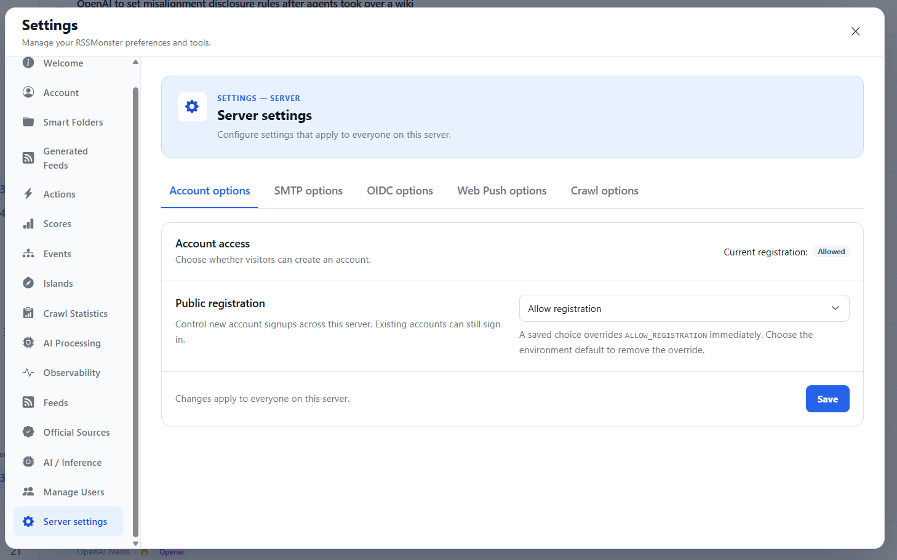

# Server Settings

**Settings → Server settings** lets administrators configure options that apply
to everyone on the server. It is the last entry in the Settings sidebar. The
first registered account becomes an administrator; regular users cannot view or
change these settings.



Use the tabs below the page introduction to switch between configuration groups.
Each tab has its own save action. Switching tabs does not save your edits.

| Tab | What it controls |
| --- | --- |
| **Account options** | Whether visitors can register local accounts. |
| **SMTP options** | Outbound email, sender details, and SMTP connectivity testing. |
| **OIDC options** | Provider sign-in, local authentication, and account provisioning. |
| **Web Push options** | Browser notification keys and contact details. |
| **Crawl options** | Feed scheduling, request limits, and parser resources. |

Personal preferences remain under **Account**. User roles are managed under
**Manage Users**, and inference configuration remains under **AI / Inference**.

## Environment defaults and saved overrides

The deployment environment provides the defaults. Saving an override stores it
in the database and takes precedence over the corresponding environment values;
it does not edit your `.env` or Compose files.

For SMTP, Web Push, and Crawl, **Override environment default** manages the
whole displayed group. For OIDC, `OIDC_ENABLED` controls the provider group while
`LOCAL_AUTH_ENABLED` has a separate override. The checkbox chooses the source of
the configuration; the Enabled/Disabled or Yes/No selector chooses whether the
feature runs. You can therefore save an overridden configuration with a feature
disabled.

To configure a group:

1. Open its tab and check **Override environment default**.
2. Review all fields in the group and enter any required credentials.
3. Click that tab's **Save** button and wait for the success message.

To return to the environment, clear the override checkbox and save, or choose
**Restore environment defaults** and confirm. Restoration removes that tab's
saved overrides, including its credentials. It does not reset the other tabs.
Account options instead provides **Use environment default** in its selector.

Changing an environment variable will not replace an active database override.
Restore inheritance first if you want the deployment configuration to take over.
Environment changes still require the affected processes to reload or restart;
saved UI changes follow the timing described below.

## Account options

**Public registration** offers three choices:

- **Use environment default** follows `ALLOW_REGISTRATION`, which defaults to
  `true` when unset.
- **Allow registration** lets visitors create local accounts.
- **Disable registration** closes local signups. Existing accounts can still sign in.

Click **Save** to apply the choice immediately. **Current registration** shows
whether local registration is available. Disabling local authentication in the
OIDC tab also makes local registration unavailable, regardless of this choice.
OIDC account creation is controlled separately by **Account provisioning**.

## SMTP options

The status cards show whether the email configuration is complete and whether
email delivery is enabled. They do not prove that the SMTP server is reachable.

Check the override beside **Enable email delivery** to manage `EMAIL_ENABLED`
and the SMTP settings together. Set the public application URL, host, port, TLS
options, username, sender, and optional reply-to address. The public URL is used
in verification, password-reset, and briefing links.

For port 587, use **Use implicit TLS: No** and **Require STARTTLS: Yes**. For port
465, use **Use implicit TLS: Yes** and **Require STARTTLS: No**.

When first enabling the override, enter the SMTP password if authentication is
required. Override mode does not inherit the environment password or
`SMTP_PASSWORD_FILE`. Password files remain available for environment-only
configuration. An unchanged masked password retains a saved database password;
editing replaces it, and clearing an edited field removes it.

After saving an enabled, complete configuration, click **Test SMTP connection**.
This checks the saved connection without sending an email. Changes apply to new
account/email operations immediately. Delivery and briefing workers pick them up
on their next poll, within five minutes; an active batch can finish with its
previous configuration.

See [Email Configuration]() for SMTP requirements,
email enrollment, delivery logs, and deployment examples.

## OIDC options

**Provider sign-in (OIDC)** and **Local authentication** have independent override
checkboxes. Enabling the OIDC override makes the provider fields editable as a
group: issuer URL, client ID, callback URL, frontend URL, scopes, account
provisioning, and client secret.

The callback must use `/api/auth/oidc/callback`. The frontend URL must be a root
URL with the same scheme and hostname as the callback; ports can differ. Scopes
must include `openid`. **Account provisioning** determines whether a first-time
provider sign-in can create an account or must use an existing linked account.

An unchanged masked client ID retains its saved value, or the environment value
if none is saved. The client-secret selector lets you keep the current secret,
replace it, or use the environment secret. Stored credentials are not displayed.

At least one sign-in method must remain enabled. Test provider sign-in before
disabling local authentication. Disabling local authentication also disables
local registration, local password changes, and Fever/Google Reader access.
Existing application sessions remain valid. Saved provider changes apply
immediately and invalidate pending sign-in flows; start those sign-ins again.

See [OIDC Configuration]() for provider setup,
account linking, access restrictions, and a Google example.

## Web Push options

Enable the group override and enter a matching VAPID public/private key pair
and a contact subject such as `mailto:admin@example.com`. Both keys are masked;
unchanged fields retain saved keys. The UI does not generate keys automatically.

Click **Save Web Push settings** to apply the configuration. **Clear keys**, then
save, disables Web Push under the override. Restoring environment defaults uses
the deployment keys again. Delivery resolves the configuration for each batch.
Changing the key pair may require readers to subscribe again.

Server configuration does not grant browser permission. Each reader must still
enable notifications in the app and allow them in their browser. See
[Web App and Notifications]() for key
generation, HTTPS requirements, and device setup.

## Crawl options

The group override controls scheduling, request limits, and parser resources.
Review the units and limits beside each field before clicking **Save crawl
settings**. **Use suggested values** fills the form but does not save it.

New crawls use the saved settings; active crawls keep their current limits.
The crawl worker updates its polling interval between iterations, so an existing
sleep is not interrupted. SQLite remains sequential. The saved effective mode
and feed lease are shown below the fields; the lease is always at least twice
the feed deadline.

See [Crawling]() for worker operation and
[Configuration](#crawl-overrides-in-server-settings)
for the detailed override behavior.

## Credentials and backups

Configure `ENCRYPTION_KEY` in the server environment before saving nonempty
database credentials. Generate a Base64-encoded 32-byte key with:

```sh
openssl rand -base64 32
```

Keep the key stable and available to every server or worker that uses encrypted
settings. SMTP passwords, OIDC client IDs/secrets, and VAPID keys are encrypted
at rest; settings responses return presence/source information rather than their
values. Back up the database and keep a secure backup of the encryption key
separately. Losing the key makes encrypted credentials unreadable.

See [Encryption of sensitive server settings](#encryption-of-sensitive-server-settings)
for key setup and legacy-value migration, and
[Backup and Restore]() for deployment backup procedures.
