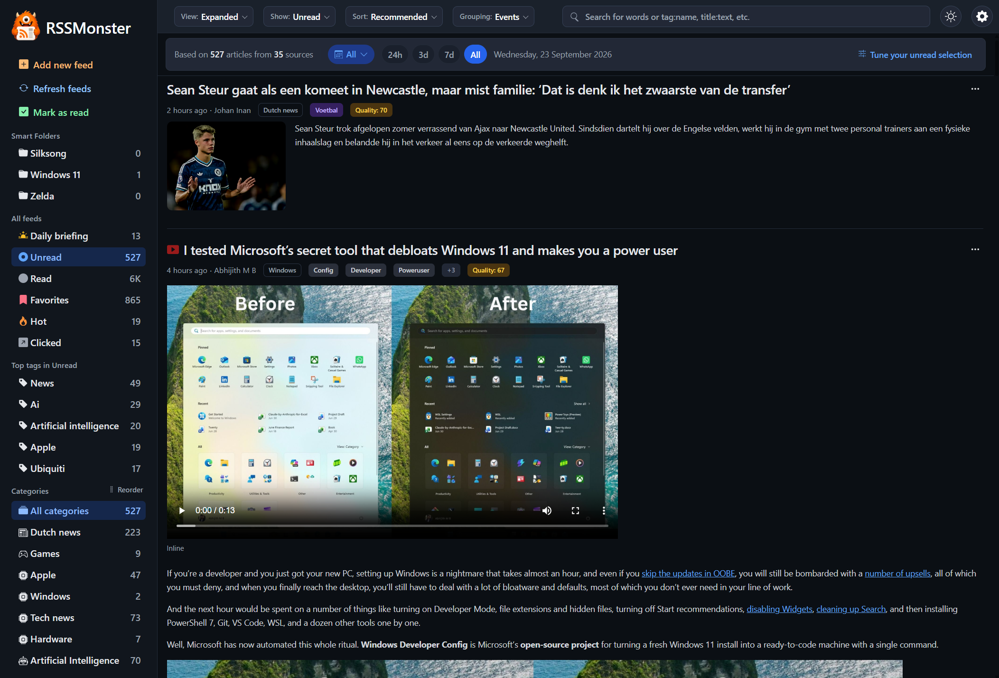
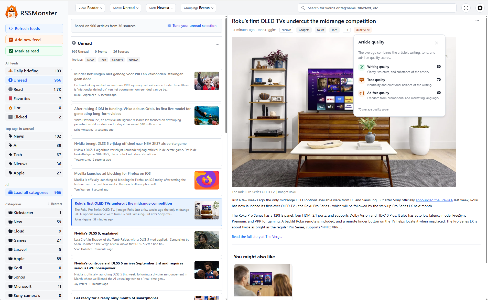
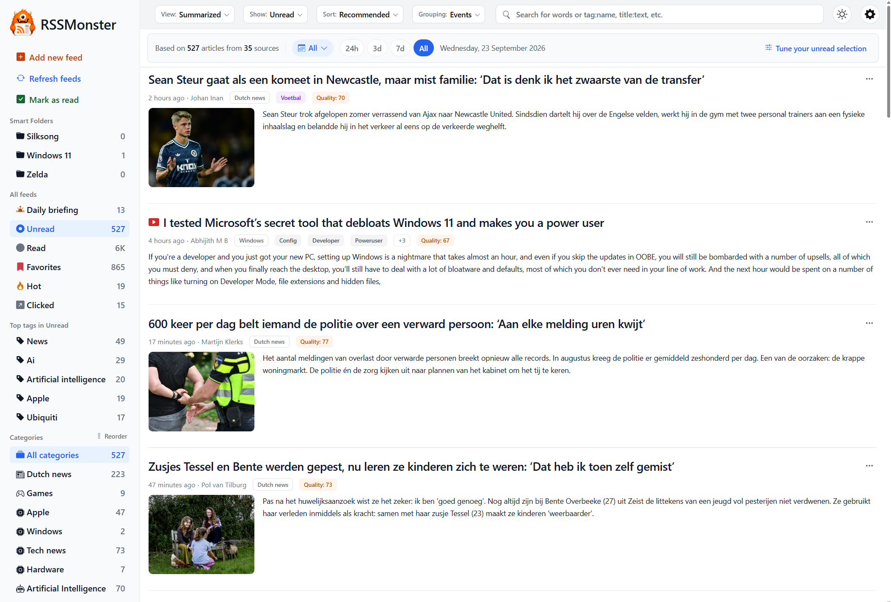
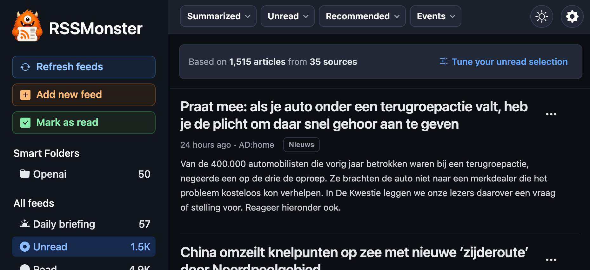
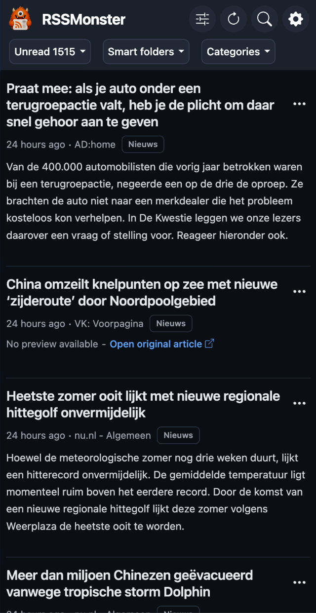

# Usability

RSSMonster adapts its reading experience to both the amount of detail you want
and the screen you are using. On a desktop, choose a view from the **View** menu
in the toolbar. On mobile devices, RSSMonster presents a streamlined interface
that keeps the main reading and organization tools close at hand.

## Expanded Mode

Expanded mode gives article content most of the available width. Each article
appears directly in the main stream with its title, source information, tags,
image, and content preview. This mode works well when you want to scan articles
without switching between a list and a separate reading pane.

## Reader Mode

Reader mode uses a three-column layout: navigation on the left, a compact
article list in the middle, and the selected article on the right. It is
similar to the reading experience offered by RSS readers such as Feedbin and is
useful when you want to move quickly through many articles while keeping the
current story visible.

Reader mode is designed for keyboard navigation. See
[Keyboard Shortcuts](keyboard-shortcuts.md) for the available commands. Moving
through articles with those shortcuts also marks the articles you leave as
read, as described in [Marking Articles Read](marking-articles-read.md).

## Summarized Mode

Summarized mode presents articles as a compact stream of titles, metadata, and
short summaries. It reduces visual detail while retaining enough context to
decide what deserves a closer look. When no preview is available, RSSMonster
offers a link to the original article instead.

## Mobile Experience

RSSMonster provides responsive layouts for phones and tablets. Both mobile
layouts support installation as a Progressive Web App (PWA), so RSSMonster can
be launched like an app from a device's home screen. Pull down on an article
collection to refresh its content. In portrait mode, swipe an article to the
right to toggle its bookmark.

The mobile settings menu is intentionally slimmer than its desktop
counterpart. It exposes a limited set of options chosen for the mobile reading
experience while leaving advanced configuration available in the full desktop
interface.

### Landscape

The landscape layout is optimized for wider mobile and tablet screens, such as
an iPad held horizontally. It condenses the navigation and controls while
retaining the full article-reading experience.

### Portrait

The portrait layout is optimized for phones and other narrow screens. It uses
a single-column article stream and compact controls so titles and summaries
remain readable without horizontal scrolling.

You can switch views at any time without changing your feeds, folders, or
article state. Choose the layout that best matches whether you are scanning,
reading in depth, or working on a smaller screen.
