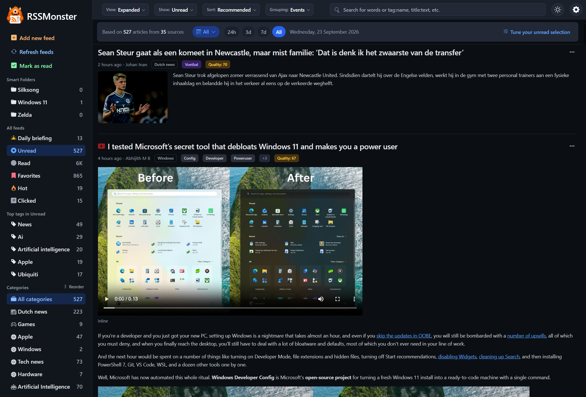
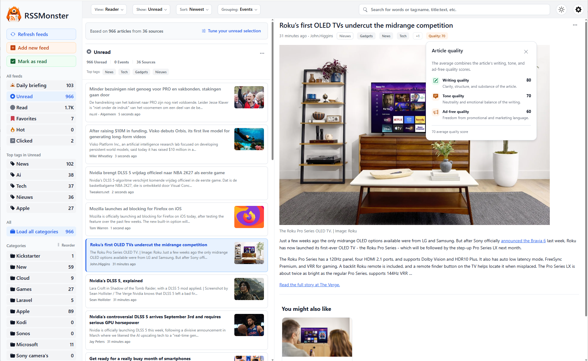
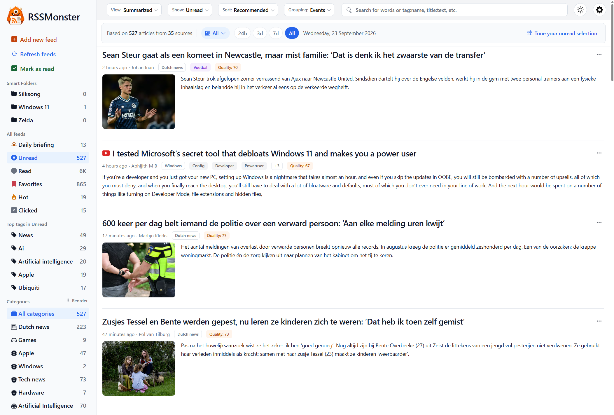
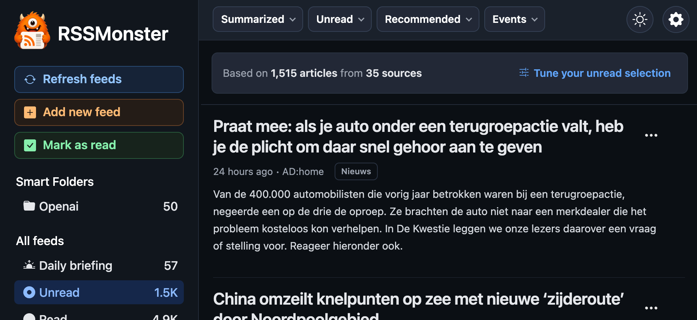
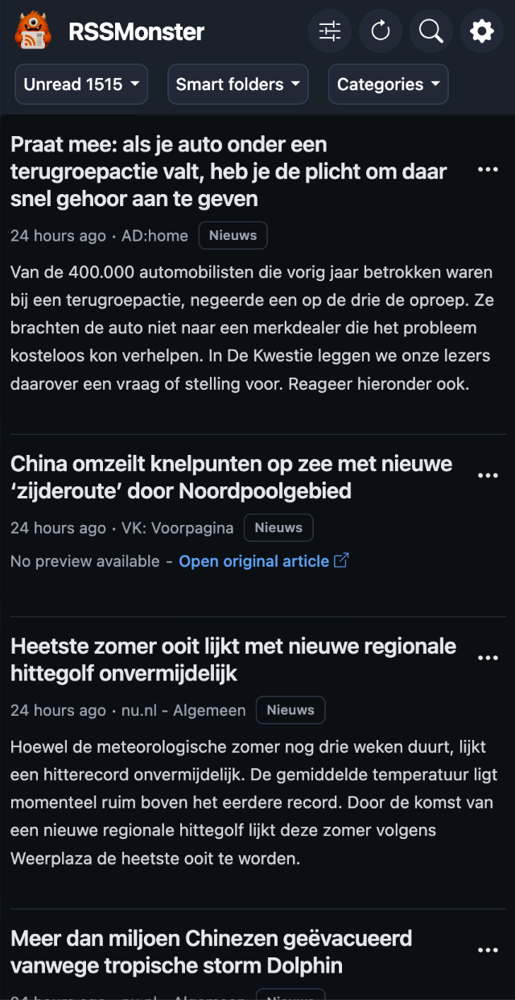

# Usability

RSSMonster adapts its reading experience to both the amount of detail you want
and the screen you are using. On a desktop, choose a view from the **View** menu
in the toolbar. On mobile devices, RSSMonster presents a streamlined interface
that keeps the main reading and organization tools close at hand.

## Expanded Mode

Expanded mode gives article content most of the available width. Each article
appears directly in the main stream with its title, source information, tags,
image, and content preview. This mode works well when you want to scan articles
without switching between a list and a separate reading pane.

## Reader Mode

Reader mode uses a three-column layout: navigation on the left, a compact
article list in the middle, and the selected article on the right. It is
similar to the reading experience offered by RSS readers such as Feedbin and is
useful when you want to move quickly through many articles while keeping the
current story visible.

Reader mode is designed for keyboard navigation. See
[Keyboard Shortcuts]() for the available commands. Moving
through articles with those shortcuts also marks the articles you leave as
read, as described in [Marking Articles Read]().

The list header shows the collection title and total article count. **Details**
reveals loaded-event and source counts and top tags. Date filters are hidden in
an empty Reader collection. The three-dot **More actions** menu contains bulk
actions and, for an active search, **Save as smart folder**.

The selected article has a sticky toolbar for read/unread, saving, **Open original**,
text size (**Aa**), listening, and expand/restore. Expanding hides the middle list
while retaining the sidebar; restoring returns to the three-column layout without
losing the selected article or reading position. Text size is remembered in the
browser. Listening uses browser text-to-speech when supported.

## Summarized Mode

Summarized mode presents articles as a compact stream of titles, metadata, and
short summaries. It reduces visual detail while retaining enough context to
decide what deserves a closer look. When no preview is available, RSSMonster
offers a link to the original article instead.

## Summary Bullets and Headlines

**Summary Bullets** shows available generated summary bullets and is offered when
AI is enabled. Articles need completed analysis to have those summaries.
**Headlines** is the most compact list. It supports the **Mark as read while
scrolling** preference as well as explicit article actions.

Headlines can expand an article in place while keeping its row anchored in the
viewport. Desktop article streams avoid nested scrollbars, and Reader list/content
and Expanded scrollbars reveal themselves during scrolling or hover.

## Collection actions

Use the collection's three-dot **More actions** menu in any article view to mark
visible articles read, save them, or record their originals as opened. Relative
actions mark loaded articles above, below, or older than the current article.
See [Marking Articles Read](#manual-and-bulk-actions)
for how each scope is determined.

New-article notifications and date/filter context share the collection's top area.
On narrow screens, filters stay left-aligned and the action menu remains available
while summaries shorten or hide to leave room for the controls.

## Reading controls and preferences

Status, sort, grouping, and view mode are separate controls. Select a status to
choose a collection, a sort to order it, and grouping to combine related coverage.
AI-dependent status, sort, and grouping choices appear only when enabled.
See [Scoring](), [Events](), and [Daily Briefing]().

With **Unread** selected, use the toolbar's sliders button to
[tune your unread selection](#tune-your-unread-selection).
The dialog controls developing coverage, high-trust prioritization, marking read
while scrolling, startup selection, and opening article links in a new tab.

Article controls include read/unread state, bookmarks, opening the original,
and, when available, related stories, story sources, score explanations, and
**More like this** / **Not interested** feedback. Use those feedback actions to
refine personal interest; they are different from changing read state.

## Dark mode and appearance

RSSMonster supports light and dark themes across its reading views, navigation,
menus, and settings. Dark mode uses dark backgrounds with light text while
keeping selected articles, links, tags, and score badges distinct.

To change the theme in the desktop layout:

1. Select the sun-shaped **Choose theme** button near the top-right corner,
   beside the Settings gear.
2. Choose **Dark**, **Light**, or **System**. The change applies immediately;
   there is no separate save button.

| Theme | Behavior |
| --- | --- |
| System | Follows your operating system's light or dark preference, including changes while RSSMonster is open. This is the default when no preference has been saved. |
| Light | Keeps the interface in the light theme regardless of the system preference. |
| Dark | Keeps the interface in the dark theme regardless of the system preference. |

Your choice is remembered in the browser and saved to your account. Choose
**System** again whenever you want the interface to follow your device's
appearance setting.

The screenshot shows **Reader** view in dark mode, with navigation on the left,
the selected article highlighted in the middle list, and its content on the
right. You can use dark mode with the other reading views as well; changing
the theme preserves your current collection and reading layout.

The theme picker and full Settings are available in the desktop layout. The
compact/mobile gear opens the smaller **Options** sheet, without a theme picker;
the saved theme still applies there, including the device preference when
**System** is selected.

## Mobile Experience

RSSMonster provides responsive layouts for phones and tablets. Compatible browsers support [installation as a Progressive Web App](),
so RSSMonster can be launched from a device's home screen. Pull down on an article
collection to reload stored results. Use **Refresh feeds** in Options to request
publisher fetching. In portrait mode, swipe an article to the
right to toggle its bookmark.

The mobile settings menu is intentionally slimmer than its desktop
counterpart. It exposes a limited set of options chosen for the mobile reading
experience while leaving advanced configuration available in the full desktop
interface.

### Landscape

The landscape layout is optimized for wider mobile and tablet screens, such as
an iPad held horizontally. It condenses the navigation and controls while
retaining the full article-reading experience.

### Portrait

The portrait layout is optimized for phones and other narrow screens. It uses
a single-column article stream and compact controls so titles and summaries
remain readable without horizontal scrolling.

You can switch views at any time without changing your feeds, folders, or
article state. Choose the layout that best matches whether you are scanning,
reading in depth, or working on a smaller screen.

## Responsive layout reference

Layout follows viewport width, rather than device name or orientation alone:

| Width | Navigation and reading controls |
| --- | --- |
| Below 768 px | Single-column reading with compact toolbar and Options sheet. |
| 768–879 px | Persistent sidebar with compact toolbar and Options sheet. |
| 880 px and above | Desktop toolbar, full Settings, and Reader view choice. |

Reader view is not offered in the compact/mobile view menu. A tablet can use
different shells depending on window size. See [Keyboard Shortcuts]()
for keyboard controls and [Web App and Notifications]()
for installation and Push permissions.

## Score thresholds

When AI is enabled, **Settings → Scores** provides minimum advertisement,
sentiment, and quality component thresholds on a `0`–`100` scale. Higher
advertisement scores mean less promotional content. These controls affect
eligibility; they differ from the normalized `0`–`1` combined quality filter in
[Search](). Pending or failed inferred analysis is not treated as a
completed low score, while deterministic Action overrides still apply.
